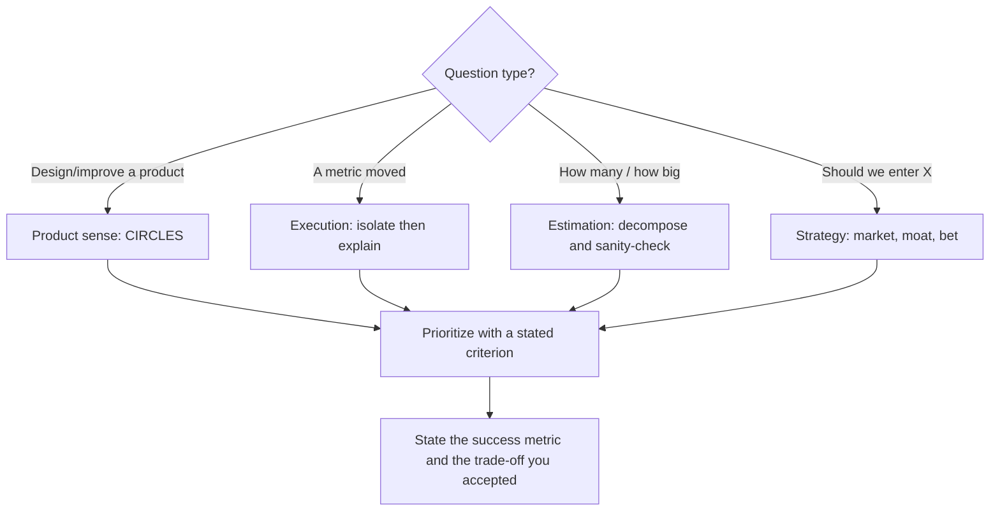

# PM Interview Drill

One PM question, timed, scored, then a model answer and a targeted follow-up — per
[`AGENTS.md`](../../../AGENTS.md). The PM sibling of
[coding-interview-drill](../coding-interview-drill/SKILL.md) and
[system-design-drill](../system-design-drill/SKILL.md).

## When to use

- The learner has a PM loop (product sense, execution/analytics, estimation, strategy) and wants reps.
- Their answers ramble: they jump to solutions before naming a user, or list features without prioritizing.
- They need a repeatable structure to fall back on when the question surprises them.

## The four rounds and their structures



**CIRCLES** (popularized by Lewis C. Lin's *Decode and Conquer*) is the product-sense spine:
**C**omprehend the situation · **I**dentify the customer · **R**eport customer needs · **C**ut through
prioritization · **L**ist solutions · **E**valuate trade-offs · **S**ummarize the recommendation.
Two moves separate strong candidates: the *cut* (an explicit prioritization criterion) and the *summary*
(one recommendation with its success metric), not the length of the solution list.

**Execution / metrics-debug spine:** is it *real* (instrumentation, bot traffic, logging change) → is it
*external* (seasonality, holiday, competitor, platform change) → is it *internal* (release, pricing,
funnel step, experiment ramp) → *which segment* (new vs. existing, platform, geo, cohort) → so what.
Segment before you theorize; a 12% aggregate drop is usually one segment falling off a cliff.

## Round comparison

| Round | Time | What's really being tested | Classic failure | Winning move |
| --- | --- | --- | --- | --- |
| **Product sense** | 25–35 min | User empathy + prioritization judgment | Feature list with no user and no criterion | Name one user segment, one pain, one prioritization criterion |
| **Execution / metrics** | 20–30 min | Structured diagnosis under ambiguity | Guessing a cause immediately | Rule out instrumentation, then segment before hypothesizing |
| **Estimation** | 10–15 min | Decomposition + numeric sanity | Precision theatre on an unstated assumption | State assumptions, use round numbers, sanity-check the total |
| **Strategy** | 30–40 min | Market/competitive reasoning, sequencing | Ambition with no wedge or moat | Pick one wedge, state the moat, name what you deprioritize |

## Procedure

1. **Set the round.** Confirm round type, target level, and time budget. Present **one original prompt** —
   never a real company's proprietary interview question — and start the clock.
2. **Take clarifying questions first (2–3 min).** Answer only what is asked. Reward scoping questions
   (platform, geography, business goal, constraints) and note if none were asked.
3. **Make them announce their structure** before content: "I'll use CIRCLES", or "I'll check
   instrumentation, then external, then internal, then segment." Structure announced up front is a scored
   behaviour because it lets an interviewer follow along.
4. **Run the round in silence-friendly mode:** let the learner talk. Interject only to keep time, to ask
   "why that user?", "what's your prioritization criterion?", or "what would you *not* do?"
5. **Force the numbers.** Every round ends with a **success metric** plus a **guardrail** metric, and for
   estimation, an explicit assumption list. Vague metrics ("engagement") get pushed to a countable
   definition — see [metrics-definition-coach](../metrics-definition-coach/SKILL.md).
6. **Probe the trade-off.** Ask what they gave up and who is worse off. A recommendation with no cost is a
   recommendation that wasn't reasoned about.
7. **Score against the rubric below** with one line of evidence per dimension — no unsupported scores.
8. **Give a model answer** (compressed, 5–8 lines) that shows *shape*, not a script to memorize.
9. **Set one targeted follow-up** aimed only at the lowest-scoring dimension, then stop.

## Output shape

```
PM Drill — <round type> (<level> · <time>)

Prompt: <original scenario>
Clarifying Qs asked: <list, or "none — flagged">
Structure announced: <CIRCLES | diagnose-tree | decomposition | wedge-moat-bet>

--- Answer captured ---
User / segment: …
Need / pain (with evidence or assumption): …
Prioritization criterion: <impact x confidence / effort, or stated alternative>
Recommendation: …
Success metric: …    Guardrail metric: …
Trade-off accepted / who is worse off: …

--- Scored rubric (1–5 each) ---
| Dimension                       | Score | Evidence from the answer            |
|---------------------------------|-------|-------------------------------------|
| Structure & clarity             |  _/5  | …                                   |
| Customer insight / user empathy |  _/5  | …                                   |
| Prioritization & judgment       |  _/5  | …                                   |
| Metrics & quantitative rigor    |  _/5  | …                                   |
| Trade-offs & risk awareness     |  _/5  | …                                   |
| Communication & concision       |  _/5  | …                                   |
Total: __/30    Signal: <no hire | mixed | hire | strong hire at level>

Top strength: …
Top gap: …           Cost in a real loop: …
Model answer (shape, not script):
  1) … 2) … 3) … 4) …
Targeted follow-up (lowest dimension only): …
```

## Tips

- **A framework is scaffolding, not a script.** Reciting CIRCLES verbatim scores worse than using it
  invisibly; the interviewer should hear structure, not headings.
- **Never skip the customer.** "Which user, and what do they do on Tuesday morning?" is the question that
  turns a generic answer into a specific one.
- **The cut is the interview.** Anyone can list ten features; the score lives in the stated criterion used
  to drop eight of them and the willingness to say what you won't build.
- In metrics debugging, **rule out the boring causes first** — a logging deploy or a bot filter explains far
  more 12% drops than a change in user preferences.
- In estimation, **round numbers loudly** (300M people, 3 devices, 2% conversion) and check the total against
  something known; the arithmetic is not the test, the decomposition is.
- Strategy answers need a **wedge** (where you start), a **moat** (why the win compounds), and an explicit
  deprioritization — see [feature-prioritization-coach](../feature-prioritization-coach/SKILL.md) and
  [okr-coach](../okr-coach/SKILL.md).
- Behavioural PM questions belong in [star-story-builder](../star-story-builder/SKILL.md); write-ups belong
  in [prd-writer](../prd-writer/SKILL.md); compensation talk belongs in
  [salary-negotiation](../salary-negotiation/SKILL.md).
- **Original prompts only** — never reproduce a specific company's proprietary question text.
- One question per session, scored, then one follow-up. For broader timed practice use
  [mock-exam](../mock-exam/SKILL.md). End with the **Learning Footer** (`AGENTS.md`).
