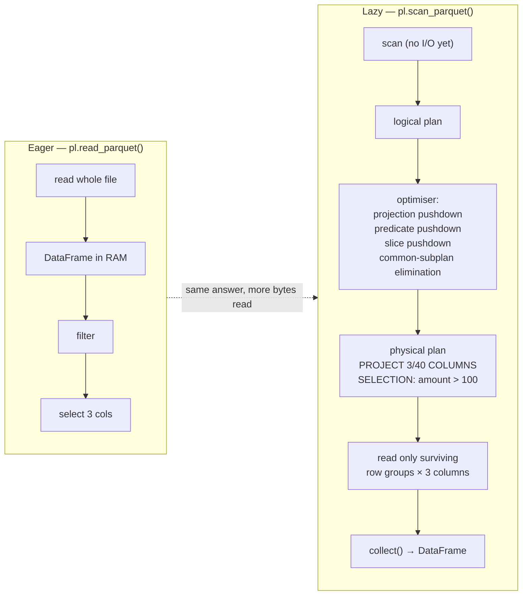

# Polars Lab

Polars is fast for two structural reasons, not one: it is **columnar and multi-threaded** (Arrow-shaped
memory, one thread per expression) *and* it has a **query optimiser** you only get if you write lazily.
This lab makes you see both — by reading a query plan rather than trusting a benchmark — in the
run-it-and-read-the-output spirit of [`AGENTS.md`](../../../AGENTS.md).

## When to use

- A pandas pipeline is too slow or too memory-hungry and the learner wants to know *why* Polars differs,
  not just which import to change.
- They keep writing Polars as if it were pandas (`df["a"][0] = 5`, chained masks, `apply` everywhere) and
  getting neither speed nor clarity.
- A dataset is larger than RAM and they need `scan_*` + streaming instead of `read_*`.
- They need to prove that a filter or a column selection actually reached the file, not just the DataFrame.
- **Don't use it for** distributed compute across machines (that's
  [`spark-dataframe-lab`](../spark-dataframe-lab/SKILL.md)), for SQL-first analytics on files
  ([`duckdb-lab`](../duckdb-lab/SKILL.md)), or for Parquet layout tuning
  ([`parquet-internals-coach`](../parquet-internals-coach/SKILL.md)).

## First principles: expressions, then laziness

Polars (Ritchie Vink; **Polars 1.0.0 released 2024-07-01**, per the official polars.dev release post) is
built on the **Apache Arrow columnar memory model** and a Rust engine. Two ideas explain almost every API
choice:

1. **An expression is a value, not an action.** `pl.col("amount") * 2` describes a computation over a
   column. It executes only when handed to a *context* — `select`, `with_columns`, `filter`, `group_by(...)
   .agg`. Because expressions are independent descriptions, the engine runs them **in parallel** over the
   same frame.
2. **Laziness buys optimisation.** `pl.read_parquet()` returns a `DataFrame` and runs immediately.
   `pl.scan_parquet()` returns a `LazyFrame` and runs nothing until `.collect()`. In between, Polars can
   rewrite your query: push projections and predicates down into the file scan, eliminate common
   sub-plans, and slice early.



*Figure: eager reads everything then throws most of it away; lazy moves the filter and the column list into
the scan, so the discarded bytes are never read. `.explain()` prints the right-hand box.*

### Polars vs pandas — the differences that actually change your code

| Aspect | pandas | Polars | Consequence |
| --- | --- | --- | --- |
| Row labels | an **index** (often meaningful) | **no index**, ever | joins and concat are explicit; no accidental alignment |
| Missing data | `NaN`, `None`, `pd.NA` overlap; `NaN` often means "missing" | `null` is missing; `NaN` is a genuine float value | `is_null()` ≠ `is_nan()`; aggregations skip `null`, propagate `NaN` |
| Mutation | in-place assignment is idiomatic | frames are effectively immutable; `with_columns` returns a new frame | no `SettingWithCopyWarning`, no hidden aliasing |
| Execution | eager, mostly single-threaded per op | eager **or lazy**, multi-threaded per expression | laziness is where the big wins live |
| Types | object dtype absorbs anything | strict Arrow types; `Utf8`/`String`, `Categorical`, `List` | type errors surface at plan time, not row 900 000 |
| Row-wise functions | `df.apply(axis=1)` common | `map_elements` exists but is the **slow path** | express it as an expression instead |

⚠ Names have moved: `groupby` → `group_by` and `apply` → `map_elements`/`map_batches` (Polars 0.19.0,
2023); `how="outer"` → `how="full"` (deprecated in 0.20.x, enforced from 1.0); `pl.count()` → `pl.len()`
(0.20.5). Check `pl.__version__` and the current API reference before copying older snippets.

### Joins

| `how=` | Keeps | Adds columns from right | Typical use |
| --- | --- | --- | --- |
| `"inner"` | matched rows | yes | default analytical join |
| `"left"` | all left rows | yes (`null` when unmatched) | enrichment |
| `"full"` | all rows from both | yes | reconciliation (⚠ was `"outer"` pre-1.0) |
| `"semi"` | left rows **that have** a match | **no** | filtering by membership |
| `"anti"` | left rows **with no** match | **no** | finding orphans / new records |
| `"cross"` | cartesian product | yes | calendars, grids |

`semi`/`anti` are the ones pandas users don't know they wanted: they filter without widening the frame and
without any risk of row duplication.

## Procedure

1. **Install locally, free:** `python -m venv .venv && .venv\Scripts\activate` (Windows) then
   `pip install "polars>=1.0" pyarrow`. Print `pl.__version__` and pin it in your notes — API names moved
   across versions and half of all Polars errors online are version mismatches.
2. **Build a toy frame eagerly** and run one `select`, one `with_columns`, one `filter`. Say out loud which
   part is the *context* and which part is the *expression*.
3. **Practise the expression API deliberately**: `pl.col`, `pl.lit`, `.alias`, `.cast`, `.when/.then/
   .otherwise`, `.over` (window without collapsing rows), `.str.*`, `.dt.*`, `.list.*`. Replace any
   `map_elements` you wrote with a native expression and compare timings.
4. **Group and aggregate**: `group_by("k").agg(...)` with several expressions in one call. Confirm that
   `pl.len()` counts *rows* while `pl.col("x").count()` counts *non-null* values — this trips people up.
5. **Join every way**: inner, left, full, semi, anti on the same pair of frames and tabulate the row counts.
   Predict each count before running it; a wrong prediction is the lesson.
6. **Go lazy.** Rewrite the pipeline with `pl.scan_parquet(...)`, keep the same operations, end with
   `.collect()`. Print `lf.explain()` and find `PROJECT n/N COLUMNS` and `SELECTION:` in the scan node —
   that is projection and predicate pushdown, proven rather than assumed.
7. **Break the optimiser on purpose**: insert a `.collect()` in the middle, or call `map_elements` over a
   filter column, then re-print the plan. Watch the pushdown disappear. Now you know what costs you.
8. **Handle larger-than-memory data**: `sink_parquet()` to stream a result to disk without materialising it,
   and try the streaming engine on `collect`. ⚠ The streaming API has changed across 1.x
   (`collect(streaming=True)` vs `collect(engine="streaming")`) and not every operation is supported —
   verify on the current user guide and fall back to partitioned processing where it is not.
9. **Compare against pandas honestly**: same file, same result, measure wall clock *and* peak memory, and
   state the hardware and the Polars version. A benchmark without those three is folklore.
10. **Write the result out** with `write_parquet`/`sink_parquet` and check the file with
    [`parquet-internals-coach`](../parquet-internals-coach/SKILL.md).
11. Close with the **Learning Footer**.

## Output shape

```
Polars lab — dataset: <path/rows/cols> · polars=<x.y.z> · python=<3.x> · machine=<cores/RAM>

Eager vs lazy:
  eager pipeline   : <ops>  -> wall <s> · peak RSS <MB> · bytes read <MB>
  lazy pipeline    : <same ops> -> wall <s> · peak RSS <MB> · bytes read <MB>
  plan evidence    : PROJECT <k>/<N> COLUMNS · SELECTION: <predicate pushed to scan? yes/no>

Expressions used: <pl.col | when/then | over | str.* | dt.*>   map_elements used: <no | why>
group_by: keys=<...> aggs=<pl.len(), sum, mean, ...>   groups=<n>
  note: pl.len()=<rows per group> vs pl.col(x).count()=<non-null per group>

Joins (row counts, predicted -> actual):
  inner <p>-><a> · left <p>-><a> · full <p>-><a> · semi <p>-><a> · anti <p>-><a>

Nulls: null count=<n> · NaN count=<n> · aggregation treated them as <skipped null | propagated NaN>
Streaming: <sink_parquet | collect(engine=...)> · fits in RAM=<yes/no> · unsupported op fallback=<...>

pandas differences that changed the code: <no index | null vs NaN | immutability | strict dtypes>
Next: duckdb-lab | parquet-internals-coach | pandas-lab
Learning Footer
```

## Worked example — one frame, traced by hand, then made lazy

Zero cost, no cloud, ~20 lines. Every printed number below is derived by hand first, so you can check the
engine rather than the other way round.

```python
import polars as pl
print(pl.__version__)          # pin this; API names moved across versions

events = pl.DataFrame({
    "user_id": [1, 1, 2, 2, 3],
    "amount":  [10.0, 30.0, 5.0, None, 7.5],     # note the null
    "ts":      ["2026-01-01", "2026-01-02", "2026-01-01", "2026-01-03", "2026-01-02"],
}).with_columns(pl.col("ts").str.to_date())

users = pl.DataFrame({
    "user_id": [1, 2, 4],
    "plan":    ["pro", "free", "pro"],
})
```

**Aggregate, and predict the output before you run it:**

```python
per_user = events.group_by("user_id").agg(
    pl.col("amount").sum().alias("total"),
    pl.col("amount").mean().alias("avg"),
    pl.col("amount").count().alias("n_non_null"),   # counts NON-NULL values
    pl.len().alias("n_rows"),                       # counts ROWS
).sort("user_id")
print(per_user)
```

Hand-trace:

| user_id | rows | amounts | `total` | `avg` | `n_non_null` | `n_rows` |
| --- | --- | --- | --- | --- | --- | --- |
| 1 | 2 | 10.0, 30.0 | 40.0 | 20.0 | 2 | 2 |
| 2 | 2 | 5.0, **null** | 5.0 | **5.0** | **1** | **2** |
| 3 | 1 | 7.5 | 7.5 | 7.5 | 1 | 1 |

User 2 is the whole lesson: `sum` and `mean` **skip nulls**, so the mean is `5.0 / 1`, not `5.0 / 2`.
And `count()` (1) differs from `len()` (2). If the null had been a `float('nan')` instead, `sum` and `mean`
would have **propagated** `NaN` — `null` and `NaN` are different things in Polars, unlike in pandas where
`NaN` routinely stands in for "missing".

**Join every way, predicting the row counts:**

```python
for how in ["inner", "left", "full", "semi", "anti"]:
    print(how, per_user.join(users, on="user_id", how=how).height)
```

`per_user` has keys {1, 2, 3}; `users` has {1, 2, 4}.

| how | Reasoning | Rows |
| --- | --- | --- |
| `inner` | keys in both: {1, 2} | **2** |
| `left` | all of {1, 2, 3}; user 3 gets `plan = null` | **3** |
| `full` | union {1, 2, 3, 4}; user 4 has no aggregate columns | **4** |
| `semi` | left rows with a match: {1, 2}, **no `plan` column added** | **2** |
| `anti` | left rows without a match: {3} | **1** |

Revenue by plan after the inner join: user 1 (`pro`) contributes 40.0 and user 2 (`free`) contributes 5.0 →
`pro = 40.0`, `free = 5.0`. User 3 is absent because they have no plan; that is a *modelling* decision you
just made by choosing `inner`, and it is exactly the kind of silent row loss `anti` exists to reveal.

**Now make it lazy and prove the pushdown.** Write a wide file first so the optimisation is visible:

```python
wide = events.with_columns([pl.lit(i).alias(f"pad_{i}") for i in range(37)])   # 40 columns total
wide.write_parquet("events.parquet")

lf = (
    pl.scan_parquet("events.parquet")          # nothing has been read yet
      .filter(pl.col("amount") > 6.0)
      .select(["user_id", "amount"])
      .group_by("user_id")
      .agg(pl.col("amount").sum().alias("total"))
)
print(lf.explain())                             # optimised plan
result = lf.collect()
```

The plan's scan node reports the pushdown (verified output below is from **polars 1.43.2**; ⚠ exact
formatting varies by version — read yours, don't memorise mine):

```
AGGREGATE[maintain_order: false]
  [col("amount").sum().alias("total")] BY [col("user_id")]
  FROM
  Parquet SCAN [events.parquet]
  PROJECT 2/40 COLUMNS
  SELECTION: col("amount") > 6.0
  ESTIMATED ROWS: 5
```

`PROJECT 2/40 COLUMNS` is projection pushdown — 38 column chunks are never decoded. `SELECTION` inside the
scan is predicate pushdown — row groups whose Parquet statistics cannot contain `amount > 6.0` are skipped
without decompression. Traced result: rows surviving the filter are `10.0`, `30.0`, `7.5` (the `null` fails
the comparison, and `5.0` is below the threshold), so `total` is `40.0` for user 1 and `7.5` for user 3 —
user 2 disappears entirely, which is correct and worth pointing at.

**Break it, to feel the cost:**

```python
slow = (
    pl.scan_parquet("events.parquet")
      .with_columns(pl.col("amount").map_elements(lambda x: x, return_dtype=pl.Float64))
      .filter(pl.col("amount") > 6.0)
      .select(["user_id", "amount"])
)
print(slow.explain())      # the filter can no longer sink below the Python UDF
```

Verified plan (polars 1.43.2) — note what is **missing**:

```
FILTER col("amount") > 6.0
FROM
   WITH_COLUMNS:
   [col("amount").python_udf()]
    Parquet SCAN [_pl_events.parquet]
    PROJECT 2/40 COLUMNS
    ESTIMATED ROWS: 5
```

Projection pushdown survived (`PROJECT 2/40`), but the `SELECTION:` line is **gone from the scan** — the
filter now sits above a `python_udf()` node. An opaque Python callable is a barrier: the optimiser cannot
reason through it, so no row group can be skipped and every surviving column is decoded in full. This is
the single most common reason "Polars wasn't faster."

**Larger than memory**, without changing the logic:

```python
(pl.scan_parquet("events.parquet")
   .filter(pl.col("amount") > 6.0)
   .sink_parquet("out.parquet"))     # streams to disk; never materialises the whole result
```

## Tips

- **Expressions over loops.** If you reach for `map_elements`, `for`, or `iter_rows`, you have left the
  fast path and disabled the optimiser. Almost everything has a native expression.
- **`scan_*` by default, `read_*` when you truly need the frame now.** Laziness is free to write and is
  where projection/predicate pushdown lives.
- `.explain()` is the ground truth. "It should be pushing the filter down" is not evidence; `SELECTION:`
  in the scan node is.
- `null` ≠ `NaN`. Aggregations skip `null` and propagate `NaN`; `is_null()` and `is_nan()` answer different
  questions. Most pandas-to-Polars bugs live here.
- There is no index. Every alignment is an explicit `join`, which means no silent reindexing — and it means
  you must sort explicitly when order matters (`sort`, or `maintain_order=True` on `group_by` when you need
  deterministic group order).
- Use `semi`/`anti` joins for membership tests instead of `is_in` over a materialised list — they are the
  clearer expression *and* they cannot duplicate rows.
- Benchmark honestly: state Polars version, cores, RAM, and measure peak memory alongside wall clock, per
  `AGENTS.md` §2. A single-run timing on a warm page cache is not a result.
- Related: [`pandas-lab`](../pandas-lab/SKILL.md), [`numpy-lab`](../numpy-lab/SKILL.md),
  [`duckdb-lab`](../duckdb-lab/SKILL.md),
  [`parquet-internals-coach`](../parquet-internals-coach/SKILL.md),
  [`spark-dataframe-lab`](../spark-dataframe-lab/SKILL.md),
  [`python-typing-lab`](../python-typing-lab/SKILL.md), and
  [`dbt-duckdb-lab`](../dbt-duckdb-lab/SKILL.md) when the transformation belongs in a modelled pipeline
  rather than a script.
  End with the **Learning Footer** (`AGENTS.md`).
