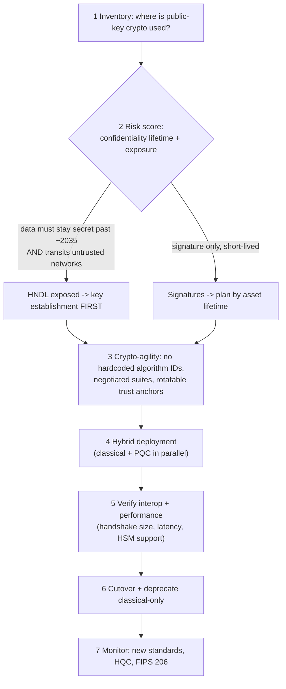

# Post-Quantum Crypto Migration Coach

Migration is an **inventory problem first and a cryptography problem second**: you cannot replace an
algorithm you cannot find. Teach the sequence — inventory → risk-score → agility → hybrid → cutover —
with every claim tied to a named NIST publication, per [`AGENTS.md`](../../../AGENTS.md).

## When to use

- Leadership asked "are we quantum-safe?" and nobody has a cryptographic inventory to answer with.
- Long-lived confidential data (health, legal, national-security, source secrets) transits networks today.
- Firmware, PKI, or code-signing roots are being designed now and will still be deployed in the 2030s.
- **Don't use it for** teaching cryptographic primitives from scratch
  ([cryptography-basics-coach](../cryptography-basics-coach/SKILL.md)) or TLS configuration mechanics
  ([tls-ssl-explainer](../tls-ssl-explainer/SKILL.md)).

## First principles: which algorithms actually break

Shor's algorithm breaks the hardness assumptions behind **RSA, Diffie-Hellman, and elliptic-curve**
cryptography — i.e. key establishment and signatures. Grover's algorithm gives only a quadratic speed-up
against symmetric primitives, so **AES-256 and SHA-384/512 remain appropriate**; the migration is about
public-key cryptography, not "replace all crypto".



| Standard | Algorithm | Role | Status (verify at csrc.nist.gov) |
| --- | --- | --- | --- |
| **FIPS 203** | ML-KEM (Kyber-based) | key encapsulation — replaces RSA/ECDH key establishment | final, August 2024 |
| **FIPS 204** | ML-DSA (Dilithium-based) | general-purpose digital signature | final, August 2024 |
| **FIPS 205** | SLH-DSA (SPHINCS+-based) | stateless hash-based signature; algorithm diversity, long-lived roots | final, August 2024 |
| FIPS 206 (draft) | FN-DSA (Falcon-based) | compact signatures for constrained links | **draft — confirm status before planning around it** |
| HQC | code-based KEM | backup KEM for algorithm diversity | selected March 2025; standard still in progress |
| NIST IR 8547 | transition guidance | deprecation/disallowance timeline | quantum-vulnerable algorithms deprecated ~**2030**, disallowed ~**2035** — confirm the final text |

**Trade-off to say out loud:** hybrid (classical ⊕ PQC) costs bandwidth and handshake latency but is the
only posture that is safe against *both* a future quantum break **and** an undiscovered flaw in a new
lattice scheme. ML-KEM public keys and ML-DSA signatures are substantially larger than ECC equivalents —
budget for MTU, handshake size, certificate chain size, and constrained devices. SLH-DSA is conservative
(hash-based, well-understood assumptions) but its signatures are large and signing is slow — reserve it
for rarely-signed, long-lived anchors such as firmware or root CAs.

## Procedure

1. **Build the cryptographic inventory** — it is the deliverable that unblocks everything else. Sources:
   TLS scans, certificate stores, code search for algorithm identifiers, HSM/KMS key listings, SBOMs.

   ```bash
   # certificates and signature algorithms in a directory of PEMs
   for f in certs/*.pem; do openssl x509 -in "$f" -noout -subject -dates \
     -text | grep -E "Signature Algorithm|Public-Key"; done
   ```

   ```bash
   # negotiated group + certificate signature for a live endpoint
   openssl s_client -connect example.com:443 -brief </dev/null 2>&1 | grep -Ei "group|cipher|signature"
   ```

2. **Record confidentiality lifetime per data class** — how many years must this stay secret? This is the
   single input that turns "someday" into a date.
3. **Score harvest-now-decrypt-later (HNDL) exposure**: does the data traverse networks you do not
   control, *and* must it stay secret past the deprecation horizon? If yes → **key establishment first**.
4. **Sequence by cryptographic role, not by system popularity**: key establishment (HNDL-exposed) →
   long-lived signatures (firmware, roots) → short-lived signatures (tokens, TLS certs).
5. **Invest in crypto-agility before algorithms**: no hardcoded OIDs or suite names, negotiated
   parameters, rotatable trust anchors, and a tested rollback. Most 2030 pain is agility debt.
6. **Deploy hybrid** where the protocol supports it (hybrid key exchange in TLS 1.3 is the common first
   step) and keep classical verification alongside PQC signatures during transition.
7. **Measure before you commit**: handshake bytes, p95 latency, CPU, HSM/KMS support, and whether
   middleboxes drop larger ClientHellos.
8. **Confirm library and FIPS-validation status** rather than assuming — support moves quarterly:

   ```bash
   openssl list -kem-algorithms 2>/dev/null | grep -i mlkem || echo "no ML-KEM in this build — check version/provider"
   ```

9. **Write the deprecation schedule** with owners and dates anchored to NIST IR 8547, then close with the
   **Learning Footer**.

## Output shape

```
Scope: <system/protocol> · owner=<…> · data class=<…> · confidentiality lifetime=<n years>
Inventory:
  <asset> · algorithm=<RSA-2048|ECDSA P-256|…> · role=<key-estab|signature|both> · where=<TLS|PKI|firmware|at-rest>
HNDL exposure: <high|medium|low> — rationale=<transits untrusted network? secret past 2035?>
Priority: 1 <key establishment …>  2 <long-lived signatures …>  3 <short-lived signatures …>
Target: KEM=<ML-KEM-768 (FIPS 203)> · SIG=<ML-DSA-65 (FIPS 204) | SLH-DSA (FIPS 205)>
Mode: <hybrid classical+PQC | PQC-only>   rationale=<…>
Agility gaps: <hardcoded OID | non-negotiated suite | pinned cert | unrotatable root> -> owner=<…>
Measured cost: handshake=<+n bytes> · p95 latency=<+n ms> · HSM/KMS support=<yes|no|roadmap>
Schedule: pilot=<date> · hybrid default=<date> · classical deprecated=<date, ref NIST IR 8547> · disallowed=<date>
Verification status: <which standards/versions were checked, and where>
Residual risk: <constrained devices, third-party endpoints, unmanaged certificates>
Next: [cryptography-basics-coach] · [tls-ssl-explainer] · [supply-chain-security-coach]
Learning Footer
```

## Worked example — customer VPN carrying 20-year-confidential records

Inventory finds ECDH P-256 key establishment and RSA-3072 certificates. Data class = medical records with
a **20-year** confidentiality requirement, transiting the public internet.

| Step | Finding / decision |
| --- | --- |
| HNDL score | **High** — untrusted transit *and* secrecy required well past the ~2035 disallowance horizon |
| Priority | Key establishment first; certificate signatures second (they expire in 1 year anyway) |
| Target | Hybrid X25519 + **ML-KEM-768** (FIPS 203) for key establishment |
| Signatures | Stay classical for now; plan **ML-DSA-65** (FIPS 204) when the CA and HSM support it |
| Agility gap | Concentrator pins one cipher suite in config — fix before any algorithm change |
| Measured cost | +~1.1 KB handshake, +~2 ms p95 — acceptable; one legacy MTU path needed adjustment |
| Schedule | Pilot Q4-2026 · hybrid default Q2-2027 · classical-only disallowed for this path 2029 |

The reasoning that matters: the *signature* on a 1-year certificate is low urgency because a forged
signature must be produced while the certificate is valid; the *key exchange* is urgent because the
ciphertext can be recorded today and decrypted decades later. Same system, opposite deadlines.

## Tips

- No inventory, no migration — an unlisted certificate or embedded key is the one that strands you.
- HNDL applies to **confidentiality**, not signatures: prioritise key establishment for long-lived secrets.
- Symmetric crypto is largely fine — AES-256 and SHA-384/512; resist "replace everything" panic.
- Prefer **hybrid** during transition: it hedges against both a quantum break and a new-scheme flaw.
- Crypto-agility is the durable deliverable; algorithms will change again after ML-KEM.
- Never claim a library or module is FIPS-validated from memory — check the current CMVP/provider status
  and state the check (`AGENTS.md` §2). Treat FIPS 206/FN-DSA and HQC as *not yet final* until verified.
- Pair with [cryptography-basics-coach](../cryptography-basics-coach/SKILL.md),
  [tls-ssl-explainer](../tls-ssl-explainer/SKILL.md),
  [secrets-management-coach](../secrets-management-coach/SKILL.md),
  [supply-chain-security-coach](../supply-chain-security-coach/SKILL.md),
  [compliance-control-mapping-coach](../compliance-control-mapping-coach/SKILL.md), and
  [zero-trust-architecture-coach](../zero-trust-architecture-coach/SKILL.md).
  End with the **Learning Footer** (`AGENTS.md`).
