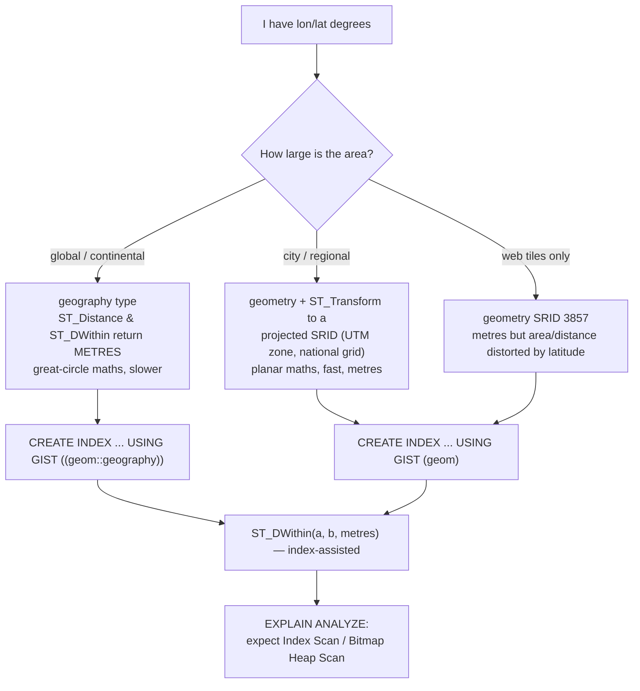

# PostGIS Spatial Lab

Spatial SQL taught from the coordinate system up: **CRS → type → index → operator → plan**, following the
first-principles, verify-by-running approach in [`AGENTS.md`](../../../AGENTS.md). Everything below runs in
a free local PostGIS container — no cloud database and no GIS licence.

## When to use

- The learner has lat/lon columns and needs "everything within 500 m", "which district is this in", or
  "how big is this polygon" — expressed correctly, in metres.
- A spatial query is slow or returns nonsense distances like `0.0034`; both are CRS/index problems.
- They are choosing between storing `geometry`, `geography`, or two float columns.
- Don't use it for non-spatial index tuning or general query plans — see
  [database-index-coach](../database-index-coach/SKILL.md) and
  [query-plan-tuning-lab](../query-plan-tuning-lab/SKILL.md).

## First principles: a coordinate is meaningless without its CRS

PostGIS (OSGeo project, PostGIS 3.x on PostgreSQL 13+) stores an **SRID** with every value. SRID **4326**
is WGS 84 — degrees on an ellipsoid, the CRS of GPS and GeoJSON. Degrees are *not* metres and are not even
a constant number of metres: one degree of longitude is ~111 km at the equator and ~68 km at 52° N. Check
what your build supports with `SELECT postgis_full_version();` and look SRIDs up in the `spatial_ref_sys`
table rather than memorising them.



| | `geometry` | `geography` |
| --- | --- | --- |
| Maths | planar (Cartesian) | spheroidal (great circle) |
| Units of `ST_Distance` | **units of the SRID** (degrees for 4326!) | always **metres** |
| Speed | fast | ~2–10× slower |
| Function coverage | the full `ST_` library | a useful subset |
| Best for | one projected zone, heavy analysis | global data, "within X metres" |

| SRID | Name | Units | Use for |
| --- | --- | --- | --- |
| 4326 | WGS 84 | degrees | storage, interchange, GeoJSON, GPS |
| 3857 | Web Mercator | metres | slippy-map tiles only — distorts area badly |
| 326xx / 327xx | UTM zone N/S | metres | accurate local distance/area (pick your zone) |
| national grids | e.g. British National Grid | metres | statutory/regional accuracy |

**The index is a bounding-box index.** GiST stores each geometry's rectangle; the `&&` operator tests
rectangle overlap. Functions like `ST_Intersects` and `ST_DWithin` are written to emit `&&` first, so they
*can* use the index, then re-check exactly. `ST_Distance(...) < 500` contains no `&&`, so it **cannot** —
that single fact explains most slow PostGIS queries.

## Procedure

1. **Start a free local PostGIS** (official image; pin a tag you verify on Docker Hub):
   ```bash
   docker run --name postgis-lab -e POSTGRES_PASSWORD=lab -p 5432:5432 -d postgis/postgis:17-3.5
   docker exec -it postgis-lab psql -U postgres -c "SELECT postgis_full_version();"
   ```
2. **Enable the extension** in your database: `CREATE EXTENSION IF NOT EXISTS postgis;`
3. **Type your columns properly** — `geometry(Point, 4326)`, not `geometry`. The typmod makes the database
   reject a mis-projected or wrong-dimension insert instead of silently corrupting the table.
4. **Load data** with `ST_SetSRID(ST_MakePoint(lon, lat), 4326)` — **longitude first**, because
   `ST_MakePoint(x, y)` is (x = lon, y = lat). Reversed coordinates are the #1 PostGIS bug and land your
   points in the Indian Ocean.
5. **Create the GiST index** *and* a functional index if you query through `::geography`.
6. **Write radius searches with `ST_DWithin`**, never `ST_Distance(...) < r`.
7. **Prove the plan**: `EXPLAIN (ANALYZE, BUFFERS)` must show an index scan; run `ANALYZE tbl;` first,
   because the planner needs statistics before it will trust a spatial index.
8. **Spatial joins**: `ST_Intersects`/`ST_Contains` between points and polygons; index *both* sides.
9. **Break it deliberately**: run the same query with `ST_Distance` and with `SET enable_seqscan = off`,
   compare the plans and timings, then explain the difference. Close with the **Learning Footer**.

## Output shape

```
Question: <the spatial question in one sentence>
Storage: <table.column> : geometry(<Type>, <SRID>) | geography(<Type>, 4326)   Rows: <n>
CRS decision: <4326 stored> -> <geography cast | ST_Transform to EPSG:<code>> because <extent/accuracy>
Index: CREATE INDEX <name> ON <tbl> USING GIST (<expr>);   ANALYZE <tbl>;
Query: <SQL using ST_DWithin / ST_Intersects — never ST_Distance(...) < r>
Plan: <Index Scan | Bitmap Heap Scan> on <index>  · rows=<est>/<actual> · time=<ms>
Result: <rows + distances in METRES>
Pitfall checked: lon/lat order · SRID match on both sides · units · index used
Next: <database-index-coach | query-plan-tuning-lab | data-pipeline-designer>
Learning Footer
```

## Worked example — cafés within 500 m of a tram stop, in real metres

```sql
CREATE EXTENSION IF NOT EXISTS postgis;

CREATE TABLE cafe (
  id   serial PRIMARY KEY,
  name text NOT NULL,
  geom geometry(Point, 4326) NOT NULL
);
CREATE TABLE tram_stop (
  id   serial PRIMARY KEY,
  name text NOT NULL,
  geom geometry(Point, 4326) NOT NULL
);

-- ST_MakePoint(x, y) = (longitude, latitude). Berlin, EPSG:4326.
INSERT INTO cafe (name, geom) VALUES
  ('Brandenburg Brew',      ST_SetSRID(ST_MakePoint(13.3777, 52.5163), 4326)),
  ('Unter den Linden Bean', ST_SetSRID(ST_MakePoint(13.3805, 52.5190), 4326)),
  ('Alexanderplatz Roast',  ST_SetSRID(ST_MakePoint(13.4050, 52.5200), 4326));
INSERT INTO tram_stop (name, geom) VALUES
  ('Pariser Platz', ST_SetSRID(ST_MakePoint(13.3780, 52.5165), 4326));

-- Index the exact expression the query uses, then give the planner statistics.
CREATE INDEX cafe_geog_gix ON cafe USING GIST ((geom::geography));
CREATE INDEX cafe_geom_gix ON cafe USING GIST (geom);
ANALYZE cafe; ANALYZE tram_stop;

-- CORRECT: geography => metres, and ST_DWithin emits && so the GiST index is usable.
SELECT c.name,
       round(ST_Distance(c.geom::geography, t.geom::geography)::numeric, 1) AS metres
FROM   cafe c
JOIN   tram_stop t ON ST_DWithin(c.geom::geography, t.geom::geography, 500)
WHERE  t.name = 'Pariser Platz'
ORDER  BY metres;
--          name          | metres
-- -----------------------+--------
--  Brandenburg Brew      |   30.0     (~30 m away)
--  Unter den Linden Bean |  326.4
-- 'Alexanderplatz Roast' is ~1.9 km away and is correctly excluded.

-- WRONG, and the classic bug: geometry/4326 distance is in DEGREES.
SELECT ST_Distance(c.geom, t.geom) AS degrees   -- ~0.00034, not 30 — never compare this to 500
FROM cafe c, tram_stop t WHERE c.name = 'Brandenburg Brew';

EXPLAIN (ANALYZE, BUFFERS)
SELECT c.name FROM cafe c JOIN tram_stop t
  ON ST_DWithin(c.geom::geography, t.geom::geography, 500);
-- Look for "Index Scan using cafe_geog_gix" (or a Bitmap Heap Scan). A Seq Scan on a large
-- table means the operator, the index expression, or the SRID does not match.
```

Polygon join — "how many cafés per district", the same pattern one dimension up:

```sql
CREATE TABLE district (id serial PRIMARY KEY, name text, geom geometry(MultiPolygon, 4326));
CREATE INDEX district_geom_gix ON district USING GIST (geom);

SELECT d.name, count(c.id) AS cafes, round((ST_Area(d.geom::geography) / 1e6)::numeric, 2) AS km2
FROM   district d
LEFT   JOIN cafe c ON ST_Intersects(d.geom, c.geom)   -- index-assisted on both sides
GROUP  BY d.name, d.geom
ORDER  BY cafes DESC;
```

## Tips

- **Longitude first.** `ST_MakePoint(lon, lat)` but GeoJSON `[lon, lat]` and most CSVs are `lat, lon` —
  sanity-check with `SELECT ST_AsText(geom)` and confirm the point is on land.
- Never write `ST_Distance(a, b) < r`. Use `ST_DWithin(a, b, r)`: same answer, index-assisted, and on
  `geography` the radius is unambiguously metres.
- SRIDs must match on both sides or PostGIS raises an error — `ST_Transform(geom, 32633)`, don't
  `ST_SetSRID` your way out of it (that relabels, it does not reproject).
- Index the *expression you query*: `USING GIST ((geom::geography))` if you cast in the predicate.
- Run `ANALYZE` after bulk loads; without statistics the planner will ignore a perfectly good GiST index.
- 3857 (Web Mercator) is for tiles, not measurement — areas at 60° latitude are inflated ~4×.
- `ST_Simplify` before rendering, never before measuring; `ST_MakeValid` fixes self-intersecting polygons
  that make `ST_Intersects` throw.
- Pair with [database-index-coach](../database-index-coach/SKILL.md),
  [query-plan-tuning-lab](../query-plan-tuning-lab/SKILL.md),
  [postgres-local-lab](../postgres-local-lab/SKILL.md) for the server itself,
  [sql-joins-lab](../sql-joins-lab/SKILL.md) for join mechanics, and
  [data-viz-coach](../data-viz-coach/SKILL.md) before you map the result.
  End with the **Learning Footer** (`AGENTS.md`).
