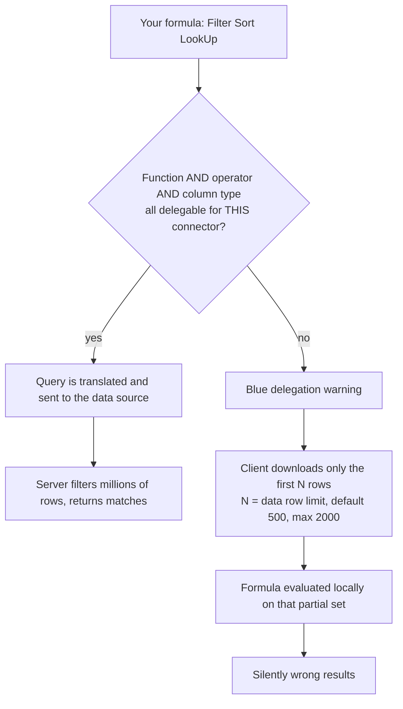

# Power Fx Coach

A coach for writing Power Fx that scales — **formulas recalculate like a spreadsheet; the hard part is
knowing which ones the data source can run for you** — following [`AGENTS.md`](../../../AGENTS.md).
Practise on the **free Power Apps Developer Plan**, with its own environment and Dataverse database.

## When to use

- A gallery shows only some records and the learner blames the filter, not delegation.
- Power Apps Studio shows the blue delegation-warning underline and the learner ignores it.
- They are unsure whether to use `Filter`, `LookUp`, `Search`, or a collection.
- `App.OnStart` has grown into a script and the app is slow to open.
- Errors surface as blank screens instead of messages.

## Free environment — Power Apps Developer Plan

| Step | Action | Verify |
| --- | --- | --- |
| 1. Sign up | Join the **Power Apps Developer Plan** with a work/school account (free, individual use) | Developer environment listed |
| 2. Open maker portal | `make.powerapps.com` → pick the Developer environment | Environment name shown top-right |
| 3. Create data | **Tables → New table** in Dataverse (or a SharePoint list for contrast) | Table opens with columns |
| 4. Seed rows | Add > 2,000 rows (Excel import or a `ForAll(Sequence(...))` patch loop) | Row count exceeds the limit |
| 5. Create app | **+ Create → Blank canvas app** | Studio opens |
| 6. Connect | Data → Add data → your table | Table appears in the Data pane |
| 7. Check limit | **Settings → General → Data row limit for non-delegable queries** | Default **500** (max 2000) |
| 8. Observe | Put `Filter(Table, Status = "Open")` in a gallery and watch for the warning | Blue underline / warning icon |

The oversized table is the whole point: delegation problems are invisible below the row limit.

## Delegation: what actually happens



**First principle:** delegation is not an optimization, it is a *correctness* feature. A non-delegable
formula does not run slower — it runs on the wrong data and returns a confident wrong answer.

## Choosing the right construct

| Need | Use | Trade-off / delegation note |
| --- | --- | --- |
| Many matching rows | `Filter(Source, cond)` | Delegable when every part of `cond` is delegable for that connector |
| Exactly one row | `LookUp(Source, cond)` | Returns a record, not a table; delegable under the same rules |
| First N by order | `FirstN(Sort(Source, Col), n)` | `Sort` delegability is connector-specific — verify |
| Text "contains" search | `Filter(Source, StartsWith(Col, txt))` | `StartsWith` is commonly delegable; `in` and `Search` often are **not** — check the connector's list |
| Small static reference data | `ClearCollect(colX, Source)` | Collections are **in-memory and never delegated**; only safe under the row limit |
| A value reused across screens | **Named formula** in `App.Formulas` | Declarative, recalculates automatically, no `Set` in `OnStart`, faster app start |
| A value that must change on a click | `Set(varX, ...)` / `UpdateContext({x: ...})` | Imperative state; needed, but keep it small |
| Writing back one record | `Patch(Source, record, changes)` | Prefer over `Update`; combine with `IfError` |
| Independent slow calls | `Concurrent(...)` | Parallelizes; do not use where order matters |

Connector capabilities differ sharply — **Dataverse** delegates far more than **SharePoint**, and Excel in
OneDrive delegates almost nothing. Always check the delegable-function list for *your* connector on
Microsoft Learn before designing the screen.

## Procedure

1. **Set up the Developer Plan environment** and a table with more rows than the row limit — otherwise the
   lesson cannot be observed.
2. **Read the warning properly.** In Studio, hover the blue underline: it names the function or operator
   that could not be delegated. Teach the learner to treat it as an error, not a hint.
3. **Decompose the predicate** — a formula is delegable only if *every* operand is. `Filter(T, Status =
   "Open" && Owner = User().Email)` may delegate while `Filter(T, Len(Title) > 10)` will not, because the
   function is evaluated client-side.
4. **Rewrite non-delegable predicates**: precompute the value into a variable *before* the query
   (`Set(gEmail, User().Email)` then `Filter(T, Owner = gEmail)`), replace client-only functions with
   delegable equivalents, or add a computed/stored column in the data source so the server can filter on it.
5. **Reduce before you shape**: delegate the `Filter` first, then do the non-delegable formatting on the
   small result — order of operations decides delegability.
6. **Set the data row limit to 2000** as a diagnostic, not a fix. If raising it changes results, the app is
   delegation-broken by definition.
7. **Refactor `App.OnStart`** into **named formulas** in `App.Formulas` (`MyRole = LookUp(...);`). Explain
   the trade-off: named formulas are declarative, always up to date and evaluated lazily, so the app opens
   faster; `Set` in `OnStart` is imperative, ordered and evaluated eagerly.
8. **Add error handling**: wrap writes in `IfError(Patch(...), Notify("Save failed: " & FirstError.Message,
   NotificationType.Error))`, and inspect `Errors(DataSource, record)` for row-level failures. Blank
   results and silent failures are the default without this.
9. **Verify with real data — make the learner run it**: publish or preview the app (F5), scroll the gallery
   past 500 rows, compare the visible count against the true row count in the table, and confirm the
   filtered set matches a query run directly in the data source. Paste both numbers.
10. **Instrument** with the **Monitor** tool (Studio → Advanced tools → Monitor) to see the actual network
    calls; it shows exactly how many rows were fetched. This turns delegation from folklore into evidence.
11. **Route onward** — analytics expressions in the same family →
    [power-bi-dax-coach](../power-bi-dax-coach/SKILL.md); server-side query thinking →
    [sql-coach](../sql-coach/SKILL.md) and [sql-indexing-lab](../sql-indexing-lab/SKILL.md); modelling the
    underlying tables → [data-modeling-drill](../data-modeling-drill/SKILL.md).

## Output shape

```
Power Fx coach — <goal>

Environment: Power Apps Developer Plan  Data source: <Dataverse | SharePoint | ...>
Rows in source: <n>   Data row limit setting: <500|2000>

Formula under review:
  <original formula>
Delegation verdict: <delegable | NOT delegable — because <function/operator> on <connector>>

Rewrite:
  <delegable version, with the precomputed variable or column change explained>
Why it now delegates: <one sentence>

State strategy: <named formula in App.Formulas | Set in OnStart | context variable> — because <trade-off>
Error handling: IfError(<write>, Notify(FirstError.Message, NotificationType.Error))

Verify (run this):
  1. Preview (F5), scroll the gallery past the row limit
  2. Compare gallery count vs. true row count in the data source
  3. Advanced tools -> Monitor: rows actually fetched
Actual result: <paste counts and monitor observation>

Pitfall avoided: <partial result | slow OnStart | swallowed error>
Next: <linked skill>
```

## Tips

- Treat the delegation warning as a **bug report about correctness**, never a performance suggestion.
- Raising the data row limit to 2000 hides small problems and guarantees a bigger one later — it buys time,
  not correctness.
- Anything you `ClearCollect` into a collection is capped by the row limit at collection time; collections
  are a caching tool for small reference data, not a workaround for big tables.
- `Search` and the `in` operator are frequently non-delegable — check the connector's delegable-function
  table before designing a search box on a large list.
- Prefer named formulas over `Set` in `OnStart`: fewer ordering bugs, faster start, automatic recalculation.
- Use `With({...})` to name intermediate values instead of repeating a subexpression — clearer and often
  cheaper.
- Ground every function, limit and connector capability in **Microsoft Learn** (Power Fx formula reference,
  "Understand delegation in a canvas app", the connector's delegable-functions list, and the Power Apps
  Developer Plan page) — never invent a function or a delegation claim; look it up and cite the page.
- End with the **Learning Footer** (`AGENTS.md`).
