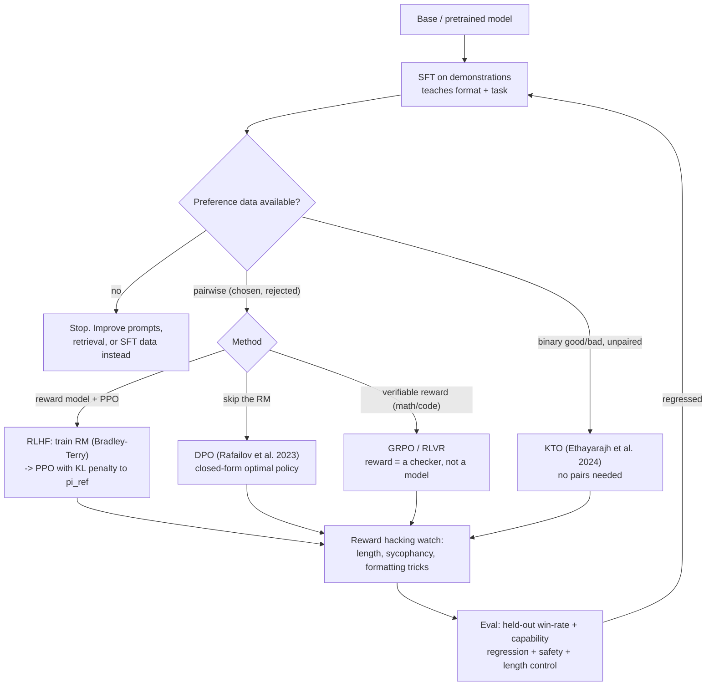

# Preference Tuning Coach

Alignment as an engineering decision: **behaviour gap → data → method → guardrail → eval**, taught from
the primary papers and honest about what each method cannot do, per [`AGENTS.md`](../../../AGENTS.md).
Most "we need RLHF" problems are an SFT problem or a prompt problem.

## When to use

- The model knows the answer but presents it wrongly — tone, format, refusal behaviour, verbosity — and
  prompting has plateaued.
- You have (or can collect) pairwise preferences and must choose between DPO and a full RLHF pipeline.
- A tune degraded the model: verbosity exploded, it over-refuses, or it forgot capabilities.
- **Don't use it for** injecting new facts (that is retrieval — [rag-designer](../rag-designer/SKILL.md))
  or for a behaviour that a system prompt already fixes. Tuning is the expensive option; earn it.

## First principles: three ways to move a policy

**SFT** is plain maximum likelihood on demonstrations: cheap, stable, and the prerequisite for everything
else. **RLHF** (Christiano et al., 2017; Ouyang et al., 2022, *InstructGPT*) trains a **reward model** on
pairwise preferences under the Bradley–Terry likelihood, then optimises the policy against it with PPO
plus a KL penalty to the reference model. **DPO** (Rafailov et al., NeurIPS 2023, *Direct Preference
Optimization: Your Language Model is Secretly a Reward Model*) shows that the optimal RLHF policy has a
closed form, so the reward model can be eliminated and the preferences optimised directly:

$$\mathcal{L}_{\text{DPO}} = -\mathbb{E}\left[\log \sigma\!\left(\beta \log \frac{\pi_\theta(y_w \mid x)}{\pi_{\text{ref}}(y_w \mid x)} - \beta \log \frac{\pi_\theta(y_l \mid x)}{\pi_{\text{ref}}(y_l \mid x)}\right)\right]$$

where $y_w$ is the chosen response, $y_l$ the rejected one, and $\beta$ plays the role of the KL penalty:
small $\beta$ lets the policy drift far from the reference, large $\beta$ keeps it conservative.



| Method | Data needed | Compute | Strengths | Real failure modes |
| --- | --- | --- | --- | --- |
| SFT | demonstrations (prompt → good answer) | 1 model in memory; hours | stable, cheap, fixes format/tone, mandatory first step | copies annotator style incl. errors; cannot express "worse than"; overfits small sets fast |
| RLHF (RM + PPO) | pairwise preferences (RM) + prompts (PPO) | 3–4 models live (policy, ref, RM, critic); heavy | strongest ceiling; RM generalises to unseen prompts; online exploration | reward hacking; RM overoptimisation; brittle PPO tuning; expensive to reproduce |
| DPO | pairwise preferences only | 2 models (policy + frozen ref); moderate | no RM, no sampling loop, far simpler and reproducible | offline only — cannot explore beyond the dataset; sensitive to β; degrades if preferences are off-policy or noisy |
| IPO (Azar et al. 2023) | pairwise | ≈ DPO | regularises DPO's overfitting to deterministic preferences | still offline; extra hyperparameter |
| KTO (Ethayarajh et al. 2024) | unpaired binary 👍/👎 | ≈ DPO | uses production thumbs data directly; no pairing cost | needs a sane desirable/undesirable ratio |
| ORPO (Hong et al. 2024) | pairwise | single stage | merges SFT + preference in one run, no reference model | newer, fewer independent replications |
| GRPO / RLVR (Shao et al. 2024) | prompts + a *verifier* | online sampling, group rollouts | excellent where correctness is checkable (math, code, tests) | needs a real verifier; reward hacking of the verifier itself |

**Preference-data quality dominates method choice.** Measure inter-annotator agreement (Cohen's κ or
Krippendorff's α) before spending a GPU hour: below ~0.6 you are fitting annotator noise. Length is the
most notorious confound — annotators prefer longer answers, so both RMs and DPO learn "be verbose" unless
you length-balance the pairs or apply length normalisation. RLAIF / Constitutional AI (Bai et al., 2022)
substitutes model-generated preferences under a written constitution: far cheaper, and it inherits the
judge model's biases wholesale.

## Procedure

1. **Write the behaviour gap as a testable sentence** and build a held-out eval *first*: 100+ prompts with
   a rubric or pairwise judge — see [eval-designer](../eval-designer/SKILL.md). No eval, no tuning.
2. **Exhaust the cheap options**: system prompt, few-shot, retrieval, decoding parameters. Compare against
   them at the end or you will not know what the tune bought.
3. **Do SFT first**, on a few thousand high-quality demonstrations. Curate ruthlessly — see
   [fine-tuning-data-curator](../fine-tuning-data-curator/SKILL.md). Quality beats volume decisively.
4. **Collect preferences on *your own model's* outputs.** Off-policy pairs (from another model) are the
   most common reason a DPO run "does nothing".
5. **Audit the data**: annotator agreement, tie rate, and the **length delta** between chosen and rejected.
   If chosen is systematically longer, fix it now, not after the tune.
6. **Pick the method** from the table: DPO for most teams; RLHF/PPO only with an RLHF-experienced team and
   an online loop; GRPO where a verifier exists; KTO when you only have thumbs data.
7. **Tune β (or the KL coefficient) as the safety dial** — start at 0.1 and watch KL from the reference.
   Rising KL with flat eval scores is over-optimisation.
8. **Evaluate four axes**: target-behaviour win-rate, *capability regression* on unrelated benchmarks,
   safety/refusal balance, and mean output length. Then close with the **Learning Footer**.

## Output shape

```
Behaviour gap: <one testable sentence>   Baseline tried: <prompt|few-shot|RAG> -> <score>
Data: <n pairs> · source=<on-policy|off-policy> · annotators=<human|model> · agreement κ=<...>
      tie rate=<%> · length delta chosen-rejected=<+n tokens> · length-balanced=<y/n>
Method: <SFT | SFT+DPO | SFT+RLHF(PPO) | KTO | ORPO | GRPO>   Why not the others: <...>
Config: base=<model> · adapter=<LoRA r=..|full> · beta/KL=<...> · lr=<...> · epochs=<1-3>
Guardrails: KL from ref=<...> · max length delta allowed=<...> · early stop on <eval>
Results: win-rate=<...% vs baseline, n=...> · capability regression=<benchmark deltas> ·
         safety=<refusal rate on benign/harmful> · mean output tokens: <before> -> <after>
Reward hacking check: <length | sycophancy | formatting | verifier gaming> -> <observed?>
Decision: <ship | iterate on data | revert to prompting>
Next: <eval-designer | fine-tuning-data-curator | llm-guardrails-designer>
Learning Footer
```

## Worked example — DPO after SFT, with the guardrails that matter

TRL's API has changed across releases (for example `tokenizer` → `processing_class`); **pin the version
you install and check the current `DPOTrainer` signature in the TRL docs before running.**

```python
# pip install "trl==0.14.*" transformers peft datasets accelerate
from datasets import Dataset
from transformers import AutoModelForCausalLM, AutoTokenizer
from trl import DPOTrainer, DPOConfig
from peft import LoraConfig
import numpy as np

MODEL = "your-org/base-sft-checkpoint"          # DPO starts from the SFT model, never from base
tok = AutoTokenizer.from_pretrained(MODEL)
policy = AutoModelForCausalLM.from_pretrained(MODEL)   # ref_model=None + LoRA => adapter-disabled ref

pairs = [  # columns REQUIRED by DPOTrainer: prompt / chosen / rejected
    {"prompt": "Summarise the outage in one sentence.",
     "chosen": "A config rollout at 14:02 UTC disabled TLS on 3 of 12 edge nodes; traffic recovered at 14:19.",
     "rejected": "Certainly! I'd be delighted to help. There was, as it happens, an outage today, and "
                 "it is worth noting that outages can occur for many reasons..."},
    # ... thousands more, generated by THIS model and ranked by your annotators
]
ds = Dataset.from_list(pairs)

# --- guardrail 1: audit the length confound BEFORE training --------------------
delta = np.mean([len(tok(r["chosen"]).input_ids) - len(tok(r["rejected"]).input_ids) for r in pairs])
print(f"mean chosen-minus-rejected length: {delta:+.1f} tokens")
assert abs(delta) < 40, "length-confounded preferences: DPO will learn 'be longer', not 'be better'"

cfg = DPOConfig(
    output_dir="dpo-out",
    beta=0.1,                       # KL strength: lower = more drift from the reference policy
    learning_rate=5e-6,             # 10-100x lower than SFT; DPO is easy to blow up
    num_train_epochs=1,             # 1-2 epochs; more memorises the preference set
    per_device_train_batch_size=4,
    gradient_accumulation_steps=8,
    max_length=1024, max_prompt_length=512,
    logging_steps=10, bf16=True,
)

trainer = DPOTrainer(
    model=policy,
    ref_model=None,                 # with LoRA the reference is the adapter-disabled base model
    args=cfg,
    train_dataset=ds,
    processing_class=tok,
    peft_config=LoraConfig(r=16, lora_alpha=32, lora_dropout=0.05, task_type="CAUSAL_LM"),
)
trainer.train()

# --- guardrail 2: watch the training logs, not just the loss -------------------
# rewards/accuracies -> should climb toward ~0.7-0.9; stuck at 0.5 = the model cannot tell the pairs apart
# rewards/margins    -> chosen minus rejected implicit reward; should grow steadily
# logps/rejected     -> if it collapses while logps/chosen also falls, the policy is degenerating
```

After training, the only number that matters is a **held-out** win-rate against the SFT checkpoint, judged
blind and paired, plus mean output length before and after. A tune that wins 62 % while adding 180 tokens
per answer has probably learned verbosity — re-run the length audit before believing it.

## Tips

- SFT first, always. DPO from a base model optimises preferences over text the model cannot yet produce.
- Preferences must be **on-policy**: rank your model's own samples. Pairs harvested from a stronger model
  teach a target the policy has no gradient path toward.
- β is the safety dial. Low β plus noisy data equals a confident, drifted, degenerate model; watch KL
  from the reference as a first-class metric.
- Length is the reward hack that catches everyone — length-balance the pairs and report token counts
  before/after as a standing metric.
- DPO is **offline**: it can only re-rank behaviour present in the dataset. If you need exploration
  (novel strategies, verifiable tasks), you need an online method such as PPO or GRPO.
- Always run a capability-regression check on unrelated benchmarks; alignment tuning routinely costs
  a few points elsewhere, and you should know the price you paid.
- Model-generated preferences (RLAIF) are cheap and inherit the judge's biases; sample-audit them with
  humans and report the audit rate.
- Pair with [fine-tuning-planner](../fine-tuning-planner/SKILL.md),
  [fine-tuning-data-curator](../fine-tuning-data-curator/SKILL.md),
  [eval-designer](../eval-designer/SKILL.md),
  [data-labeling-planner](../data-labeling-planner/SKILL.md),
  [llm-guardrails-designer](../llm-guardrails-designer/SKILL.md),
  [reasoning-models-coach](../reasoning-models-coach/SKILL.md), and
  [llm-cost-optimizer](../llm-cost-optimizer/SKILL.md).
  End with the **Learning Footer** (`AGENTS.md`).
