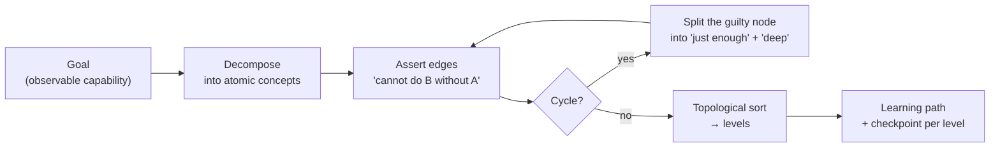
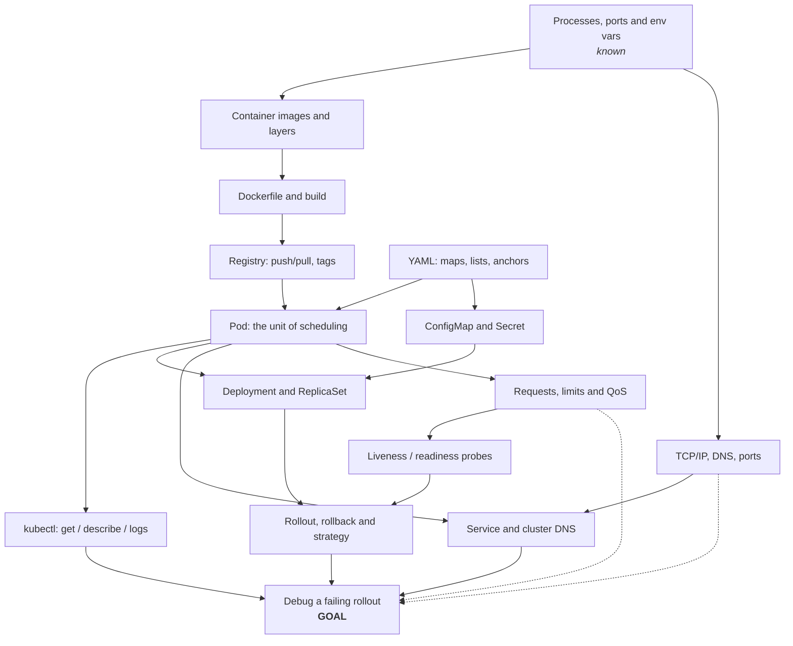

# Prerequisite Graph Generator

Most "I'm stuck" is really "I'm missing an upstream concept." This skill makes the dependency structure of
a topic **explicit and inspectable** — a DAG you can argue with — then walks it in a defensible order,
following the teach-from-first-principles rule in [`AGENTS.md`](../../../AGENTS.md).

## When to use

- A learner has a goal ("deploy and debug a service on Kubernetes") and no idea where to start.
- A course/tutorial keeps losing people at the same chapter — usually an unstated prerequisite.
- You are writing curriculum ([curriculum-designer](../curriculum-designer/SKILL.md)) and need the ordering
  to be derived rather than guessed.
- You want to *skip* material safely: a DAG shows exactly which nodes a known concept discharges.
- **Don't use it for** a schedule (that's [learning-roadmap](../learning-roadmap/SKILL.md) — this skill
  produces order, not dates), for mapping *associations* between ideas rather than dependencies (use
  [concept-map-generator](../concept-map-generator/SKILL.md)), or for a single concept's explanation
  ([concept-explainer](../concept-explainer/SKILL.md)).

## First principles

Three ideas, each from a primary source, justify the whole method:

1. **Learning has hierarchical structure.** Gagné's *learning hierarchies* (Robert M. Gagné,
   *The Conditions of Learning*, 1965; and "Learning Hierarchies", *Educational Psychologist*, 1968) argue
   that intellectual skills are ordered: a higher skill is acquired only when its subordinate skills can be
   performed. Knowledge Space Theory later formalised the same idea as a partial order over problems
   (Doignon & Falmagne, *International Journal of Man–Machine Studies*, 1985).
2. **Prior knowledge is the strongest single predictor of what you can learn next.** Ausubel's advance
   organizers rest on this (*Educational Psychology: A Cognitive View*, 1968): teach in the order the
   learner's existing schema can absorb.
3. **Out-of-order learning is expensive because working memory is small.** Cognitive Load Theory (Sweller,
   *Cognitive Science*, 1988) predicts that studying a concept whose prerequisites are missing forces the
   learner to hold unresolved dependencies in working memory — the felt sense of "I read it three times and
   nothing stuck." Ordering is not pedantry; it is load management
   ([cognitive-load-coach](../cognitive-load-coach/SKILL.md)).

The mechanics are plain graph theory: concepts are nodes, "A must precede B" is a directed edge, and a
**valid study order is a topological sort** (Kahn, *Communications of the ACM*, 1962). A cycle means your
decomposition is wrong, not that the subject is circular.



*Figure 1 — The generator loop. Cycles are always a decomposition bug; the fix is splitting a node, never deleting an edge you believe in.*

| Edge type | Test it must pass | Example |
| --- | --- | --- |
| **Hard prerequisite** (solid `-->`) | "Can they even start B without A?" → no | containers → Kubernetes Pods |
| **Soft prerequisite** (dashed `-.->`) | B is *learnable* without A but far harder or riskier | Linux networking → debugging Services |
| **Not an edge** | Merely related, or the same level | YAML ↔ JSON |

## Procedure

1. **State the goal as an observable capability**, not a topic. "Kubernetes" is a shelf; "deploy a service,
   expose it, and debug a failing rollout" is a goal you can test against.
2. **Elicit the starting point.** What can the learner already do? Every discharged node prunes a subtree —
   this is where most of the time savings come from ([skill-assessment](../skill-assessment/SKILL.md)).
3. **Decompose into atomic concepts** — each one teachable in a single sitting and testable by a single
   task. If a node needs two checkpoints, split it.
4. **Assert each edge as a claim you'd defend**: "you cannot understand X until you can do Y." If you can
   construct a counter-example learner, it isn't a hard edge — downgrade it to soft or drop it.
5. **Detect cycles** (walk the graph, or just look for a back edge). Break a cycle by **splitting the node**
   into `X (just enough)` and `X (deep)`; the shallow half goes upstream, the deep half downstream. Never
   resolve a cycle by deleting an edge you still believe.
6. **Topologically sort into levels** with Kahn's algorithm: repeatedly take every node with in-degree 0,
   emit it as one level, remove it, recompute. Nodes sharing a level are genuinely order-independent — say
   so, because that's where the learner gets to choose.
7. **Emit the Mermaid DAG**, direction `TD` for ≤ ~20 nodes and `LR` beyond that, with hard edges solid and
   soft edges dashed, and known concepts visually marked as discharged.
8. **Convert levels into a path** with, per level, a one-line *why now*, a concrete artifact, and a
   checkpoint question. Interleave and space the checkpoints —
   [spaced-repetition-scheduler](../spaced-repetition-scheduler/SKILL.md),
   [retrieval-practice-coach](../retrieval-practice-coach/SKILL.md).
9. **Mark the critical path** (longest chain to the goal). It is the only part of the graph where delay
   delays everything; leaf branches can be deferred without cost.
10. **State what you deliberately excluded** and why — the honest boundary is what keeps the graph small
    enough to be useful. Then close with the **Learning Footer**.

## Output shape

````
Goal (capability): <observable thing the learner will be able to do>
Already known (discharged): <a, b, c>     Excluded on purpose: <x — because ...>
Concepts: <n>   Hard edges: <n>   Soft edges: <n>   Cycles found/broken: <n>

```mermaid
graph TD
  <nodes with human labels>
  <A --> B hard edges ; A -.-> B soft edges>
```

Levels (topological sort — items in a level are order-independent):
  L0: <...>   L1: <...>   L2: <...>
Critical path: <A → B → C → goal>   (length <n> — this is what sets the timeline)

Learning path
  1. <concept> — why now: <...> · do: <artifact> · checkpoint: <question they must answer>
  2. ...

Cycles broken: <X ↔ Y> → split into "<X: just enough>" (before Y) and "<X: deep>" (after Y)
Confidence: <high|med|low> — weakest edge: <edge> because <...>
Next: <learning-roadmap | curriculum-designer | spaced-repetition-scheduler>
Learning Footer
````

## Worked example — "Deploy a service on Kubernetes and debug a failing rollout"

Learner already knows: Linux shell, Git, one backend language. Those nodes are discharged up front.



*Figure 2 — Prerequisite DAG for the goal. Solid = hard prerequisite; dashed = soft (learnable without, but painfully). `proc` is already discharged.*

**Trace the topological sort (Kahn, 1962).** Take every node with in-degree 0, emit, remove, repeat:

| Level | In-degree 0 at this step | Why they're together |
| --- | --- | --- |
| L0 | `proc` *(known)*, `yaml` | no incoming edges at all |
| L1 | `net`, `img`, `cfg` | `net`,`img`←`proc`; `cfg`←`yaml` |
| L2 | `df` | `img` is its only parent |
| L3 | `reg` | `df` is its only parent |
| L4 | `pod` | needs `reg` **and** `yaml` — the last of its parents lands at L3 |
| L5 | `ctl`, `dep`, `svc`, `res` | all depend only on things at or below L4 |
| L6 | `probe` | needs `res` |
| L7 | `roll` | needs `dep` **and** `probe` |
| L8 | `dbg` (goal) | needs `ctl`, `roll`, `svc` |

Nine levels, 15 nodes emitted, none left over ⇒ **the graph is acyclic and the sort is valid** (verified by
running Kahn's algorithm over exactly the edges drawn above: 19 hard + 2 soft = 21 edges). Everything
inside a level is genuinely interchangeable: a learner can do `svc` before `res` with no penalty.

**Critical path:** `proc → img → df → reg → pod → res → probe → roll → dbg` — 9 nodes, depth 8. Slipping
any of those slips the goal; slipping `cfg` does not.

**A cycle you will actually hit.** Naïve decomposition produces `svc → net` ("you meet DNS via Services")
*and* `net → svc` ("you can't understand Services without DNS"). Both feel true, so don't delete either —
**split the node**: `net (just enough): ports, TCP, what a DNS A record is` goes at L1, and
`net (deep): resolution order, search domains, conntrack` moves after `svc`. The cycle disappears and both
original intuitions survive intact. That is the move to reach for every time.

**Path, level by level** (abbreviated): L0–L1 *why now:* everything below is a process in a namespace →
*do:* run a server, `curl` it, read `/proc/<pid>/environ` → *checkpoint:* "what does binding to `0.0.0.0`
vs `127.0.0.1` change?" … L4 *why now:* the Pod is the only thing Kubernetes schedules → *do:* apply a
one-container Pod manifest → *checkpoint:* "why did the Pod restart and where is the previous log?"

## Tips

- A cycle is **always** a decomposition bug. Split the node into "just enough" and "deep" — it is the single
  highest-leverage move in this skill.
- Nodes on the same level are a *feature*: tell the learner they may choose, and motivation improves.
- Prune aggressively with what they already know; an honest 12-node graph beats a complete 60-node one.
- Mark soft edges honestly. Pretending "nice to have" is "required" is how six-month roadmaps get built.
- The critical path — not the node count — sets the timeline. Hand it to
  [learning-roadmap](../learning-roadmap/SKILL.md) for dates.
- Attach a *checkpoint task* per node; an unverified prerequisite is an assumption
  ([quiz-generator](../quiz-generator/SKILL.md), [worked-example](../worked-example/SKILL.md)).
- Render big graphs with [graphviz-dot-lab](../graphviz-dot-lab/SKILL.md) — beyond ~30 nodes Mermaid's
  layout gives up before Graphviz does.
- Related: [concept-map-generator](../concept-map-generator/SKILL.md),
  [knowledge-graph](../knowledge-graph/SKILL.md),
  [graph-algorithms-coach](../graph-algorithms-coach/SKILL.md),
  [lesson-plan-writer](../lesson-plan-writer/SKILL.md),
  [reading-list-curator](../reading-list-curator/SKILL.md).
  End with the **Learning Footer** (`AGENTS.md`).
