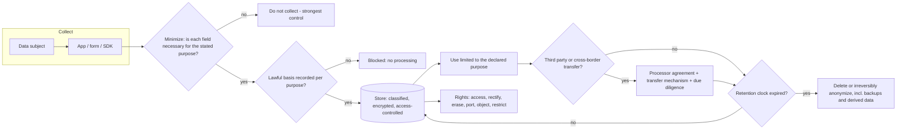

# Privacy by Design Coach

**Scope guardrail:** defensive only — this skill helps you *protect* personal data in systems you own or are
authorized to review; it will not help de-anonymize individuals, build tracking or scraping tooling, or
circumvent consent, and it is engineering guidance rather than legal advice — confirm decisions with your
DPO or counsel. Follows [`AGENTS.md`](../../../AGENTS.md); pairs with
[threat-model](../threat-model/SKILL.md) and
[secure-code-review](../secure-code-review/SKILL.md).

## When to use

- A new feature touches personal data and you need privacy designed in before the schema is frozen.
- Legal asks for a DPIA and the team has never done one.
- Nobody can answer "where does this user's data live and how do we delete all of it?"
- You are adding analytics, an AI feature, or a third-party processor and need a defensible decision trail.

## First principles

GDPR **Article 25** requires *data protection by design and by default* — privacy engineered into the system,
with the most privacy-friendly settings as the default, not a consent banner bolted on at launch. **Article
35** requires a **DPIA** when processing is likely to be high risk (large-scale sensitive data, systematic
monitoring, automated decisions with legal effect, novel technology).

Security asks "can an unauthorized party access this?"; privacy also asks "**should we hold this at all, for
this purpose, this long?**" That is why STRIDE is insufficient and **LINDDUN** exists: Linking,
Identifying, Non-repudiation, Detecting, Data disclosure, Unawareness, Non-compliance. NIST CSF 2.0 governance
outcomes give you the accountability wrapper.



## Privacy threats and controls (LINDDUN)

| Threat | The question it asks | Typical control |
| --- | --- | --- |
| **L**inking | Can records be joined across contexts to build a profile? | Separate identifiers per context, avoid shared keys, aggregate |
| **I**dentifying | Can an individual be singled out from "anonymous" data? | Pseudonymization, k-anonymity, coarse geo/time, differential privacy |
| **N**on-repudiation | Is someone provably tied to an action they should be able to deny? | Limit signed audit detail, plausible deniability where appropriate |
| **D**etecting | Does existence of a record leak something (e.g. "user exists")? | Uniform responses, constant-time-ish behaviour, rate limits |
| **D**ata disclosure | Is more data exposed than necessary? | Field-level authz, redaction, minimization at the API boundary |
| **U**nawareness | Do subjects understand and control processing? | Layered notice, real choice, privacy-friendly defaults |
| **N**on-compliance | Is processing outside policy or law? | Lawful basis register, retention enforcement, DPIA, audits |

## Lawful basis, quickly

| Basis | Fits | Watch out |
| --- | --- | --- |
| Consent | Optional extras, marketing, non-essential cookies | Must be freely given, specific, informed, withdrawable — and withdrawal must work |
| Contract | What the user actually signed up for | Cannot stretch to analytics or profiling |
| Legal obligation | Tax, AML, statutory retention | Cite the specific obligation; it also *forbids* early deletion |
| Legitimate interests | Security, fraud prevention, core telemetry | Requires a documented balancing test + opt-out |
| Vital interests / public task | Rare in product work | Narrow; confirm with counsel |

## Procedure

1. **Scope and confirm authorization**; identify data subjects (customers, employees, children — special
   care), jurisdictions, and whether you act as controller or processor.
2. **Build the data inventory** (ROPA-style): for each data element — what, why (purpose), lawful basis,
   source, where stored, who can access, processors/sub-processors, cross-border transfers, retention period.
   You cannot protect or delete what you have not mapped.
3. **Draw the data-flow diagram** with trust boundaries *and* purpose boundaries; mark every point where data
   leaves your control (SDKs, analytics, logs, support tools, backups, ML training sets).
4. **Minimize aggressively.** For every field ask: needed for the purpose, or merely nice to have? Can it be
   truncated, hashed with a per-context key, aggregated, or derived on the fly? Not collecting is the only
   control that never fails.
5. **Set purpose limitation in writing** and enforce it technically — separate stores/scopes per purpose, so
   "support data" cannot silently become "training data".
6. **Run LINDDUN** over each element and flow; record threat → control → residual risk, exactly as
   [threat-model](../threat-model/SKILL.md) does for security.
7. **Decide DPIA necessity** against the Article 35 triggers. If needed, work through it: describe the
   processing, assess necessity and proportionality, assess risks to rights and freedoms, define measures,
   record residual risk and sign-off, and consult the DPO (and the supervisory authority if high risk remains).
8. **Design retention and deletion as code**: a retention clock per data class, automated deletion jobs,
   deletion propagation to replicas, caches, search indexes, backups (document the backup-expiry approach),
   analytics warehouses, and third-party processors.
9. **Build the DSAR path before the first request**: identity verification proportionate to risk, a search
   across every store in the inventory, a redaction step for third-party data, machine-readable export for
   portability, erasure with the legal-hold exceptions documented, and a one-month clock with an audit trail.
10. **Handle logs and telemetry** — the most common accidental data lake. No PII in logs by default, structured
    redaction, short retention, restricted access; coordinate with
    [logging-strategy-coach](../logging-strategy-coach/SKILL.md).
11. **Prepare for breach**: detection to notification path, 72-hour controller clock, decision criteria for
    notifying subjects, and a documented rehearsal.
12. **Verify**: test deletion end-to-end (create → delete → search every store), test a DSAR export, and
    review the inventory whenever the schema or a processor changes.

## Output shape

```
Privacy by design — <feature/system>          (authorized: yes | legal review: pending/done)

Roles: controller <org> | processors <list> | subjects <who> | jurisdictions <list>

Data inventory:
| element | purpose | lawful basis | store | access | retention | transfer | minimized? |
| email   | account | contract     | <db>  | <role> | life+30d  | none     | yes        |
| precise geo | <purpose> | consent | <db> | <role> | 24h      | <region> | -> coarse city |

Flow map: <mermaid DFD with trust + purpose boundaries>
LINDDUN findings:
  1. Linking — <shared user id across contexts> -> per-context pseudonym   residual: LOW
  2. Identifying — <rare attribute combo re-identifies> -> generalize      residual: MED

DPIA required? <yes/no + Art.35 trigger>   if yes: necessity, proportionality,
  risks to rights, measures, residual risk, DPO sign-off <date>

Defaults (Art.25): <most privacy-friendly setting per toggle>
Retention & deletion: clock per class | jobs <schedule> | propagation: replicas, cache,
  index, backups <policy>, warehouse, processors | verified <date>
DSAR: verify identity -> search <stores> -> redact third parties -> export <format>
  -> erase (exceptions: <legal hold>) | SLA 1 month | audit trail
Logging: PII policy <none by default> | redaction | retention <n days>
Breach: detect -> assess -> notify (72h) | rehearsal <date>
Open questions for DPO/counsel: <...>
Next: <threat-model | logging-strategy-coach | secure-code-review>
```

## Tips

- **The cheapest privacy control is not collecting the field.** Every other control is maintenance forever.
- Deletion is a distributed-systems problem: replicas, caches, search indexes, backups, warehouses, ML
  training sets, and processors. Test it; do not assume the `DELETE` propagated.
- Consent is not a universal solvent — if the processing is necessary for the contract, saying "consent"
  creates an obligation to honour withdrawal you cannot actually honour.
- Pseudonymization reduces risk but is still personal data under GDPR; only irreversible anonymization exits
  scope, and re-identification research shows that bar is high.
- Logs, support tools, and analytics SDKs are where personal data quietly accumulates outside the inventory —
  audit them first.
- Write the DPIA while the design is still cheap to change; a DPIA that only documents an existing system is
  a compliance artifact, not a privacy control.
- This is engineering guidance, not legal advice — record the open questions and route them to your DPO.
- Related: [threat-model](../threat-model/SKILL.md),
  [secure-code-review](../secure-code-review/SKILL.md),
  [logging-strategy-coach](../logging-strategy-coach/SKILL.md),
  [broken-access-control-coach](../broken-access-control-coach/SKILL.md).
- End with the **Learning Footer** (`AGENTS.md`).
