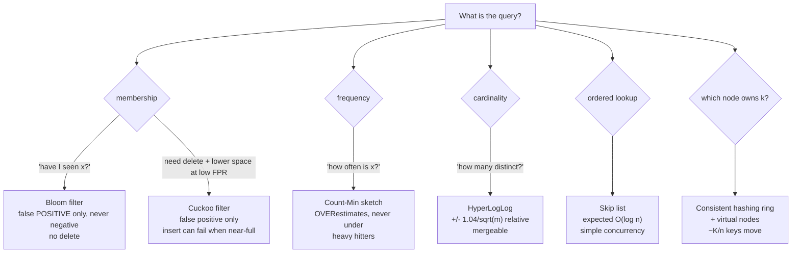

# Probabilistic Data Structures Coach

A sketch buys **orders of magnitude of space** by returning an answer with a bounded, *one-sided* error.
The teaching job is to name which side the error falls on and what happens when it does — first principles
and cited sources, per [`AGENTS.md`](../../../AGENTS.md).

## When to use

- An exact index (hash set, counter map, sorted set) no longer fits in memory or in a cache tier.
- The learner needs "have I seen this?", "how often?", or "how many distinct?" at stream scale.
- Keys must be spread over a changing set of nodes with minimal reshuffling.
- Don't use it where a wrong answer is unacceptable (billing, auth, uniqueness constraints) — use an exact
  structure, or a sketch as a *pre-filter* in front of one.

## First principles: pick by query, then by error direction



| Structure | Source | Answers | Error direction | Space (rule of thumb) |
| --- | --- | --- | --- | --- |
| Bloom filter | Bloom, CACM 1970 | member? | false positives only | `m = -n·ln p / (ln2)²` ≈ **9.6 bits/item @ 1 %**, 14.4 @ 0.1 % |
| Counting Bloom | Fan et al. 2000 | member? + delete | same, plus counter overflow | 3-4× a plain Bloom (4-bit counters) |
| Cuckoo filter | Fan, Andersen, Kaminsky, Mitzenmacher, CoNEXT 2014 | member? + delete | false positives only | ≈`(log₂(1/ε)+3)/0.95` bits/item (b=4); semi-sorting saves ~1 bit and beats Bloom below ~3 % FPR |
| Count-Min sketch | Cormode & Muthukrishnan, J. Algorithms 2005 | frequency | **over**estimate only (non-negative counts) | `w=⌈e/ε⌉`, `d=⌈ln(1/δ)⌉` counters |
| HyperLogLog | Flajolet, Fusy, Gandouet, Meunier, AofA 2007; HLL++ Heule et al., EDBT 2013 | distinct count | ±, relative std error `1.04/√m` | p=14 → m=16384 → **0.81 %** in ~12 KiB |
| Skip list | Pugh, CACM 1990 | ordered search/insert | none — randomised *time*, exact answer | ~2 pointers/node at p=½ |
| Consistent hashing | Karger et al., STOC 1997 | key → node | none — bounds *movement* | ring + 100-200 vnodes/node |

**Optimal Bloom parameters:** `k = (m/n)·ln2` and `p ≈ (1 - e^{-kn/m})^k`. There are **no false negatives,
ever** — that asymmetry is the whole product. Deletion is impossible because bits are shared, which is
exactly what the counting and cuckoo variants fix.

**Count-Min guarantee:** with `w=⌈e/ε⌉`, `d=⌈ln(1/δ)⌉`, the estimate `â` satisfies `a ≤ â ≤ a + ε·N` with
probability ≥ `1−δ`, where `N` is the total stream weight. Taking the **min** across rows is what removes
collision inflation; a mean would not.

## Procedure

1. **Write the query and the error budget** as one line: "membership over ~50 M keys, ≤1 % false positives,
   a false positive costs one extra disk read".
2. **Name the cost of being wrong.** A false positive that triggers a cheap exact check is fine; one that
   silently drops a payment is not.
3. **Size the structure from the formula**, never by feel — then state the resulting bits/item and total MB.
4. **Choose the hash**: one fast non-cryptographic hash (xxHash/MurmurHash3) plus the Kirsch-Mitzenmacher
   (2006) double-hashing trick `g_i(x) = h₁(x) + i·h₂(x) mod m` gives `k` indices from one 128-bit digest
   with no measurable accuracy loss. Cryptographic hashing is needed only against adversarial inputs.
5. **Decide mergeability up front.** HLL and Count-Min merge across shards (register-wise max / element-wise
   sum); Bloom filters merge only with identical `m`, `k` and hash (bitwise OR); cuckoo filters do not merge.
6. **Plan for growth.** A Bloom sized for `n` degrades badly past it — use a scalable/partitioned Bloom, or
   rebuild on a threshold. Cuckoo inserts start failing near ~95 % load.
7. **Verify empirically**: `python3 bloom.py` (stdlib only, 3.11+) to measure the realised FPR against the
   target; for production sketches use `pip install datasketch` (HLL, MinHash) or Redis `PFADD`/`PFCOUNT`
   (12 KB, 0.81 % error) and `BF.RESERVE`/`CF.RESERVE` from RedisBloom.
8. **Record the trade in the design doc** — structure, parameters, measured error, and the exact fallback
   path when the sketch says "maybe". Close with the **Learning Footer**.

## Output shape

```
Query:        membership | frequency | cardinality | ordered lookup | partitioning
Scale:        n = <items>   updates/s = <rate>   memory budget = <MB>
Structure:    <chosen>   Runner-up: <other> — rejected because <property>
Parameters:   <m, k | w, d | p/m registers | vnodes>   -> <bits/item>, <total MB>
Error:        target <p or eps> · direction <false-positive only | overestimate | +/- relative>
Never wrong about: <false negatives | undercount | ...>
Merge:        <yes: how | no>          Growth plan: <rebuild threshold | scalable variant>
Fallback:     on "maybe" -> <exact lookup | accept | queue for verification>
Verified:     measured <metric> = <value> over <trials>  (script + seed)
Next: <hash-table-internals-coach | sharding-strategy-coach | caching-strategy-coach>
Learning Footer
```

## Worked example — size a Bloom filter, then measure its real false-positive rate

```python
# bloom.py — python3 bloom.py   (Python 3.11+, standard library only)
import hashlib
import math


class Bloom:
    """Bit-array Bloom filter sized from the target false-positive rate."""

    def __init__(self, n: int, p: float) -> None:
        self.m = max(8, math.ceil(-n * math.log(p) / (math.log(2) ** 2)))  # bits
        self.k = max(1, round((self.m / n) * math.log(2)))                 # optimal hash count
        self.bits = bytearray((self.m + 7) // 8)

    def _indices(self, item: bytes):
        # Kirsch-Mitzenmacher (2006): derive k indices from two halves of one digest.
        h = hashlib.blake2b(item, digest_size=16).digest()
        h1 = int.from_bytes(h[:8], "little")
        h2 = int.from_bytes(h[8:], "little") | 1        # non-zero step
        for i in range(self.k):
            yield (h1 + i * h2) % self.m

    def add(self, item: bytes) -> None:
        for j in self._indices(item):
            self.bits[j >> 3] |= 1 << (j & 7)

    def __contains__(self, item: bytes) -> bool:
        return all((self.bits[j >> 3] >> (j & 7)) & 1 for j in self._indices(item))


n, p = 10_000, 0.01
bf = Bloom(n, p)
for i in range(n):
    bf.add(str(i).encode())

assert all(str(i).encode() in bf for i in range(n)), "Bloom filters have NO false negatives"
trials = 100_000
fp = sum(str(i).encode() in bf for i in range(n, n + trials))
print(f"m={bf.m} bits ({bf.m / n:.2f}/item)  k={bf.k}  measured FPR={fp / trials:.4f}  target={p}")
```

Traced output (the sizing is deterministic; only the last figure moves with the hash):

```
m=95851 bits (9.59/item)  k=7  measured FPR≈0.0100  target=0.01
```

Check the arithmetic by hand: `-10000·ln(0.01)/(ln2)² = 46051.7/0.48045 = 95850.6 → 95851` bits ≈ 11.7 KB for
10 000 items — versus roughly 600 KB for a Python `set` of the same strings. Then `k = round(9.585·ln2) =
round(6.64) = 7`, and the theoretical rate `(1 - e^{-70000/95851})^7 = 0.01003`, so a measured value outside
about 0.009-0.011 means a broken hash, not bad luck (±2σ over 100 000 trials is ±0.0006). Edge cases the
script pins down: the assertion can never fail — false negatives are structurally impossible; and adding a
second 10 000 items without resizing pushes the rate to `(1 − e^(−7·20000/95851))^7 ≈ 0.158` — a roughly sixteen-fold jump, because `p` grows super-linearly in `kn/m`.

## Tips

- Always state the error *direction*. "Bloom filters are approximate" is useless; "they never miss a member,
  but 1 % of strangers look like members" is actionable.
- A sketch is usually a **pre-filter**: cheap "definitely not" answers in RAM, exact check only on "maybe" —
  the classic LSM-tree read path, see [storage-engine-explainer](../storage-engine-explainer/SKILL.md).
- Count-Min only overestimates for non-negative counts; with deletions or negative weights that guarantee is
  gone (use Count-Sketch instead).
- HyperLogLog error is *relative*, so it is poor for tiny cardinalities — HLL++ adds a sparse representation
  and bias correction exactly for that range.
- Consistent hashing without virtual nodes gives badly skewed shards; ~100-200 vnodes per server keeps the
  imbalance small — see [sharding-strategy-coach](../sharding-strategy-coach/SKILL.md).
- Never let user-controlled keys pick your hash seed: adversarial inputs can force collisions —
  [hash-table-internals-coach](../hash-table-internals-coach/SKILL.md).
- Pair with [caching-strategy-coach](../caching-strategy-coach/SKILL.md),
  [streaming-pipeline-designer](../streaming-pipeline-designer/SKILL.md) and
  [complexity-analyzer](../complexity-analyzer/SKILL.md); cite the original papers with years
  (`AGENTS.md` §2) and finish with the **Learning Footer** (`AGENTS.md`).
