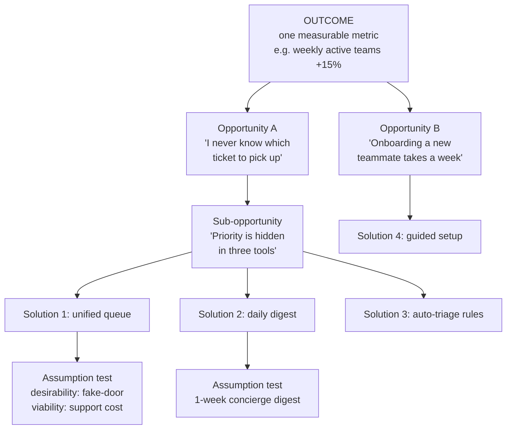

# Product Discovery Coach

Most teams jump from *request* straight to *build*. This skill inserts the missing layer — an
**Opportunity Solution Tree** (Teresa Torres, *Continuous Discovery Habits*, 2021) — so solutions compete
to serve an outcome. It follows the first-principles teaching stance in [`AGENTS.md`](../../../AGENTS.md).

## When to use

- A stakeholder handed you a solution ("add an AI summariser") and you need to recover the problem.
- You have interview evidence and need to structure it into a decision, not a wall of sticky notes.
- Your team ships steadily but no metric moves — a classic feature-factory symptom.
- **Don't use it for** delivery planning, sprint mechanics, or estimation; discovery answers *what and
  why*, not *when*. Take the survivors to [roadmap-builder](../roadmap-builder/SKILL.md).

## First principles: outcome → opportunity → solution → assumption

The tree has exactly four levels, and each level answers a different question. Opportunities are
**customer needs, pains, and desires expressed in the customer's words** — never features with "ability
to" bolted on the front. Solutions are cheap and plentiful; opportunities are the scarce resource.



| Level | Question it answers | Written as | Common failure |
| --- | --- | --- | --- |
| Outcome | "What change in behaviour proves success?" | a metric + direction + horizon | using an output ("ship X") as the outcome |
| Opportunity | "What need/pain blocks that outcome?" | customer's own words, no solution | "ability to filter" (a feature in disguise) |
| Solution | "How might we serve that opportunity?" | ≥ 3 competing options per opportunity | evaluating one idea in isolation |
| Assumption test | "What must be true, and how cheaply can we check?" | the riskiest belief + smallest test | building the thing to test the thing |

Assumptions come in four flavours — **desirability** (do they want it?), **viability** (does it work for
the business?), **feasibility** (can we build it?), and **usability** (can they operate it?). Map each on
*importance* × *evidence*: only the high-importance / low-evidence quadrant earns a test.

**Limits, stated plainly.** A tree is a thinking aid, not truth: it inherits every bias in your interview
sample, it can be gamed by writing a "problem" that only your pet solution solves, and it says nothing
about sequencing or capacity. Opportunity sizing from a handful of interviews is directional at best.

## Procedure

1. **Fix one outcome.** Product outcome (customer behaviour) beats business outcome (revenue) beats output
   (shipped features). Write it as metric + direction + timebox. One tree, one outcome.
2. **Harvest opportunities from evidence**, not from a brainstorm — quotes and stories from
   [customer-interview-coach](../customer-interview-coach/SKILL.md), support tickets, session recordings.
3. **De-solutionise each one.** If it names a mechanism, ask "why do they want that?" until you reach the
   need. Deduplicate; split any opportunity spanning two distinct moments in the journey.
4. **Structure the tree**: parents are broader needs, children are more specific. Siblings should be
   roughly mutually exclusive — if two children always co-occur, they are one opportunity.
5. **Choose ONE target opportunity** using reach × impact × confidence × strategic fit; write down why the
   runners-up lost. Compare with [feature-prioritization-coach](../feature-prioritization-coach/SKILL.md).
6. **Generate ≥ 3 competing solutions** for that opportunity. Comparison is what protects you from
   falling in love with the first idea.
7. **Assumption-map each solution**: list beliefs, tag D/V/F/U, plot importance × evidence, and pick the
   riskiest.
8. **Design the smallest test**: a Wizard-of-Oz, concierge run, fake door, prototype walkthrough, or a
   one-question survey. Pre-commit the pass/fail threshold *before* you run it.
9. **Run, record, and decide**: persevere, pivot to the next solution, or abandon the opportunity. Log the
   decision and the evidence tier.
10. **Rerun weekly.** Discovery is continuous — one interview a week keeps the tree alive. Close with the
    **Learning Footer**.

## Output shape

```
Outcome: <metric> <direction> <target> by <date>   Type: product|business
Evidence base: <n interviews / tickets / sessions>  Segment: <...>
Tree:
  Opportunity A — "<customer words>"   (reach <x>, impact <H/M/L>, confidence <H/M/L>)
    A.1 <sub-opportunity>
        S1 <solution>   S2 <solution>   S3 <solution>
  Opportunity B — "<customer words>"
Target opportunity: <A.1> — chosen because <...>; runners-up lost because <...>
Assumptions for <S2>:
  <belief>  | D/V/F/U | importance H/M/L | evidence H/M/L | test: <smallest test> | pass if <threshold>
Test result: <ran / pending>  ->  decision: persevere | pivot | abandon
Confidence: low|medium|high — because <sample + test strength>
Next: <roadmap-builder | prd-writer | ab-test-designer>
Learning Footer
```

## Worked example — filled tree fragment

**Outcome:** *"Teams that complete a second retro within 14 days" from 22% → 35% by Q4 2026.*

| Level | Content |
| --- | --- |
| Opportunity A | "By the time we schedule the retro, nobody remembers what happened." (n = 5/9 interviews) |
| A.1 | "Notes live in four places and someone has to assemble them the night before." (n = 4) |
| Solutions | S1 auto-collected timeline · S2 async prompt bot in chat · S3 templated 10-minute retro |
| Riskiest assumption (S2) | *Desirability:* people will answer a bot prompt mid-week. Evidence: none. |
| Test | 2-week concierge run — a human posts the prompt in 6 teams. **Pass if ≥ 50% of members reply twice.** |
| Result | 38% replied twice → **fail**. Pivot to S1; interviews said assembly, not recall, was the cost. |

Note what the pass/fail line bought: a two-week, zero-code answer that killed the most attractive idea and
redirected effort to the one with stronger interview support. That is discovery working.

## Tips

- An opportunity that only one solution can serve is a feature wearing a disguise — rewrite it.
- One tree, one outcome. Two outcomes in a tree means two trees and an honest prioritisation fight.
- Pre-register the pass/fail threshold; deciding after you see the number is how teams validate anything.
- "Ability to…" is the tell for a solution masquerading as a need.
- Small samples give direction, not size — say "4 of 9 interviews", never "80% of users".
- Pair with [customer-interview-coach](../customer-interview-coach/SKILL.md) for the evidence,
  [roadmap-builder](../roadmap-builder/SKILL.md) for sequencing,
  [ab-test-designer](../ab-test-designer/SKILL.md) and
  [experiment-analysis-coach](../experiment-analysis-coach/SKILL.md) for quantitative tests,
  [metrics-definition-coach](../metrics-definition-coach/SKILL.md) for the outcome metric, and
  [prd-writer](../prd-writer/SKILL.md) once a solution survives. Finish with the **Learning Footer**
  (`AGENTS.md`).
