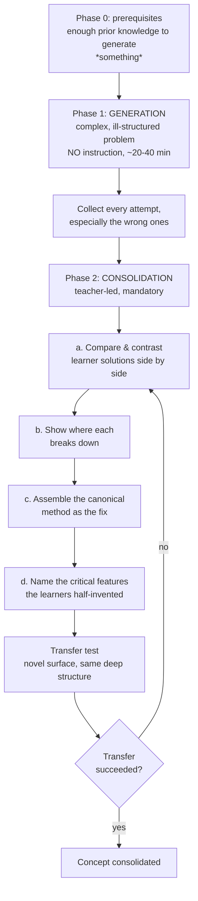

# Productive Failure Designer

Failing at a well-chosen problem *before* being taught primes the learner to see what the canonical
method actually solves. This skill designs that two-phase sequence — and its indispensable second half —
following the teach-the-why principle in [`AGENTS.md`](../../../AGENTS.md).

## When to use

- A concept keeps being "understood" and then misapplied, because learners never felt the problem it
  solves (variance, normalisation, indexing, consistency models).
- A lesson currently starts with the formula and ends with plug-and-chug exercises.
- You want deeper conceptual transfer, and you can afford lower efficiency in the short term.
- Don't use it when the learner has *no* relevant prior knowledge to activate, when the task is safety-
  or cost-critical, or when the goal is procedural fluency — use
  [worked-example](../worked-example/SKILL.md) and [cognitive-load-coach](../cognitive-load-coach/SKILL.md)
  instead.

## First principles: failure first, consolidation always

Kapur (2008, *Cognition and Instruction*; 2012, *Instructional Science*) had students tackle complex,
ill-structured problems *before* any instruction. They generated many sub-optimal solutions and mostly
failed — yet on later conceptual and transfer tests they outperformed peers who were taught first.
Kapur's mechanism has four parts: **activate** prior knowledge, **notice** critical features of the
problem, **experience** the limits of your own methods, and then **assemble** the canonical solution
against that felt gap.

The essential caveat: it is *productive* failure only if the **consolidation phase happens**. Failure
without the contrast-and-assemble phase is just failure — a finding that reconciles Kapur with Kirschner,
Sweller & Clark's (2006) critique of unguided discovery learning. Design the second phase first.



| Design element | Productive failure | Direct instruction first |
| --- | --- | --- |
| Order | problem → instruction | instruction → problem |
| Problem type | complex, ill-structured, multiple solution paths | well-structured, single method |
| Expected success in phase 1 | **low, by design** | high |
| Short-term efficiency | lower | higher |
| Conceptual understanding & transfer | higher (Kapur 2008, 2012) | lower on transfer items |
| Cognitive load profile | high germane, deliberately high intrinsic | low, scaffolded |
| Fails when | consolidation is skipped; no prior knowledge | concept's *purpose* is never felt |
| Best for | why-questions, invented measures, design trade-offs | syntax, safety procedures, tools |

**Trade-off to say out loud:** you are spending time to buy transfer. Budget ~1.5× a conventional lesson,
and never let the phase-1 clock eat the consolidation.

## Procedure

1. **Choose a concept with a felt need** — one that exists because a naive approach fails (variance
   exists because "average deviation" cancels to zero; indexes exist because scans don't scale).
2. **Write the consolidation first.** Decide the canonical method and the 3–4 *critical features* you
   will name. If you can't list them, the sequence will drift into unguided discovery.
3. **Design the generation problem**: complex, contextual, ill-structured, with multiple partial paths,
   and solvable-*looking* with prior knowledge alone. Give data, not a formula.
4. **Set the affordances**: work in pairs, produce at least three different methods, no docs, no search,
   fixed timebox. Explicitly tell learners that *not* solving it is expected and fine.
5. **Collect and preserve every attempt**, including dead ends — these are the raw material of phase 2,
   not embarrassments.
6. **Run consolidation**: display 2–3 learner solutions, contrast them on a shared example, show exactly
   where each breaks, then present the canonical method as the assembly of what they were reaching for.
7. **Name the critical features explicitly**, mapping each to the learner attempt that half-invented it.
8. **Test transfer** on a novel surface with the same deep structure, then close with the
   **Learning Footer**.

## Output shape

```
Concept: <concept>   Learners: <level>   Prior knowledge assumed: <...>
Felt need: <the naive approach that fails, and how>
Consolidation plan (written FIRST):
  Canonical method: <...>
  Critical features to name: 1 <...> 2 <...> 3 <...>
Phase 1 - Generation (<n> min, no instruction)
  Problem: <complex, ill-structured stem + data>
  Affordances: pairs · >=3 methods required · no docs · timebox <n> min
  Expected learner attempts (predicted): <A> <B> <C>  (all partially wrong - that's the point)
Phase 2 - Consolidation (<n> min, mandatory)
  Compare: <attempt A> vs <attempt B> on <shared example>
  Break:   <where each fails, with the counter-case>
  Assemble: <canonical method> = <feature 1> + <feature 2> + <feature 3>
  Map:     attempt A half-invented <feature n>
Transfer test: <novel surface, same deep structure>   Success criterion: <...>
Fallback: if no attempt is generated in <n> min, give hint <h1> (structure, not answer)
Next: <worked-example | self-explanation-prompter | cognitive-load-coach>
Learning Footer
```

## Worked example — inventing variance (Kapur's canonical case, adapted)

**Felt need:** learners know "average", so they will reach for average deviation from the mean — and it
sums to exactly zero, every time. That surprise is the lesson.

**Phase 1 (30 min, no instruction).** "Here are the goal-scoring records of three footballers over 10
matches. Each has the *same mean*. Design a measure of *consistency* so a club can rank them. Produce at
least three different measures and justify one."

| Learner attempt | Method | Where it breaks (shown in consolidation) |
| --- | --- | --- |
| A | mean of (x − x̄) | always 0 — cancellation is the whole discovery |
| B | range (max − min) | ignores every point in between; one outlier dominates |
| C | mean of \|x − x̄\| | genuinely reasonable (this is MAD) — but not differentiable, and doesn't decompose additively |
| D | count of matches equal to the mean | discards magnitude entirely; ties everywhere |

**Phase 2 (25 min, mandatory).** Contrast A and C on the same dataset: A gives 0 for all three players
(useless), C separates them (useful). Then push C: ask what happens when you want to combine variability
across independent groups. Assemble the canonical measure — **square the deviations** (kills
cancellation *and* is additive), average them (variance), take the root to restore the original units
(standard deviation). Map: attempt A discovered *the cancellation problem*, attempt C discovered
*magnitude-without-sign*, attempt B discovered *sensitivity to spread*. Name the three critical
features: deviation from a centre · sign removal · units restoration.

**Transfer test:** given server latencies (a completely different surface, same deep structure), choose
and justify a variability measure, and explain why the mean alone would mislead an SLA discussion.

## Tips

- **Design the consolidation before the problem.** Unconsolidated failure is the failure mode this whole
  method is criticised for — and rightly so (Kirschner, Sweller & Clark, 2006).
- Low success in phase 1 is a *feature*; tell learners so up front or they'll read it as incompetence.
- Preserve the wrong attempts verbatim — the contrast is what makes the canonical method feel inevitable.
- If nobody generates anything in ~10 minutes, the prior-knowledge gate wasn't met; give a structural
  hint, never the method.
- Pair with [worked-example](../worked-example/SKILL.md) for the post-consolidation practice ladder,
  [self-explanation-prompter](../self-explanation-prompter/SKILL.md) during generation,
  [cognitive-load-coach](../cognitive-load-coach/SKILL.md) to keep phase 1 hard-but-navigable,
  [misconception-buster](../misconception-buster/SKILL.md) for beliefs that survive consolidation, and
  [lesson-plan-writer](../lesson-plan-writer/SKILL.md) to slot the sequence into a session.
  End with the **Learning Footer** (`AGENTS.md`).
