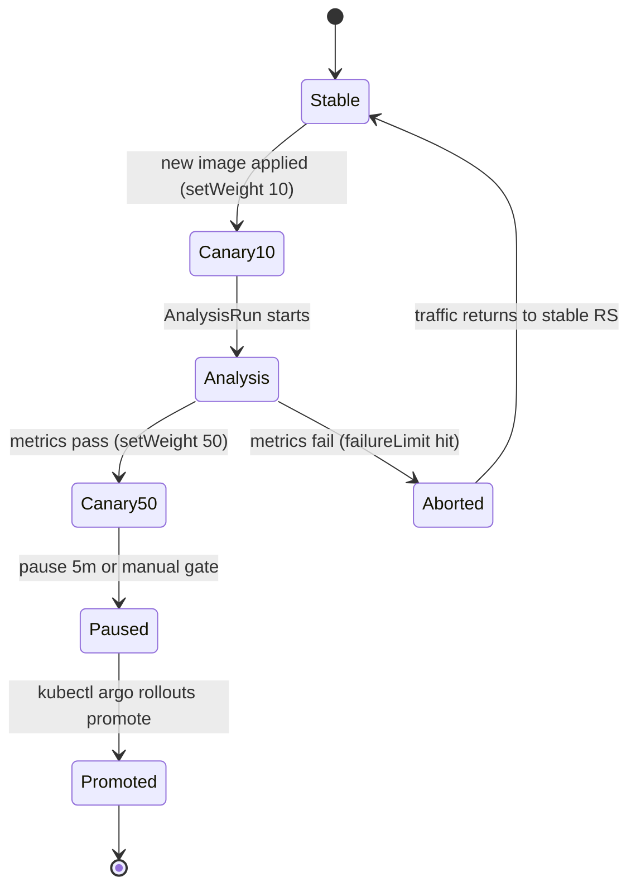

# Progressive Delivery Lab

Deploying is not releasing. Progressive delivery **limits blast radius by exposing a new version to a slice of
traffic and letting evidence decide** — learn it hands-on per [`AGENTS.md`](../../../AGENTS.md). All steps run
on a **free local cluster** (kind or k3d); verify each promotion with the plugin's real output.

## When to use

- A rolling update is "all or nothing" and the learner needs a safer release with an automated abort.
- Choosing between canary and blue-green for a specific service.
- Practising an incident drill: abort a bad release *while it is running*.

## First principles

Argo Rollouts replaces `Deployment` with a `Rollout` (`argoproj.io/v1alpha1`) whose `spec.strategy` is a
**state machine of steps**. It manages ReplicaSets and Services so a subset of traffic reaches the new
version; an `AnalysisRun` produced from an `AnalysisTemplate` can fail the rollout automatically
(Argo Rollouts docs, argo-rollouts.readthedocs.io).



| Strategy | Traffic during release | Extra cost | Best for | Main weakness |
| --- | --- | --- | --- | --- |
| Rolling update (plain Deployment) | mixed, uncontrolled ratio | none | Low-risk internal apps | No gate, no weights, no auto-abort |
| **Canary** (`strategy.canary`) | weighted `setWeight` steps | +1 small ReplicaSet | Stateless HTTP services with good metrics | Needs traffic routing + real signals |
| **Blue-green** (`strategy.blueGreen`) | 100% old, then 100% new | ~2× replicas | Schema-coupled apps, big-bang cutover | Doubles resources; no partial exposure |
| Canary + `analysis` | weighted + metric-gated | analysis provider (Prometheus/Job) | Anything customer-facing | Bad SLI = false confidence |

## Procedure

1. **Cluster + controller**: `kind create cluster --name rollouts`, then
   `kubectl create namespace argo-rollouts` and
   `kubectl apply -n argo-rollouts -f https://github.com/argoproj/argo-rollouts/releases/latest/download/install.yaml`.
   Verify `kubectl -n argo-rollouts rollout status deploy/argo-rollouts`.
2. **Install the kubectl plugin** (`kubectl argo rollouts version`) — the dashboard for this lab is
   `kubectl argo rollouts get rollout <name> --watch`.
3. **Convert a Deployment to a Rollout**: same `spec.replicas`, `selector` and `template`, but
   `apiVersion: argoproj.io/v1alpha1`, `kind: Rollout`, plus a `strategy`. Apply and confirm the pods come up.
4. **Canary run**: `strategy.canary.steps` = `setWeight: 10` → `pause: {duration: 60s}` → `setWeight: 50` →
   `pause: {}` (indefinite) → implicit 100. Trigger by bumping the image tag and `kubectl apply -f`.
5. **Watch the state machine**: `kubectl argo rollouts get rollout <name> --watch` — read the step index,
   the canary/stable ReplicaSet weights and pod counts as they move.
6. **Promote and abort by hand**: `kubectl argo rollouts promote <name>` to pass an indefinite pause;
   `kubectl argo rollouts abort <name>` to send traffic back to stable;
   `kubectl argo rollouts undo <name>` to roll back to the previous revision.
7. **Add automated analysis**: create an `AnalysisTemplate` with a metric (`interval`, `count`,
   `successCondition`, `failureLimit`) — a `job` provider works offline, a `prometheus` provider is realistic —
   and reference it from a canary step via `analysis.templates`. A metric breaching `failureLimit` aborts
   the rollout without a human.
8. **Blue-green run**: switch `strategy` to `blueGreen` with `activeService`, `previewService` and
   `autoPromotionEnabled: false`. Curl the preview Service in-cluster to smoke-test the new version while
   100% of live traffic still hits active, then `promote`.
9. **Incident drill (do this one for real)**: deploy an image that fails its readiness probe or returns 500s,
   start the rollout, and abort it *mid-canary*. Time yourself.
10. **Verification step**: `kubectl argo rollouts get rollout <name>` shows `Phase: Healthy` on the stable
    revision after the abort; `kubectl get rs` shows the bad ReplicaSet scaled to 0; an in-cluster `curl`
    returns the *old* version's response.
11. **Clean up**: `kubectl delete rollout <name>`; `kind delete cluster --name rollouts`.

## Output shape

```
Progressive delivery plan — <service>  | cluster: kind/k3d  | controller: argo-rollouts

Strategy: canary | blue-green      Reason: <traffic shape, schema coupling, cost>
Steps: setWeight 10 -> analysis(<metric>) -> pause 5m -> setWeight 50 -> pause{} -> 100
Gate metric: <SLI> successCondition: <expr>  failureLimit: <n>  interval/count: <...>
Rollback: kubectl argo rollouts abort|undo <name>   (target: < <n> min)

Verification (real output):
  get rollout --watch -> step <i>/<n>, canary <x>%, stable <y>%
  abort drill        -> traffic back on stable, bad RS scaled to 0   ✔
  preview smoke test -> <status> before promotion                    ✔
Residual risk: <no real traffic locally, metric fidelity>
```

## Tips

- Weighted canaries need a traffic router (ingress controller or service mesh) for *precise* percentages;
  without one, weights are approximated by replica counts — say so out loud rather than over-claiming.
- An auto-abort is only as good as its SLI. Gate on error rate and latency the user feels, not CPU — design
  those signals with [slo-designer](../slo-designer/SKILL.md).
- Blue-green doubles resource usage during the release; on a laptop cluster keep `replicas` small.
- Database migrations do not roll back with the pods — make schema changes backward-compatible (expand/contract)
  before adopting either strategy.
- Never leave `pause: {}` unattended in CI: the rollout waits forever and looks like a stuck deploy.
- Argo Rollouts and Argo CD compose well — the Rollout manifest lives in Git; see
  [argocd-local-lab](../argocd-local-lab/SKILL.md) and [gitops-coach](../gitops-coach/SKILL.md).
  Compare against plain rollouts in [k8s-deployment-lab](../k8s-deployment-lab/SKILL.md), and debug stuck
  releases with [k8s-troubleshooting-lab](../k8s-troubleshooting-lab/SKILL.md).
- Keep the Rollout's pod template compliant with cluster policy — see
  [k8s-admission-policy-lab](../k8s-admission-policy-lab/SKILL.md) and
  [kubernetes-manifest-coach](../kubernetes-manifest-coach/SKILL.md).
- End with the **Learning Footer** (`AGENTS.md`) — one abort drill the learner should time on their cluster.
