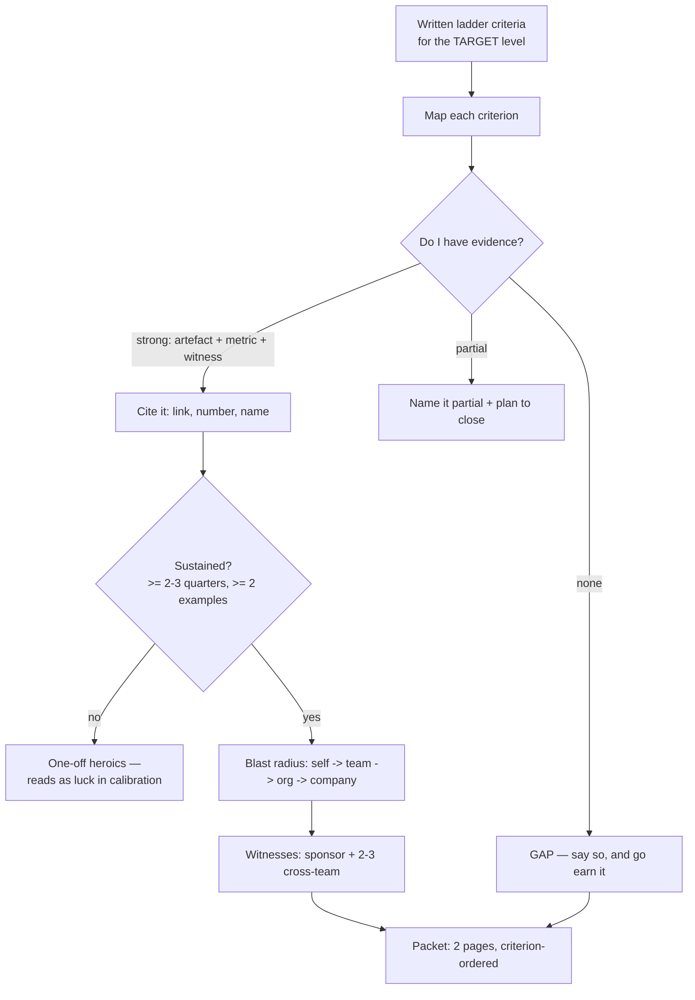

# Promotion Packet Builder

Promotions are decided by people who did not watch you work, reading a document under time pressure. This
skill builds the packet **evidence-first, mapped to the written ladder**, and is candid about what the
evidence does *not* support — per [`AGENTS.md`](../../../AGENTS.md).

## When to use

- You're preparing a promo case, a self-review, or a brag doc and have a pile of achievements with no shape.
- Your manager says "you need more impact/scope" and you need to translate that into specific evidence.
- You want to know six months early whether the case exists, while you can still go get the missing proof.
- **Don't use it for** performance-improvement situations or compensation negotiation — see
  [performance-review-coach](../performance-review-coach/SKILL.md) and
  [salary-negotiation](../salary-negotiation/SKILL.md).

## First principles: promotion follows demonstrated scope

Most ladders promote for **already operating at the next level, sustained, with witnesses** — not for
effort, tenure, or a single heroic quarter. The packet's job is to make that easy to verify.



| Ladder dimension | Mid → Senior | Senior → Staff / EM | Evidence that proves it |
| --- | --- | --- | --- |
| Scope | owns a component end to end | owns a problem space across teams | who else changed behaviour because of you |
| Ambiguity | solves given problems | defines which problem to solve | a doc that redirected a roadmap |
| Impact | team-visible outcomes | org-visible, quantified | baseline → result + how measured |
| Influence | mentors, reviews well | sets standards others adopt | adoption count, other teams' PRs/docs |
| Judgement | escalates well | makes calls others defer to | a decision + the alternatives rejected |
| Multiplier | unblocks teammates | makes teams faster without being present | onboarding time, review latency, hires ramped |

**Be honest about the limits.** A packet cannot manufacture scope you were never given — if the ladder
requires cross-org influence and you were assigned solo work all year, the correct output is a *plan*, not
a stretch. Calibration is also partly political and budget-bound: a strong packet can lose to a headcount
freeze. And metrics in a packet are especially prone to over-claiming; anything you can't explain the
measurement of will be attacked, so state confounders yourself before a reviewer does.

## Procedure

1. **Get the actual written ladder** for the target level. Not the blog post, not folklore — the document
   your calibration room reads. If none exists, ask your manager to name the 4–6 criteria in writing.
2. **Dump evidence unfiltered** from PRs, design docs, incident reviews, launches, mentoring, hiring,
   interviews run, docs adopted. Quantity first; you will cut later.
3. **Map each item to a criterion.** Items that map to nothing are candidates for deletion, no matter how
   much effort they cost you.
4. **Grade each criterion**: strong (artefact + metric + witness), partial, or gap. Refuse to inflate —
   inflation is the fastest way to lose a reviewer's trust for the entire document.
5. **Test sustained-ness**: every "strong" needs ≥ 2 examples across ≥ 2 quarters. One brilliant quarter
   reads as luck.
6. **Quantify with measurement notes**: baseline → result → how measured → confounders. Borrow definitions
   from [engineering-metrics-coach](../engineering-metrics-coach/SKILL.md).
7. **Convert effort statements into behaviour-change statements**: "wrote a testing guide" → "three teams
   adopted it; flaky-test reruns fell from 12% to 4% over two quarters".
8. **Recruit witnesses**: one sponsor (a decision-maker who will argue for you in the room) and 2–3
   cross-team peers who can confirm specific artefacts. Send them the *specific* thing to speak to.
9. **Write two pages, ordered by ladder criterion**, each opening with the headline claim and its single
   strongest proof. Reviewers skim; front-load.
10. **Close the gaps explicitly**, with a dated plan and the artefact each gap will produce. Then finish
    with the **Learning Footer**.

## Output shape

```
Current level -> Target level: <...>   Cycle date: <...>   Ladder source: <link/doc>
Criterion map:
  <criterion 1> — strength: strong|partial|gap
     Evidence A: <artefact link> · impact <baseline -> result, how measured> · witness <name>
     Evidence B: <second example, different quarter>
  <criterion 2> — ...
Sustained check: <criterion> -> <n examples across n quarters>  (flag any single-quarter claims)
Blast radius: self | team | org | company   Highest defensible: <...>
Scope narrative (3 sentences): <what problem space you own and how that changed this year>
Sponsor: <name> — will speak to <...>   Witnesses: <name/artefact> x2-3
Gaps (stated honestly): <criterion> — missing <...> — plan: <action> by <date> -> artefact <...>
Risks / confounders I'll name first: <...>
Ask: <promotion this cycle | pre-read for next cycle | explicit criteria in writing>
Learning Footer
```

## Worked example — a filled criterion block (Senior → Staff, 2026 cycle)

| Criterion | Strength | Evidence |
| --- | --- | --- |
| Ambiguity / problem selection | **strong** | *Q1:* wrote "Checkout reliability: where the losses actually are", which redirected the Q2 roadmap from a rewrite to a timeout fix (see roadmap changelog, 2026-01-30). *Q3:* framed the multi-region decision doc that the platform group adopted. Witness: Priya (payments lead). |
| Org-visible impact | **strong** | Refund tickets 220 → 130/week over six weeks (support tag `refund-timeout`, definition unchanged across both windows). *Confounder I'll name first:* a pricing change landed in week 4 and may account for part of the drop; the tag-level breakdown suggests ≤ 15%. |
| Influence / standards | **partial** | Testing guide adopted by 3 of 9 teams; flaky reruns 12% → 4% in those three. Not yet org-wide. *Plan:* present at the engineering forum in May, target 6 teams by Q3. |
| Multiplier | **gap** | No evidence of ramping others: mentored one intern, no hires ramped, no on-call training built. *Plan:* own the on-call onboarding rewrite in Q3; artefact = runbook + two engineers through first solo shift. |

**Scope narrative:** *"I own checkout reliability as a problem space, not a service. This year I chose what
we worked on twice — redirecting a planned rewrite and framing the multi-region decision — and both calls
held. My gap is multiplying other engineers; I've asked for the on-call onboarding rewrite to build it."*

Note what makes this credible: the confounder is volunteered, the partial is labelled partial, and the gap
is stated with a dated plan. A reviewer who finds nothing to catch you on starts trusting the numbers.

## Tips

- Map to the *written* ladder or you're arguing against an invisible rubric you'll never match.
- Two examples across two quarters, or it isn't scope — it's a good quarter.
- Effort is not impact; the sentence must end in someone else's changed behaviour or a moved number.
- Name your own confounders first. Volunteered caveats buy credibility for everything else.
- A sponsor who will argue in the room beats three peers who "think highly of you".
- Start the packet two quarters early — its real value is showing you which gap to go fill.
- Pair with [career-ladder](../career-ladder/SKILL.md),
  [star-story-builder](../star-story-builder/SKILL.md),
  [leadership-principles-drill](../leadership-principles-drill/SKILL.md),
  [performance-review-coach](../performance-review-coach/SKILL.md),
  [engineering-metrics-coach](../engineering-metrics-coach/SKILL.md),
  [stakeholder-management-coach](../stakeholder-management-coach/SKILL.md), and
  [exec-communication-coach](../exec-communication-coach/SKILL.md). End with the **Learning Footer**
  (`AGENTS.md`).
