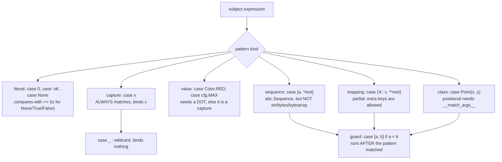

# Python Pattern Matching Lab

`match`/`case` is **structural destructuring with binding**, not a switch and not a chain of `==`. PEP 634
defines a small pattern grammar; almost every bug comes from one rule people skip. We teach the grammar
first, in the first-principles style of [`AGENTS.md`](../../../AGENTS.md).

## When to use

- Code branches on the *shape* of data — JSON payloads, ASTs, events, command tokens, protocol frames.
- A learner's `case something:` matches everything and they cannot see why.
- They need exhaustiveness over a union or `Enum` and want the type checker to enforce it.
- Don't use it for a plain value dispatch on one scalar — a `dict` lookup or `if`/`elif` is clearer, and
  don't use it to replace `isinstance` polymorphism (see [oop-design-coach](../oop-design-coach/SKILL.md)).

## First principles: six pattern kinds, one fatal ambiguity

PEP 634 (specification), 635 (rationale) and 636 (tutorial) landed in Python 3.10. A pattern either matches
and **binds names**, or fails and the next `case` is tried.



| Pattern | Matches | Trap |
| --- | --- | --- |
| `case RED:` | **anything** — it is a capture named `RED` | use `case Color.RED:`; a bare name never compares |
| `case [x, y]:` | any `Sequence` of length 2 | `str`, `bytes`, `bytearray` are excluded on purpose |
| `case {"type": t}:` | any `Mapping` **containing** that key | partial by design; extra keys never fail |
| `case {**rest}:` | any mapping | `**_` is a syntax error |
| `case Point(0, 0):` | needs `__match_args__ = ("x", "y")` | plain classes have none → `TypeError` |
| `case int(n):` | builtins self-match the whole object | only for the ~10 special builtins |
| `case A() | B() as e:` | either, bound to `e` | every alternative must bind the *same* names |
| `case _:` | everything | the only "default"; there is no runtime exhaustiveness |

**Binding happens during matching.** A guard runs only after the pattern matched, so `case [a, b] if a < b`
binds `a` and `b` even when the guard then fails — PEP 634 explicitly permits names to be bound by a case
that ultimately does not execute. Keep guards side-effect free.

`@dataclass` sets `__match_args__` automatically from the positional `__init__` fields (unless
`match_args=False`), and named tuples set it to `_fields`, which is why those two types match so cleanly.

## Procedure

1. **Model the shape first**: frozen `@dataclass`es or `NamedTuple`s for internal events, plain `dict` only
   at the untrusted boundary (parsed JSON).
2. **Order cases from most specific to most general.** The first match wins, so `case Click(0, 0)` must
   precede `case Click(x, y)`.
3. **Dot every constant.** Enum members, module constants and class attributes need `Color.RED` or `cfg.MAX`;
   a bare `RED` silently swallows every subject.
4. **Prefer keyword class patterns** (`case Click(x=x, y=y)`) when field order is not obvious — positional
   patterns couple you to `__match_args__` ordering.
5. **Treat mapping patterns as partial**: they succeed with extra keys. If a payload must have *only* certain
   keys, check `rest` explicitly via `case {"type": t, **rest} if not rest:`.
6. **Add a terminal `case _:`** that raises or logs. There is no runtime exhaustiveness check; a subject that
   matches nothing simply falls through and the `match` is a no-op.
7. **Get exhaustiveness statically**: type the subject as a union or `Enum`, end with
   `case _ as unreachable: assert_never(unreachable)` (`typing.assert_never`, 3.11+; `typing_extensions`
   below that) and run `mypy --strict .` or `pyright`. Adding a variant then fails type-checking, not prod.
8. **Run and break it:** `python3 match_lab.py`, then `python3 -m pytest -q` for the table of cases; reorder
   two cases and predict the new output before re-running. Close with the **Learning Footer**.

## Output shape

```
Subject:      <expression>   Static type: <union | Enum | dict[str, Any]>
Case order:   1 <pattern>  2 <pattern>  ...  n case _  (most specific first: <yes|no>)
Pattern kinds used: literal | capture | value | sequence | mapping | class | or | as
Bindings:     <name> -> <what it captures>       Guards: <expr> (side-effect free: yes)
Traps checked: dotted constants <y/n> · str excluded from sequence <y/n> · mapping partial <y/n>
Exhaustiveness: runtime <case _ raises ...> · static <assert_never + mypy --strict | pyright>
Run:          python3 match_lab.py    Check: mypy --strict match_lab.py
Expected output: <traced lines>
Next: <python-typing-lab | python-dataclasses-lab | haskell-typeclasses-monads-lab>
Learning Footer
```

## Worked example — event routing with dataclasses and raw payloads

```python
# match_lab.py — python3 match_lab.py   (Python 3.12; assert_never needs 3.11+)
from dataclasses import dataclass
from typing import Any, assert_never


@dataclass(frozen=True)
class Click:
    x: int
    y: int          # dataclass sets __match_args__ = ("x", "y")


@dataclass(frozen=True)
class KeyPress:
    key: str
    ctrl: bool = False


@dataclass(frozen=True)
class Scroll:
    dy: int


Event = Click | KeyPress | Scroll


def describe(e: Event) -> str:
    match e:
        case Click(0, 0):                       # literal sub-patterns, positional
            return "click at origin"
        case Click(x, y) if x == y:             # guard evaluated after binding x, y
            return f"click on the diagonal at {x}"
        case Click(x=x, y=y):                   # keyword form: order-independent
            return f"click at ({x}, {y})"
        case KeyPress(key="c", ctrl=True):
            return "interrupt"
        case KeyPress(key=k):
            return f"key {k!r}"
        case Scroll(dy) if dy < 0:
            return f"scroll up {-dy}"
        case Scroll(dy):
            return f"scroll down {dy}"
        case _ as unreachable:                  # mypy/pyright prove this is Never
            assert_never(unreachable)


def route(msg: dict[str, Any]) -> str:
    match msg:
        case {"type": "ping"}:                          # partial: extra keys allowed
            return "pong"
        case {"type": "sum", "args": [*nums]} if all(isinstance(n, int) for n in nums):
            return f"sum={sum(nums)}"
        case {"type": str(t), **rest}:                  # class pattern on a builtin
            return f"unknown {t} (+{len(rest)} extra)"
        case _:
            return "malformed"


if __name__ == "__main__":
    for ev in (Click(0, 0), Click(3, 3), Click(2, 5), KeyPress("c", ctrl=True),
               KeyPress("a"), Scroll(-3), Scroll(4)):
        print(describe(ev))
    for m in ({"type": "ping", "seq": 1}, {"type": "sum", "args": [1, 2, 3]},
              {"type": "echo", "body": "hi"}, {"id": 1}, {"type": "sum", "args": "123"}):
        print(route(m))
```

Traced output:

```
click at origin
click on the diagonal at 3
click at (2, 5)
interrupt
key 'a'
scroll up 3
scroll down 4
pong
sum=6
unknown echo (+1 extra)
malformed
unknown sum (+1 extra)
```

The last two lines are the ones to dwell on. `{"id": 1}` reaches `case {"type": str(t), **rest}`, fails
because the key is absent, and falls to `case _` → `"malformed"`. The final payload has `args="123"`: a
string is **not** matched by the sequence pattern `[*nums]` (PEP 634 deliberately excludes `str`/`bytes`), so
the `sum` case fails and it lands in the generic mapping case with `rest = {"args": "123"}` → one extra key.
Note also that `{"type": "ping", "seq": 1}` still returns `"pong"` — mapping patterns are partial. Change
`case Click(0, 0)` to sit *after* `case Click(x, y) if x == y` and the first line becomes
`click on the diagonal at 0`: order is semantics, not style.

## Tips

- The number-one bug: `case MAX_RETRIES:` binds instead of compares. If a constant has no dot, give it one.
- Guards may bind names even on the failing branch — never mutate state inside a guard.
- Sequence patterns match `tuple`, `list`, and other `abc.Sequence`s but never `str`/`bytes`; wrap strings
  in an explicit literal or `str()` class pattern.
- `case {}` matches *every* mapping, including a non-empty one — it is not "empty dict".
- Matching `dict`s straight from JSON is fine at the boundary, but convert to dataclasses immediately after
  so the rest of the codebase gets static checking — [python-dataclasses-lab](../python-dataclasses-lab/SKILL.md).
- Exhaustiveness is a *type-checker* feature; wire `mypy --strict`/`pyright` into CI, per
  [python-typing-lab](../python-typing-lab/SKILL.md).
- Compare with Haskell, where the compiler warns on non-exhaustive patterns by construction —
  [haskell-typeclasses-monads-lab](../haskell-typeclasses-monads-lab/SKILL.md). Cite PEP 634-636 by number
  (`AGENTS.md` §2) and end with the **Learning Footer** (`AGENTS.md`).
