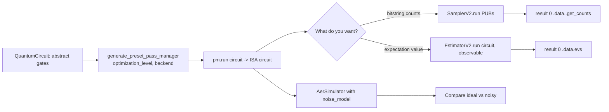

# Qiskit Circuits Lab

A local, zero-cost quantum computing lab — **a circuit describes, an ISA is what a device can execute, a
primitive is how you ask for a result** — following [`AGENTS.md`](../../../AGENTS.md). Everything runs on
the **free local Qiskit Aer simulator**, with no IBM Quantum account and no queue.

## When to use

- The learner wants to write and run their first quantum circuit today, offline.
- They copied Qiskit 1.x code and hit removals (`execute()` is gone in Qiskit 2.x).
- They get a "circuit contains instructions not supported by the backend" style error — the ISA lesson.
- They cannot tell whether they want **counts** (Sampler) or an **expectation value** (Estimator).
- They want to see how noise changes an answer before asking for real hardware time.

## Free environment — Qiskit + Aer local simulator

| Step | Command | Verify |
| --- | --- | --- |
| 1. Isolate | `python -m venv .venv` then activate (`.venv\Scripts\Activate.ps1` on Windows) | prompt shows `(.venv)` |
| 2. Install | `pip install qiskit qiskit-aer` (add `matplotlib` for drawings) | `pip show qiskit` |
| 3. Version check | `python -c "import qiskit; print(qiskit.__version__)"` | prints `2.x` |
| 4. Simulator check | `python -c "from qiskit_aer import AerSimulator; print(AerSimulator().name)"` | prints a backend name |
| 5. Run | `python bell.py` | counts dict printed |

No hardware account is needed. If the learner later wants a real device, the IBM Quantum open plan and
`qiskit-ibm-runtime` use the *same* primitive API — that portability is the point of this lab.

## The Qiskit 2.x execution path



**Why transpilation is not optional:** a device supports only a fixed basis gate set on a fixed coupling
map. The pass manager decomposes your gates into that basis, maps virtual qubits to physical ones and
inserts SWAPs. `optimization_level` 0–3 trades compile time for shorter, less error-prone circuits.

## Choosing a primitive

| Goal | Primitive | Input (PUB) | Output |
| --- | --- | --- | --- |
| Distribution over measured bitstrings | **SamplerV2** | `(isa_circuit,)` or `(isa_circuit, params)` | per-register bit arrays → `get_counts()` |
| ⟨ψ\|O\|ψ⟩ for observables, VQE-style cost | **EstimatorV2** | `(isa_circuit, observable, params)` | `data.evs`, `data.stds` |
| Exact, noiseless reference on small n | `StatevectorSampler` / `StatevectorEstimator` (`qiskit.primitives`) | same PUB shape | exact values, no shot noise |
| Realistic device behaviour | Aer primitives / `AerSimulator` with a `NoiseModel` | same PUB shape | counts skewed by noise |

Sampler circuits **must contain measurements**; Estimator circuits **must not** measure the qubits being
observed — the observable does the measuring. This asymmetry is the most common beginner error.

## Procedure

1. **Set up the venv and confirm the version** with the table above. Qiskit 1.x vs 2.x differences are
   large enough that guessing wastes an hour.
2. **State the goal physically first** — entanglement, interference, an energy expectation — then map it
   to gates. Teach `h` as "create superposition" and `cx` as "correlate", not as matrices only.
3. **Build the circuit**: `qc = QuantumCircuit(2)`, `qc.h(0)`, `qc.cx(0, 1)`, then `qc.measure_all()` only
   if a Sampler will run it. Show `print(qc.draw())` so the learner sees the structure.
4. **Transpile to ISA**:
   `pm = generate_preset_pass_manager(optimization_level=1, backend=backend)` then
   `isa = pm.run(qc)`. Print `isa.depth()` and `isa.count_ops()` **before and after** and discuss what the
   optimization level bought.
5. **Run with the chosen primitive** and read the result correctly —
   `result = job.result()[0]`; counts come from the classical register
   (`result.data.meas.get_counts()` when `measure_all()` created a register named `meas`).
6. **Verify against theory**: a Bell state should give ~50/50 on `00`/`11` and (near-)zero on `01`/`10`.
   Tell the learner to **actually run it** and compare their real numbers to the prediction — shot noise
   of order 1/√shots is expected; a 50/50 split on `01`/`10` means the circuit is wrong, not noisy.
7. **Add noise**: build a `NoiseModel` (e.g. depolarizing error on one- and two-qubit gates), pass it to
   `AerSimulator(noise_model=...)`, rerun, and diff the distributions. Explain that depth and two-qubit
   gate count, not qubit count, dominate error accumulation.
8. **Contrast with a device-like target** — transpile against a fake/backend target and show how the
   coupling map inflates depth with SWAPs. This is the bridge to real hardware.
9. **Sweep shots** (e.g. 100 → 4096) and plot or tabulate the variance to make statistical error concrete.
10. **Route onward** — probability and error bars →
    [confidence-interval-coach](../confidence-interval-coach/SKILL.md); linear algebra intuition →
    [numpy-lab](../numpy-lab/SKILL.md); reproducible Python environments →
    [python-venv-lab](../python-venv-lab/SKILL.md) and
    [python-packaging-lab](../python-packaging-lab/SKILL.md).

## Output shape

```
Qiskit lab — <goal>

Env: python <ver> | qiskit <ver> | qiskit-aer <ver>   Backend: AerSimulator
Circuit intent: <entangle 2 qubits and measure correlation>

Code (annotated):
  <QuantumCircuit build>
  <generate_preset_pass_manager -> pm.run>
  <SamplerV2 or EstimatorV2 run>

Transpile diff:  depth <before> -> <after>   ops <before> -> <after>   (opt level <n>)

Prediction: <00 ~50%, 11 ~50%, 01/10 ~0>
Run this:  python <file>.py
Actual result: <paste counts / evs>
Verdict: <matches theory within shot noise | mismatch -> cause>

Noise experiment: ideal <...> vs noisy <...>  -> lesson: <depth/2q-gate cost>
Next: <linked skill>
```

## Tips

- `execute()` no longer exists — the Qiskit 2.x path is always *build → transpile to ISA → primitive*.
- Primitives take **PUBs** (lists of tuples), so `sampler.run([isa])` — passing a bare circuit is the
  single most common `TypeError` in migration.
- Measurement basis matters: to measure in X, apply `h` before measuring; an Estimator observable such as
  `SparsePauliOp("XX")` handles this for you.
- Bit ordering is little-endian in Qiskit — qubit 0 is the **rightmost** character of a bitstring; check
  this before declaring a result "wrong".
- Simulate ≤ ~25–30 qubits on a laptop for statevector methods; memory doubles per qubit, so plan the
  experiment before launching it.
- Fix a `seed_simulator` when teaching, so the learner can reproduce a number exactly.
- Ground every class, method and argument in the **official Qiskit documentation** (`docs.quantum.ibm.com`),
  the **Qiskit Aer** docs and the **Qiskit migration guides**, with the version stated — never invent an
  API; if unsure, check with `help()` or `dir()` in the venv and report what the installed version says.
- End with the **Learning Footer** (`AGENTS.md`).
