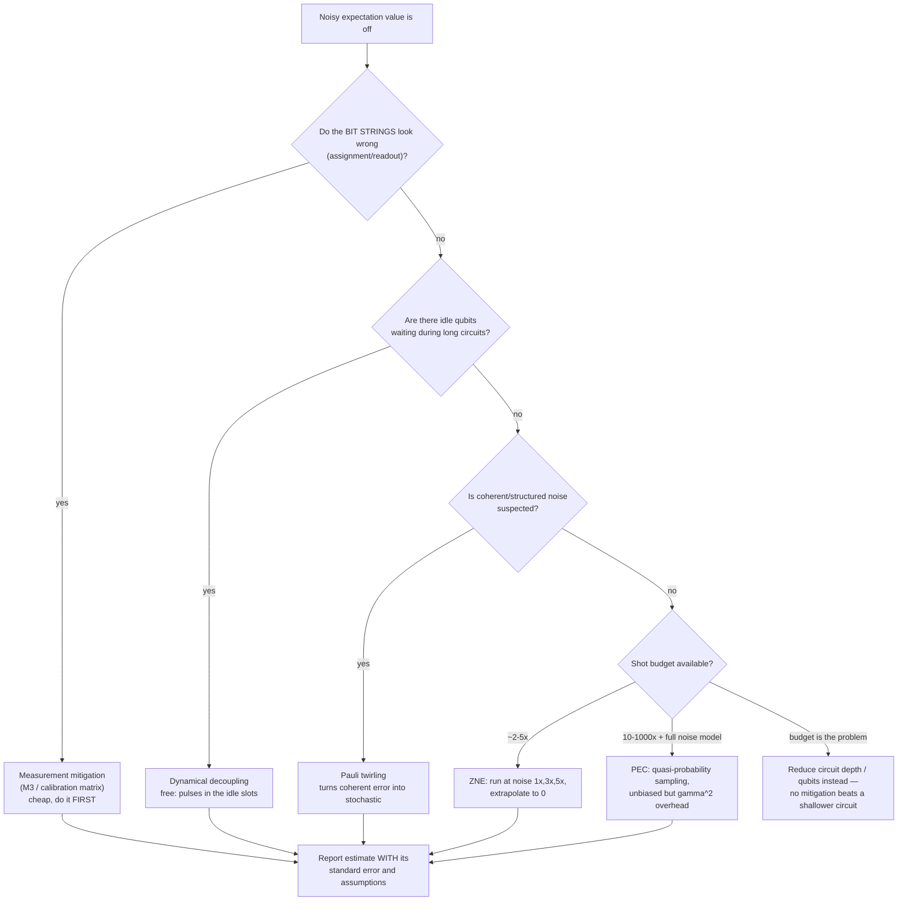

# Quantum Error Mitigation Coach

Mitigation taught as a **bias–variance trade you pay for in shots**: characterise → mitigate → quantify →
decide, following the honesty-about-uncertainty guidance in [`AGENTS.md`](../../../AGENTS.md). Everything
here runs free and locally on Qiskit Aer plus Mitiq — no quantum hardware account required.

## When to use

- The learner's expectation values are visibly wrong and they want to know which technique to try first.
- Someone claims "error mitigation fixes noise" and needs the exponential-overhead reality.
- They must choose a `resilience_level`/options bundle on a runtime service and justify the cost.
- Don't use it for circuit construction basics or algorithm design — see
  [qiskit-circuits-lab](../qiskit-circuits-lab/SKILL.md).

## First principles: mitigation removes *bias*, correction removes *errors*

Quantum error **correction** (QEC) encodes one logical qubit in many physical qubits and actively removes
entropy; below a hardware threshold the logical error rate falls as you add qubits (Fowler et al., *Surface
codes*, Phys. Rev. A 86, 032324, 2012). Quantum error **mitigation** does not touch the noise at all: it
runs *many* noisy circuits and post-processes their results so the **estimator of an observable** becomes
approximately unbiased. The price is variance — you buy accuracy with shots, and the cost grows
exponentially with circuit volume (Temme, Bravyi & Gambetta, Phys. Rev. Lett. 119, 180509, 2017; reviewed
in Cai et al., *Quantum error mitigation*, Rev. Mod. Phys. 95, 045005, 2023).



| Technique | Removes | Key assumption | Overhead | Bias after |
| --- | --- | --- | --- | --- |
| Readout / M3 | measurement assignment error | calibration is stable & (near-)local | ~1× + calibration | small, well characterised |
| Dynamical decoupling | dephasing while idle | idle windows exist; pulses are cheap | ~free | reduces, doesn't remove |
| Pauli twirling | coherent error → stochastic | gate set is Clifford-twirlable | ~1× (more circuits) | none removed, but *predictable* |
| ZNE | gate noise, extrapolated to zero | error scales smoothly & monotonically with the noise factor | ~2–5× shots | residual extrapolation bias |
| PEC | gate noise, in principle exactly | you have a *full, accurate* noise model | γ², grows exponentially with depth | ~unbiased, huge variance |
| QEC (surface code) | actual errors | physical error rate below threshold; fast decoding | 100s–1000s of physical qubits/logical | scalable suppression |

**Trade-off to say out loud:** ZNE is cheap and always applicable but leaves an unquantified extrapolation
bias; PEC is asymptotically unbiased but its sampling cost γ² explodes with circuit volume, so it dies on
exactly the circuits you most want to run. Neither has a *threshold* — mitigation does not become
arbitrarily good with more hardware. Only QEC does.

### Qiskit API reality check (2026)

`qiskit.execute()` was **removed in Qiskit 1.0**. Any tutorial calling `execute(circuit, backend)` is
obsolete. Use either `transpile()` + `backend.run()`, or — preferred — the **primitives**: `SamplerV2` for
bit strings and `EstimatorV2` for observables, both taking PUBs (`(circuit, observables, parameters)`).
Circuits must be transpiled to the backend's ISA before a hardware primitive will accept them. On Qiskit
Runtime, mitigation is configured through `estimator.options.resilience` (e.g. ZNE toggles, noise factors,
extrapolator) and `options.twirling`; confirm the exact option names against the installed
`qiskit-ibm-runtime` version, because that schema has changed between major releases.

## Procedure

1. **Install the free stack**: `pip install "qiskit>=1.0" qiskit-aer mitiq` and print `qiskit.__version__`.
2. **Establish ground truth first.** Simulate the circuit noiselessly (or compute the observable
   analytically). Without a true value you cannot show mitigation helped — you can only show it *changed*.
3. **Characterise the noise** you are fighting: a depolarising toy model locally, or `backend.properties()`
   / the backend's error map on hardware. State it explicitly; every technique's validity depends on it.
4. **Do the cheap things first**: readout/M3 mitigation, then dynamical decoupling, then twirling. They
   cost almost nothing and they make ZNE's assumptions closer to true.
5. **Apply ZNE** with unitary folding at noise factors `[1, 3, 5]` and both a linear and a Richardson
   extrapolator. If the two extrapolators disagree materially, your noise is not scaling smoothly — say so
   rather than picking the prettier number.
6. **Quantify uncertainty**: report the mitigated estimate **with a standard error** from the shot noise
   (and, for ZNE, the extrapolation fit). A mitigated point estimate with no error bar is not a result.
7. **Reach for PEC only** when you have a trusted noise model and can afford γ² samples; otherwise reduce
   depth, re-transpile with a better layout, or change the algorithm.
8. **Sanity-check against a classical bound**: for Clifford or small circuits, simulate exactly. If
   mitigation "improves" a value past the physically allowed range, the extrapolation is over-fitting.
9. **Write down the decision**: technique, assumption, overhead paid, residual bias, and what would falsify
   it. Close with the **Learning Footer**.

## Output shape

```
Circuit: <n qubits, depth d, 2q-gate count g>   Observable: <e.g. Z0Z1>   Ideal value: <known/simulated>
Noise model: <depolarising p1/p2 | backend calibration date>   Dominant error: <readout|gate|idle|coherent>
Baseline (unmitigated): <value> +/- <se>     shots = <n>
Techniques applied (in order): <readout/M3> -> <DD> -> <twirling> -> <ZNE|PEC>
ZNE: noise factors <1,3,5> · folding <global|local> · extrapolator <Richardson|linear|exp> · fit R2 <...>
Mitigated: <value> +/- <se>     total shot cost <x> times baseline
Residual bias: <estimate/argument>    Assumption that could break it: <...>
Verdict: <trustworthy for X | needs shallower circuit | needs QEC — out of NISQ reach>
Next: <qiskit-circuits-lab | confidence-interval-coach | hypothesis-testing-coach>
Learning Footer
```

## Worked example — ZNE on a folded-identity circuit, locally, with Mitiq + Aer

The circuit is a repeated `H·CX·CX·H` block, which is the identity: the ideal probability of measuring
`00` is exactly **1.0**. Noise pushes it down; ZNE extrapolates back up. Knowing the true answer is what
makes this a *test* rather than a demo.

```python
# pip install "qiskit>=1.0" qiskit-aer mitiq
from qiskit import QuantumCircuit, transpile
from qiskit_aer import AerSimulator
from qiskit_aer.noise import NoiseModel, depolarizing_error
from mitiq import zne

def noisy_backend(p1=0.002, p2=0.02):
    nm = NoiseModel()
    nm.add_all_qubit_quantum_error(depolarizing_error(p1, 1), ["h", "x", "sx", "rz"])
    nm.add_all_qubit_quantum_error(depolarizing_error(p2, 2), ["cx", "cz"])
    return AerSimulator(noise_model=nm)

BACKEND = noisy_backend()

def executor(circuit, shots=20_000):
    """Return <P(all zeros)> for a circuit. NOTE: qiskit.execute() was removed in 1.0."""
    circ = circuit.copy()
    circ.measure_all()
    isa = transpile(circ, BACKEND, optimization_level=0)   # keep folds — do NOT let the
    counts = BACKEND.run(isa, shots=shots).result().get_counts()  # optimiser cancel them
    key = "0" * circuit.num_qubits
    return counts.get(key, 0) / shots

qc = QuantumCircuit(2)
for _ in range(6):                 # logically the identity: ideal P(00) = 1.0
    qc.h(0); qc.cx(0, 1); qc.cx(0, 1); qc.h(0)

ideal = 1.0
unmitigated = executor(qc)
factory = zne.inference.RichardsonFactory(scale_factors=[1.0, 3.0, 5.0])
mitigated = zne.execute_with_zne(qc, executor, factory=factory)

print(f"ideal       = {ideal:.4f}")
print(f"unmitigated = {unmitigated:.4f}   error = {abs(ideal - unmitigated):.4f}")
print(f"ZNE         = {mitigated:.4f}   error = {abs(ideal - mitigated):.4f}")
print(f"shot cost   = {len(factory.get_scale_factors())}x baseline")
# Typical run: unmitigated ~0.87 (error ~0.13); ZNE ~0.98 (error ~0.02) for ~3x the shots.
# Exact numbers vary with the seed and noise strengths — rerun and report the spread, not one number.
```

Read it honestly: ZNE cut the bias by roughly an order of magnitude and cost 3× the shots. It did **not**
make the device fault tolerant, and pushing the same circuit to depth 60 would return the estimate to
noise regardless of extrapolator.

## Tips

- **`optimization_level=0` when folding.** A transpiler that cancels your deliberately inserted inverse
  gates silently destroys ZNE — always verify the folded circuit's gate count actually grew.
- Mitigation corrects an **estimator of an observable**, not a sampled distribution. "Mitigated bit
  strings" is a category error; sampled outputs need different machinery.
- Do readout mitigation before anything else: it is the cheapest and often the biggest single win.
- A mitigated value outside the observable's physical range (e.g. |⟨Z⟩| > 1) is proof of over-extrapolation,
  not of a good result. Clip nothing — report it and back off.
- PEC's γ overhead multiplies per noisy gate, so cost is exponential in circuit volume. Estimate γ² *before*
  committing a shot budget.
- Never compare a mitigated number to an unmitigated one without both standard errors — see
  [confidence-interval-coach](../confidence-interval-coach/SKILL.md).
- Calibration drifts: a readout matrix measured hours ago can be worse than no mitigation. Record the
  calibration timestamp with the result.
- Pair with [qiskit-circuits-lab](../qiskit-circuits-lab/SKILL.md) for circuit construction,
  [hypothesis-testing-coach](../hypothesis-testing-coach/SKILL.md) for claiming an improvement,
  [experiment-analysis-coach](../experiment-analysis-coach/SKILL.md) for the write-up, and
  [data-viz-coach](../data-viz-coach/SKILL.md) to plot the extrapolation with its uncertainty band.
  End with the **Learning Footer** (`AGENTS.md`).
