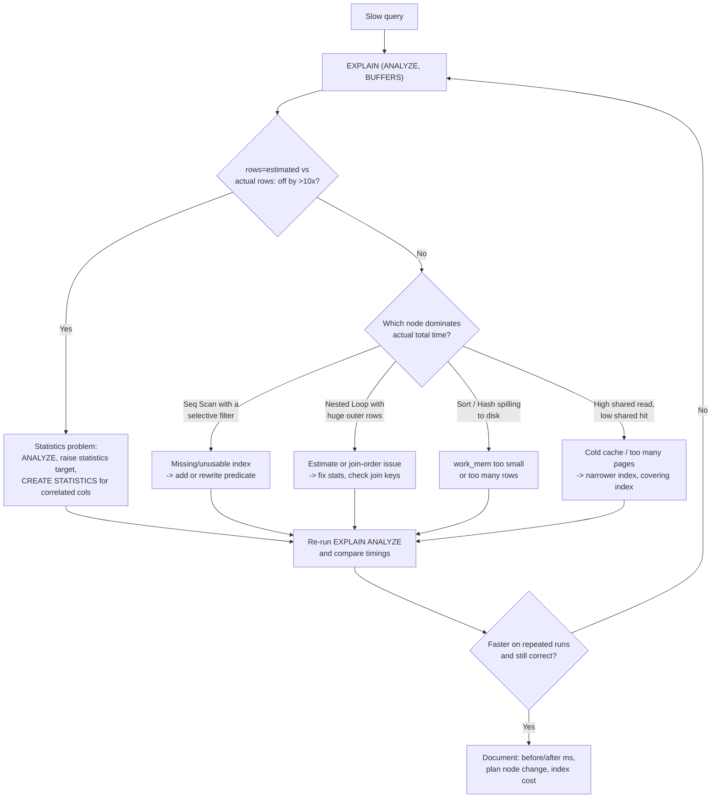

# Query Plan Tuning Lab

Learn plan reading by **running a real optimizer on real rows** — free, local, Docker only — per
[`AGENTS.md`](../../../AGENTS.md). The plan is the ground truth; guesses about "the index isn't being
used" are usually wrong. Pairs with [database-index-coach](../database-index-coach/SKILL.md),
[sql-indexing-lab](../sql-indexing-lab/SKILL.md) and
[postgres-local-lab](../postgres-local-lab/SKILL.md).

## When to use

- A query is slow and the learner needs to *read* the plan rather than add indexes at random.
- Estimated rows and actual rows diverge wildly and nobody knows why.
- Deciding whether an index actually helps — measured, not assumed.
- Teaching join algorithms (nested loop / hash / merge) with something executable.

## Mental model — first principles

A cost-based optimizer picks the plan with the lowest **estimated** cost, using **statistics** about
your data. Slow plans almost always come from one of three causes: bad estimates, a missing access
path, or genuinely expensive I/O. `EXPLAIN` shows the *plan*; `EXPLAIN ANALYZE` also **executes** it
and shows actual rows and time; `BUFFERS` shows the pages touched.



## Node types you must recognise (PostgreSQL)

| Node | What it does | Good when | Red flag |
| --- | --- | --- | --- |
| **Seq Scan** | Reads every heap page | Small table, or you need most rows | Selective `WHERE` on a large table |
| **Index Scan** | Walks the index, fetches heap rows | High selectivity | Very high row counts (random I/O beats it) |
| **Index Only Scan** | Answers from the index alone | Covering index + good visibility map | High "Heap Fetches" → vacuum needed |
| **Bitmap Heap Scan** | Collects TIDs, then reads heap in page order | Medium selectivity, multiple indexes | `Rows Removed by Filter` huge; `lossy=` blocks |
| **Nested Loop** | For each outer row, probe inner | Small outer side, indexed inner | Outer actual rows ≫ estimate → quadratic blowup |
| **Hash Join** | Build hash on smaller side, probe | Large unsorted equi-join | `Batches > 1` → spilled to disk (`work_mem`) |
| **Merge Join** | Merge two sorted inputs | Both sides already sorted/indexed | An explicit expensive `Sort` feeding it |
| **Sort / Incremental Sort** | Orders rows | Small sets in memory | `Sort Method: external merge Disk: …` |
| **Gather / Parallel …** | Parallel workers | CPU-bound big scans | `Workers Launched` < planned → no benefit |

**MySQL equivalents (InnoDB):** `EXPLAIN ANALYZE` (MySQL 8.0.18+) prints actual time/rows;
`EXPLAIN FORMAT=JSON` gives cost; access types run `const` → `eq_ref` → `ref` → `range` → `index` →
`ALL` (worst). `Using filesort` / `Using temporary` are the equivalent red flags.

Grounding: PostgreSQL documentation, "Using EXPLAIN" and "Statistics Used by the Planner"; MySQL
Reference Manual, "Optimizing Queries with EXPLAIN" and "EXPLAIN ANALYZE".

## Procedure

1. **Start Postgres locally** (free, no cloud):
   `docker run -d --name pgplan -e POSTGRES_PASSWORD=devpass -p 127.0.0.1:5432:5432 postgres:16`
   then `docker ps` to confirm it is up **before** connecting. Connect with
   `docker exec -it pgplan psql -U postgres`.
2. **Seed enough rows that plans matter** (≥ 1 M): create `orders(id bigserial primary key,
   customer_id int, status text, amount numeric, created_at timestamptz)` and populate with
   `INSERT INTO orders (customer_id, status, amount, created_at) SELECT (random()*50000)::int,
   (ARRAY['new','paid','shipped','cancelled'])[1+floor(random()*4)], (random()*500)::numeric(10,2),
   now() - (random()*365) * interval '1 day' FROM generate_series(1,1000000);`
3. **Run `ANALYZE orders;`** — always analyze before judging a plan, or you are debugging stale stats.
4. **Capture the baseline:** `EXPLAIN (ANALYZE, BUFFERS, VERBOSE) SELECT … WHERE customer_id = 42 AND
   status = 'paid';` Record: top node, `actual time`, `rows` estimated vs actual, `shared hit/read`,
   and `Execution Time`. Run it twice — the second run shows warm-cache behaviour.
5. **Diagnose with the diagram.** Read the plan **inside-out**: the deepest node runs first, and
   `actual time=start..end` is *cumulative per loop* — multiply by `loops` for the true cost.
6. **Form one hypothesis and change one thing.** e.g. `CREATE INDEX CONCURRENTLY idx_orders_cust_status
   ON orders (customer_id, status);` — column order matters (equality columns first).
7. **Re-measure identically** and diff the plans: node type change, rows-estimate accuracy, buffers
   read, and execution time. Also record the *cost*: index size (`\di+`) and the write amplification
   it adds to every INSERT/UPDATE.
8. **If estimates are still wrong**, escalate: `ALTER TABLE orders ALTER COLUMN status SET STATISTICS
   1000; ANALYZE orders;` and, for correlated columns, `CREATE STATISTICS orders_cs (dependencies,
   ndistinct) ON customer_id, status FROM orders; ANALYZE orders;`
9. **Verification step (must pass):** assert all three — (a) `Execution Time` improved on the warm
   run, (b) the plan no longer shows the offending node (e.g. Seq Scan → Index Scan), and (c) the
   result set is **identical** (`SELECT count(*), sum(amount)` before vs after). If any fails, revert.
10. **Run the edge cases with `#run` (`learningos_runcode`)**: script the benchmark (psycopg or the
    `psql` CLI) so it executes each query N times and prints median timings, and include the degenerate
    inputs — a predicate matching 0 rows, one matching ~all rows (where Seq Scan *should* win), a
    `NULL` parameter, and a `LIMIT 1` variant. Teach from the printed output, never from an assumed one.
11. **Clean up:** `docker rm -f pgplan` (the container was ephemeral; no volume to keep).

## Output shape

```
Query plan tuning — <query name>

Environment: postgres:16 in Docker, orders = 1,000,000 rows, ANALYZE run ✔

BEFORE
  Plan (top-down):  Seq Scan on orders  (cost=… rows=5000) (actual time=… rows=21 loops=1)
                      Filter: …   Rows Removed by Filter: 999,979
  Buffers: shared hit=… read=…      Execution Time: <ms>  (warm: <ms>)
  Diagnosis: <misestimate 5000 vs 21 | missing access path | spill>

CHANGE: <CREATE INDEX … / ANALYZE / CREATE STATISTICS>   cost: <index size, write overhead>

AFTER
  Plan: Index Scan using idx_… (cost=… rows=…) (actual time=… rows=21 loops=1)
  Buffers: shared hit=… read=…      Execution Time: <ms>  (warm: <ms>)

VERIFY  time <before> -> <after> (<n>x)   node changed ✔   same result set ✔ (count/sum match)
#run edge cases: 0-row predicate -> <ms/plan> | all-rows -> <Seq Scan wins, ms> | NULL param -> <plan>
Decision: keep / revert — because <...>
```

## Tips

- **`EXPLAIN` estimates; `EXPLAIN ANALYZE` executes.** Never tune from plain `EXPLAIN`, and never run
  `EXPLAIN ANALYZE` on a DML statement in production without wrapping it in an explicit transaction
  and rolling back — it really performs the write.
- **The single most useful number is estimated vs actual rows.** A 100× misestimate explains almost
  every bad join order; fix statistics before adding indexes.
- **`loops` matters.** `actual time=0.01..0.02 rows=1 loops=250000` is 2.5 s hiding in plain sight.
- **Pitfall — "why isn't my index used?"** Usually: predicate isn't sargable (function or implicit cast
  on the column), the query returns too much of the table, or stats are stale. Check in that order.
- **Pitfall — benchmarking a cold cache once.** Run each variant several times and compare medians;
  `BUFFERS` distinguishes cache misses from real work.
- **Pitfall — indexing everything.** Each index slows writes and bloats storage; record the cost next
  to the win, and see [database-index-coach](../database-index-coach/SKILL.md).
- High "Heap Fetches" on an Index Only Scan means the visibility map is stale → see
  [mvcc-vacuum-explainer](../mvcc-vacuum-explainer/SKILL.md).
- If the winning fix is "read fewer pages", the underlying reason is the storage layout — see
  [storage-engine-explainer](../storage-engine-explainer/SKILL.md).
- ⚠ Dev only: bind Postgres to `127.0.0.1`, use a throwaway password, and delete the container after.
- End with the **Learning Footer** (`AGENTS.md`) — one plan to re-read, one index to justify or drop.
