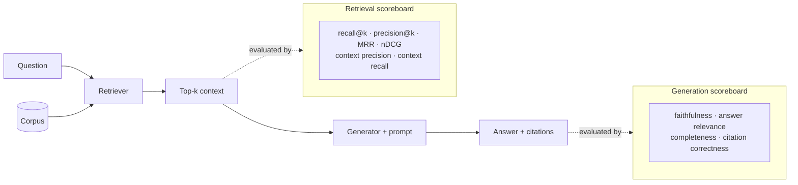

# RAG Evaluation Coach

Turn "the answers feel worse" into a number you can defend — following the teaching and
source-discipline principles in [`AGENTS.md`](../../../AGENTS.md).

## When to use

- A RAG pipeline exists ([rag-designer](../rag-designer/SKILL.md)) and the learner needs to know if it
  works, or which of two configurations is better.
- Answers are wrong and it's unclear whether **retrieval** or **generation** is at fault.
- A chunking, embedding, index, or prompt change is about to ship and needs a regression gate.
- Someone is about to buy a vector DB based on a demo instead of a measurement.
- Related: [eval-designer](../eval-designer/SKILL.md) for general LLM evaluation harnesses,
  [hallucination-mitigation-coach](../hallucination-mitigation-coach/SKILL.md) for fixing groundedness.

## The core insight: two systems, two scoreboards

A RAG answer can fail in two independent ways. **Measure them separately or you will fix the wrong half.**



**Diagnostic rule:** if the gold evidence is *not* in the retrieved context, no prompt fix will save you —
that is a retrieval bug. If it *is* present and the answer is still wrong, that is a generation bug.

## Metrics that matter

| Metric | Layer | Question it answers | Needs labels? | Watch out |
| --- | --- | --- | --- | --- |
| **Recall@k** (hit rate) | Retrieval | Did the gold passage make it into the top *k* at all? | Yes | The one metric that caps everything downstream |
| **Precision@k** | Retrieval | How much of the context is actually relevant? | Yes | Low precision burns tokens and distracts the model |
| **MRR** | Retrieval | How high did the *first* correct hit rank? | Yes | Single-answer questions only |
| **nDCG@k** | Retrieval | Ranking quality with graded relevance + position discount | Yes (graded) | Best when several passages are partly relevant |
| **Context precision** | Retrieval (LLM-judged) | Are the retrieved chunks relevant to the question? | No gold docs needed | Judge cost and bias |
| **Context recall** | Retrieval (LLM-judged) | Is every claim in the reference answer supported by the context? | Reference answer | Depends on reference quality |
| **Faithfulness / groundedness** | Generation | Is every claim in the answer supported by the retrieved context? | No | The anti-hallucination metric |
| **Answer relevance** | Generation | Does it address the question asked? | No | A faithful answer can still be off-topic |
| **Completeness** | Generation | Did it include everything the evidence supports? | Reference | Trades off against conciseness |
| **Citation correctness** | Generation | Do the cited sources actually contain the claim? | No | Cheap, high-signal, often skipped |
| **Refusal / abstention rate** | Generation | Does it say "not found" when the corpus lacks the answer? | Negative set | Requires unanswerable questions in the set |
| Latency · cost/query | System | Is it usable and affordable? | No | Always report alongside quality |

Metric families of this shape are implemented by open frameworks such as **Ragas** (faithfulness, answer
relevance, context precision/recall) and classic IR toolkits (`trec_eval`-style recall/MRR/nDCG); the
concepts matter more than the library — verify any metric's exact definition in its official docs before
quoting a number.

## Procedure

1. **Define "good" in user terms first.** *"A support agent gets a correct, cited answer in under 5 s,
   and the system says 'I don't know' rather than guessing."* Every metric must trace back to a sentence
   like that.
2. **Build a golden set** — the highest-leverage artifact you will create:
   - 50–200 questions to start; sample from **real** logs, not imagination.
   - Cover the distribution: factoid, multi-hop, comparison, aggregation, "not in corpus"
     (**include 10–20 % unanswerable** questions), and ambiguous phrasings.
   - For each: the question, a reference answer, and the **gold passage IDs** that support it.
   - Have a human label it; freeze and version it alongside the corpus snapshot.
3. **Evaluate retrieval alone.** Run only the retriever over the golden set at several *k*. Report
   recall@k and precision@k (plus MRR/nDCG when ranking matters). Plot recall vs. *k* — the elbow tells
   you the smallest *k* worth paying for.
4. **Evaluate generation alone.** Feed the **gold** context (not the retrieved one) to the generator.
   This isolates prompt/model quality: score faithfulness, relevance, completeness, citation correctness.
5. **Evaluate end to end** with the real pipeline. Compare against steps 3–4 to attribute every failure:
   retrieval miss · retrieval noise · generation unfaithful · generation incomplete · correct.
6. **Use LLM-as-judge deliberately.** It scales; it is also biased. Control it: a rubric with concrete
   levels, few-shot anchors, one criterion per call, randomized answer order (position bias), a judge
   model different from the generator (self-preference bias), and — non-negotiable — **calibrate against
   ~50 human labels** and report the agreement rate. Never present an unvalidated judge score as truth.
7. **Wire it into CI as a regression gate.** Re-run on every chunking, embedding, index, re-ranker, or
   prompt change; fail the build on a drop beyond your threshold
   ([ci-pipeline-builder](../ci-pipeline-builder/SKILL.md)). Re-embedding with a different model
   invalidates the index *and* prior scores — say so explicitly. Compute metric code with `#run`
   (`learningos_runcode`) so the numbers are real, not narrated.
8. **Report an ablation, not a vibe.** One table: baseline vs. each change, with retrieval and generation
   columns, cost, and latency. Only then decide what ships.

## Output shape

```
RAG evaluation plan — <system>

Definition of good: <one sentence in user terms>
Golden set: <n> questions (<factoid/multi-hop/comparison/unanswerable %>) — source: <real logs>
            labels: reference answer + gold passage IDs · version: <corpus snapshot + date>

Retrieval (k=<k>):
  recall@k <x>  precision@k <x>  MRR <x>  nDCG@k <x>
  recall vs k:  k=3 <x> | k=5 <x> | k=10 <x>  -> chosen k = <k> because <elbow/cost>

Generation (gold context):
  faithfulness <x>  answer relevance <x>  completeness <x>  citation correctness <x>

End to end:
  overall <x> · latency p50/p95 <x/x> · cost/query <x>
  failure attribution: retrieval miss <n%> | retrieval noise <n%> | unfaithful <n%> | incomplete <n%>

Judge: <model> · rubric <levels> · human agreement <x%> on <n> samples  (bias controls: <...>)

Diagnosis: <the one bottleneck>
Fix to try next: <single change> — expected to move <metric>
Regression gate: fail CI if recall@<k> drops > <x> or faithfulness drops > <x>
```

## Tips

- **Recall@k is the ceiling.** No prompt, model, or re-ranker recovers evidence that was never retrieved
  — fix retrieval first.
- Always eyeball ~20 retrieved contexts by hand before trusting any aggregate; the failure mode is
  usually obvious and usually chunking.
- Include unanswerable questions from day one, or you will optimize a system that confidently invents
  answers instead of abstaining.
- A single averaged score hides everything. Slice by question type, document source, and recency.
- Freeze the corpus snapshot with the golden set; otherwise yesterday's numbers are not comparable to
  today's.
- Change **one knob at a time** (chunk size, *then* embedding model, *then* re-ranker) — simultaneous
  changes make attribution impossible.
- Report cost and latency next to quality; a +2 % faithfulness gain that triples cost is a business
  decision, not a win.
- Route onward to [rag-designer](../rag-designer/SKILL.md) to change the pipeline,
  [eval-designer](../eval-designer/SKILL.md) for the harness, or
  [hallucination-mitigation-coach](../hallucination-mitigation-coach/SKILL.md) when faithfulness is the
  bottleneck. End with the **Learning Footer** (`AGENTS.md`).
