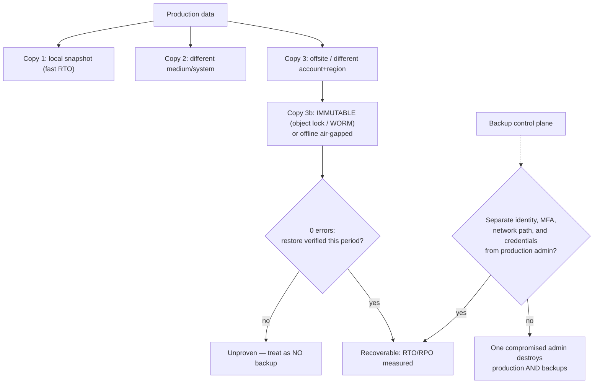

# Ransomware Resilience Drill

Ransomware is a **recovery** problem before it is a malware problem: modern intrusions destroy backups
first, so this drill starts at the restore and works backwards, per the teach-the-why rule in
[`AGENTS.md`](../../../AGENTS.md). Everything here is defensive — recovery capability, not attacker
behaviour.

## When to use

- Backups exist but have never been restored end-to-end under a clock.
- The backup system shares an identity provider, network, or admin credentials with production.
- Leadership wants an RTO/RPO number that is measured rather than asserted.
- **Don't use it for** live incident command ([incident-response-drill](../incident-response-drill/SKILL.md)),
  forensic collection ([dfir-evidence-triage-drill](../dfir-evidence-triage-drill/SKILL.md)), or anything
  involving obtaining, running, or simulating actual ransomware.

## First principles: 3-2-1-1-0, and the backup control plane

The classic 3-2-1 rule — 3 copies, 2 media types, 1 offsite — predates campaigns that deliberately target
backup infrastructure. The modern form adds **1 immutable or offline copy** and **0 errors after
verification**. NIST CSF 2.0 places this under **RECOVER** (RC.RP recovery plan execution) with
**PROTECT** data-security outcomes; NIST SP 1800-11 (*Data Integrity: Recovering from Ransomware and
Other Destructive Events*) and the CISA `#StopRansomware` Guide are the operative references.



| Digit | Requirement | Defeats | Typical failure seen in drills |
| --- | --- | --- | --- |
| **3** | three copies of the data | single-copy loss | "the replica" counted as a second copy |
| **2** | two different media/systems | correlated platform failure | both copies on the same storage array |
| **1** | one offsite (separate account/region) | site or account compromise | offsite copy in the same cloud account |
| **1** | one **immutable or offline** copy | deliberate backup deletion | retention lock configurable by the same admin |
| **0** | zero errors — verified restore | corrupt/incomplete backups | last full restore test: never |

**Trade-off to say out loud:** immutability removes your ability to delete data early, which collides with
storage cost and with deletion obligations (e.g. GDPR erasure). Choose the lock **mode** deliberately —
a governance-style lock that a privileged role can lift is *not* protection against a compromised
privileged role; a compliance-style lock cannot be lifted by anyone, including you, until expiry. Decide
retention with legal input, and document the decision.

## Procedure

1. **Pick one business-critical service** and write its stated RTO/RPO. Unstated targets cannot fail a test.
2. **Map every copy** into the 3-2-1-1-0 table — location, medium, account, retention, and *who can delete it*.
3. **Interrogate the immutable copy**: is the lock enforced by the storage platform, and can the same
   identity that administers production shorten or remove it? Verify, don't assume:

   ```bash
   aws s3api get-object-lock-configuration --bucket backups-prod
   aws s3api get-object-retention --bucket backups-prod --key <object>
   ```

4. **Isolate the backup control plane**: separate directory/tenant or break-glass accounts, phishing-resistant
   MFA, no shared service accounts, no production admin path into the backup console, and separate logging.
5. **Check the recovery *dependencies***, not just the data: DNS, PKI/certificates, the IdP itself, secrets,
   IaC repos, runbooks, and the contact list. A runbook stored only in the encrypted file share is not a runbook.
6. **Run a timed restore test to a clean, isolated environment** — never restore over production, and never
   into a network still shared with the suspected-compromised estate.

   ```bash
   date -u +"%Y-%m-%dT%H:%M:%SZ"           # T0: start the clock
   # …perform the restore into the isolated recovery VPC/namespace…
   date -u +"%Y-%m-%dT%H:%M:%SZ"           # T1: service answering health checks
   ```

7. **Validate the restored data**, not just the restore job: row counts, checksums, and one real business
   transaction end to end.

   ```bash
   sha256sum -c MANIFEST.sha256   # integrity of restored artefacts
   ```

8. **Record measured RTO and RPO** against the stated ones, and treat any gap as a funded finding with an owner.
9. **Rehearse the decision path** — who declares disaster, who authorises failover, what the comms plan is —
   and note that paying is not a recovery plan (it does not guarantee data return and may carry sanctions
   exposure; involve counsel and follow CISA guidance).
10. **File the gaps**, schedule the next drill, and close with the **Learning Footer**.

## Output shape

```
Service: <name> · tier=<1|2|3> · stated RTO=<h> · stated RPO=<h> · data owner=<…>
Copies (3-2-1-1-0):
  <copy> · location=<account/region/site> · medium=<disk|object|tape> · retention=<…> ·
           deletable by=<role> · immutable=<none|governance-style|compliance-style|offline>
Backup control plane: identity=<separate|shared> · MFA=<phishing-resistant?> ·
           network path=<isolated|shared> · logs=<separate sink?>
Recovery dependencies: <DNS · PKI · IdP · secrets · IaC · runbooks · contacts> — available offline=<y/n>
Restore test: date=<…> · target=<isolated env> · T0=<UTC> · T1=<UTC> ·
           measured RTO=<…> · measured RPO=<…> · data validation=<checksums + business txn: pass|fail>
Gap vs stated: RTO <met|missed by …> · RPO <met|missed by …>
Findings: <id> <gap> · owner=<…> · due=<date> · risk if unfixed=<…>
Decision path: declare=<role> · authorise failover=<role> · comms=<role> · legal/regulator=<trigger>
Next drill: <date> · scope change=<…>
Next: [disaster-recovery-planner] · [incident-response-drill] · [security-logging-audit-coach]
Learning Footer
```

## Worked example — order database, stated RTO 4 h / RPO 1 h

| Copy | Location | Medium | Retention | Deletable by | Immutable |
| --- | --- | --- | --- | --- | --- |
| 1 | prod account, same region | disk snapshot | 7 d | prod admin | no |
| 2 | prod account, second AZ | object storage | 30 d | prod admin | no |
| 3 | **separate account**, second region | object storage | 90 d | backup-only role | **compliance-style lock, 35 d** |

Drill result: `T0 = 2026-08-09T10:00Z`, service healthy at `T1 = 2026-08-09T13:12Z` → **measured RTO
3 h 12 m** (meets 4 h). Snapshot timestamp `09:20Z` → **measured RPO 40 m** (meets 1 h). Data validation
passed on checksums and one end-to-end order placement.

Two findings, both about the *control plane* rather than the data:

1. The backup-only role was assumable by the production break-glass account — one compromised identity
   could reach copies 1 and 2 and shorten the lifecycle policy. Fix: separate directory + hardware-MFA
   break-glass, reviewed quarterly.
2. The recovery runbook and the PKI private-key escrow lived only on the file share being restored — a
   circular dependency. Fix: printed/offline copy plus an escrow in the isolated account.

Note that copies 1 and 2 share an account: they satisfy "3 copies" but **not** the offsite and immutability
digits on their own. That is exactly the failure the 3-2-1-1-0 form was designed to expose.

## Tips

- An untested backup is a hypothesis — the `0` in 3-2-1-1-0 is the only digit that is *measured*.
- Attack the **backup control plane** in your threat model: shared admin identity defeats every other digit.
- Restore into an **isolated** environment; restoring into the compromised network re-infects the recovery.
- Time the restore with UTC timestamps so RTO is evidence rather than an estimate.
- Recovery has dependencies — DNS, PKI, IdP, secrets, runbooks; keep an offline copy of each.
- Immutability collides with deletion obligations; pick the lock mode with legal input and record why.
- Pair with [disaster-recovery-planner](../disaster-recovery-planner/SKILL.md),
  [incident-response-drill](../incident-response-drill/SKILL.md),
  [dfir-evidence-triage-drill](../dfir-evidence-triage-drill/SKILL.md),
  [cloud-iam-least-privilege-coach](../cloud-iam-least-privilege-coach/SKILL.md),
  [runbook-writer](../runbook-writer/SKILL.md), and
  [incident-postmortem](../incident-postmortem/SKILL.md).
  End with the **Learning Footer** (`AGENTS.md`).
