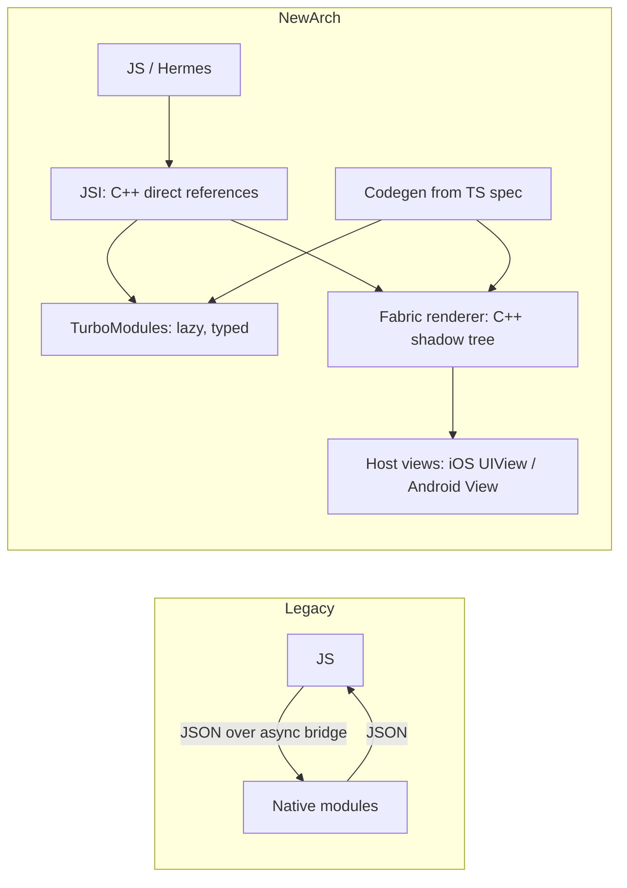

# React Native New Architecture Lab

Prove which architecture your app is *actually* running, then ship one typed TurboModule end to end —
first-principles, evidence-driven, closing with the **Learning Footer**, per
[`AGENTS.md`](../../../AGENTS.md). Pairs with
[mobile-release-coach](../mobile-release-coach/SKILL.md) and
[mobile-state-management-coach](../mobile-state-management-coach/SKILL.md).

## When to use

- Upgrading an app and needing to confirm Fabric / TurboModules / bridgeless are genuinely on.
- A third-party library breaks after the upgrade and you must decide: interop layer, fork, or replace.
- The learner has only ever written a legacy `NativeModules` bridge module and needs the Codegen workflow.
- UI updates feel laggy through the old asynchronous, JSON-serialised bridge.

## First principles

The legacy architecture connected JS and native through a **bridge**: every call was serialised to JSON,
queued, and delivered asynchronously across three threads. That design forced three costs — serialisation
overhead, no synchronous calls, and eager initialisation of every native module at startup.

The New Architecture removes the bridge and replaces it with **JSI** (JavaScript Interface), a C++ layer
that lets JS hold references to native objects and invoke them **directly and synchronously when needed**.
Everything else is built on that foundation:

- **Fabric** — the re-architected renderer; the shadow tree lives in C++ and is shared across platforms,
  enabling synchronous layout and better interop with host views.
- **TurboModules** — native modules exposed over JSI and loaded **lazily** on first use, not at startup.
- **Codegen** — reads your typed JS/TS spec files and generates the native interfaces, so the type contract
  is checked at **build time** instead of failing at runtime.
- **Bridgeless mode** — the runtime with the bridge fully removed.

Per the React Native blog post *React Native 0.76 — New Architecture by default* (23 Oct 2024), the New
Architecture, including bridgeless mode, is the default for new apps from 0.76 onward. Always confirm the
exact behaviour for **your** version on reactnative.dev rather than assuming.



## Legacy vs New — what actually changes

| Concern | Legacy (bridge) | New Architecture (JSI) | Consequence for you |
| --- | --- | --- | --- |
| JS↔native calls | JSON serialised, async only | direct references, sync possible | no more JSON cost in hot paths |
| Module loading | all modules eagerly at startup | lazy on first access | faster TTI, but init errors surface later |
| Type safety | untyped, fails at runtime | Codegen from a TS spec, fails at build | typos become compiler errors |
| Rendering | JS-side shadow tree, async layout | C++ shadow tree, sync layout & measure | fewer flickers on measurement |
| Native view props | manual `RCTViewManager` mapping | generated component descriptors | less boilerplate, stricter contract |
| Third-party libs | anything works | needs a New-Arch build, or the interop layer | audit dependencies before upgrading |
| Debugging | Chrome / remote JS debugging | React Native DevTools, Hermes | old remote-debugging workflows retired |

## Procedure

1. **Baseline.** Record `npx react-native --version`, the platforms you target, and whether Hermes is on —
   JSI-based features assume Hermes. Create a fresh app to compare against:
   `npx @react-native-community/cli init NewArchLab`.
2. **Verify what is running** (do not trust the docs about your app, trust the runtime). Add a debug screen
   that renders these three probes and read them on a real build:
   - Fabric: `!!global.nativeFabricUIManager`
   - TurboModules: `!!global.__turboModuleProxy`
   - Bridgeless: check whether an `RCTBridge` appears in your native stack/logs
   Also confirm the build flags: `newArchEnabled=true` in `android/gradle.properties`, and on iOS the
   New-Arch pod install (`RCT_NEW_ARCH_ENABLED=1 bundle exec pod install` on versions where that toggle
   still applies). Write the observed booleans down — that is your ground truth.
3. **Toggle it deliberately, once.** On a scratch branch, flip the flag off, rebuild, and re-read the same
   probes. Seeing them go `false → true` is what makes the concept concrete. Then discard the branch.
4. **Write the spec.** Create `specs/NativeBattery.ts` exporting a `TurboModule` interface (e.g.
   `getLevel(): Promise<number>` and `isCharging(): boolean`) plus
   `TurboModuleRegistry.getEnforcing<Spec>('NativeBattery')`. Configure `codegenConfig` in `package.json`
   with your module name and spec directory.
5. **Generate and implement.** Run the build so Codegen produces the native interfaces, then implement them:
   Kotlin/Java extending the generated Android spec class, Objective-C++/Swift conforming to the generated
   iOS protocol. Register the module in your package/provider. Rebuild and call it from JS.
6. **Break the contract on purpose.** Change the spec's return type (e.g. `number` → `string`) without
   touching the native side and rebuild. Capture the **build-time** error — this is the single biggest
   practical win of Codegen over the legacy bridge, and seeing the failure teaches it better than prose.
7. **Prove laziness.** Log inside your module's constructor/init and confirm it only fires on the first JS
   call, not at app launch. Compare cold-start logs before and after.
8. **Handle legacy libraries.** Audit dependencies (the React Native directory lists New-Arch support, and
   Expo projects can run `npx expo-doctor`). For each unsupported library choose one path and justify it:
   rely on the **interop layer**, upgrade the library, fork and migrate it, or replace it. Record the
   decision and its risk.
9. **Verify — measure, do not assume.** Capture and compare: the three runtime probes; cold start (TTI)
   before/after; module init timing; a scroll/layout interaction profiled in React Native DevTools; and a
   clean release build on **both** platforms. A New-Arch migration is only "done" when release builds pass.
10. **Run the pure logic with `#run`.** Native code needs Xcode/Gradle, but the JS/TS layer above your module
    does not: extract parsing, unit conversion, throttling and error mapping into plain functions and execute
    them with `#run` (`learningos_runcode`) on real inputs **including edge cases** — `null`/`undefined` from
    native, `-1` for "unknown", `0` and `1.0` boundaries, a rejected promise, a module missing entirely
    (`getEnforcing` throw), and rapid repeat calls. Teach from the real output.

## Output shape

```
RN New Architecture lab — <capability> (RN <version>, iOS/Android, Hermes <on/off>)

Runtime probes (observed on device):
  global.nativeFabricUIManager : <true/false>   -> Fabric
  global.__turboModuleProxy    : <true/false>   -> TurboModules
  bridgeless (no RCTBridge)    : <yes/no>
  flags: android newArchEnabled=<...> | ios pod install <...>

TurboModule build:
  spec        : specs/Native<X>.ts -> <methods>
  codegenConfig: name=<...> type=modules jsSrcsDir=<...>
  native impl : Android <Kotlin class> | iOS <ObjC++/Swift class>
  contract test: changed spec type -> build error "<exact message>"  (caught at BUILD time)
  laziness    : init log fired at <app launch / first call>

Legacy interop audit:
  <lib>  new-arch support: <yes/no/interop>  -> decision: <keep|upgrade|fork|replace>  risk: <...>

Verification: cold start <a>→<b> ms | release build iOS <pass/fail> Android <pass/fail>

#run (JS layer): null -> <output> | -1 unknown -> <output> | 0 / 1.0 -> <output>
                 rejected promise -> <output> | module missing -> <output> | rapid calls -> <output>

Takeaway: <why removing the bridge changes the API surface, in one sentence>
Next: <linked skill>
```

## Tips

- Verify the architecture from the **running app**, not from the release notes: flags can be set and still
  not take effect if a pod install or Gradle sync was skipped.
- Lazy initialisation moves failures later. A module that used to blow up at launch now blows up on first
  use — add explicit error handling around the first call.
- Codegen turns a whole class of runtime type bugs into build errors; keep the TS spec as the single source
  of truth and never hand-edit generated files.
- Synchronous JSI calls are possible — that does not make them free. Sync work blocks the JS thread; keep it
  to cheap getters and leave real work async.
- Audit third-party dependencies **before** the upgrade, not after. The interop layer buys time; it is not a
  destination, and it does not cover every legacy pattern.
- Always validate on **release** builds for both platforms; debug-only success routinely hides New-Arch
  packaging and Codegen issues.
- Old remote JS debugging workflows are gone — learn React Native DevTools instead of fighting for them.
- Close with the **Learning Footer** (`AGENTS.md`): recap, pitfalls, next topic, one exercise, level, time.
