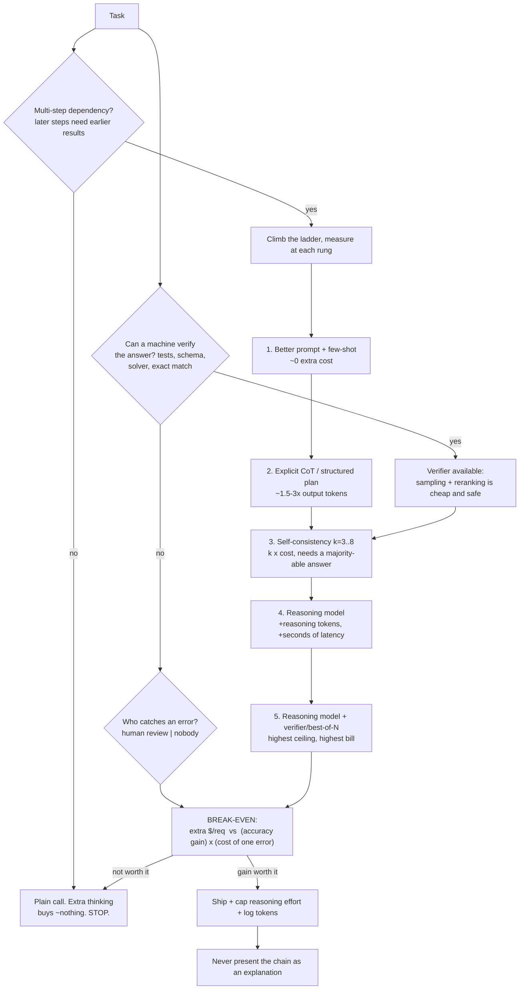

# Reasoning Models Coach

Thinking is a purchase: **task shape → verifiability → compute ladder → break-even → guardrail**, decided
with arithmetic rather than vibes, following the honesty rules in [`AGENTS.md`](../../../AGENTS.md).
Reasoning models are a genuine capability jump on a *narrow* class of tasks — and a tax on the rest.

## When to use

- You must justify (or refuse) a switch to a reasoning model on cost, latency, or accuracy grounds.
- A multi-step task — planning, maths, code repair, constraint satisfaction, root-cause analysis — is
  failing on a plain model and you want the cheapest fix that works.
- Someone is treating the model's printed reasoning as an audit trail and you need to explain why it isn't.
- **Don't use it for** extraction, classification, formatting, routing, summarisation, or retrieval-bound
  Q&A — extra thinking buys almost nothing there and can *hurt* by over-elaborating simple instructions.

## First principles: two axes of compute, one of faithfulness

Train-time compute is fixed once the model ships. **Test-time compute** is the dial you still control:
sample longer, sample more, or search. Wei et al. (2022) showed chain-of-thought prompting unlocks
multi-step arithmetic and symbolic tasks; Kojima et al. (2022) showed a zero-shot trigger does much of it;
Wang et al. (ICLR 2023) added **self-consistency** — sample *k* chains and take the majority answer.
Snell et al. (2024) argue test-time compute can be allocated more efficiently than simply scaling
parameters, and process-supervised verifiers (Lightman et al., 2023, *Let's Verify Step by Step*) beat
outcome-only verifiers when reranking candidates. Modern reasoning models (OpenAI o-series,
DeepSeek-R1 and successors) internalise this: they emit **reasoning tokens** that you pay for as output
and usually never see.

**Faithfulness is the uncomfortable part.** Turpin et al. (2023, *Language Models Don't Always Say What
They Think*) showed models produce plausible chains that omit the feature actually driving the answer;
Lanham et al. (2023) measured how often the stated chain is causally load-bearing; Anthropic's 2025 work
on reasoning-model faithfulness found models frequently fail to mention hints they demonstrably used.
Conclusion to state every time: **a chain of thought is a generated artefact, not an introspection log.**



| Rung | Extra cost | Extra latency | Helps most | Helps least / hurts |
| --- | --- | --- | --- | --- |
| Better prompt, few-shot | ~0 | ~0 | format, tone, edge cases | genuinely hard multi-step reasoning |
| Explicit CoT | 1.5–3× output tokens | seconds | arithmetic, ordering, constraint checks | classification (adds waffle), strict-latency paths |
| Self-consistency (k samples) | k× | parallelisable | tasks with a discrete majority answer | free-form prose (no majority to take) |
| Reasoning model | reasoning tokens billed as output; often 5–30× per request | 5–60 s+ | competition maths, hard code repair, planning, deep root-cause | retrieval Q&A, extraction, routing, chat |
| Reasoning + verifier / best-of-N | k× on top of the above | high | code with tests, formal constraints, SQL that must run | anything without a real verifier |

## Procedure

1. **Classify the task**: is there a *dependency chain* where a later step needs an earlier result? If not,
   stop at a plain call — this single question kills most reasoning-model proposals.
2. **Measure the plain baseline** on 100+ held-out cases with the metric you actually care about. No
   baseline, no argument — see [eval-designer](../eval-designer/SKILL.md).
3. **Climb the ladder one rung at a time**, re-measuring accuracy, p95 latency, and tokens at each rung.
   Report the rung where the curve flattens, not the top rung.
4. **Price the error.** Cost of one undetected mistake (rework, refund, escalation, harm) is the number
   that makes the decision; without it you are arguing about the model, not the business.
5. **Compute the break-even** (code below) and state the answer as "$X per avoided error vs $Y that an
   error costs us".
6. **Cap the spend**: use the provider's reasoning-effort / thinking-budget control, set `max_tokens`
   generously enough to avoid truncated reasoning, and enforce a wall-clock timeout with a fallback.
7. **Instrument reasoning tokens separately** so they show up in the cost dashboard — see
   [llm-observability-lab](../llm-observability-lab/SKILL.md).
8. **Write the faithfulness caveat** into any user-facing surface that shows a chain, then close with the
   **Learning Footer**.

## Output shape

```
Task: <one sentence>  Dependency chain: <yes/no>  Verifier: <tests|schema|solver|human|none>
Baseline (plain): accuracy=<...> on n=<...> · p95=<...>s · tokens in/out=<.../...> · $/req=<...>
Ladder measured:
  CoT:              accuracy=<...> · p95=<...>s · $/req=<...>
  self-consistency k=<n>: accuracy=<...> · p95=<...>s · $/req=<...>
  reasoning model:  accuracy=<...> · p95=<...>s · reasoning tokens=<...> · $/req=<...>
Cost of one error: <$...>  (source: <rework hours | refund | escalation>)
Break-even: extra $<...>/req ÷ <Δaccuracy> = $<...> per avoided error   -> <WORTH IT | NOT WORTH IT>
Chosen rung: <...>   Caps: reasoning_effort=<low|medium|high> · timeout=<s> · fallback=<...>
Faithfulness note: chain-of-thought is generated text, NOT an audit trail — <where this is stated>
Next: <eval-designer | llm-observability-lab | llm-cost-optimizer>
Learning Footer
```

## Worked example — the break-even calculation, done honestly

A reconciliation task: match a payment to invoices with multi-step arithmetic. Errors are caught by a human
reviewer whose rework costs about **$12** each. Volume: 1000 requests/day. Prices below are **illustrative
placeholders — substitute your provider's current published rates**.

```python
def per_request_cost(in_tok, out_tok, price_in, price_out):
    """price_* in $ per 1M tokens. Reasoning tokens are billed as OUTPUT tokens."""
    return in_tok / 1e6 * price_in + out_tok / 1e6 * price_out

# Plain model: 2000 input, 300 visible output
plain = per_request_cost(2000, 300, price_in=0.15, price_out=0.60)

# Reasoning model: same input, 300 visible output + 1800 hidden reasoning tokens (billed as output)
reasoning = per_request_cost(2000, 300 + 1800, price_in=1.10, price_out=4.40)

acc_plain, acc_reasoning, volume, error_cost = 0.78, 0.91, 1000, 12.00

extra = reasoning - plain
errors_avoided = (acc_reasoning - acc_plain) * volume
cost_per_avoided = extra * volume / errors_avoided          # == extra / delta_accuracy

print(f"plain      ${plain:.5f}/req")                        # $0.00048/req
print(f"reasoning  ${reasoning:.5f}/req  ({reasoning/plain:.1f}x)")   # $0.01144/req (23.8x)
print(f"extra spend ${extra*volume:.2f}/day  (${extra*volume*30:,.0f}/month)")  # $10.96/day, $329/mo
print(f"errors avoided {errors_avoided:.0f}/day")            # 130/day
print(f"cost per avoided error ${cost_per_avoided:.3f} vs ${error_cost:.2f} human rework")
print("VERDICT:", "worth it" if cost_per_avoided < error_cost else "not worth it")
# cost per avoided error $0.084  ->  worth it by ~140x
```

The verdict is **worth it** — 23.8× the unit price still buys an avoided error for 8.4 cents against $12
of human rework. Flip one assumption and it inverts: if the accuracy gain were 1 pp instead of 13 pp, the
cost per avoided error becomes `$0.01096 / 0.01 = $1.10` — still under $12, but if errors were instead
caught for free by a downstream validator (`error_cost ≈ $0`), *no* accuracy gain justifies the spend.
That is the whole discipline: the model comparison is downstream of the error economics.

For the latency half of the decision, cap the thinking budget and always keep a fallback:

```python
resp = client.responses.create(          # provider-specific: check the current SDK reference
    model="o-series-reasoning-model",
    input=prompt,
    reasoning={"effort": "medium"},      # low | medium | high — the spend dial
    max_output_tokens=4000,              # must cover reasoning + answer, or you pay and get nothing
)
usage = resp.usage                        # log output_tokens_details.reasoning_tokens separately
```

## Tips

- Ask "does step 3 need the result of step 2?" first. No dependency chain means no reasoning-model case,
  whatever the benchmark charts say.
- Reasoning tokens are billed as output and are usually invisible — budget `max_output_tokens` for
  reasoning **plus** the answer, or you will pay for a truncated response containing nothing.
- Self-consistency is the cheapest big win when a *discrete* answer exists and samples are parallel: k=5
  often recovers most of a reasoning model's gain at a fraction of the latency.
- A verifier beats more thinking. If tests, a schema, or a solver can check the answer, sample-and-check
  outperforms sampling-and-hoping.
- CoT on trivial tasks can *reduce* accuracy by inventing steps and drifting from a clear instruction —
  measure, don't assume monotone improvement.
- Never show a chain of thought as an explanation or an audit record: the literature (Turpin et al. 2023;
  Lanham et al. 2023; Anthropic 2025) shows stated reasons routinely omit the real cause. If a regulator
  needs a rationale, generate it as a separate, verifiable artefact —
  [ai-governance-coach](../ai-governance-coach/SKILL.md).
- Reasoning traces can leak internal instructions and user data; treat them as sensitive in logs.
- Pair with [eval-designer](../eval-designer/SKILL.md),
  [llm-cost-optimizer](../llm-cost-optimizer/SKILL.md),
  [llm-observability-lab](../llm-observability-lab/SKILL.md),
  [prompt-optimizer](../prompt-optimizer/SKILL.md),
  [preference-tuning-coach](../preference-tuning-coach/SKILL.md),
  [hallucination-mitigation-coach](../hallucination-mitigation-coach/SKILL.md), and
  [agent-evaluation-coach](../agent-evaluation-coach/SKILL.md).
  End with the **Learning Footer** (`AGENTS.md`).
