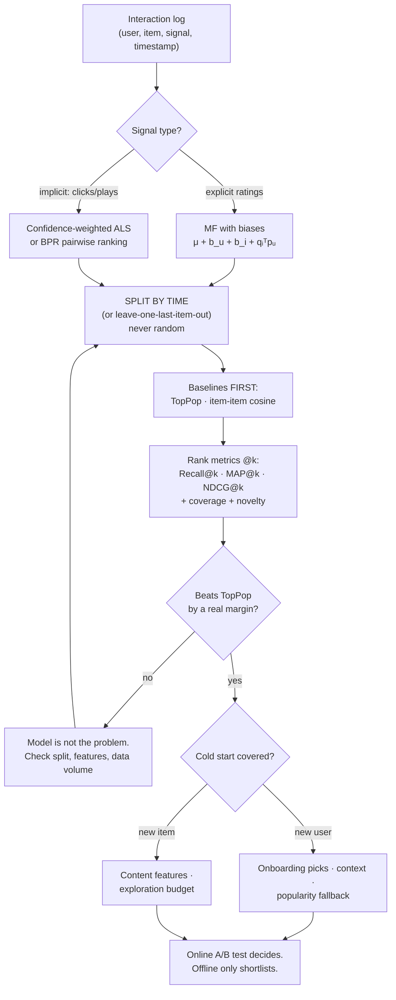

# Recommender Systems Coach

Recommendation is a **ranking** problem measured under a **temporal** split against a **popularity**
baseline — and almost every disappointing recommender got one of those three wrong. Follows the
measure-honestly and source-discipline rules in [`AGENTS.md`](../../../AGENTS.md).

## When to use

- There is an interaction log (views, plays, purchases, clicks) and someone wants "recommendations".
- Offline metrics look excellent and the A/B test is flat or negative.
- The team is optimising RMSE on ratings while the product shows a top-10 list.
- New users or new items get nothing useful and nobody has written down a cold-start policy.
- A deep model is being proposed before anyone has run `TopPop`.
- **Don't use it for** search with an explicit query (that is
  [hybrid-search-reranking-coach](../hybrid-search-reranking-coach/SKILL.md)), for causal uplift ("would
  they have bought anyway?" — that needs [ab-test-designer](../ab-test-designer/SKILL.md)), or as the
  decision-maker for the online test: offline metrics *shortlist*, online experiments *decide*.

## First principles: the matrix, the signal, and the metric

**The object is a sparse user–item matrix.** Densities of 0.1–5% are normal, so the modelling question is
always "how do I generalise across the 95%+ that is missing?"

- **Content-based**: score $\text{sim}(\text{profile}(u), \text{features}(i))$. Handles new items on day
  one, but cannot surprise anyone — it recommends more of what you already consumed.
- **Neighbourhood CF**: item–item cosine on co-occurrence. Simple, explainable ("because you watched X"),
  and a genuinely strong baseline.
- **Matrix factorisation**: learn $d$-dimensional latent vectors, predicting
  $\hat r_{ui} = \mu + b_u + b_i + q_i^\top p_u$ (Koren, Bell & Volinsky, *Matrix Factorization Techniques
  for Recommender Systems*, IEEE Computer 42(8), 2009-08). The bias terms $\mu, b_u, b_i$ typically explain
  more variance than the latent factors — never drop them.

**Implicit feedback is not a rating.** A play count is not a score out of five, and a *non*-interaction is
not a negative — it is ambiguous (unseen, or seen and rejected). Hu, Koren & Volinsky
(*Collaborative Filtering for Implicit Feedback Datasets*, ICDM 2008) split the signal in two: a binary
**preference** and a **confidence** in it,

$$p_{ui}=\mathbb{1}[r_{ui}>0],\qquad c_{ui}=1+\alpha r_{ui},\qquad
\min_{x,y}\sum_{u,i} c_{ui}\big(p_{ui}-x_u^\top y_i\big)^2+\lambda\big(\|x_u\|^2+\|y_i\|^2\big)$$

Every $(u,i)$ pair enters the sum — including the zeros, at low confidence. That is the whole idea:
missing means "probably not, weakly". BPR (Rendle et al., UAI 2009, arXiv:1205.2618) attacks the same
problem from the ranking side, optimising $P(i \succ j \mid u)$ over observed-vs-unobserved pairs.

**The metric must be rank-aware.** Users see a top-$k$ list, so an error at position 1 costs more than one
at position 20. Discounted cumulative gain (Järvelin & Kekäläinen, ACM TOIS 20(4), 2002) encodes exactly
that, and normalising by the ideal ordering makes it comparable across users:

$$\mathrm{DCG@}k=\sum_{i=1}^{k}\frac{rel_i}{\log_2(i+1)},\qquad
\mathrm{NDCG@}k=\frac{\mathrm{DCG@}k}{\mathrm{IDCG@}k}$$


*Caption: three gates — temporal split, popularity baseline, online test — stand between a model and a claim.*

| Approach | Cold start (user / item) | Explainable? | Scales to | Main weakness |
| --- | --- | --- | --- | --- |
| **Popularity (TopPop)** | ✓ / ✓ | trivially | anything | no personalisation — yet often hard to beat on Recall@k |
| **Content-based** | ✗ / ✓ | ✓ ("similar to X") | large catalogues | filter bubble; needs good item features |
| **Item–item CF** | ✗ / ✗ | ✓ ("because you watched X") | millions with sparsification | popularity bias; recomputation cost |
| **MF / ALS (implicit)** | ✗ / ✗ | ✗ (latent) | very large, parallel | needs retraining for new entities |
| **BPR / learning-to-rank** | ✗ / ✗ | ✗ | large | negative sampling choices dominate results |
| **Hybrid (content + CF)** | ✓ / ✓ | partly | large | more moving parts, more ways to leak |

⚠ **Two findings that should change your default plan.** Dacrema, Cremonesi & Jannach (*Are We Really
Making Much Progress?*, RecSys 2019, arXiv:1907.06902, 2019-07-16) could reproduce only 7 of 18 published
neural recommenders, and **6 of those 7 were outperformed by simple, well-tuned heuristics**. And Krichene
& Rendle (*On Sampled Metrics for Item Recommendation*, KDD 2020) showed that evaluating against a small
sample of negatives — the widespread "1 positive vs 100 random negatives" protocol — is **inconsistent**:
it can rank algorithms in the wrong order relative to full-catalogue evaluation. Rank against the full
candidate set, or report the sampling protocol as a caveat on every number.

## Procedure

1. **Write the decision the recommender serves.** Top-10 homepage rail? one push notification? a
   next-item autoplay? $k$, the candidate pool, and therefore the metric all follow from that sentence.
2. **Profile the data before modelling.** Users, items, interactions, density
   $= \frac{|\text{interactions}|}{|U|\cdot|I|}$, interactions-per-user distribution (it is a power law —
   plot it), catalogue coverage, and the time span. A recommender for a catalogue where 5% of items own 80%
   of plays is mostly a popularity-bias management problem.
3. **Split by time, not at random.** Train on $[t_0, t_1)$, evaluate on $[t_1, t_2)$; or hold out each
   user's **last** interaction. A random split lets the model see a user's future and is the single most
   common reason offline results do not reproduce online.
4. **Build `TopPop` first** — the most popular items in the training window, recommended to everyone. It
   costs five lines and it is the number every later model must beat. Add item–item cosine as a second floor.
5. **Model the feedback you actually have.** Implicit → confidence-weighted ALS (`implicit` library) or BPR;
   explicit ratings → MF with bias terms. Do not binarise ratings without saying why, and do not treat
   dwell-time as a rating.
6. **Evaluate with rank metrics at the real $k$**: Recall@k (did we find it?), MAP@k (how early?), NDCG@k
   (graded relevance, position-discounted). Report **coverage** (fraction of catalogue ever recommended) and
   **novelty** next to them — a recommender that hits Recall@10 by showing everyone the same 20 items has
   optimised the metric and not the product.
7. **Hunt leakage explicitly.** Assert that every evaluated interaction's timestamp is later than every
   training timestamp for that user; assert that already-consumed items are filtered out of the candidate
   list (recommending a film someone just watched inflates every metric); assert item/user features were
   computed from the training window only.
8. **Write the cold-start policy down as rules.** New user → onboarding picks, context (locale, device,
   referrer), popularity fallback. New item → content features plus an explicit exploration budget, because
   an item that is never shown can never earn interactions — the feedback loop is self-reinforcing.
9. **Ship behind an experiment.** Offline metrics select candidates; an online test with a guardrail metric
   (revenue, retention, complaint rate) decides. Design it with
   [ab-test-designer](../ab-test-designer/SKILL.md).
10. **Monitor drift and the feedback loop after launch.** Today's recommendations are tomorrow's training
    data, so popularity bias compounds. Track coverage and the long-tail share over time with
    [model-monitoring-coach](../model-monitoring-coach/SKILL.md). Close with the **Learning Footer**.

## Output shape

```
Decision served: <top-k rail | 1 push | autoplay>   k=<..>   candidate pool=<full catalogue | filtered>
Data: users=<..> items=<..> interactions=<..> density=<..>% span=<t0..t2>
Signal: <explicit ratings | implicit clicks/plays>   confidence: c=1+α·r with α=<..>
Split: <temporal at t1 | leave-last-out>            leakage assertions: <all pass>

| model                | Recall@k | MAP@k | NDCG@k | coverage | novelty | train time |
|----------------------|----------|-------|--------|----------|---------|------------|
| TopPop (baseline)    | <..>     | <..>  | <..>   | <..>     | <..>    | <..>       |
| item-item cosine     | <..>     | <..>  | <..>   | <..>     | <..>    | <..>       |
| ALS (implicit)       | <..>     | <..>  | <..>   | <..>     | <..>    | <..>       |
| <candidate>          | <..>     | <..>  | <..>   | <..>     | <..>    | <..>       |

Lift over TopPop: NDCG@k <+x%>   ← if this is not clearly positive, stop and fix data/split
Evaluation protocol: full-catalogue ranking ✓ (or: sampled negatives n=<..> — INCONSISTENT, see Krichene 2020)
Already-consumed items filtered from candidates ✓
Cold start: new user -> <policy>   new item -> <policy + exploration budget>
Popularity bias: top-1% of items = <..>% of recommendations (train: <..>%)
Online plan: metric=<..> guardrail=<..> MDE=<..> duration=<..>
Next: <ab-test-designer | model-monitoring-coach | feature-engineering-coach>
Learning Footer
```

## Worked example — implement the ranking metrics, then verify them by hand

Free, offline, no dataset download: `pip install numpy`. The point is that you should be able to compute
NDCG on paper, because a metric you cannot verify is a metric you cannot debug.

```python
# rank_metrics.py
import numpy as np

def dcg(rels):
    rels = np.asarray(rels, dtype=float)
    discounts = np.log2(np.arange(2, len(rels) + 2))   # positions 1..n -> log2(2), log2(3), ...
    return float((rels / discounts).sum())

def ndcg_at_k(ranked_rels, n_relevant, k):
    ideal = [1.0] * min(n_relevant, k) + [0.0] * max(0, k - min(n_relevant, k))
    denom = dcg(ideal)
    return dcg(ranked_rels[:k]) / denom if denom > 0 else 0.0

def ap_at_k(ranked_rels, n_relevant, k):
    hits, total = 0, 0.0
    for pos, rel in enumerate(ranked_rels[:k], start=1):
        if rel:
            hits += 1
            total += hits / pos                       # precision@pos, counted only at hits
    return total / min(n_relevant, k) if n_relevant else 0.0

def recall_at_k(ranked_rels, n_relevant, k):
    return sum(ranked_rels[:k]) / n_relevant if n_relevant else 0.0

ranked, n_rel, k = [1, 0, 1], 2, 3
print("NDCG@3  ", round(ndcg_at_k(ranked, n_rel, k), 4))    # 0.9197
print("MAP@3   ", round(ap_at_k(ranked, n_rel, k), 4))      # 0.8333
print("Recall@3", round(recall_at_k(ranked, n_rel, k), 4))  # 1.0
```

**Trace every number.** The list is `[1, 0, 1]` — relevant at positions 1 and 3, two relevant items exist.

- $\mathrm{DCG@}3 = \frac{1}{\log_2 2} + \frac{0}{\log_2 3} + \frac{1}{\log_2 4} = 1 + 0 + 0.5 = 1.5$
- Ideal ordering is $[1,1,0]$, so
  $\mathrm{IDCG@}3 = \frac{1}{\log_2 2} + \frac{1}{\log_2 3} = 1 + \frac{1}{1.58496} = 1.63093$
- $\mathrm{NDCG@}3 = 1.5 / 1.63093 = \mathbf{0.9197}$
- $\mathrm{AP@}3$: hit at position 1 → $1/1 = 1.0$; hit at position 3 → $2/3 = 0.6667$; sum $1.6667$ divided
  by $\min(2,3)=2$ → $\mathbf{0.8333}$
- $\mathrm{Recall@}3 = 2/2 = \mathbf{1.0}$

Notice what each metric does and does not see: Recall@3 is a perfect 1.0 even though a relevant item sat in
last place, while NDCG (0.92) and MAP (0.83) both charge you for that. If your product shows three items,
Recall is the wrong headline metric.

Two implementation details that are quietly wrong in a lot of blog code: the AP denominator must be
$\min(\text{n\_relevant}, k)$, not $k$ and not `hits` — using $k$ makes AP unbeatable-by-construction when
a user has fewer than $k$ relevant items, and using `hits` turns AP into mean precision-at-hits, which is a
different quantity. And `ideal` must be truncated at $k$, otherwise IDCG is computed over a longer list than
DCG and NDCG can never reach 1.0.

Now the baseline that decides whether any of this was worth doing:

```python
from collections import Counter

def toppop(train_interactions, k):
    counts = Counter(item for _, item in train_interactions)
    return [i for i, _ in counts.most_common(k)]

def evaluate(recommend_fn, test_by_user, seen_by_user, k=10):
    scores = []
    for user, held_out in test_by_user.items():
        recs = [i for i in recommend_fn(user) if i not in seen_by_user.get(user, set())][:k]
        rels = [1 if i in held_out else 0 for i in recs]          # graded relevance would go here
        scores.append(ndcg_at_k(rels, len(held_out), k))
    return float(np.mean(scores))
```

The `if i not in seen_by_user` filter is not cosmetic. Leave it out and a model that simply re-recommends
each user's training history will post spectacular offline numbers and be useless in production — the single
most common way a recommender "beats the baseline" without recommending anything. Run `evaluate(toppop_fn,
…)` first, write the number on the wall, and require every subsequent model to beat it by a margin larger
than the run-to-run variance.

## Tips

- **Beat `TopPop` or go home.** It takes five minutes to implement and it eliminates most premature deep
  learning. Report it in every table, forever.
- Split by time. A random split leaks the future into the past, and it is why offline gains evaporate online.
- Filter already-consumed items out of the candidate list before scoring — otherwise you are measuring
  memorisation.
- RMSE on ratings answers a question nobody asked; users see a ranked list, so measure NDCG/MAP/Recall at
  the $k$ the interface actually renders.
- Report coverage and long-tail share alongside accuracy; a recommender that shows everyone the same 20
  items can win Recall@10 while destroying catalogue value.
- Sampled-negative evaluation can invert the ranking of algorithms (Krichene & Rendle, KDD 2020) — rank
  against the full catalogue when you can, and label the protocol when you cannot.
- Cold start is a **policy**, not a model bug: write the new-user and new-item rules explicitly, and fund an
  exploration budget or new items will never accumulate the signal they need.
- Offline metrics shortlist; the online experiment decides. Related:
  [ab-test-designer](../ab-test-designer/SKILL.md),
  [hybrid-search-reranking-coach](../hybrid-search-reranking-coach/SKILL.md) for the ranking machinery,
  [embeddings-explainer](../embeddings-explainer/SKILL.md) for item vectors,
  [feature-engineering-coach](../feature-engineering-coach/SKILL.md) for content features,
  [imbalanced-data-coach](../imbalanced-data-coach/SKILL.md) for the extreme skew in click data, and
  [model-monitoring-coach](../model-monitoring-coach/SKILL.md) for the feedback loop after launch.
  End with the **Learning Footer** (`AGENTS.md`).
