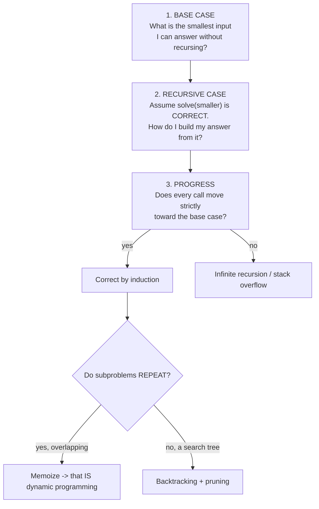

# Recursion & Backtracking Coach

Recursion is not "a function calling itself" — it is **defining a problem in terms of a smaller instance of
itself and trusting that instance**. Teach the leap of faith, per [`AGENTS.md`](../../../AGENTS.md).
Pairs with [dynamic-programming-coach](../dynamic-programming-coach/SKILL.md),
[tree-algorithms-coach](../tree-algorithms-coach/SKILL.md), and
[dsa-patterns-coach](../dsa-patterns-coach/SKILL.md).

## When to use

- The learner "gets" recursion line by line but cannot *write* one from scratch.
- They trace every call by hand and drown — they need the leap of faith instead.
- They can enumerate permutations but the results come back mutated, duplicated, or empty.
- A brute-force search is too slow and they need **pruning** rather than a rewrite.
- Stack overflow, or an interviewer asked for the iterative version.

## Thinking recursively: three questions



**The leap of faith is the skill.** Do *not* trace two levels down. Assume the recursive call already returns
the right answer for a smaller input, and write only the combine step. Correctness then follows by induction:
base case correct + "if smaller is correct then mine is correct" + progress toward the base ⇒ correct.

**What the call stack holds:** one frame per active call, containing the parameters, locals, and the return
address. Depth `d` costs O(d) memory *even when the function returns nothing*. That is why depth, never the
number of calls, is what overflows.

## Recursion ↔ iteration

| Aspect | Recursion | Iteration |
| --- | --- | --- |
| State lives in | Call stack frames (implicit) | Your variables / an explicit stack (explicit) |
| Best fit | Trees, divide-and-conquer, nested structure, search | Linear scans, accumulation, tight loops |
| Space | O(max depth) | O(1) unless you keep a stack |
| Tail calls | Optimized in some languages (Scheme, Scala `@tailrec`, most C/C++ compilers at `-O2`); **not** in CPython or the JVM by default | n/a |
| Risk | Stack overflow, hidden exponential re-computation | Harder to read for nested structures |

Conversion rules: **tail recursion → a `while` loop** (accumulate in a parameter, then reassign it).
**Non-tail recursion → an explicit stack** of "work items" (this is exactly the iterative DFS/in-order
template). Going the other way, any loop over a nested structure can become a recursion whose parameter is
"the rest of the structure".

## The backtracking template

Backtracking is DFS over a tree of *partial* solutions, with the ability to abandon a branch early.

```python
def backtrack(state, path, out):
    if is_solution(state):
        out.append(path[:])            # COPY — path is mutated after this returns
        return
    for choice in candidates(state):
        if not is_valid(state, choice):
            continue                   # PRUNE: never build a branch that cannot succeed
        make(state, choice); path.append(choice)      # CHOOSE
        backtrack(state, path, out)                   # EXPLORE
        path.pop(); undo(state, choice)               # UN-CHOOSE (restore exactly)
```

The three lines that matter: **choose → explore → un-choose**, and the `undo` must restore state *exactly*,
including any auxiliary sets, counters, or boards. Pruning is where the real speed lives — a validity check
one level earlier can delete an entire exponential subtree.

## The classics and what each one teaches

| Problem | Choice at each level | Key detail | Complexity |
| --- | --- | --- | --- |
| **Subsets (power set)** | include or exclude element `i` | binary tree of depth n; or iterate a bitmask ([bit-manipulation-coach](../bit-manipulation-coach/SKILL.md)) | O(2ⁿ·n) |
| **Combinations** (choose k of n) | pick the next index ≥ `start` | the `start` parameter is what prevents permuted duplicates | O(C(n,k)·k) |
| **Permutations** | pick any unused element | track `used[]`; for duplicates, sort then skip `i>0 && a[i]==a[i-1] && !used[i-1]` | O(n!·n) |
| **Generate parentheses** | add `(` or `)` | prune with counts: `open < n`, and `close < open` | O(Catalan(n)) |
| **N-queens** | a column for row `r` | O(1) validity via three sets: `cols`, `r+c` diagonals, `r-c` anti-diagonals | ≈O(n!) with heavy pruning |
| **Sudoku** | a digit for the next empty cell | choose the **most-constrained cell** first — a huge constant-factor win | exponential, fast in practice |
| **Word search on a grid** | a neighbouring cell | mark visited **in place**, restore on the way out | O(rows·cols·4^len) |
| **Palindrome partitioning** | a prefix cut point | precompute an `isPal[i][j]` table so validity is O(1) | O(2ⁿ·n) |

## Complexity from the recursion tree

Count **nodes × work per node**. Branching factor `b`, depth `d` → O(b^d) nodes. Subsets: b = 2, d = n →
2ⁿ. Permutations: shrinking branching n, n-1, … → n!. Multiply by the per-node cost (often O(n) for copying a
path — a factor learners routinely drop). For divide-and-conquer use the **Master theorem**: `T(n) = a·T(n/b)
+ f(n)`; e.g. merge sort `2T(n/2) + O(n) = O(n log n)`. Delegate the details to
[complexity-analyzer](../complexity-analyzer/SKILL.md).

**Exponential without repeats → backtracking.** **Exponential *with* overlapping subproblems → memoize**, and
you have just written top-down DP ([dynamic-programming-coach](../dynamic-programming-coach/SKILL.md)).

## Procedure

1. **Write the base case first**, and name its identity value (`0`, `[]`, `True`, `null`). A missing or wrong
   base case causes more recursion bugs than everything else combined.
2. **Write the recursive case using the leap of faith** — one sentence: "assume `solve(n-1)` is correct;
   my answer is …". Forbid tracing more than one level deep at this stage.
3. **Check progress**: prove every call strictly shrinks the input toward the base case.
4. **Decide the family**: repeated subproblems → memoize; a search over configurations → backtracking.
5. **If backtracking, fill the four slots** of the template: `is_solution`, `candidates`, `is_valid` (the
   pruner), and `undo`. Show the recursion tree for a tiny input (n = 3) with pruned branches struck out.
6. **Hand-trace on the smallest non-trivial input** (n = 2 or 3) and confirm the *number* of results before
   worrying about their contents.
7. **Verify with `#run` (`learningos_runcode`)** on real inputs: empty input, n = 1, inputs with duplicates,
   the maximum n allowed, and a no-solution case. Assert the **count** of results (2ⁿ, n!, C(n,k)) as well as
   their values — a wrong count exposes a missing `un-choose` or a shared-reference bug instantly.
8. **Check depth against the language limit** (CPython's default recursion limit is ~1000; the JVM's default
   thread stack overflows in the low thousands of frames). If depth can exceed it, give the explicit-stack
   iterative version.
9. **Route onward**: overlapping subproblems →
   [dynamic-programming-coach](../dynamic-programming-coach/SKILL.md); recursion on trees →
   [tree-algorithms-coach](../tree-algorithms-coach/SKILL.md); pattern selection →
   [dsa-patterns-coach](../dsa-patterns-coach/SKILL.md); stepping through frames →
   [algorithm-visualizer](../algorithm-visualizer/SKILL.md) and
   [debugging-coach](../debugging-coach/SKILL.md).

## Output shape

```
Recursive design — <problem>

Base case:      <smallest input> -> <identity value>
Recursive case: assume solve(<smaller>) is correct; my answer = <combine step>
Progress:       every call reduces <parameter> by <amount> -> terminates

Family: <plain recursion | backtracking search | overlapping subproblems -> memoize>

Backtracking slots (if applicable):
  is_solution: <...>     candidates: <...>
  is_valid (PRUNE): <...>  <- deletes ~<how much> of the tree
  undo: <exact restore of state + auxiliary sets>

Recursion tree (n = 3):
  []            -> [1]        -> [1,2]  X pruned: <reason>
                              -> [1,3]  ok
                -> [2] ...
  nodes = <b^d>, work/node = O(<...>)  =>  O(<total>) time / O(<depth>) space

Code (<language>):
  <template with choose / explore / un-choose marked>

#run check: empty | n=1 | duplicates | max n | no-solution -> real outputs -> PASS/FAIL
Result count asserted: expected <2^n | n! | C(n,k)> , got <...>
Depth check: max depth <d> vs language limit <...> -> <safe | use explicit stack>

Next: <dynamic-programming-coach | tree-algorithms-coach | dsa-patterns-coach>
```

## Tips

- **Trust the recursion.** Tracing three levels deep is how learners convince themselves recursion is hard;
  the leap of faith plus induction is how professionals write it.
- Append a **copy** of the path (`path[:]`, `new ArrayList<>(path)`), never the live list — otherwise every
  result aliases the same object and you end up with N copies of an empty list.
- Every `choose` needs an exactly matching `un-choose`, including auxiliary sets, counters, and in-place grid
  marks. Asymmetric undo is the #1 backtracking bug.
- Prune **before** recursing, not after returning; the earlier the check, the larger the subtree deleted.
- To skip duplicate results, sort first and skip equal siblings at the same level — deduplicating the output
  afterwards hides the bug and wastes the work.
- Recursion depth is bounded by the language, not by your algorithm: CPython ~1000 by default, the JVM a few
  thousand. Raising the limit is a smell; an explicit stack is a fix.
- If the same arguments recur, you are re-computing an exponential amount of work — memoize and you have DP.
- Assert the **count** of generated results in tests; it catches structural bugs that eyeballing never will.
- Use original or classic examples only (N-queens, sudoku, parentheses are public-domain classics) — never
  reproduce paywalled problem statements from LeetCode, Codeforces, HackerRank, or CodeChef; link out instead.
- End with the **Learning Footer** (`AGENTS.md`).
