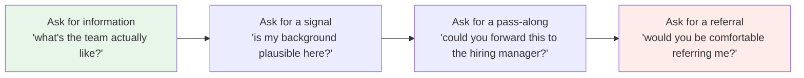

# Referral Outreach Coach

A referral is someone spending **their** credibility on you. This skill helps you earn that, ask for it in a
way that is easy to refuse, and keep your integrity either way — in the be-honest spirit of
[`AGENTS.md`](../../../AGENTS.md).

## When to use

- You found a role you genuinely fit and want a warm path in rather than the general applicant pile.
- You have a dormant contact at a company and don't know how to reopen the conversation without being crass.
- You have sent 40 LinkedIn messages and received zero replies, and want to know what's wrong (usually:
  length, vagueness, and asking a stranger for a *referral* when you should have asked for *information*).
- Someone declined or went silent and you need to respond well rather than not at all.
- **Don't use it for** fabricating a shared background, scraping personal contact details, mass-blasting
  identical messages, pressuring anyone after a "no", or asking someone to vouch for skills you don't have.
  A referral obtained dishonestly damages the referrer, and it is *their* reputation you are borrowing.

## First principles

**1. Weak ties do the work.** Granovetter, *The Strength of Weak Ties* (*American Journal of Sociology*,
**1973**) found job information flows disproportionately through acquaintances, not close friends — close
contacts mostly know what you already know. A large randomised test on LinkedIn (Rajkumar, Saint-Jacques,
Bojinov, Brynjolfsson & Aral, *A causal test of the strength of weak ties*, **Science, September 2022**)
found causal evidence that **moderately weak** ties were most effective for job mobility, and that the very
weakest and the strongest ties were less so. Practical translation: your best referrer is usually a former
colleague, a bootcamp/university acquaintance, or an open-source collaborator — not your best friend, and
not a total stranger.

**2. The referrer is taking a risk.** Most referral programmes attach the referrer's name (and often a
bonus) to your outcome. If you interview badly or misrepresent yourself, it costs them. Therefore: never ask
someone to refer you for a role you have not read, and always give them enough evidence to decide.
⚠ Referral bonus amounts, eligibility windows and whether referrals bypass screening are **company-specific
and change often** — check the company's current careers page or ask the contact rather than assuming.

**3. Make it cheap to say yes and cheap to say no.** The single biggest lever is *reducing the recipient's
effort*: one specific role, one link, one paragraph of evidence, an explicit "a 'no' or no reply is
completely fine." Giving a graceful exit measurably raises reply rates because it removes the social cost of
declining.

**4. Ask for the smallest thing that helps.** There is a ladder, and most people jump to the top rung:



*Figure 1 — The ask ladder. Cost to the other person rises left → right. With a stranger, start at the left; with a former colleague who knows your work, D is fine immediately.*

| Relationship | Reasonable opening ask | Why |
| --- | --- | --- |
| Worked with you directly | **Referral** (rung D) | they can vouch from evidence |
| Same company, never worked together | pass-along (C) or a 15-min chat (A) | they can't yet vouch |
| Acquaintance (community, OSS, alumni) | information (A) → then B/C | build the basis first |
| Complete stranger | information only (A) | asking D cold puts them in an unfair position |
| Recruiter at the company | direct application + a short pitch | referral isn't theirs to give |

## Procedure

1. **Qualify the role first.** Read the JD, note the 3 requirements you meet with evidence and the 1–2 you
   don't. If you can't do that, you're not ready to ask — and the honesty will show.
2. **Build the contact list from real ties**: former colleagues, alumni, OSS collaborators, conference/meetup
   people, and anyone who has publicly written about that team. Rank by *how well they can speak to your
   work*, not by seniority.
3. **Choose your rung on the ask ladder** using the table. When in doubt, go one rung lower — it converts
   better than the bolder ask.
4. **Write a message that fits on a phone screen**: how you know them (truthfully), the specific role + link,
   two or three lines of concrete evidence, the explicit ask, and an explicit easy out. 120 words is plenty.
5. **Attach the evidence, not the adjectives.** "Cut p95 checkout latency 40%→12% by replacing N+1 queries"
   beats "passionate, results-driven". Tailor the CV first
   ([resume-tailor](../resume-tailor/SKILL.md), [linkedin-optimizer](../linkedin-optimizer/SKILL.md)).
6. **Send individually.** No BCC, no template that still contains `{{company}}`, no identical paragraph to
   six people at the same company on the same day — they talk to each other.
7. **Follow up at most twice, then stop.** One nudge after ~5–7 business days, one final "closing the loop"
   after ~2 more weeks, then leave it. Silence is an answer; treating it as a challenge is how you become
   the story people tell.
8. **Make it easy on the referrer once they agree**: send a 3-bullet blurb they can paste, your CV, the
   requisition ID, and the exact name you applied under. Then get out of their way.
9. **Close every loop.** Thank them the day they refer you, tell them the outcome either way, and offer
   something back. This is what turns one referral into a network
   ([email-writing-coach](../email-writing-coach/SKILL.md)).
10. **Handle "no" in one short, warm reply** with no counter-argument — then close with the
    **Learning Footer**.

## Output shape

```
Target: <role> @ <company>   ·   Req/link: <url>   ·   Applied: <yes/no + date>
Fit evidence (3): <1> · <2> · <3>        Honest gaps (1–2): <...>

Contacts (ranked by ability to vouch, not seniority)
  1. <name> — tie: <ex-colleague|alumni|OSS|community> · strength: <moderate-weak|strong>
     ask rung: <A info | B signal | C pass-along | D referral>   channel: <LinkedIn|email>
     personal hook (true): <...>

Message (<= 120 words, sent individually):
  <the actual text — includes: how we're connected · the specific role · 2–3 lines of evidence ·
   the explicit ask · an explicit easy out>

Cadence: send <date> → nudge <+5–7 business days> → close-the-loop note <+2 weeks> → stop
If yes: send within 24h — 3-bullet blurb + CV + req ID + name I applied under
If no / silence: <one warm line, no counter-argument, no follow-up>
Ethics check: connection real? <y> · evidence accurate? <y> · easy out given? <y> · individually sent? <y>
Reciprocity: <what I can offer back>
Next: <resume-tailor | linkedin-optimizer | coding-interview-drill>
Learning Footer
```

## Worked example — one weak tie, three drafts

**Situation.** You want a Senior Backend Engineer role at Acme. Priya was a QA engineer on an adjacent team
at your previous employer three years ago; you shipped one project together. That is a **moderately weak
tie** — exactly the profile the 2022 *Science* study found most useful.

**Draft 1 (what most people send — don't):**

> Hi Priya, hope you're doing well! I'm looking for new opportunities and saw Acme is hiring. I'm a
> passionate backend engineer with 6 years of experience. Could you refer me? I've attached my CV. Any help
> would be appreciated!!

Why it fails: no specific role (she must go find one), no evidence she can repeat to a hiring manager, no
easy out, and "any help" makes the work *hers*.

**Draft 2 (the message to send — 105 words):**

> Hi Priya — we overlapped on the Atlas migration at Contoso in 2023; you caught the replication bug that
> saved that launch.
>
> I'm applying for Senior Backend Engineer at Acme (req 4821, link below) and wanted to ask you directly
> rather than go through the pile.
>
> Closest evidence: I led the Contoso payments rewrite (Go + Postgres, 4→40 deploys/week), cut checkout p95
> from 840 ms to 190 ms, and ran the on-call rotation for it. I'm light on Kubernetes operations, which the
> JD lists — happy to say so in the interview.
>
> If you'd be comfortable referring me, I'll send a paste-ready blurb. If not, genuinely no problem — a "no"
> or no reply is completely fine.

Why it works: one true shared memory, one specific req, three quantified claims, a **volunteered gap**
(which is what makes the other three claims believable), and two escape hatches.

**Draft 3 (the nudge, +6 business days — 30 words):**

> Hi Priya, just floating this once in case it got buried — no need to reply if it's not a fit. Either way,
> good to see the Atlas work still gets cited!

Then stop. If she declines: *"Completely understood — thanks for reading it. If you ever want a second pair
of eyes on anything Go/Postgres, I'm around."* No counter-argument, no "would you at least…". The
relationship is worth more than this application, and behaving as if it is, is also the strategy that works.

## Tips

- **Cold "please refer me" to a stranger is the lowest-yield message in job search.** Ask for information
  first; the referral often follows unprompted.
- One specific requisition beats "any openings". You are asking them to do zero searching.
- Volunteer one honest gap. It costs nothing and it is the reason the rest of your claims get believed.
- Always give an explicit easy out. It raises replies *and* it's the decent thing to do.
- Two follow-ups maximum, then stop. Persistence past that is remembered — badly.
- Never imply a closer relationship than you have; the referrer will be asked "how do you know them?"
- Close the loop with the outcome, good or bad, and offer something back. Referrals compound only if you do.
- Related: [linkedin-optimizer](../linkedin-optimizer/SKILL.md),
  [resume-tailor](../resume-tailor/SKILL.md),
  [job-search-strategy-coach](../job-search-strategy-coach/SKILL.md),
  [cover-letter](../cover-letter/SKILL.md),
  [email-writing-coach](../email-writing-coach/SKILL.md),
  [interview-debrief-coach](../interview-debrief-coach/SKILL.md),
  [salary-negotiation](../salary-negotiation/SKILL.md),
  [career-ladder](../career-ladder/SKILL.md).
  End with the **Learning Footer** (`AGENTS.md`).
