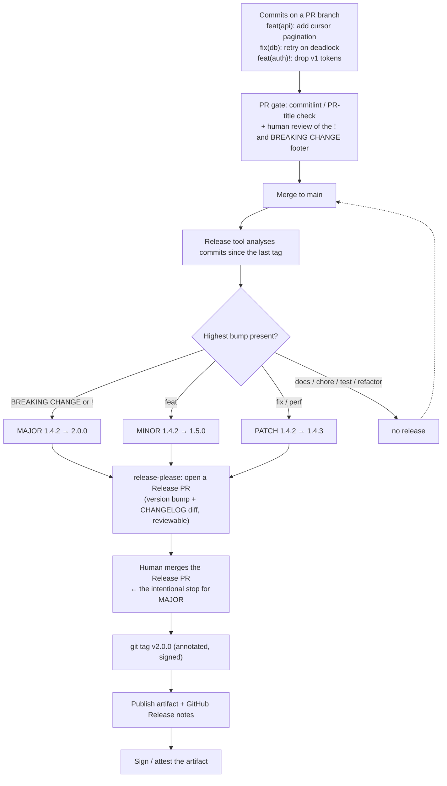

# Release & Versioning Coach

A version number is a **promise to your consumers about upgrade risk**. Get it right and upgrading is a
`^` range and a coffee; get it wrong and every bump becomes a manual audit. This skill makes the promise
explicit, then makes a machine keep it — teaching the trade-offs rather than the tool, per
[`AGENTS.md`](../../../AGENTS.md).

## When to use

- Versions are bumped by whoever remembers, and "is this breaking?" is decided in a PR comment.
- The changelog is `git log`, or a `CHANGELOG.md` last edited eleven months ago.
- Consumers pin exact versions because minor bumps have broken them before — the clearest sign the contract
  is not being honoured.
- A monorepo publishes six packages and every release bumps all six, so consumers cannot tell what changed.
- **Don't use it for** internal-only services deployed continuously from `main` with no external consumer —
  there, the git SHA plus a deployment record is a perfectly good "version", and SemVer is ceremony. Use
  [dora-metrics-coach](../dora-metrics-coach/SKILL.md) instead. Also don't use SemVer for calendar-driven
  products where consumers care about *when*, not *what broke*; CalVer is the honest choice there.

## First principles: the version encodes the consumer's risk

**Semantic Versioning 2.0.0** (semver.org, spec version 2.0.0 by Tom Preston-Werner) is a contract on
`MAJOR.MINOR.PATCH` given a **declared public API**:

- **MAJOR** — incompatible API changes.
- **MINOR** — functionality added, backwards-compatibly.
- **PATCH** — backwards-compatible bug fixes.

The clauses people forget, and which decide most real arguments:

| Rule | What it actually says | Consequence in practice |
| --- | --- | --- |
| **0.y.z** | "Anything MAY change at any time. The public API SHOULD NOT be considered stable." | `0.x` is not a promise. Ship `1.0.0` the day you have consumers, or say plainly that you make no promise. |
| **Pre-release** | `1.0.0-alpha.1` — a hyphen plus dot-separated identifiers; **lower precedence** than the release | `1.0.0-rc.1 < 1.0.0`. Use it for release candidates, not for "not finished yet, forever". |
| **Build metadata** | `1.0.0+20260809.abc123` — **ignored** in precedence | Two builds differing only in metadata are the *same version*. Never encode meaning there. |
| **Precedence** | compare numerically field by field; numeric identifiers < alphanumeric; a pre-release has lower precedence than its release | `1.0.0-alpha < 1.0.0-alpha.1 < 1.0.0-beta < 1.0.0` |
| **Immutability** | a released version's contents MUST NOT be modified | Never re-tag. Publish `1.2.4` instead — re-tagging breaks every cache and lockfile in the world. |
| **Public API must be declared** | SemVer only means something relative to a documented surface | Write down what is public. Undeclared surface makes every "breaking" argument unfalsifiable. |

**Conventional Commits 1.0.0** (conventionalcommits.org) turns commit messages into that decision
mechanically: `<type>[optional scope][!]: <description>`, with `fix:` → PATCH, `feat:` → MINOR, and either
a `BREAKING CHANGE:` footer or a `!` after the type/scope → MAJOR. This is the whole trick — the version is
*derived*, so nobody has to remember, and nobody can quietly under-classify a breaking change.

**Keep a Changelog 1.1.0** (keepachangelog.com) supplies the human half: entries grouped as **Added,
Changed, Deprecated, Removed, Fixed, Security**, newest first, written for people upgrading — not a dump
of commit subjects.



*Figure: the version is derived from commits, not decided in a meeting. The Release PR is the human
checkpoint — the place where a MAJOR bump is noticed **before** it is published.*

| Commit | Bump | Changelog section |
| --- | --- | --- |
| `fix(parser): handle empty input` | PATCH | Fixed |
| `feat(api): add cursor pagination` | MINOR | Added |
| `feat(auth)!: require OIDC` | **MAJOR** | Changed + a "Breaking" callout |
| `perf(db): index lookups` | PATCH (tool-configurable) | Changed |
| `refactor:` / `test:` / `chore:` / `ci:` / `docs:` | none | omitted (or Changed if user-visible) |
| `revert:` | usually PATCH | Fixed |

| Automation | Model | Best for | Trade-off |
| --- | --- | --- | --- |
| **release-please** (Google) | opens a **Release PR** you merge when ready | teams wanting a human gate, monorepos via a manifest | release is a two-step dance |
| **semantic-release** | publishes **immediately** on merge to a release branch | libraries with strong CI and high trust | an accidental `feat!:` ships a MAJOR with no pause |
| **Changesets** | contributors write an intent file per change | JS monorepos, many contributors | requires discipline in every PR |
| Manual + `git tag` | a human decides | rare releases, tiny surface | drifts within a quarter |

## Procedure

1. **Declare the public API surface in writing.** Exported functions? HTTP routes and response shapes? CLI
   flags? Config file keys? The database schema? SemVer is meaningless until this list exists — most
   "is it breaking?" arguments are really arguments about this document.
2. **Decide the scheme honestly**: SemVer (consumers integrate against an API), CalVer (time-based
   product), or "SHA + deploy record" (an internal service nobody imports). Write down *why*.
3. **Adopt Conventional Commits and enforce them at the gate**, not by hope. Either commitlint on commits,
   or — more practical with squash-merge — a PR-title check plus squash-merge using the PR title:
   ```bash
   npm i -D @commitlint/cli @commitlint/config-conventional
   echo "module.exports = {extends: ['@commitlint/config-conventional']}" > commitlint.config.js
   npx commitlint --from=HEAD~1 --to=HEAD --verbose
   ```
4. **Make breaking changes loud in review**: require both `!` and a `BREAKING CHANGE:` footer explaining
   *what breaks* and *what to do instead*. Add a PR checklist item. A silent MAJOR is the failure this
   whole system exists to prevent.
5. **Wire the automation.** With release-please, the tool proposes; you merge. Add the workflow, run it on
   `main`, and let it open the first Release PR — then read the generated changelog critically before
   merging.
6. **Bootstrap an existing repo**: tag the current state (`git tag -a v1.4.2 -m "baseline"`), push tags,
   and tell the tool that is the starting point (`.release-please-manifest.json`, or a
   `Release-As:` footer for a one-off correction).
7. **Write the changelog for upgraders, not for archaeologists.** Under each MAJOR, add a *Migration*
   subsection with before/after code. Auto-generated bullets are the skeleton; the migration note is the
   value.
8. **Publish a deprecation policy with real numbers**: how it is announced (changelog + runtime warning +
   docs), the minimum notice period (e.g. one MAJOR or 6 months, whichever is longer), and how long the old
   path keeps working. Deprecate in a MINOR; remove only in a MAJOR.
9. **Choose the monorepo model deliberately**: *independent* versions (each package versioned by its own
   commits — honest, more release PRs) or *fixed/locked* (everything moves together — simple, but every
   package inherits an unrelated MAJOR). Scope commits (`feat(api):`) so the tool can attribute changes.
10. **Make releases immutable and verifiable**: annotated, ideally signed tags (`git tag -s v2.0.0`), never
    re-tag, and attach provenance to the artifact
    ([supply-chain-attestation-lab](../supply-chain-attestation-lab/SKILL.md)).
11. **Rehearse a bad release**: publish a broken PATCH to a test registry, then practise the recovery —
    publish `x.y.z+1` (or deprecate/yank per your registry). Never mutate a published version.
12. **Review quarterly**: how many MAJORs did you ship, how many consumers were surprised, how long from
    merge to release? Then close with the **Learning Footer**.

## Output shape

```
Project: <name>          Scheme: <SemVer 2.0.0 | CalVer | SHA+deploy>       Current: <v1.4.2>
Public API (the thing versioned):
  - <exported symbols / HTTP routes / CLI flags / config keys / wire format>
  NOT public (may change any time): <internals, /internal, undocumented flags, DB schema>

Commit convention: Conventional Commits 1.0.0   enforced by: <commitlint | PR-title check> at <gate>
  fix → PATCH · feat → MINOR · `!` or BREAKING CHANGE footer → MAJOR
Automation: <release-please | semantic-release | changesets | manual>
  trigger: <push to main>   human gate: <Release PR merge | none>   tag format: <v${version}>

Changelog: <CHANGELOG.md, Keep a Changelog 1.1.0>  sections: Added/Changed/Deprecated/Removed/Fixed/Security
  Migration notes required for: <every MAJOR>

Breaking-change policy:
  announce: <changelog + runtime deprecation warning + docs banner>
  notice period: <≥ 1 MAJOR or 6 months, whichever is longer>
  deprecate in: <MINOR>    remove in: <next MAJOR>    supported versions: <current + N-1>
Pre-releases: <1.0.0-rc.N on branch <...>>   dist-tag/channel: <next|beta>

Monorepo: <independent | fixed>   packages: <list>   config: <release-please-config.json>
Release integrity: annotated tag=<✔> signed=<✔/✘> immutable (never re-tagged)=<✔> provenance=<✔/✘>

Last release: <v1.5.0>  derived from: <N feat, M fix, 0 breaking>  merge→publish: <N min>
Recovery rehearsed (bad release → publish x.y.z+1, never mutate): <✔>
Next: <changelog-writer | api-versioning-coach | ci-pipeline-builder>
Learning Footer
```

## Worked example — a library that must stop surprising its consumers

**The problem.** `acme-client` is at `0.14.3`, has forty internal consumers, and every `0.x` bump has
broken someone. Three decisions fix it.

**Decision 1 — declare the public API, then ship `1.0.0`.** `0.y.z` explicitly promises nothing, so
consumers pinning exact versions are behaving *correctly*; the fault is the version scheme, not them.

```markdown
## Public API (covered by SemVer)
- Everything exported from `src/index.ts`
- The `AcmeClient` constructor options object
- The shape of thrown `AcmeError` (`code`, `message`, `retryable`)
- CLI flags documented in `docs/cli.md`

## NOT public (may change in any release)
- Anything under `src/internal/`
- Log message text and log formats
- Timing/retry constants not exposed in options
```

**Decision 2 — commits that decide the version.** Compare a real pair:

```
# Under-classified — this is how a breaking change escapes as a MINOR:
feat: improve error handling

# Honest, and mechanically correct:
feat(errors)!: replace AcmeError.status with AcmeError.code

BREAKING CHANGE: `AcmeError.status` (number) is replaced by `AcmeError.code` (string enum).
Migration:
  before:  if (err.status === 429) retry()
  after:   if (err.code === 'RATE_LIMITED') retry()
`status` remains present but always `undefined` in 2.x and is removed in 3.0.0.
```

The second message alone produces the MAJOR bump, the changelog entry, **and** the migration note. That is
why the discipline pays for itself: one careful commit message replaces three artefacts.

**Decision 3 — automate, with a human checkpoint.** release-please opens a PR rather than publishing
straight away, which is what you want the first time a `feat!:` appears:

```yaml
name: release
on:
  push:
    branches: [main]

permissions:
  contents: write          # create tags, releases and the release branch
  pull-requests: write     # open/update the Release PR

jobs:
  release:
    runs-on: ubuntu-latest
    steps:
      - uses: googleapis/release-please-action@v4    # ← verify the current major on the action's repo
        id: release
        with:
          release-type: node

      # Everything below runs ONLY on the run where the Release PR was merged and a tag was created.
      - uses: actions/checkout@v4
        if: ${{ steps.release.outputs.release_created }}
      - uses: actions/setup-node@v4
        if: ${{ steps.release.outputs.release_created }}
        with:
          node-version: 20
          registry-url: https://registry.npmjs.org
      - run: npm ci && npm test
        if: ${{ steps.release.outputs.release_created }}
      - run: npm publish --provenance --access public
        if: ${{ steps.release.outputs.release_created }}
        env:
          NODE_AUTH_TOKEN: ${{ secrets.NPM_TOKEN }}
```

**Tracing this workflow so it actually behaves.** The action runs on **every** push to `main`; on most runs
it only creates or updates the Release PR, and `steps.release.outputs.release_created` is empty — which is
exactly why every publish step is guarded by that `if`. Without the guard you would attempt an `npm
publish` on each merge and fail noisily. `permissions` must include both `contents: write` (tag + release)
and `pull-requests: write` (the Release PR); missing the latter produces a confusing 403 with no PR. The
`--provenance` flag makes npm attach build provenance, which pairs with
[supply-chain-attestation-lab](../supply-chain-attestation-lab/SKILL.md).

**The changelog entry that results — and the part the tool cannot write:**

````markdown
## [2.0.0] - 2026-08-09

### ⚠ BREAKING CHANGES
* **errors:** `AcmeError.status` is replaced by `AcmeError.code`.

### Added
* **api:** cursor-based pagination on `list()` ([#412](...))

### Fixed
* **db:** retry on serialization failures ([#419](...))

### Migration from 1.x
```diff
- if (err.status === 429) await backoff();
+ if (err.code === 'RATE_LIMITED') await backoff();
```
`status` is still present in 2.x (always `undefined`) and will be **removed in 3.0.0**.
1.x receives security fixes until 2027-02-09 (6 months).
````

**Monorepo variant.** With `packages/api` and `packages/cli`, independent versioning keeps each package's
version meaningful — a MAJOR in `cli` should not force `api` consumers to audit anything:

```json
{
  "$schema": "https://raw.githubusercontent.com/googleapis/release-please/main/schemas/config.json",
  "separate-pull-requests": true,
  "packages": {
    "packages/api": { "release-type": "node", "package-name": "@acme/api" },
    "packages/cli": { "release-type": "node", "package-name": "@acme/cli" }
  }
}
```

```json
{ "packages/api": "1.4.2", "packages/cli": "0.9.1" }
```

The manifest file is the bootstrap: it tells the tool where each package's history starts, so it does not
try to derive a version from the beginning of time. Attribution then depends entirely on commit **scopes**
— `feat(api):` versus `feat(cli):` — which is the discipline monorepo versioning actually demands.

**Sanity-check the precedence rules you now depend on**, because release-candidate ordering trips people up:

```
1.0.0-alpha  <  1.0.0-alpha.1  <  1.0.0-alpha.beta  <  1.0.0-beta  <  1.0.0-rc.1  <  1.0.0
1.0.0+build.5  ==  1.0.0+build.9      # build metadata is IGNORED for precedence — same version
```

So a caret range `^1.0.0` in a consumer's manifest will **not** pick up `1.0.0-rc.1` by default, which is
precisely what you want from a release candidate.

## Tips

- **The version is a promise, not a label.** If a MINOR can break a consumer, the number is lying and the
  consumers will respond by pinning exact versions — which costs you every security patch.
- Ship `1.0.0` as soon as anyone depends on you. Sitting at `0.x` to "avoid commitment" just moves the cost
  onto consumers, who must treat every bump as potentially breaking.
- **Never re-tag or re-publish a version.** Immutability is what makes lockfiles, caches and mirrors work.
  Fix forward with `x.y.z+1` and, if the registry supports it, deprecate the bad release.
- Enforce the commit convention at the gate. With squash-merge, the **PR title** becomes the commit
  message, so check the title — checking individual commits and then squashing verifies the wrong string.
- Automated changelogs are a skeleton. The migration note under a MAJOR — before/after, in code — is the
  part consumers actually need, and no tool can generate it.
- Deprecate in a MINOR, remove in a MAJOR, and give a notice period with a *date* in it. A deprecation with
  no removal date is ignored; a removal with no deprecation is a betrayal.
- Language ecosystems add their own hard rules: Go requires a `/v2` module-path suffix for major versions
  ≥ 2, npm caret ranges skip pre-releases, and OCI tags are mutable by default. Verify your ecosystem's
  rules on its official docs rather than assuming SemVer covers them.
- Related: [changelog-writer](../changelog-writer/SKILL.md) for the prose,
  [api-versioning-coach](../api-versioning-coach/SKILL.md) for versioning HTTP/gRPC surfaces (where SemVer
  alone is not enough), [ci-pipeline-builder](../ci-pipeline-builder/SKILL.md) for the release job,
  [supply-chain-attestation-lab](../supply-chain-attestation-lab/SKILL.md) to sign what you publish,
  [adr-writer](../adr-writer/SKILL.md) to record the scheme decision,
  [technical-writing-coach](../technical-writing-coach/SKILL.md) for migration guides,
  [feature-flags-coach](../feature-flags-coach/SKILL.md) to decouple release from rollout, and
  [dora-metrics-coach](../dora-metrics-coach/SKILL.md) to check the process did not slow delivery.
  End with the **Learning Footer** (`AGENTS.md`).
