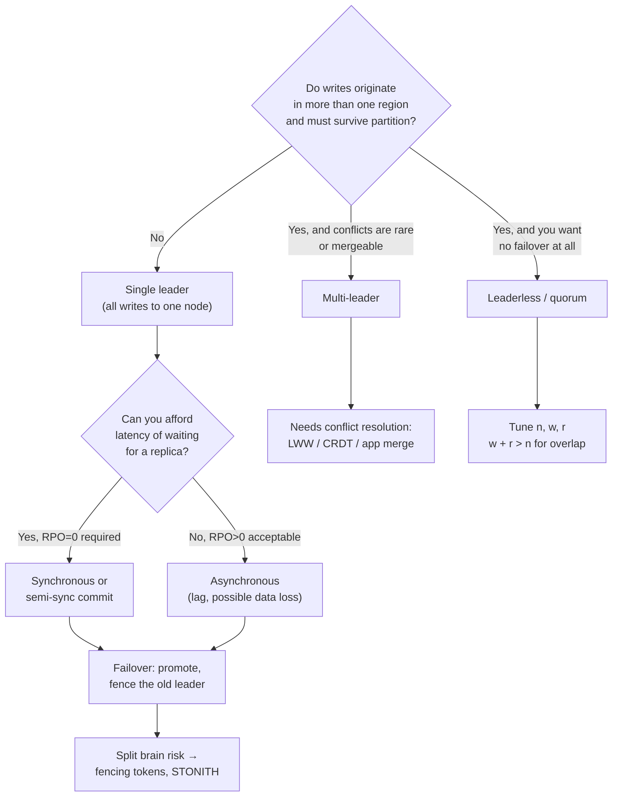

# Replication Topology Coach

Teach replication as a set of **explicit trade-offs between durability, latency and availability**, per
[`AGENTS.md`](../../../AGENTS.md). Every topology is "safe" until you name the failure it tolerates.
Pairs with [consistency-models-coach](../consistency-models-coach/SKILL.md) and
[sharding-strategy-coach](../sharding-strategy-coach/SKILL.md) — replication copies data, sharding
splits it, and most real systems do both.

## When to use

- Choosing between read replicas, active-active regions, or a Dynamo-style quorum store.
- A user "saved and then didn't see their change" — a classic replication-lag / read-your-writes bug.
- Planning failover and you need to reason about data loss (RPO) and downtime (RTO) honestly.
- Two writes to different leaders conflicted and someone is about to invent last-write-wins by accident.
- Preparing for a system-design interview question about multi-region writes.

## Mental model — first principles

Replication exists for three different reasons — **HA**, **read scale** and **locality** — and the
right topology depends on which one you actually need. Every replica is a copy that can be *behind*,
so the real design question is: *when a write is acknowledged, how many copies already have it?*



## Topology comparison

| Dimension | Single leader | Multi-leader | Leaderless (quorum) |
| --- | --- | --- | --- |
| Where writes go | One node | Any leader, per region | Any of `n` replicas (coordinator) |
| Write conflicts | Impossible by construction | **Expected** — must be resolved | Possible; resolved by version vectors / LWW |
| Read scaling | Replicas (stale) | Local leader (fresher locally) | Read from `r` replicas |
| Write latency | One region's RTT | Local RTT — best for geo writes | Slowest of `w` replicas |
| Failover | Required; risk of split brain | Region loss tolerated | **No failover concept** |
| Typical systems | PostgreSQL, MySQL, most RDBMS | Multi-region RDBMS, CouchDB | Cassandra, Riak (Dynamo lineage) |
| Hardest part | Failover correctness | Conflict semantics | Quorum tuning + repair |

**Commit modes (single-leader):**

| Mode | Ack when | RPO on leader loss | Latency cost | Example |
| --- | --- | --- | --- | --- |
| Asynchronous | Leader's WAL flushed | > 0 — lag window lost | None | PostgreSQL default `synchronous_commit = on` (local only) |
| Semi-synchronous | ≥ 1 replica *received* | ~0 if that replica survives | 1 network RTT | MySQL semisynchronous replication plugin |
| Synchronous | ≥ 1 replica *applied/flushed* | 0 for those replicas | 1 RTT + apply | PostgreSQL `synchronous_standby_names` + `synchronous_commit = remote_apply` |

Grounding: PostgreSQL documentation, "High Availability, Load Balancing, and Replication" (streaming
replication, `synchronous_commit` levels, `pg_stat_replication`); MySQL Reference Manual, "Replication"
(binary log, GTIDs, semisynchronous replication); Kleppmann, *Designing Data-Intensive Applications*
(2017), ch. 5 for the topology taxonomy and quorum arithmetic.

## Quorum arithmetic (leaderless)

With `n` replicas, `w` write acks and `r` read responses, **`w + r > n`** guarantees the read set
overlaps the write set, so at least one returned value is the newest. Common `n=3, w=2, r=2`.
Caveats: overlap does **not** give linearizability (sloppy quorums, concurrent writes and failed
writes still break it), so you still need read repair and anti-entropy.

## Procedure

1. **State the goal**, in this order: HA (survive node loss), read scale, or geo-locality. Different
   goals justify different topologies; conflating them causes over-engineering.
2. **Write the targets down as numbers**: RPO (acceptable data loss), RTO (acceptable downtime),
   p99 write latency budget, and read staleness the product can tolerate.
3. **Pick the topology** using the decision diagram, and name the failure it does *not* handle.
4. **Choose the commit mode** from the table; for synchronous, decide how many replicas must ack and
   what happens when they're unavailable (block writes vs degrade to async — this is a *policy*, and
   getting it wrong turns an HA feature into an outage).
5. **Measure lag, don't assume it.** On PostgreSQL inspect `pg_stat_replication`
   (`write_lag`/`flush_lag`/`replay_lag`); on MySQL check `SHOW REPLICA STATUS`
   (`Seconds_Behind_Source`). Alert on lag *before* it breaks reads.
6. **Design read routing** explicitly: strong reads → leader; read-your-writes → sticky-to-leader for
   N seconds after a write, or track a write LSN/GTID and only read replicas that have applied it;
   analytics → any replica. Document the rule per endpoint.
7. **Design failover**: automatic or manual, who decides, quorum-based leader election, and
   **fencing** — the promoted leader must invalidate the old one (fencing tokens / STONITH), or a
   zombie leader will accept writes and create split brain.
8. **If multi-leader, define conflict semantics before writing code**: LWW (loses data silently and
   depends on clocks), per-field merge, CRDTs, or surfacing both versions to the user.
9. **Run a game day**: kill the leader, partition the network, and verify RPO/RTO with real numbers.
10. **Route onward:** staleness guarantees → [consistency-models-coach](../consistency-models-coach/SKILL.md);
    horizontal partitioning → [sharding-strategy-coach](../sharding-strategy-coach/SKILL.md); client
    behaviour during failover → [retry-backoff-coach](../retry-backoff-coach/SKILL.md) and
    [circuit-breaker-coach](../circuit-breaker-coach/SKILL.md); durability internals →
    [storage-engine-explainer](../storage-engine-explainer/SKILL.md).

## Output shape

```
Replication design — <system>

Goal: <HA | read scale | geo locality>     Targets: RPO=<...>  RTO=<...>  p99 write<=<...>
Topology: <single-leader | multi-leader | leaderless>   because <...>
Tolerates: <node loss | AZ loss | region loss>     Does NOT tolerate: <...>

Commit mode: <async | semi-sync | sync (k acks)>   fallback when replicas down: <block | degrade>
Lag monitoring: <pg_stat_replication.replay_lag | Seconds_Behind_Source>  alert at <threshold>

Read routing:
  <endpoint>  -> leader        (needs read-your-writes)
  <endpoint>  -> any replica   (staleness ok up to <n>s)

Failover: <auto|manual>, elector=<...>, fencing=<token/STONITH>
Conflicts (multi-leader/leaderless): <LWW | CRDT | app merge>  data-loss risk: <...>
Quorum (leaderless): n=<> w=<> r=<>  -> w+r>n? <yes/no>
Game day result: leader killed -> RPO=<measured>  RTO=<measured>
```

## Tips

- **Async replication always loses data on leader failure** — the only question is how much. Quote the
  lag window; "we have replicas" is not an RPO.
- **Pitfall — replica reads with no staleness contract.** Read-your-writes bugs are invisible in test
  and constant in production. Decide per endpoint, in code, not per developer, in habit.
- **Pitfall — last-write-wins.** LWW silently discards a concurrent write and relies on clock sync;
  DDIA calls it out explicitly. Use it only where losing a write is genuinely acceptable.
- **Pitfall — no fencing.** A "failed" leader that comes back and keeps writing corrupts data far
  worse than a longer outage. Fencing tokens are mandatory, not optional.
- **Semi-sync with one replica is not HA** if that replica is in the same failure domain — count
  failure domains, not machines.
- **Replication ≠ backups.** Replication faithfully copies your `DELETE FROM users`.
- Ground every claim in the PostgreSQL or MySQL manual section by name, or DDIA ch. 5 — never invent
  configuration parameters or guarantee names.
- End with the **Learning Footer** (`AGENTS.md`) — one lag metric to graph, one failover to rehearse.
