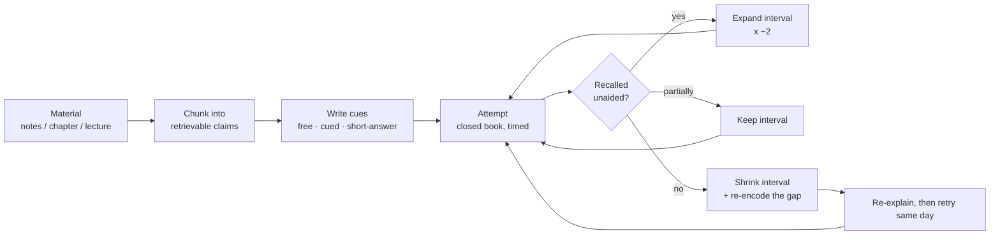

# Retrieval Practice Coach

Retrieval is not a *measurement* of learning — it **is** the learning event. This skill converts passive
material into a dated retrieval schedule, following the teach-don't-tell prime directive in
[`AGENTS.md`](../../../AGENTS.md).

## When to use

- The learner re-reads, highlights, or re-watches and still blanks under exam or interview pressure.
- They have a fixed deadline and need a schedule, not just a pile of questions.
- They want their notes converted into questions that force recall *before* the answer is visible.
- Don't use it for material they have never encountered once — first exposure needs
  [concept-explainer](../concept-explainer/SKILL.md); retrieval practice comes *after* initial encoding.

## First principles: the testing effect and the spacing effect

Roediger & Karpicke (2006, *Psychological Science*) had students study a passage then either restudy it
or take a free-recall test. Restudiers felt more confident and won at a 5-minute delay; testers won
decisively at one week. Two lessons: **retrieval beats restudy for durable memory**, and **fluency during
study is a poor predictor of later recall**. Bjork's *desirable difficulties* framing explains why —
effortful, slightly-failing retrieval strengthens the trace more than smooth re-reading.

The spacing effect (traceable to Ebbinghaus, 1885, and confirmed by Cepeda et al.'s 2006 meta-analysis)
adds the second lever: the *same* total practice time spread across days beats it massed into one block.



| Format | Cue strength | Effort | Best for | Weakness |
| --- | --- | --- | --- | --- |
| Free recall ("brain dump the topic") | none | highest | structure, big picture, exam essays | misses details you never cued |
| Cued recall ("what does X do, and why?") | topic cue | high | definitions, mechanisms, APIs | cue can leak the answer |
| Short answer / fill-in | partial | medium | formulas, syntax, parameters | can drift into rote strings |
| Multiple choice | strong (options shown) | lowest | early coverage, wide scanning | recognition ≠ recall; see [item-writing-coach](../item-writing-coach/SKILL.md) |
| Application problem | scenario | high | transfer, interviews | slow; use sparingly per session |

**Trade-off to say out loud:** recognition formats feel productive and score high, which inflates
confidence — see [confidence-calibration-coach](../confidence-calibration-coach/SKILL.md). Prefer
production formats (free/cued/short answer) for anything you must generate under pressure.

## Procedure

1. **Chunk the source** into 8–20 atomic, testable claims. One claim = one idea worth recalling alone.
2. **Write a cue per claim**, phrased so the answer is *generated*, not selected. Ban "true/false" and
   any cue whose wording contains its own answer.
3. **Grade the formats**: aim for roughly 60 % cued recall, 20 % free recall, 20 % application. Escalate
   from cued → free as accuracy rises.
4. **Feedback must be delayed but certain** — attempt everything closed-book first, then reveal answers
   in one pass. Immediate answer-peeking converts retrieval back into re-reading.
5. **Schedule with expanding intervals**: 1 day → 3 → 7 → 16 → 35, clipped so the last review lands
   1–2 days before the deadline. Halve the next interval on any failed item.
6. **Interleave topics inside each session** rather than blocking one topic — hand off to
   [interleaving-planner](../interleaving-planner/SKILL.md).
7. **Log every miss** with its root cause in [mistake-log-coach](../mistake-log-coach/SKILL.md); missed
   items re-enter at interval 1.
8. **Review the schedule weekly** against actual accuracy, then close with the **Learning Footer**.

## Output shape

```
Topic: <topic>          Deadline: <YYYY-MM-DD>   Budget: <n> min/day
Chunks: <n> claims      Format mix: cued <n> · free <n> · application <n>
Retrieval set:
  R1 [cued]        Q: <cue>                          A: <answer, 1-2 lines>
  R2 [free]        Q: <brain-dump prompt>            A: <checklist of must-hit points>
  R3 [application] Q: <scenario>                     A: <reasoning steps>
Schedule (expanding: 1/3/7/16/35 d):
  <YYYY-MM-DD>  session 1  items R1-Rn  <n> min  target accuracy <n>%
Rules: closed book · delayed feedback · misses reset to interval 1
Confidence check: rate 0-100% before each answer -> Brier score
Next: <interleaving-planner | mistake-log-coach | mock-exam>
Learning Footer
```

## Worked example — TCP congestion control, exam in 21 days

| # | Format | Cue | Must-hit answer points |
| --- | --- | --- | --- |
| R1 | cued | What problem does congestion control solve that flow control does not? | protects the *network* (routers/links), not the receiver's buffer |
| R2 | cued | Walk slow start → congestion avoidance: what changes at ssthresh? | exponential cwnd growth → linear (+1 MSS/RTT) once cwnd ≥ ssthresh |
| R3 | short | On 3 duplicate ACKs, Reno does what? | fast retransmit + fast recovery; cwnd halved, not reset to 1 |
| R4 | free | Brain-dump every congestion signal TCP can observe. | loss, duplicate ACKs, RTT inflation (Vegas/BBR), ECN marks |
| R5 | application | A link has 2 % random loss, no congestion. Predict Reno's throughput. | Reno misreads loss as congestion → cwnd collapses → throughput ≈ 1/√p |

Schedule, budget 20 min/day, exam on day 21:

| Session | Day | Date offset | Items | Focus |
| --- | --- | --- | --- | --- |
| 1 | D0 | today | R1–R5 | first closed-book pass, expect ~40 % |
| 2 | D1 | +1 | all + misses | re-encode gaps from session 1 |
| 3 | D4 | +3 | all | drop cues that hit 2× correct |
| 4 | D11 | +7 | survivors + R4 free recall | shift toward production formats |
| 5 | D19 | +16 (clipped) | full set, timed | simulate exam; hand off to [mock-exam](../mock-exam/SKILL.md) |

## Tips

- **Failed retrieval is not wasted** — an honest attempt before feedback still boosts later recall
  (the "pretesting" benefit); guessing then correcting beats reading the answer cold.
- Re-reading feels good and predicts nothing. If a session felt easy, the interval was too short.
- Never reveal answers item-by-item; batch the reveal so each attempt is genuinely unaided.
- Keep each cue atomic — a cue that needs three answers hides which part failed.
- Pair with [spaced-repetition-scheduler](../spaced-repetition-scheduler/SKILL.md) for the algorithm,
  [flashcards](../flashcards/SKILL.md) for card craft, [quiz-generator](../quiz-generator/SKILL.md) and
  [item-writing-coach](../item-writing-coach/SKILL.md) for defensible items,
  [self-explanation-prompter](../self-explanation-prompter/SKILL.md) to deepen each answer, and
  [progress-tracker](../progress-tracker/SKILL.md) to watch accuracy climb.
  End with the **Learning Footer** (`AGENTS.md`).
