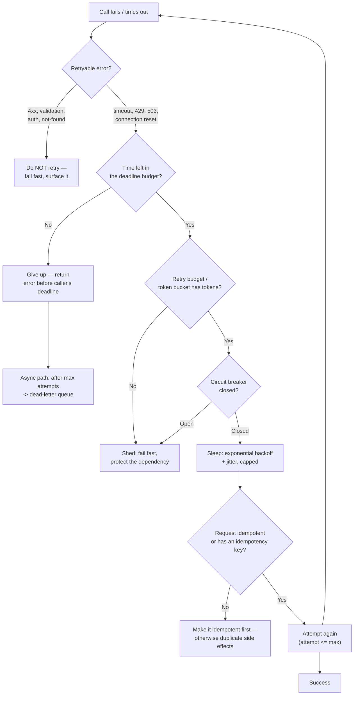

# Retry & Backoff Coach

Teach retries as a **budgeted, idempotent, jittered** policy — not a `for` loop — per
[`AGENTS.md`](../../../AGENTS.md). Naive retries convert a brownout into an outage by multiplying load
exactly when the system is weakest. Pairs with
[circuit-breaker-coach](../circuit-breaker-coach/SKILL.md) and
[idempotency-coach](../idempotency-coach/SKILL.md).

## When to use

- A dependency flaps and errors leak to users despite the fault being transient.
- Latency spikes correlate with retry counts — a suspected **retry storm** or metastable failure.
- A queue consumer keeps re-processing the same failing message (**poison pill**) forever.
- Retries cause duplicate side effects: double charges, double emails, duplicate rows.
- Designing a client SDK or a service mesh policy and choosing timeouts per hop.

## Mental model — first principles

A retry is a **bet** that the fault is transient and that the extra load is affordable. Both halves
must hold. Under overload the fault is *not* transient and the extra load is *not* affordable — so
retries must be capped by a **budget**, spread by **jitter**, and gated by a **circuit breaker**.



## Backoff strategies compared

Let `base` = initial delay, `cap` = max delay, `n` = attempt number.

| Strategy | Formula | Behaviour under load | Verdict |
| --- | --- | --- | --- |
| Immediate retry | `0` | Amplifies load instantly; synchronised herds | Almost never |
| Fixed delay | `base` | Clients stay in lockstep; periodic load spikes | Rarely |
| Exponential, no jitter | `min(cap, base·2ⁿ)` | Thundering herd — all clients wake together | Not enough |
| **Full jitter** | `random(0, min(cap, base·2ⁿ))` | Spreads load best; lowest contention | **Default choice** |
| Equal jitter | `half + random(0, half)` where `half = min(cap, base·2ⁿ)/2` | Spread + a latency floor | Good when a floor helps |
| **Decorrelated jitter** | `min(cap, random(base, prev·3))` | Self-spreading, good for long outages | Good for clients |

Grounding: AWS Architecture Blog, "Exponential Backoff and Jitter" (Brooker, 2015) — the source of the
full/equal/decorrelated jitter comparison; the AWS Builders' Library article "Timeouts, retries and
backoff with jitter" for retry budgets and token buckets; Google *SRE Book* ch. 22 ("Addressing
Cascading Failures") for retry amplification and load shedding.

**Retryability by signal:**

| Signal | Retry? | Why |
| --- | --- | --- |
| Connection refused / reset, DNS blip | Yes | Transient, request likely never processed |
| Timeout (no response) | Yes — **only if idempotent** | The write may have succeeded; replay can duplicate |
| HTTP 429 + `Retry-After` | Yes, honour the header | Server told you when |
| HTTP 503 / 502 | Yes, with backoff | Transient unavailability |
| HTTP 500 | Cautiously, low cap | May be deterministic — a bug retries identically |
| HTTP 400 / 422 / 401 / 403 / 404 | **No** | Deterministic; retrying only burns budget |
| Serialization failure (`40001`) / deadlock | Yes, immediately + jitter | Expected under [SERIALIZABLE](../transaction-isolation-explainer/SKILL.md); the retry usually wins |

## Procedure

1. **Establish the deadline budget first.** The caller's deadline is the hard cap; every hop gets a
   slice, and a retry spends from the *remaining* budget. Propagate the deadline (gRPC deadlines,
   `Deadline`/`X-Request-Deadline` headers) so no hop retries past the point anyone is still waiting.
2. **Classify the error**, using the table. Never retry deterministic failures — that is pure
   amplification with zero success probability.
3. **Pick backoff + jitter**: default to **full jitter**, `base` ≈ the dependency's p50 latency,
   `cap` ≈ 1–10 s, and cap attempts (2–3 for interactive paths, more for async).
4. **Add a retry budget**, not just per-call limits: a token bucket allowing retries to be at most
   ~10 % of successful request volume. Per-call caps still let *every* client retry at once; a budget
   bounds the aggregate. Emit a metric when the budget is exhausted.
5. **Retry only at one layer.** Retries at client, SDK, proxy and mesh multiply: 3 × 3 × 3 = 27 calls
   from one user action. Choose the layer, disable the others, and write it down.
6. **Make replay safe.** Attach an **idempotency key** per logical operation (not per attempt), stored
   with the result so a repeat returns the original outcome. See
   [idempotency-coach](../idempotency-coach/SKILL.md).
7. **Gate with a circuit breaker** so a persistently failing dependency stops receiving retries at all
   — see [circuit-breaker-coach](../circuit-breaker-coach/SKILL.md).
8. **For async consumers, bound redelivery**: max delivery attempts, then route to a **dead-letter
   queue** with the failure reason and headers preserved. A poison pill must leave the hot path — and
   DLQ depth must be alerted on and have a documented replay procedure.
9. **Verify with `#run` (`learningos_runcode`)**: implement the backoff function and run it on real
   inputs — attempts 1…8, and the edge cases `n = 0`, `cap < base`, a huge `n` (assert no overflow and
   that `delay ≤ cap`), plus a simulated flaky call that fails k times then succeeds. Teach from the
   printed numbers, and show that full jitter's delays are *spread*, not identical.
10. **Load-test the failure**, not the happy path: inject 100 % dependency failure and confirm total
    outbound calls stay bounded and the service sheds rather than melts.

## Output shape

```
Retry policy — <caller> -> <dependency>

Deadline budget: caller <ms> | this hop <ms> | per-attempt timeout <ms>
Retry on: <timeout, 429, 503, conn-reset, 40001>   Never on: <4xx, validation>
Backoff: full jitter  base=<ms> cap=<ms> max_attempts=<n>
  attempt 1: sleep in [0, <..>]  2: [0, <..>]  3: [0, <..>]   # from #run
Retry budget: <10% of successes> (token bucket)  on exhaustion: <fail fast + metric>
Retry layer: <client SDK only>  disabled at: <proxy, mesh>
Idempotency: key=<scope+op-id>, stored result TTL <...>
Breaker: open after <n> failures / <window>, half-open probe <...>
Async: max deliveries=<n> -> DLQ <name>, alert on depth>0, replay runbook: <link>

#run verification:
  backoff(n) for n=1..8 -> <real values>   edge: n=0 -> <..>, cap<base -> <..>, n=1000 -> <=cap ✔
  flaky call (fails 3x) -> attempts=<..>, total elapsed=<..>ms, result=<success>
Failure load test: 100% dep failure -> outbound calls capped at <n>/s ✔
```

## Tips

- **Jitter is the whole point.** Exponential backoff without jitter just re-synchronises the herd at
  wider intervals (AWS, 2015).
- **Pitfall — layered retries.** Multiplicative amplification is the most common cause of a
  self-inflicted outage; audit every layer in the path.
- **Pitfall — retrying a timeout on a non-idempotent write.** A timeout means *unknown*, not *failed*;
  without an idempotency key you may double-charge a customer.
- **Pitfall — infinite retries in a consumer.** One poison message can stall a partition forever; cap
  deliveries and DLQ it.
- **Pitfall — DLQ as a black hole.** An unmonitored DLQ is silent data loss; alert on depth and own a
  replay runbook.
- Retries fix *transient* faults only. If success rate is low and steady, retries are a load
  multiplier with no upside — shed instead (Google *SRE Book*, ch. 22).
- Honour `Retry-After` when the server sends it: the server knows more than your heuristic.
- Never present a delay table you have not executed — run the function and report real numbers.
- End with the **Learning Footer** (`AGENTS.md`) — one policy to cap, one call path to de-duplicate.
