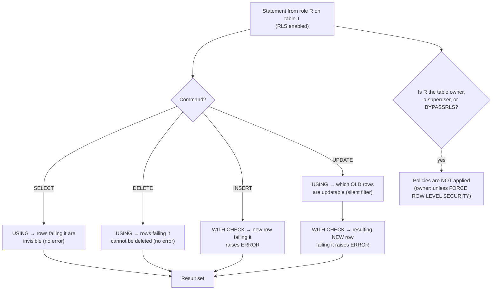

# RLS and Data Masking Coach

A `WHERE tenant_id = ?` in application code is a convention; **row-level security is an invariant the
database enforces even when the application forgets**. This skill teaches the mechanism precisely — because
the difference between `USING` and `WITH CHECK` is the difference between "you cannot see other tenants'
rows" and "you cannot *write into* another tenant" — in the verify-before-you-teach spirit of
[`AGENTS.md`](../../../AGENTS.md).

## When to use

- Building multi-tenant isolation and deciding whether it lives in the app, in a view, or in the database.
- Auditing an existing RLS setup: policies exist, but the application connects as the table owner and the
  isolation quietly does nothing.
- Masking PII (email, SSN, salary) so analysts can join and aggregate without reading raw values.
- Porting an isolation rule between PostgreSQL, Snowflake, and BigQuery and needing the semantics mapped.
- **Don't use it for** authentication or session identity (that's [`auth-designer`](../auth-designer/SKILL.md)
  and [`oauth2-oidc-security-coach`](../oauth2-oidc-security-coach/SKILL.md)), for application-layer
  authorization design ([`broken-access-control-coach`](../broken-access-control-coach/SKILL.md)), or for
  deciding *which* fields are sensitive ([`privacy-by-design-coach`](../privacy-by-design-coach/SKILL.md)).

## First principles: two different questions, two different clauses

PostgreSQL added row-level security in **PostgreSQL 9.5 (released 2016-01-07)**. Once
`ALTER TABLE t ENABLE ROW LEVEL SECURITY` runs, the table is **deny-by-default**: with no matching policy,
a non-bypassing role sees zero rows and can write nothing. Policies then *add back* access.

Each policy can carry two expressions, and they answer different questions (PostgreSQL docs,
*CREATE POLICY*):

- **`USING (expr)`** — asked of **rows that already exist**. Rows where it is not true are *invisible*.
  The statement does not error; it simply affects fewer rows. **Silent** by design.
- **`WITH CHECK (expr)`** — asked of **rows the statement is trying to produce**. If it is not true, the
  statement **raises an error** (`new row violates row-level security policy`). **Loud** by design.



*Figure: `USING` filters what exists and fails quietly; `WITH CHECK` validates what you are creating and
fails loudly. The dotted branch is the bypass that defeats most real-world deployments.*

### Which clause applies to which command

This table is the load-bearing part of the skill (PostgreSQL docs, *CREATE POLICY* → "Policies Applied by
Command Type"):

| Command | `USING` | `WITH CHECK` | Failure mode |
| --- | --- | --- | --- |
| `SELECT` | yes — filters visible rows | **not allowed** | silent: fewer rows |
| `INSERT` | **not allowed** | yes — validates the new row | error |
| `UPDATE` | yes — chooses which existing rows are updatable | yes — validates the post-update row | silent for the first, error for the second |
| `DELETE` | yes — chooses which existing rows are deletable | **not allowed** | silent: 0 rows deleted |
| `ALL` | yes | yes | both |

Two consequences people get wrong:

1. **If `WITH CHECK` is omitted on a policy that has `USING`, the `USING` expression is used for both.**
   That is usually what you want for tenant isolation — but it means an intentionally read-only-visible
   rule silently becomes a write rule too.
2. `UPDATE ... RETURNING` and `INSERT ... ON CONFLICT DO UPDATE` need *more* policies than people expect:
   the former also requires a `SELECT` policy, and the latter is evaluated against the `INSERT`
   `WITH CHECK`, the `UPDATE` `USING`, **and** the `UPDATE` `WITH CHECK`.

### Permissive vs restrictive, and the bypass ladder

| Concept | Combination rule | Use it for |
| --- | --- | --- |
| `AS PERMISSIVE` (default) | multiple policies are **OR**-ed | granting access ("you may see your tenant *or* shared rows") |
| `AS RESTRICTIVE` | **AND**-ed on top of the permissive result | a non-negotiable guardrail no other policy can widen |

| Who is running the query | RLS applied? | How to change it |
| --- | --- | --- |
| Ordinary role | **yes** | policies |
| Table **owner** | **no**, by default | `ALTER TABLE t FORCE ROW LEVEL SECURITY` |
| Role with `BYPASSRLS` | **no** | don't grant it; audit with `SELECT rolname FROM pg_roles WHERE rolbypassrls` |
| Superuser | **no**, always | never let the app connect as one |
| Referential integrity checks (FK) | **no** | by design, so FKs stay consistent — but it means a FK can *prove existence* of a hidden row |

**The number-one production defect**: the application connects with the role that owns the tables, so RLS
is enabled, policies look perfect, and nothing is enforced. Fix with a separate application role *and*
`FORCE ROW LEVEL SECURITY`.

### Masking: PostgreSQL has no built-in DDM

⚠ PostgreSQL (through the current major release) has **no built-in dynamic data masking** statement. You
build it from parts: column-level `GRANT`, or a view that rewrites the column. The critical detail is that
a view historically executes with the **view owner's** privileges, so a view over an RLS-protected table
*bypasses* the caller's policies. **PostgreSQL 15 (released 2022-10-13)** added
`WITH (security_invoker = true)`, which runs the view with the querying user's permissions and therefore
applies *their* RLS policies. Pre-15, use `security_barrier` views plus careful ownership, or the
third-party `postgresql_anonymizer` extension.

| Engine | Row filtering | Column masking | Note |
| --- | --- | --- | --- |
| PostgreSQL | `CREATE POLICY … USING (…)` | `security_invoker` view + `CASE`, or column `GRANT` | no native DDM |
| Snowflake | `CREATE ROW ACCESS POLICY … RETURNS BOOLEAN ->` then `ALTER TABLE … ADD ROW ACCESS POLICY p ON (col)` | `CREATE MASKING POLICY … RETURNS <type> ->` then `ALTER TABLE … MODIFY COLUMN c SET MASKING POLICY p` | Enterprise Edition or higher — ⚠ verify edition on the current docs page |
| BigQuery | `CREATE ROW ACCESS POLICY p ON tbl GRANT TO (…) FILTER USING (…)` | policy tags (Dataplex/Data Catalog) + data policies with masking rules | column-level security is IAM-driven, not SQL-predicate-driven |

## Procedure

1. **Write the isolation rule as one sentence** before any DDL: "a principal may read and write only rows
   whose `tenant_id` equals the tenant on their session." Ambiguity here becomes a policy hole.
2. **Decide where session identity comes from.** In PostgreSQL either a per-tenant database role
   (`current_user`) or a session GUC (`current_setting('app.tenant_id', true)`). Prefer the GUC for pooled
   applications, and always pass `true` (`missing_ok`) so an unset value yields `NULL` → predicate `NULL` →
   **zero rows**, rather than an exception mid-transaction.
3. **Create a non-owner application role.** `CREATE ROLE app_user LOGIN;` and grant only the DML it needs.
   The migration/owner role stays separate.
4. **Enable and force RLS**: `ALTER TABLE t ENABLE ROW LEVEL SECURITY;` **and**
   `ALTER TABLE t FORCE ROW LEVEL SECURITY;`. Skipping the second line is the classic silent failure.
5. **Write the policy with both clauses explicit**, even when they are identical — the redundancy documents
   intent and survives a later edit that splits them.
6. **Add a restrictive backstop** if any other policy might be added later:
   `CREATE POLICY deny_cross_tenant ON t AS RESTRICTIVE FOR ALL TO PUBLIC USING (tenant_id = current_setting('app.tenant_id', true));`
7. **Set the context per transaction, not per session.** With a transaction-pooling connection pooler,
   `SET` leaks to the next borrower of the connection; `SET LOCAL` inside an explicit transaction does not.
   Pair with [`connection-pooling-coach`](../connection-pooling-coach/SKILL.md).
8. **Mask columns** with a `security_invoker` view (PG 15+) or engine-native masking policies, and revoke
   direct `SELECT` on the base table so the view is the only path.
9. **Index the policy predicate.** RLS quals become part of every plan; an unindexed `tenant_id` turns each
   query into a sequential scan. Verify with `EXPLAIN` and [`sql-indexing-lab`](../sql-indexing-lab/SKILL.md).
10. **Test the negative cases**, not the happy path: read another tenant (expect 0 rows), insert into
    another tenant (expect an error), update a row *into* another tenant (expect an error), and run the
    same suite as the owner role to confirm `FORCE` is working.
11. **Audit the bypass ladder**: `pg_roles.rolbypassrls`, `pg_roles.rolsuper`, table ownership, and any
    `SECURITY DEFINER` function that reads the table. Each is a legitimate hole you must justify.
12. **Document what remains visible.** Row counts, aggregate timings, foreign-key errors, and unique
    constraint violations can leak the *existence* of hidden rows even when values are hidden.
13. Close with the **Learning Footer**.

## Output shape

```
Isolation rule: "<one sentence>"    Engine: <PostgreSQL 16 | Snowflake | BigQuery>
Identity source: <current_user | current_setting('app.tenant_id', true) | CURRENT_ROLE()>  scope=<SET LOCAL per txn>

Table: <schema.table>   ENABLE RLS=<yes>   FORCE RLS=<yes|no ⚠>   owner=<role>   app role=<role>
Policies:
  <name> | <PERMISSIVE|RESTRICTIVE> | FOR <ALL|SELECT|INSERT|UPDATE|DELETE> | TO <roles>
          USING: <expr | n/a>          WITH CHECK: <expr | n/a | inherited from USING>
Combination: permissive OR-set = <...> ; restrictive AND-set = <...>

Masking: <col> -> <security_invoker view | masking policy | column GRANT>  visible to <roles>
Base table direct SELECT revoked: <yes|no>

Negative tests (must all hold):
  read other tenant        -> rows=0            actual=<...>  PASS/FAIL
  insert other tenant      -> ERROR (WITH CHECK) actual=<...>  PASS/FAIL
  update row INTO other    -> ERROR (WITH CHECK) actual=<...>  PASS/FAIL
  update row IN other      -> 0 rows (USING)     actual=<...>  PASS/FAIL
  as owner role            -> filtered (FORCE)   actual=<...>  PASS/FAIL

Bypass audit: BYPASSRLS roles=<...> · superuser app conn=<no> · SECURITY DEFINER readers=<...>
Performance:  policy predicate indexed=<yes|no> · plan=<Index Scan|Seq Scan>
Residual leakage: <row counts | FK errors | unique violations | timing>
Next: broken-access-control-coach | privacy-by-design-coach | sql-indexing-lab
Learning Footer
```

## Worked example — a tenant boundary you can actually break, then fix

Run locally against a free Postgres container (see
[`postgres-local-lab`](../postgres-local-lab/SKILL.md)). Every result below is traced statement by
statement.

```sql
-- 1. schema + seed data, as the owner
CREATE TABLE invoices (
  id        bigserial PRIMARY KEY,
  tenant_id text NOT NULL,
  customer_email text NOT NULL,
  amount    numeric(10,2) NOT NULL
);
INSERT INTO invoices (tenant_id, customer_email, amount) VALUES
  ('acme',   'ap@acme.example',   100.00),
  ('acme',   'cfo@acme.example',  250.00),
  ('globex', 'ap@globex.example', 900.00);
CREATE INDEX ON invoices (tenant_id);          -- the policy predicate must be indexable

-- 2. a separate, non-owner application role
CREATE ROLE app_user LOGIN PASSWORD 'lab';
GRANT SELECT, INSERT, UPDATE, DELETE ON invoices TO app_user;
GRANT USAGE, SELECT ON SEQUENCE invoices_id_seq TO app_user;

-- 3. deny by default, then add exactly one rule back
ALTER TABLE invoices ENABLE ROW LEVEL SECURITY;
ALTER TABLE invoices FORCE  ROW LEVEL SECURITY;   -- owner is subject to policies too

CREATE POLICY tenant_isolation ON invoices
  FOR ALL TO app_user
  USING      (tenant_id = current_setting('app.tenant_id', true))
  WITH CHECK (tenant_id = current_setting('app.tenant_id', true));
```

Now the session, with the traced result of each statement:

```sql
SET ROLE app_user;
BEGIN;
SET LOCAL app.tenant_id = 'acme';    -- SET LOCAL is transaction-scoped: safe behind a pooler

SELECT count(*) FROM invoices;
--  2        ← rows 1 and 2. Row 3 is not "denied", it is invisible. USING fails silently.

INSERT INTO invoices (tenant_id, customer_email, amount)
VALUES ('globex', 'x@globex.example', 5.00);
--  ERROR:  new row violates row-level security policy for table "invoices"
--  ← WITH CHECK rejected the row being created. Loud.

UPDATE invoices SET tenant_id = 'globex' WHERE id = 1;
--  ERROR:  new row violates row-level security policy for table "invoices"
--  ← USING accepted the OLD row (id 1 is 'acme'); WITH CHECK rejected the NEW row. This is the
--    single most important line in this skill: an UPDATE is checked twice, against two row versions.

UPDATE invoices SET amount = 999 WHERE id = 3;
--  UPDATE 0
--  ← No error. USING made row 3 invisible, so there was nothing to update. Silent again.

DELETE FROM invoices WHERE id = 3;
--  DELETE 0        ← same mechanism, same silence.
COMMIT;
```

**Now break it deliberately**, to show why the two `ALTER TABLE` lines both matter:

```sql
RESET ROLE;                             -- back to the table owner
SELECT count(*) FROM invoices;
--  With FORCE ROW LEVEL SECURITY and no policy granting the owner anything: 0
--  Without FORCE (the default): 3  ← policies present, isolation absent. This is the classic defect.
```

And the fail-closed behaviour when the app forgets to set context:

```sql
SET ROLE app_user;
SELECT count(*) FROM invoices;         -- no SET LOCAL this time
--  0
--  ← current_setting('app.tenant_id', true) returns NULL, so `tenant_id = NULL` evaluates to NULL,
--    which is not true, so no row passes. Dropping the second argument would raise
--    "unrecognized configuration parameter" instead — also fail-closed, but noisier.
```

**Column masking** on top, with a `security_invoker` view (PostgreSQL 15+), so the caller's RLS still
applies inside the view:

```sql
CREATE ROLE finance;
CREATE VIEW invoices_masked WITH (security_invoker = true) AS
SELECT id,
       tenant_id,
       CASE WHEN pg_has_role(current_user, 'finance', 'MEMBER')
            THEN customer_email
            ELSE regexp_replace(customer_email, '^[^@]+', '***')   -- '***@acme.example'
       END AS customer_email,
       amount
FROM invoices;

REVOKE SELECT ON invoices FROM app_user;      -- the view becomes the only path
GRANT  SELECT ON invoices_masked TO app_user;
```

Trace: `app_user` (not a member of `finance`) selecting through the view inside a transaction with
`app.tenant_id = 'acme'` gets **2 rows**, with `customer_email` rendered `***@acme.example`. The domain is
deliberately preserved so joins and group-bys still work — masking that destroys the join key destroys the
analytics too. Without `security_invoker = true`, the view would run as *its owner*, and if that owner is
the table owner without `FORCE`, all 3 rows leak — the same bypass, wearing a different hat.

**The same rule in the warehouses** (⚠ syntax and edition requirements are vendor-versioned — verify on the
current Snowflake and BigQuery pages):

```sql
-- Snowflake: row access policy + masking policy
CREATE ROW ACCESS POLICY tenant_rap AS (tenant_id string) RETURNS BOOLEAN ->
  EXISTS (SELECT 1 FROM governance.tenant_grants g
          WHERE g.role_name = CURRENT_ROLE() AND g.tenant_id = tenant_id);
ALTER TABLE invoices ADD ROW ACCESS POLICY tenant_rap ON (tenant_id);

CREATE MASKING POLICY email_mask AS (val string) RETURNS string ->
  CASE WHEN CURRENT_ROLE() IN ('FINANCE') THEN val ELSE '***MASKED***' END;
ALTER TABLE invoices MODIFY COLUMN customer_email SET MASKING POLICY email_mask;
```

```sql
-- BigQuery: row access policy (column-level security is IAM + policy tags, not SQL)
CREATE ROW ACCESS POLICY acme_only
ON `proj.ds.invoices`
GRANT TO ('group:acme-analysts@example.com')
FILTER USING (tenant_id = 'acme');
```

Note the semantic difference worth teaching: PostgreSQL binds policies to **database roles and session
state**; Snowflake binds to `CURRENT_ROLE()` and its role hierarchy; BigQuery binds to **IAM principals**.
Porting a rule means porting the identity model, not just the predicate.

## Tips

- Memorise the asymmetry: **`USING` = fewer rows, no error. `WITH CHECK` = error.** If a test expected an
  exception and got `UPDATE 0`, you wrote the rule in the wrong clause.
- Omitting `WITH CHECK` silently reuses `USING` for writes. Write both explicitly so a future edit to one
  cannot quietly change the other.
- `ENABLE` without `FORCE` protects you from everyone except the role your application most likely uses.
  Check `SELECT relrowsecurity, relforcerowsecurity FROM pg_class WHERE relname = 't';`
- Under a transaction-pooling pooler, `SET` outlives your request and hands another tenant's context to the
  next borrower. Always `SET LOCAL` inside an explicit transaction.
- Mark a function `LEAKPROOF` only when you can prove it reveals nothing about its arguments — RLS quals
  are security barriers, and `LEAKPROOF` is the documented way to let a function run *before* them.
- RLS filters values, not metadata. Row counts, planner timings, sequence gaps and unique-violation errors
  still leak existence; if that matters, add aggregation thresholds or separate the data physically.
- Masking must preserve joinability where analysts need it (hash or partially redact) and destroy it where
  they do not — decide per column with
  [`privacy-by-design-coach`](../privacy-by-design-coach/SKILL.md) and record it in
  [`data-catalog-coach`](../data-catalog-coach/SKILL.md).
- Related: [`broken-access-control-coach`](../broken-access-control-coach/SKILL.md),
  [`cloud-iam-least-privilege-coach`](../cloud-iam-least-privilege-coach/SKILL.md),
  [`sql-injection-defense`](../sql-injection-defense/SKILL.md),
  [`secure-code-review`](../secure-code-review/SKILL.md),
  [`postgres-local-lab`](../postgres-local-lab/SKILL.md),
  [`sql-indexing-lab`](../sql-indexing-lab/SKILL.md), and
  [`snowflake-performance-coach`](../snowflake-performance-coach/SKILL.md) for the cost of policy
  predicates at warehouse scale.
  End with the **Learning Footer** (`AGENTS.md`).
