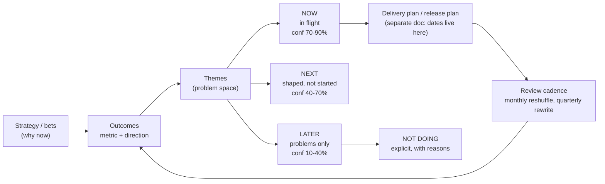

# Roadmap Builder

A roadmap is a **communication artefact about intent under uncertainty**, not a delivery contract. This
skill builds the now/next/later form popularised by Janna Bastow and ProdPad, anchored on outcomes and
honest confidence bands, in line with the candour rules in [`AGENTS.md`](../../../AGENTS.md).

## When to use

- Your "roadmap" is a Gantt chart of features with quarters attached, and every quarter it slips.
- Leadership wants commitments, the team wants slack, and you need one artefact that serves both.
- You need to say *no* visibly — an explicit "not now" list is the most valuable column on the page.
- **Don't use it for** sprint planning or release scheduling; a roadmap answers *why and roughly when*,
  while a release plan answers *exactly when*. Keep them in separate documents.

## First principles: certainty decays with horizon

The further out you plan, the less you know — so the artefact must get *vaguer*, not more precise. Fake
precision at 9 months is the single biggest cause of roadmap distrust. Each horizon therefore carries a
different unit of work, a different confidence band, and a different promise.



| Horizon | Unit | Confidence | Legit promise | Illegitimate promise |
| --- | --- | --- | --- | --- |
| Now (~this quarter) | shaped solutions with owners | 70–90% | "in flight; we'll show progress fortnightly" | exact ship date to the day |
| Next (~1–2 quarters) | themes + target outcomes | 40–70% | "this is the problem we intend to attack next" | scope and date |
| Later (2 quarters+) | problems / opportunities only | 10–40% | "on our radar; direction of travel" | anything at all specific |
| Not doing | explicit exclusions | n/a | "we've decided against this, because…" | silence (breeds lobbying) |

**Say the limits out loud.** Confidence bands are judgement, not statistics — unless you derive them from
throughput history, in which case use [kanban-flow-coach](../kanban-flow-coach/SKILL.md) Monte Carlo
forecasts and quote a percentile ("85% chance by X"). A roadmap does not create capacity; if *now* holds
more than the team's demonstrated throughput, the roadmap is fiction regardless of format. And an
outcome-based roadmap fails when the outcomes are vanity metrics — pair with
[metrics-definition-coach](../metrics-definition-coach/SKILL.md).

## Procedure

1. **State the strategy in one paragraph** — where you're playing, what you're betting on, what changes if
   you're right. Every theme must trace back to it.
2. **Define 2–4 outcomes**, each a metric with direction, baseline, and horizon. More than four outcomes
   means no priority.
3. **Group work into themes** (problem spaces, customer language) sourced from
   [product-discovery-coach](../product-discovery-coach/SKILL.md). Themes, never features, are the roadmap
   rows.
4. **Sort into now / next / later** and enforce the vagueness gradient — later items must be *less*
   specific than now items. Delete any date beyond the current quarter.
5. **Attach a confidence band per item** with the reason (throughput history, dependency risk, unknown
   discovery). Widen it honestly for anything not yet shaped.
6. **Sanity-check capacity**: sum of *now* ≤ demonstrated throughput minus a reserve (15–25%) for
   interrupts, incidents, and support. Cite the actual historical number.
7. **Write the NOT DOING column** with one-line reasons. This is where trust is earned.
8. **List dependencies and assumptions** that would force a re-plan, plus the leading indicator that tells
   you early.
9. **Cut audience-specific views** from the same source: exec (outcomes + bets + risk), team (themes +
   sequencing + dependencies), customer (directional benefits only, zero dates).
10. **Set the cadence and the changelog**: monthly reshuffle, quarterly rewrite, every change logged with
    the reason. Then close with the **Learning Footer**.

## Output shape

```
Strategy in one paragraph: <...>
Outcomes:
  O1 <metric> from <baseline> to <target> by <horizon>
  O2 <...>
NOW (this quarter, conf 70-90%)
  - <theme> -> serves <O1> | shaped: yes | owner: <...> | confidence <x%> because <...>
NEXT (1-2 quarters, conf 40-70%)
  - <theme> -> serves <O2> | open question: <...>
LATER (2+ quarters, conf 10-40%)
  - <problem/opportunity, no solution named>
NOT DOING (and why)
  - <item> — because <...>
Capacity check: demonstrated throughput <x/quarter> vs NOW load <y> · reserve <z%>
Key dependencies / assumptions: <...>  Early warning signal: <...>
Audience views: exec <...> | team <...> | customer <...>
Review cadence: <monthly reshuffle / quarterly rewrite>   Changelog owner: <...>
Learning Footer
```

## Worked example — filled roadmap (developer-tools team, 2026)

**Strategy:** win teams that adopt bottom-up by making the first hour to value trivial, then monetise on
team-scale collaboration.

| Horizon | Theme | Serves outcome | Confidence | Note |
| --- | --- | --- | --- | --- |
| NOW | "First run works without docs" | Activation 31% → 45% by Q3 | 80% | 3 of 4 solutions shaped; owner: Ana |
| NOW | "Stop the top-3 onboarding errors" | Support tickets/1k signups −30% | 75% | depends on auth rewrite landing |
| NEXT | "Teams can see each other's work" | Weekly active teams +15% | 55% | discovery underway; solution unchosen |
| LATER | "Enterprise trust barriers" (SSO? audit? residency?) | Enterprise win-rate | 25% | problem only — no solution named |
| NOT DOING | Mobile app | — | — | < 4% of sessions; revisit if it passes 10% |
| NOT DOING | Marketplace/plugins | — | — | no distribution advantage yet; costs a platform team |

**Capacity check:** last three quarters delivered 6, 5, and 7 shaped items → planning *now* at **5**, with
a 20% reserve for incidents. **Exec line:** "Two bets this quarter, both on activation; team collaboration
is next but unshaped, so I'll give you a range, not a date, in six weeks."

## Tips

- Dates on a roadmap create a contract you didn't intend to sign; put dates in the release plan instead.
- If everything is "now", nothing is — the columns only work when *later* is genuinely thin and vague.
- Publish the "not doing" list; unspoken nos get relitigated in every meeting.
- Derive confidence from throughput data where you can ([kanban-flow-coach](../kanban-flow-coach/SKILL.md))
  and label it as judgement where you can't.
- Version and changelog the roadmap; "it changed and nobody told me" destroys more trust than the change.
- Pair with [product-discovery-coach](../product-discovery-coach/SKILL.md),
  [feature-prioritization-coach](../feature-prioritization-coach/SKILL.md),
  [okr-coach](../okr-coach/SKILL.md), [prd-writer](../prd-writer/SKILL.md),
  [estimation-coach](../estimation-coach/SKILL.md),
  [stakeholder-management-coach](../stakeholder-management-coach/SKILL.md), and
  [exec-communication-coach](../exec-communication-coach/SKILL.md). End with the **Learning Footer**
  (`AGENTS.md`).
