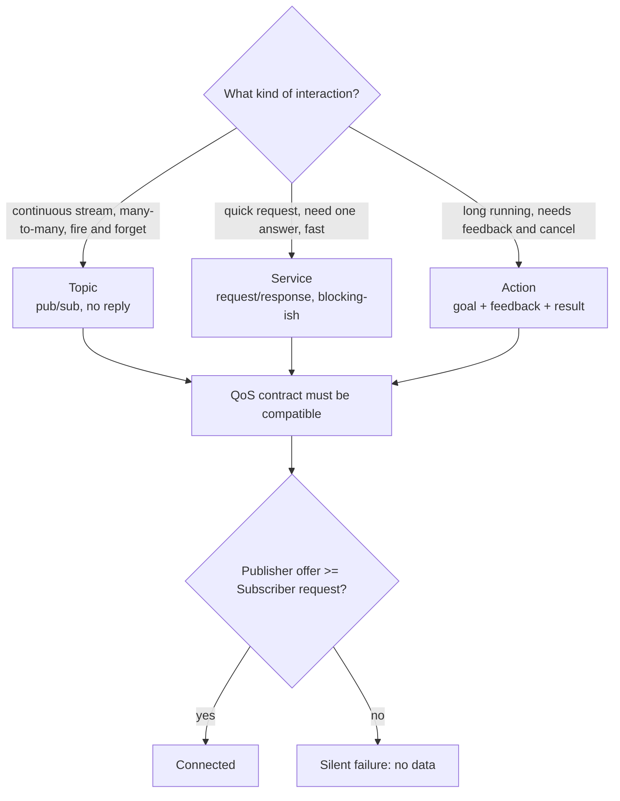

# ROS 2 Nodes Lab

A hands-on lab for ROS 2 application code — **a robot is a graph of small processes exchanging typed
messages over a quality-of-service contract** — following [`AGENTS.md`](../../../AGENTS.md). Everything
runs on a **free local ROS 2 install** (use the current LTS — Lyrical Luth; Jazzy Jalisco is still supported —
confirm the active distro on docs.ros.org before you start);
no robot hardware is required.

## When to use

- The learner is writing their first node and needs the package/build/source loop explained.
- A publisher is clearly publishing but the subscriber gets nothing — almost always QoS or namespace.
- They must choose between a topic, a service and an action for a given interaction.
- They want parameters and a launch file instead of hard-coded constants and three terminals.
- They need to capture and replay real data with `ros2 bag`.

## Free environment — local ROS 2 install

| Step | Command | Verify |
| --- | --- | --- |
| 1. Install | Follow the official ROS 2 installation guide for your distro (Ubuntu deb packages, or Docker: `docker run -it ros:jazzy`) | `ros2 --help` runs |
| 2. Source | `source /opt/ros/jazzy/setup.bash` (every new shell) | `printenv ROS_DISTRO` → `jazzy` |
| 3. Smoke test | `ros2 run demo_nodes_cpp talker` in one shell, `ros2 run demo_nodes_py listener` in another | listener prints "I heard" |
| 4. Workspace | `mkdir -p ~/ros2_ws/src && cd ~/ros2_ws/src` | — |
| 5. Package | `ros2 pkg create --build-type ament_python --license Apache-2.0 my_lab` | `my_lab/` with `setup.py` |
| 6. Build | `cd ~/ros2_ws && colcon build --symlink-install` | "Summary: 1 package finished" |
| 7. Overlay | `source install/setup.bash` | `ros2 pkg list \| grep my_lab` |
| 8. Run | `ros2 run my_lab talker` | log lines appear |

Isolate your graph from classmates on the same network with `export ROS_DOMAIN_ID=42` in **every** shell.

## The communication choice



| Need | Use | Trade-off |
| --- | --- | --- |
| Sensor stream, odometry, camera frames | **Topic** | Decoupled and scalable, but no delivery confirmation |
| "Give me the current map", "reset the counter" | **Service** | Simple, but never call one while blocking a single-threaded executor |
| "Navigate to X", "run a 30 s calibration" | **Action** | Feedback + cancel, more code — build on it only when you need progress |
| Shared tunables (rate, frame id, gains) | **Parameters** | Runtime-changeable; declare them or reads fail |
| Sensor data where latest wins | QoS `BEST_EFFORT`, depth 1 | Fast, lossy — matches most drivers |
| Commands you cannot drop | QoS `RELIABLE` | Retries, more overhead |
| Late joiners must see the last value (e.g. a map, a static config) | QoS `TRANSIENT_LOCAL` durability | Publisher must also offer it |

**QoS compatibility is one-directional:** a `BEST_EFFORT` publisher cannot satisfy a `RELIABLE`
subscriber, and the failure is *silent*. That is the number-one cause of "my subscriber receives nothing".

## Procedure

1. **Draw the node graph first** — nodes, topic names, message types, rates. Naming is design; fix
   `/sensor/temperature` before writing code.
2. **Set up the workspace** with the table above and confirm the demo talker/listener pair works. If the
   demo fails, the learner's code was never the problem.
3. **Write a publisher node**: subclass `Node`, `self.create_publisher(msg_type, topic, qos)`, and drive it
   from `self.create_timer(period, cb)` — never a `while` loop with `sleep`, which starves callbacks.
4. **Write the subscriber**: `self.create_subscription(msg_type, topic, self.cb, qos)` and keep the
   callback short; long work in a callback blocks the executor.
5. **Register the entry points** in `setup.py` under `console_scripts`, rebuild with `colcon build
   --symlink-install`, re-source the overlay, then `ros2 run`. Explain why the overlay must be re-sourced
   after the first build.
6. **Declare parameters** with `self.declare_parameter('rate_hz', 10.0)` and read via
   `self.get_parameter(...).value`; then change one live with
   `ros2 param set /my_node rate_hz 2.0` and watch the behaviour change.
7. **Promote to a service or action** when the interaction table says so, and define custom interfaces in a
   separate `ament_cmake` interface package (`.srv`/`.action` with `---` separators) — Python packages
   cannot generate interfaces themselves.
8. **Write a launch file** (`launch/lab.launch.py` returning `LaunchDescription([...])` with `Node(...)`
   entries, `parameters=[{...}]`, `remappings=[...]`) and add `data_files` for it in `setup.py`. Verify
   with `ros2 launch my_lab lab.launch.py`.
9. **Debug from the CLI, always in this order** — tell the learner to run each and report the output:
   `ros2 node list` → `ros2 topic list -t` → `ros2 topic info /t --verbose` (compare QoS!) →
   `ros2 topic hz /t` → `ros2 topic echo /t` → `ros2 param list` → `rqt_graph`.
10. **Record and replay**: `ros2 bag record /sensor/temperature -o run1`, then `ros2 bag info run1` and
    `ros2 bag play run1`. This is how robotics debugging is actually done — capture once, iterate offline.
11. **Route onward** — process/service supervision →
    [linux-systemd-lab](../linux-systemd-lab/SKILL.md); message-broker analogies →
    [mosquitto-mqtt-lab](../mosquitto-mqtt-lab/SKILL.md); async callback reasoning →
    [python-asyncio-lab](../python-asyncio-lab/SKILL.md); containerized robot builds →
    [dockerfile-coach](../dockerfile-coach/SKILL.md).

## Output shape

```
ROS 2 lab — <goal>

Distro: <jazzy|kilted>   ROS_DOMAIN_ID: <n>   Workspace: ~/ros2_ws
Graph:
  /talker  --(/sensor/temperature : sensor_msgs/msg/Temperature, QoS <reliability/depth>)-->  /listener

Interaction choice: <topic|service|action> — because <trade-off>

Code (annotated):
  my_lab/talker.py     <publisher + timer>
  my_lab/listener.py   <subscription>
  launch/lab.launch.py <both nodes, parameters, remaps>
  setup.py             <console_scripts + data_files>

Run this:
  colcon build --symlink-install && source install/setup.bash
  ros2 launch my_lab lab.launch.py
Verify:
  ros2 topic info /sensor/temperature --verbose   # QoS on both ends
  ros2 topic hz /sensor/temperature
Actual result: <paste rate + echoed messages>

Pitfall avoided: <QoS mismatch | unsourced overlay | blocked executor>
Next: <linked skill>
```

## Tips

- **Source the overlay in every new terminal** (`source install/setup.bash`); "command not found" and
  "package not found" are nearly always this.
- Mismatched `ROS_DOMAIN_ID` (or a different machine on the LAN) makes nodes invisible to each other —
  check it before debugging code.
- Never block inside a callback: sleeping, or calling a service synchronously from a callback on a
  single-threaded executor, deadlocks the node. Use a `MultiThreadedExecutor` and callback groups.
- `--symlink-install` lets you edit Python and re-run without rebuilding; you still rebuild after adding
  entry points or launch files.
- Undeclared parameters raise — declare with a default, then override from launch or `ros2 param set`.
- Prefer standard `std_msgs`/`sensor_msgs`/`geometry_msgs` types before inventing an interface; custom
  messages force everyone downstream to rebuild.
- Ground every command, QoS policy and API name in the **official ROS 2 documentation** (`docs.ros.org`,
  the Tutorials and Concepts sections), the **rclpy API reference** and **REP** documents, naming the
  distro — never invent a CLI flag; run `ros2 <verb> --help` and report what it prints.
- End with the **Learning Footer** (`AGENTS.md`).
