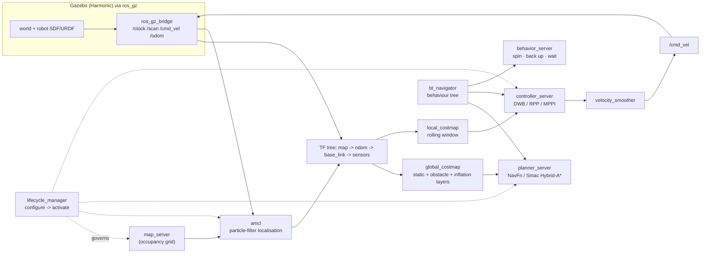

# ROS 2 Sim + Nav2 Lab

Autonomous navigation taught by running it: **graph → launch → simulate → localise → plan → control**,
following the first-principles, run-it-yourself approach in [`AGENTS.md`](../../../AGENTS.md). Everything
here is free and open source, and the whole lab works in simulation with no robot hardware.

## When to use

- The learner can run `ros2 run` but cannot explain what a launch file, a lifecycle node, or a costmap is.
- The robot "doesn't move": no `/cmd_vel`, an empty costmap, a lifecycle node stuck in `unconfigured`, or
  a TF tree missing `map → odom → base_link`.
- They need a reproducible simulated stack before touching a real, expensive robot.
- Don't use it for plain ROS 2 message/node authoring in isolation — see
  [ros2-nodes-lab](../ros2-nodes-lab/SKILL.md) — or for embedded motor firmware, see
  [zephyr-rtos-lab](../zephyr-rtos-lab/SKILL.md).

## First principles: a robot is a graph plus a transform tree

ROS 2 (Open Robotics / Open Source Robotics Foundation) is a peer-to-peer graph over DDS: nodes discover
each other, publish/subscribe topics, call services, and run long tasks as **actions**. Nav2 is a set of
*managed lifecycle* nodes coordinated by a behaviour tree.

Use the **current LTS distribution** — as of 2026 that is **Jazzy Jalisco** (released May 2024, supported
to May 2029, on Ubuntu 24.04), paired with **Gazebo Harmonic** (LTS) through `ros_gz`. ROS 2 ships a new
LTS every even-numbered May, so **confirm the active LTS and its Ubuntu/Gazebo pairing on `docs.ros.org`
(Releases page) before you install** rather than trusting any tutorial, including this one.



| Nav2 server | Answers | Swap it when |
| --- | --- | --- |
| `map_server` | "what does the world look like?" | switching to SLAM (`slam_toolbox`) instead of a static map |
| `amcl` | "where am I on that map?" | you have external localisation (GPS/VIO) |
| `planner_server` | "what global route?" | Ackermann/car-like → Smac Hybrid-A* instead of NavFn |
| `controller_server` | "what velocity right now?" | tight spaces/dynamic obstacles → MPPI; path-following → RPP |
| `behavior_server` | "how do I recover?" | custom recovery (dock, reverse-out, call a human) |
| `bt_navigator` | "what is the mission logic?" | you need a different XML behaviour tree |

| CLI you must know | Answers |
| --- | --- |
| `ros2 node list` / `ros2 node info /x` | is the node alive, and what does it publish? |
| `ros2 topic list -t` / `ros2 topic echo /scan --once` / `ros2 topic hz /scan` | is data flowing, and at what rate? |
| `ros2 interface show nav2_msgs/action/NavigateToPose` | what exactly must a goal contain? |
| `ros2 lifecycle get /planner_server` | is the managed node `active` or silently `inactive`? |
| `ros2 run tf2_tools view_frames` | is `map → odom → base_link` complete and current? |
| `ros2 param get /controller_server <p>` | is the parameter you edited actually loaded? |

**Trade-off to say out loud:** the lifecycle indirection is annoying until a sensor dies — then it lets you
deactivate and reconfigure half the stack without killing the process, which is why Nav2 uses it.

## Procedure

1. **Install the current LTS** (verify the distro name on `docs.ros.org` first):
   ```bash
   sudo apt install -y ros-jazzy-desktop ros-jazzy-navigation2 ros-jazzy-nav2-bringup \
     ros-jazzy-ros-gz ros-jazzy-tf2-tools
   source /opt/ros/jazzy/setup.bash && printenv ROS_DISTRO
   ```
2. **Read the graph before writing code**: `ros2 run demo_nodes_cpp talker` in one shell, then
   `ros2 topic echo /chatter`, `ros2 topic hz /chatter`, `ros2 node info /talker`.
3. **List the launch files your install actually ships** — never copy a launch name from a blog:
   ```bash
   ls "$(ros2 pkg prefix nav2_bringup)/share/nav2_bringup/launch"
   ros2 launch nav2_bringup tb3_simulation_launch.py headless:=False   # name per the listing above
   ```
4. **Set the initial pose** in RViz ("2D Pose Estimate") — AMCL cannot publish `map → odom` until it has a
   hypothesis, and every "the robot won't move" ticket starts here.
5. **Send a goal from the CLI**, not just the RViz button, so the learner sees the action contract:
   ```bash
   ros2 action send_goal /navigate_to_pose nav2_msgs/action/NavigateToPose \
     "{pose: {header: {frame_id: map}, pose: {position: {x: 1.5, y: 0.5, z: 0.0},
       orientation: {w: 1.0}}}}" --feedback
   ```
6. **Watch the stack work**: `ros2 topic echo /cmd_vel`, `ros2 topic echo /plan --once`,
   and the costmaps in RViz. Confirm whether your Nav2 publishes `geometry_msgs/Twist` or
   `TwistStamped` (`ros2 topic list -t`) — recent releases gate this behind `enable_stamped_cmd_vel`.
7. **Write your own launch file** (worked example below) so simulation, bridge and `use_sim_time` come up
   together and reproducibly.
8. **Tune one thing with evidence**: raise `inflation_radius` in the costmap params, relaunch, and observe
   the path move away from walls. Change one parameter at a time.
9. **Break it deliberately**: `ros2 lifecycle set /controller_server deactivate`, watch `/cmd_vel` stop
   while the planner still publishes `/plan`, then reactivate. Close with the **Learning Footer**.

## Output shape

```
Goal: <what the robot must achieve>
Distro: <ROS 2 LTS, confirmed on docs.ros.org>   Sim: <Gazebo Harmonic via ros_gz>   RMW: <rmw_fastrtps_cpp>
Graph: nodes <...>  topics <...>  actions </navigate_to_pose ...>   use_sim_time: <true|false>
TF: map -> odom (<amcl|slam_toolbox>) -> base_link (<odom source>) -> <sensor frames>   complete? <y/n>
Nav2 config: planner=<NavFn|Smac> controller=<DWB|RPP|MPPI> costmap layers=<static,obstacle,inflation>
Launch: ros2 launch <pkg> <file> <args>
Evidence: /scan @<Hz> · /cmd_vel @<Hz> · /plan poses=<n> · lifecycle states=<all active?>
Symptom -> cause -> fix: <robot still> -> <no initial pose | inactive node | missing TF> -> <action>
Next: <ros2-nodes-lab | zephyr-rtos-lab | openxr-xr-basics-coach>
Learning Footer
```

## Worked example — a launch file that starts Gazebo, bridges it, and hands off to Nav2

`my_robot_bringup/launch/sim_bringup.launch.py`. The bridge argument syntax is
`<ros_topic>@<ros_msg>[<direction>]<gz_msg>`, where `@` is bidirectional, `[` is gz→ROS and `]` is ROS→gz.

```python
from launch import LaunchDescription
from launch.actions import DeclareLaunchArgument, IncludeLaunchDescription
from launch.launch_description_sources import PythonLaunchDescriptionSource
from launch.substitutions import LaunchConfiguration, PathJoinSubstitution
from launch_ros.actions import Node
from launch_ros.substitutions import FindPackageShare


def generate_launch_description():
    world = LaunchConfiguration('world')
    use_sim_time = LaunchConfiguration('use_sim_time')

    gz = IncludeLaunchDescription(
        PythonLaunchDescriptionSource(PathJoinSubstitution(
            [FindPackageShare('ros_gz_sim'), 'launch', 'gz_sim.launch.py'])),
        launch_arguments={'gz_args': ['-r ', world]}.items(),
    )

    # Gazebo owns simulated time: everything downstream MUST use_sim_time:=true.
    bridge = Node(
        package='ros_gz_bridge', executable='parameter_bridge', output='screen',
        arguments=[
            '/clock@rosgraph_msgs/msg/Clock[gz.msgs.Clock',
            '/scan@sensor_msgs/msg/LaserScan[gz.msgs.LaserScan',
            '/odom@nav_msgs/msg/Odometry[gz.msgs.Odometry',
            '/cmd_vel@geometry_msgs/msg/Twist]gz.msgs.Twist',
        ],
        parameters=[{'use_sim_time': use_sim_time}],
    )

    nav2 = IncludeLaunchDescription(
        PythonLaunchDescriptionSource(PathJoinSubstitution(
            [FindPackageShare('nav2_bringup'), 'launch', 'navigation_launch.py'])),
        launch_arguments={'use_sim_time': use_sim_time,
                          'params_file': PathJoinSubstitution(
                              [FindPackageShare('my_robot_bringup'), 'config', 'nav2.yaml'])}.items(),
    )

    return LaunchDescription([
        DeclareLaunchArgument('world', default_value='empty.sdf'),
        DeclareLaunchArgument('use_sim_time', default_value='true'),
        gz, bridge, nav2,
    ])
```

```bash
colcon build --packages-select my_robot_bringup && source install/setup.bash
ros2 launch my_robot_bringup sim_bringup.launch.py world:=empty.sdf
# verify, in another shell:
ros2 topic hz /scan          # ~10 Hz if the bridge and sensor are alive
ros2 lifecycle get /planner_server   # must print "active"
ros2 run tf2_tools view_frames       # writes frames.pdf — check map -> odom -> base_link
```

## Tips

- **`use_sim_time` must be true everywhere** when Gazebo is running. One node on wall-clock time makes TF
  lookups fail with "extrapolation into the future" and the stack silently stalls.
- No `/cmd_vel`? Check, in order: initial pose set → `map → odom` TF exists → lifecycle nodes `active` →
  costmap not entirely lethal → goal frame is `map`.
- An empty costmap almost always means the laser topic name or `sensor_frame` in the obstacle layer does
  not match what the bridge publishes. Verify with `ros2 topic echo /scan --once`.
- Nav2 parameters live in a YAML per node with a `ros__parameters:` block — a typo yields a *default*, not
  an error. Confirm with `ros2 param get`.
- QoS mismatch (a `BEST_EFFORT` publisher, a `RELIABLE` subscriber) silently delivers nothing; check with
  `ros2 topic info /scan --verbose`.
- Prefer `ros2 launch` over many `ros2 run` shells: launch files are the reproducible artefact you review.
- Pair with [ros2-nodes-lab](../ros2-nodes-lab/SKILL.md) for node/topic authoring,
  [zephyr-rtos-lab](../zephyr-rtos-lab/SKILL.md) for the motor-controller firmware,
  [openxr-xr-basics-coach](../openxr-xr-basics-coach/SKILL.md) for teleop/XR interfaces,
  [state-machine-visualizer](../state-machine-visualizer/SKILL.md) for behaviour trees, and
  [debugging-coach](../debugging-coach/SKILL.md) for systematic fault isolation.
  End with the **Learning Footer** (`AGENTS.md`).
