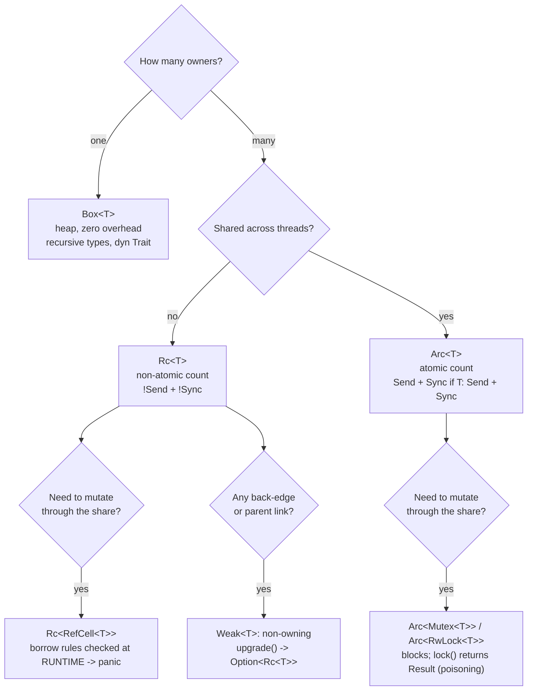

# Rust Smart Pointers Lab

Every Rust smart pointer answers three questions: **who owns it, who may see it, and who may mutate it.**
Pick the pointer by answering those, not by trying types until it compiles — first principles and cited
sources per [`AGENTS.md`](../../../AGENTS.md).

## When to use

- A learner is fighting the borrow checker and reaching for `Rc<RefCell<T>>` as a workaround.
- They need a graph/tree with parent links, or shared mutable state across threads.
- They hit `already borrowed: BorrowMutError` at runtime, or memory that is never freed.
- Don't use it to learn the borrow rules themselves — start with
  [rust-ownership-lab](../rust-ownership-lab/SKILL.md) and [rust-borrowing-lab](../rust-borrowing-lab/SKILL.md).

## First principles: owners × threads × mutability

The Rust Book ch. 15 frames these as types that own data and implement `Deref`/`Drop`. The decision is
mechanical once you answer the three questions.



| Type | Owners | Thread-safe | Mutation | Failure mode |
| --- | --- | --- | --- | --- |
| `Box<T>` | 1 | moves with `T` | via `&mut` | none — compile-time only |
| `Rc<T>` | n | **no** (`!Send`/`!Sync`) | none (shared = immutable) | cycles leak silently |
| `Arc<T>` | n | yes | none | atomic count costs cache traffic |
| `Cell<T>` | — | `!Sync` | `get`/`set`, `Copy` only | no references handed out |
| `RefCell<T>` | — | `!Sync` | `borrow`/`borrow_mut` | **panics** at runtime on violation |
| `Mutex<T>` | — | yes | `lock()` | deadlock; poisoned on panic |
| `RwLock<T>` | — | yes | `read()`/`write()` | writer starvation, poisoning |
| `Weak<T>` | 0 (non-owning) | matches `Rc`/`Arc` | — | `upgrade()` returns `None` after drop |

**Leaks are safe.** Rust guarantees memory *safety*, not absence of leaks: two `Rc`s pointing at each other
keep both strong counts at ≥1 forever, and neither destructor runs. `Weak` fixes that — it holds the
allocation alive but not the value, so `upgrade()` yields `None` once the last strong reference is gone.

**Drop order** is defined: local variables drop in **reverse** declaration order, struct fields in
declaration order, and `Vec` elements front to back. You may not call `x.drop()` directly — use
`std::mem::drop(x)`. `Deref` is what lets `Box<T>`/`Rc<T>` be used wherever `&T` is expected (deref coercion),
which is also why `Rc<T>` exposes `T`'s methods and you must write `Rc::clone(&a)`, `Rc::strong_count(&a)` as
associated functions to avoid shadowing them.

## Procedure

1. **Answer the three questions out loud** — owners, threads, mutation — and read the pointer off the
   flowchart. Most "I need `Rc<RefCell<>>`" cases are actually one owner plus a borrow.
2. **Default to `Box<T>`** for heap allocation, recursive types (`enum List { Cons(i32, Box<List>), Nil }`)
   and trait objects (`Box<dyn Error>`).
3. **Use `Rc` only inside one thread.** It is `!Send`, so the compiler stops you; upgrading to `Arc` costs an
   atomic RMW per clone/drop — real but usually small.
4. **Add interior mutability last**, and pick the narrowest: `Cell` for `Copy` scalars, `RefCell` for
   single-threaded, `Mutex`/`RwLock` across threads. `RefCell` moves the borrow check to runtime — the same
   rules, later diagnostics.
5. **Keep guard lifetimes short.** Bind `let v = cell.borrow_mut();` in the tightest scope; holding one across
   a call that borrows again is the classic `BorrowMutError`. The same discipline avoids `Mutex` deadlock.
6. **Make every back-edge `Weak`** (child → parent, cache → owner, observer → subject). Strong edges must
   form a DAG or you have a leak.
7. **Prefer channels or a scoped thread** over shared mutable state when you can — `std::thread::scope`
   (Rust 1.63+) borrows without `Arc` at all.
8. **Build and check:** `cargo new ptr_lab && cd ptr_lab`, paste into `src/main.rs`, then
   `cargo run`, `cargo clippy -- -D warnings`, and `cargo +nightly miri run` — Miri reports "the evaluated
   program leaked memory" for a genuine `Rc` cycle. Introduce one on purpose, watch Miri catch it, then fix
   it with `Weak`. Close with the **Learning Footer**.

## Output shape

```
Problem:      owners=<1|n>  threads=<1|n>  mutate-through-share=<yes|no>
Pointer:      <Box|Rc|Arc|Rc<RefCell<T>>|Arc<Mutex<T>>|Weak>   Runner-up: <x> — rejected because <...>
Back-edges:   <edge> -> Weak   (strong graph is a DAG: <yes|no>)
Borrow check: compile-time | runtime (RefCell -> panic) | blocking (Mutex -> deadlock risk)
Counts:       strong=<n> weak=<n> at <point in the program>
Drop order:   <expected sequence, reverse declaration order>
Run:          cargo run   ·   cargo clippy -- -D warnings   ·   cargo +nightly miri run
Expected output: <traced lines>
Next: <rust-lifetimes-lab | rust-async-lab | memory-model-lockfree-coach>
Learning Footer
```

## Worked example — a tree with `Weak` parents, then an `Arc<Mutex<T>>` counter

```rust
// src/main.rs — cargo run   (Rust 2021/2024 edition, stable)
use std::cell::RefCell;
use std::rc::{Rc, Weak};
use std::sync::{Arc, Mutex};
use std::thread;

#[derive(Debug)]
struct Node {
    label: &'static str,
    parent: RefCell<Weak<Node>>,   // back-edge: non-owning, so no cycle
    kids: RefCell<Vec<Rc<Node>>>,  // forward edge: owning
}

impl Node {
    fn new(label: &'static str) -> Rc<Node> {
        Rc::new(Node { label, parent: RefCell::new(Weak::new()), kids: RefCell::new(Vec::new()) })
    }
}

impl Drop for Node {
    fn drop(&mut self) { println!("drop {}", self.label); }
}

fn main() {
    let leaf = Node::new("leaf");
    println!("leaf: strong={} weak={}", Rc::strong_count(&leaf), Rc::weak_count(&leaf));
    {
        let root = Node::new("root");
        root.kids.borrow_mut().push(Rc::clone(&leaf));    // guard dropped at end of statement
        *leaf.parent.borrow_mut() = Rc::downgrade(&root);
        println!("root: strong={} weak={}", Rc::strong_count(&root), Rc::weak_count(&root));
        println!("leaf: strong={} weak={}", Rc::strong_count(&leaf), Rc::weak_count(&leaf));
        println!("leaf parent = {:?}", leaf.parent.borrow().upgrade().map(|n| n.label));
    } // root's strong count hits 0 here

    println!("after scope, leaf parent = {:?}", leaf.parent.borrow().upgrade().map(|n| n.label));
    println!("leaf: strong={} weak={}", Rc::strong_count(&leaf), Rc::weak_count(&leaf));

    let counter = Arc::new(Mutex::new(0u64));
    let mut handles = Vec::new();
    for _ in 0..8 {
        let c = Arc::clone(&counter);
        handles.push(thread::spawn(move || {
            for _ in 0..1_000 {
                *c.lock().unwrap() += 1; // lock() -> Result because a panic poisons the mutex
            }
        }));
    }
    for h in handles { h.join().unwrap(); }
    println!("counter = {}", *counter.lock().unwrap());
    println!("arc strong = {}", Arc::strong_count(&counter));
}
```

Traced output:

```
leaf: strong=1 weak=0
root: strong=1 weak=1
leaf: strong=2 weak=0
leaf parent = Some("root")
drop root
after scope, leaf parent = None
leaf: strong=1 weak=0
counter = 8000
arc strong = 1
drop leaf
```

Follow the counts: pushing `Rc::clone(&leaf)` into `root.kids` takes `leaf` to **strong=2**, while
`Rc::downgrade(&root)` only raises root's **weak** count — so when the block ends root's strong count reaches
0, `Drop` runs immediately (`drop root`), and dropping its `kids` vector returns `leaf` to strong=1. That is
why `upgrade()` afterwards is `None`: the value is gone even though the allocation survives until `leaf`
drops its `Weak`. Make `parent` an `Rc<Node>` instead and neither `drop` line ever prints — Miri reports the
leak. The counter is exactly `8 × 1000 = 8000` because the `Mutex` serialises the read-modify-write; and
`arc strong = 1` because every clone was moved into a thread that has since ended. Finally, `drop leaf` is
last, at the close of `main`, showing reverse-declaration drop order. If you cloned the borrow guard —
`let a = leaf.kids.borrow_mut(); let b = leaf.kids.borrow_mut();` — the second line panics with
`already borrowed: BorrowMutError`.

## Tips

- `Rc<RefCell<T>>` is a design smell more often than a solution — try restructuring to one owner plus `&mut`,
  an index/arena, or message passing first.
- Write `Rc::clone(&a)`, not `a.clone()`: it makes a cheap refcount bump visually distinct from a deep copy.
- `RefCell` does not relax the borrow rules; it *defers* them. The panic is the same violation, found later.
- `Mutex::lock` returns a `Result` because a panic while holding the lock poisons it — handle it, don't
  reflexively `unwrap()` in library code.
- Cycles leak, and leaking is safe Rust; Miri and heap profilers find them, the type system will not.
- Prefer `std::thread::scope` (1.63+) or channels over `Arc<Mutex<_>>` when the lifetime allows —
  [rust-async-lab](../rust-async-lab/SKILL.md) for the async equivalents.
- Contrast with C++'s `shared_ptr`/`weak_ptr` in [cpp-smart-pointers-raii-lab](../cpp-smart-pointers-raii-lab/SKILL.md)
  and with atomics in [memory-model-lockfree-coach](../memory-model-lockfree-coach/SKILL.md); pair with
  [rust-lifetimes-lab](../rust-lifetimes-lab/SKILL.md). Cite the Rust Book and std docs by version
  (`AGENTS.md` §2) and finish with the **Learning Footer** (`AGENTS.md`).
