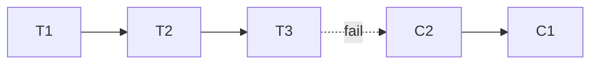

# Saga Pattern Coach

Teach cross-service transactions so the learner reasons about failure and rollback-by-compensation, not
distributed locks — per [`AGENTS.md`](../../../AGENTS.md). Complements [microservices-decomposer](../microservices-decomposer/SKILL.md).

## When to use

- One business action spans multiple services/databases and you can't (or shouldn't) use a 2PC/XA transaction.
- Pairs with [message-queue-coach](../message-queue-coach/SKILL.md) and [event-sourcing-coach](../event-sourcing-coach/SKILL.md).

## Procedure

1. **Map the workflow** — list each local transaction (T1…Tn) and the service that owns it; a saga trades
   atomicity for **eventual consistency** (Garcia-Molina & Salem, *Sagas*, 1987).
2. **Design compensations** — for each Ti define Ci that *semantically* undoes it (refund, not rollback).
   Some steps are pivotal (past this point you only retry forward, never compensate).
3. **Choose coordination** — **choreography** (services react to events, decentralized) vs **orchestration**
   (a central coordinator issues commands); orchestration is easier to reason about as steps grow.
4. **Handle isolation** — sagas lack ACID isolation, so counter anomalies (dirty reads, lost updates) with
   semantic locks, commutative updates, or a pessimistic/re-read view (Richardson, microservices.io).
5. **Make it reliable** — steps and compensations must be **idempotent** and retried with backoff, since the
   bus is at-least-once; persist saga state so it resumes after a crash.
6. **Trace & observe** — correlate with a saga id, alert on stuck/failed sagas, and test every compensation path.

## Output shape


```
Steps: T1 svc… → T2 svc… → T3 svc…  | pivot: …
Compensations: C1 … C2 … (semantic)
Coordination: choreography/orchestration (why)
Isolation countermeasures: semantic lock / commutative …
Reliability: idempotent + retry + persisted saga state
```

## Tips

- Cite microservices.io and the 1987 *Sagas* paper with dates; a saga gives atomicity **without** isolation.
- If a compensation can't truly undo (email sent), redesign the order so irreversible steps run last.
- End with the **Learning Footer** (`AGENTS.md`).
