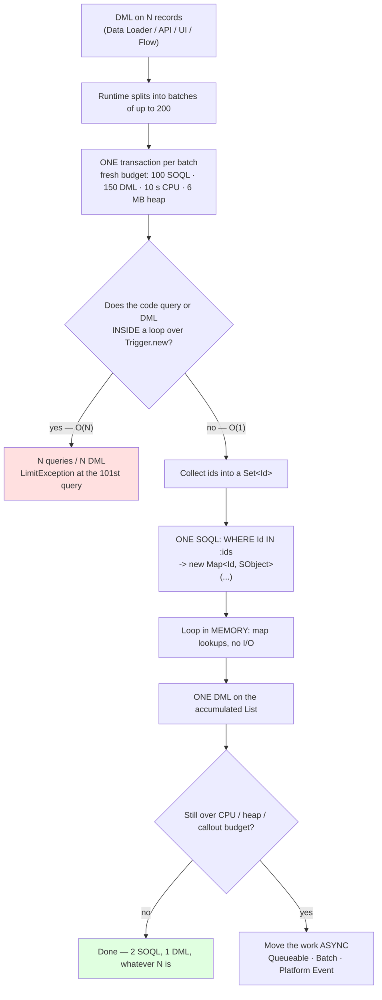

# Salesforce Governor Limits Coach

Governor limits taught from their cause, not as a list to memorise: **the org is multitenant, so every
transaction gets a budget, and code that scales with record count spends it linearly.** Follows the
first-principles, verify-against-the-source approach in [`AGENTS.md`](../../../AGENTS.md). Every number and
API below comes from the **Salesforce Apex Developer Guide** — chapters *Execution Governors and Limits*,
*Asynchronous Apex*, *Trigger and Bulk Request Best Practices* and *Triggers and Order of Execution* — plus
the **Query & Search Optimization Cheat Sheet** on Salesforce Architects.

> ⚠ **Every number in this skill is release-volatile.** Salesforce publishes a new version of the Apex
> Developer Guide each release (Spring / Summer / Winter). Treat the tables below as the *shape* of the
> budget, then confirm the exact figure in the guide for **your org's API version** before relying on it —
> and prefer reading the live value with the `Limits` class over quoting any document at all.

## When to use

- Code works in a sandbox with 5 records and throws `System.LimitException: Too many SOQL queries: 101` on a
  real data load.
- A trigger, flow and managed package all fire in one transaction and nobody can say who spent the budget.
- The learner must choose between `@future`, `Queueable`, `Batchable` and Platform Events and is picking by
  familiarity rather than by constraint.
- A query that was fine last year now throws *"Non-selective query against large object type"*.
- **Don't use it for** first-time Apex/SOQL syntax and the free-org setup — see
  [apex-soql-lab](../apex-soql-lab/SKILL.md) — or for front-end work
  ([lwc-component-lab](../lwc-component-lab/SKILL.md)).

## First principles: one transaction, one shared budget

Salesforce runs many customers on shared infrastructure. Nothing stops one tenant's runaway loop from
starving everyone else *except* a hard, per-transaction resource budget enforced by the runtime. That single
design constraint produces every rule that follows.

Three properties matter more than the numbers:

1. **The budget is per transaction, not per class.** Your trigger, someone else's trigger, a Flow, a managed
   package and a workflow field update all draw on the *same* 100 queries.
2. **`LimitException` cannot be caught.** There is no `try/catch` rescue and no partial commit — the whole
   transaction rolls back. Limits must be *designed for*, not handled.
3. **A trigger fires once per batch of up to 200 records**, not once per record. A 10 000-row Data Loader
   job is 50 separate transactions of 200, each with a fresh budget. Code that is O(records) in queries dies
   at 101; code that is O(1) never notices the volume.



*Fig. 1 — the only decision that matters. Everything left of the diamond is folklore; everything right of it
is design. Note the last branch: async is not a way to *cheat* limits, it is a way to get a **new
transaction** with its own budget.*

### The budget (verify against your release)

| Resource | Synchronous | Asynchronous | Read it live with |
| --- | --- | --- | --- |
| SOQL queries issued | 100 | 200 | `Limits.getQueries()` / `getLimitQueries()` |
| Rows retrieved by SOQL | 50 000 | 50 000 | `Limits.getQueryRows()` |
| DML statements | 150 | 150 | `Limits.getDmlStatements()` |
| Rows processed per DML request | 10 000 | 10 000 | `Limits.getDmlRows()` |
| SOSL queries | 20 | 20 | `Limits.getSoslQueries()` |
| CPU time | 10 000 ms | 60 000 ms | `Limits.getCpuTime()` |
| Heap size | 6 MB | 12 MB | `Limits.getHeapSize()` |
| Callouts per transaction | 100 | 100 | `Limits.getCallouts()` |
| `@future` calls per transaction | 50 | (1 from async) | `Limits.getFutureCalls()` |
| Jobs added by `System.enqueueJob` | 50 | (1 child from async) | `Limits.getQueueableJobs()` |

**CPU time is the subtle one.** It counts *your* Apex execution only — it excludes time waiting on the
database, on callouts, and on the Salesforce platform itself. So a "slow" transaction can pass while a fast
one with a nested loop fails. Nested iteration is almost always the cause:

$$ \text{iterations} = N_{\text{outer}} \times N_{\text{inner}} \quad\text{versus}\quad N_{\text{outer}} + N_{\text{inner}} \ \text{with a Map} $$

200 records against 5 000 related rows is $200 \times 5000 = 1{,}000{,}000$ iterations nested, versus
$5000 + 200 = 5200$ with a `Map<Id, ...>` lookup — a **192×** reduction in work for a five-line change.

### Query selectivity — the limit that appears later

A query in a trigger against an object with a large row count must be **selective** or the runtime rejects it
outright. Selectivity means the `WHERE` clause can use an index and the filter matches a small enough
fraction of rows. Practical rules:

- Filter on **indexed** fields: `Id`, `Name`, `OwnerId`, `CreatedDate`, `SystemModstamp`, lookup/master-detail
  fields, `External Id` and `Unique` custom fields (custom indexes can be requested from Salesforce Support).
- Index-defeating patterns: leading wildcards (`LIKE '%acme'`), `!=`, `NOT IN`, `OR` across different fields,
  comparisons on formula fields, and filtering on `null` for some field types.
- ⚠ The exact selectivity **thresholds** (a percentage of rows, capped at an absolute row count) are
  documented in the Query & Search Optimization Cheat Sheet and have been revised — look them up rather than
  quoting a remembered figure, and use the **Query Plan** tool in the Developer Console to see the actual
  cost and chosen index.

### Choosing an async mechanism

| Mechanism | Arguments | Chaining | Callouts | Best for | Watch out |
| --- | --- | --- | --- | --- | --- |
| `@future` | **primitives only** (pass record Ids, not sObjects), `static void` | ❌ | with `(callout=true)` | the simplest fire-and-forget | no job id, hard to monitor, can't chain — legacy |
| `Queueable` | any type, including sObjects | ✅ (one child job from an async context) | `Database.AllowsCallouts` | most new async work; returns an `AsyncApexJob` id | one child only — chains, not fans out |
| `Batchable` | `Database.QueryLocator` over very large row counts | via `finish()` | `Database.AllowsCallouts` | processing far more rows than one transaction can hold | each `execute` scope gets **fresh limits**; use `Database.Stateful` to carry state |
| `Schedulable` | cron expression via `System.schedule` | schedules others | indirectly | recurring work | scheduled-job count is capped |
| Platform Events / CDC | event payload | — | in the subscriber | decoupling, fan-out, cross-system | at-least-once delivery ⇒ subscribers must be idempotent |

**Async is a fresh transaction, not an exemption.** A `Queueable` gets its own 200 queries and 60 s of CPU —
badly bulkified code fails there too, just later and less visibly.

## Procedure

1. **Reproduce with volume, not with one record.** Write a test that inserts **200** records in a single DML.
   A test that passes with one record proves nothing about limits.
2. **Measure before theorising.** Instrument the transaction:
   ```apex
   System.debug(LoggingLevel.ERROR, String.format(
       'SOQL {0}/{1} · rows {2}/{3} · DML {4}/{5} · CPU {6}/{7} ms · heap {8}/{9}',
       new List<Object>{ Limits.getQueries(),       Limits.getLimitQueries(),
                         Limits.getQueryRows(),     Limits.getLimitQueryRows(),
                         Limits.getDmlStatements(), Limits.getLimitDmlStatements(),
                         Limits.getCpuTime(),       Limits.getLimitCpuTime(),
                         Limits.getHeapSize(),      Limits.getLimitHeapSize() }));
   ```
   Then read the `LIMIT_USAGE_FOR_NS` block at the end of the debug log
   (`sf apex get log --number 1`) to see the whole transaction, including other people's code.
3. **Identify which budget line is actually exhausted.** The four failure modes have four different fixes —
   never apply the DML fix to a CPU problem.
4. **Bulkify: hoist every SOQL and DML out of every loop.** The canonical shape is
   *collect ids into a `Set` → one bound query → build a `Map` → loop in memory → one DML at the end*.
5. **Prefer aggregate queries and SOQL `for` loops for volume.** `SELECT AccountId, SUM(Amount) ... GROUP BY`
   returns a handful of `AggregateResult` rows instead of thousands of sObjects; and
   `for (Account a : [SELECT ...])` streams in chunks of 200, keeping the heap flat where
   `List<Account> all = [SELECT ...]` would not.
6. **Replace nested loops with Maps.** Any `for (X x : xs) { for (Y y : ys) {...} }` over non-trivial
   collections is a CPU-time incident waiting to happen — index `ys` by key once, then look up.
7. **Query only the fields you need**, and make every trigger query **selective** (indexed field, no leading
   wildcard, no `!=` on the driving filter). Check it with the Developer Console **Query Plan**.
8. **Guard recursion.** A `static Boolean`/`static Set<Id>` of processed ids lives for the *transaction*;
   remember the trigger can legitimately re-fire (workflow field updates re-run before/after update
   triggers), so write the guard for repeated invocation.
9. **Only update records that actually changed.** It halves DML rows and short-circuits recursive re-entry.
10. **Move to async when a single transaction genuinely cannot hold the work** — and choose from the table
    above by *constraint* (does it need sObject arguments? chaining? more rows than 50 000?), not by habit.
11. **Respect callout ordering**: you cannot make a callout after uncommitted DML in the same transaction.
    Do the callout first, or move it into `Queueable`/`@future` with `callout=true`.
12. **Assert limits in tests.** Wrap the code under test in `Test.startTest()`/`Test.stopTest()` (which grants
    a fresh set of limits and flushes queued async work) and assert `Limits.getQueries()` stayed constant as
    volume grew. Close with the **Learning Footer**.

## Output shape

```
Scenario: <trigger | batch | service | integration>   Object(s): <...>   Volume to survive: <N records>
API version: <from sfdx-project.json>   Release: <Spring/Summer/Winter YY>   (limits verified against: <source>)
Failing limit: <SOQL 101 | DML 151 | CPU 10s | heap 6MB | query rows 50k | non-selective query>
Measured BEFORE:
  SOQL <n>/<limit> · rows <n>/<limit> · DML <n>/<limit> · CPU <n> ms/<limit> · heap <n>/<limit>
Root cause: <SOQL in loop | DML in loop | nested iteration O(NxM) | unbounded list on heap | no index>
Complexity: before O(<...>) per transaction  ->  after O(<...>)
Fix applied:
  [ ] ids collected into Set<Id>, single bound query (WHERE Id IN :ids)
  [ ] Map<Id, SObject> lookup replaces nested loop        (<N x M> -> <N + M> iterations)
  [ ] aggregate query / SOQL for-loop instead of a full List
  [ ] one DML on an accumulated List; only changed records included
  [ ] recursion guard (static) written for repeated invocation
  [ ] selective query confirmed via Query Plan (index used: <...>)
Measured AFTER (same 200-record test):
  SOQL <n>/<limit> · DML <n>/<limit> · CPU <n> ms · heap <n>   -> headroom <...>
Async decision: <none | @future | Queueable | Batch | Scheduled | Platform Event>   because <constraint>
  chaining/idempotency: <...>   callout-after-DML avoided: <y/n>
Tests: 200-record bulk test <pass/fail> · limit assertions <...> · Test.startTest/stopTest around code under test <y>
Version-volatile numbers to re-verify: <...>
Next: <apex-soql-lab | test-writer | code-review-coach>
Learning Footer
```

## Worked example — a rollup that dies at 101, and the version that never will

**The failing code.** It reads perfectly well, which is exactly the problem:

```apex
// ANTI-PATTERN — do not ship. One query and one DML per record.
public class OpportunityRollupBad {
    public static void rollup(List<Opportunity> opps) {
        for (Opportunity o : opps) {                                    // up to 200 iterations
            Account a = [SELECT Id, Total_Open_Amount__c                // SOQL #1..#200  <-- in a loop
                         FROM Account WHERE Id = :o.AccountId];
            a.Total_Open_Amount__c = (a.Total_Open_Amount__c == null ? 0 : a.Total_Open_Amount__c)
                                     + o.Amount;
            update a;                                                   // DML #1..#200   <-- in a loop
        }
    }
}
```

**Trace the arithmetic.** With `N` records in `Trigger.new`, this issues `N` queries and `N` DML statements.
A Data Loader run splits at 200 per transaction, so `N = 200`, and the transaction dies on the **101st**
iteration with `System.LimitException: Too many SOQL queries: 101` — uncatchable, whole batch rolled back.
Even had the query limit been survivable, DML would have failed at 151. And notice the second bug the loop
hides: repeatedly querying and updating the *same* Account overwrites rather than accumulates.

**The bulk-safe version.** Same behaviour, O(1) in limits:

```apex
public with sharing class OpportunityRollup {
    public static void rollup(List<Opportunity> opps) {
        // 1. Collect the keys. No I/O here.
        Set<Id> accountIds = new Set<Id>();
        for (Opportunity o : opps) {
            if (o.AccountId != null) accountIds.add(o.AccountId);
        }
        if (accountIds.isEmpty()) return;                 // never spend a query on an empty set

        // 2. ONE selective query, bound to a collection. Map constructor gives O(1) lookup.
        Map<Id, Account> accounts = new Map<Id, Account>([
            SELECT Id, Total_Open_Amount__c
            FROM Account
            WHERE Id IN :accountIds                       // Id is indexed -> selective
        ]);                                               // SOQL 1

        // 3. ONE aggregate query: the database does the summing, so nothing lands on the heap.
        Map<Id, Decimal> totals = new Map<Id, Decimal>();
        for (AggregateResult ar : [
            SELECT AccountId aid, SUM(Amount) total
            FROM Opportunity
            WHERE AccountId IN :accountIds AND IsClosed = false
            GROUP BY AccountId
        ]) {                                              // SOQL 2
            totals.put((Id) ar.get('aid'), (Decimal) ar.get('total'));
        }

        // 4. Loop in memory. Map lookups, no queries, and only changed rows are collected.
        List<Account> toUpdate = new List<Account>();
        for (Id accId : accounts.keySet()) {
            Decimal newTotal = totals.containsKey(accId) ? totals.get(accId) : 0;
            Account a = accounts.get(accId);
            if (a.Total_Open_Amount__c != newTotal) {      // skip no-ops: fewer DML rows, breaks recursion
                a.Total_Open_Amount__c = newTotal;
                toUpdate.add(a);
            }
        }

        // 5. ONE DML.
        if (!toUpdate.isEmpty()) update toUpdate;          // DML 1

        System.debug(LoggingLevel.ERROR, 'SOQL ' + Limits.getQueries() + '/' + Limits.getLimitQueries()
            + ' · DML ' + Limits.getDmlStatements() + '/' + Limits.getLimitDmlStatements()
            + ' · CPU ' + Limits.getCpuTime() + ' ms');
    }
}
```

**The bulk test that actually proves it:**

```apex
@IsTest
private class OpportunityRollupTest {
    @IsTest
    static void survives200Records() {
        Account a = new Account(Name = 'Bulk Co');
        insert a;

        List<Opportunity> opps = new List<Opportunity>();
        for (Integer i = 0; i < 200; i++) {                 // the volume the runtime will really send
            opps.add(new Opportunity(Name = 'Opp ' + i, AccountId = a.Id, Amount = 10,
                                     StageName = 'Prospecting',
                                     CloseDate = Date.today().addDays(30)));
        }

        Test.startTest();                                   // fresh limits from here
        insert opps;                                        // trigger fires ONCE with 200 records
        Integer queriesUsed = Limits.getQueries();
        Test.stopTest();                                    // async work (if any) flushes here

        Account after = [SELECT Total_Open_Amount__c FROM Account WHERE Id = :a.Id];
        Assert.areEqual(2000, after.Total_Open_Amount__c.intValue(), '200 opportunities x 10');
        Assert.isTrue(queriesUsed <= 5, 'query count must not scale with record count, used: ' + queriesUsed);
    }
}
```

```bash
sf project deploy start --source-dir force-app
sf apex run test --tests OpportunityRollupTest --code-coverage --result-format human --wait 10
sf apex get log --number 1          # read the LIMIT_USAGE_FOR_NS block at the end
```

**Verify the numbers by hand.** 200 opportunities × `Amount` 10 = **2000**, which is what the assertion
checks. Limits used: **2 SOQL** (one for the Accounts, one aggregate) and **1 DML** — and crucially those are
*constants*: run it with 1 record or 200 and the counters are identical. The failing version consumed
`N` and `N`. That difference — O(N) versus O(1) in limit consumption — is the entire discipline, and
`Assert.isTrue(queriesUsed <= 5, ...)` is how you stop a future edit from quietly reintroducing a loop query.

If the transaction were still too big — say the rollup had to touch every Opportunity in the org — the
answer is not a cleverer query but a different transaction: `Database.Batchable` over a
`Database.QueryLocator`, where each scope of 200 gets its own fresh budget.

## Tips

- **Never** put SOQL, SOSL or DML inside a `for` loop. This one rule prevents the large majority of Apex
  production incidents.
- `LimitException` is **not catchable**. Design under the budget; there is no rescue path and no partial save.
- The budget is shared with *everything else in the transaction* — other triggers, Flows, managed packages,
  workflow field updates. Your 40-query class is fine alone and fatal in a busy org.
- CPU time excludes database and callout wait, so profile *your* loops. Replacing a nested loop with a `Map`
  turns $N \times M$ into $N + M$ — usually a two-order-of-magnitude win.
- Use a **SOQL for-loop** (`for (Account a : [SELECT ...])`) or an **aggregate query** whenever the result set
  could be large; assigning to a `List` loads everything onto a 6 MB heap.
- Async gives you a *new transaction*, not immunity. `Queueable` is the modern default (`@future` cannot
  chain, cannot take sObjects and returns no job id); `Batchable` is for row counts a single transaction
  cannot hold.
- Platform Events and CDC deliver **at least once**, so subscribers must be idempotent — see
  [idempotency-coach](../idempotency-coach/SKILL.md) and
  [message-queue-coach](../message-queue-coach/SKILL.md).
- Make trigger queries **selective** and confirm with the Developer Console **Query Plan**; a query that is
  fine at 10 000 rows can be rejected outright once the object grows, and the fix is an index, not more
  Apex — the same reasoning as [sql-indexing-lab](../sql-indexing-lab/SKILL.md).
- Never build SOQL by string concatenation with user input; use bind variables (see
  [sql-injection-defense](../sql-injection-defense/SKILL.md)) or `String.escapeSingleQuotes` with
  `WITH USER_MODE` / `WITH SECURITY_ENFORCED` where applicable.
- Re-verify every number against the Apex Developer Guide for **your** release before you quote it, and use
  the `Limits` class in preference to any document.
- Pair with [apex-soql-lab](../apex-soql-lab/SKILL.md) for the free Developer Edition org and syntax,
  [lwc-component-lab](../lwc-component-lab/SKILL.md) for the UI that calls this Apex,
  [test-writer](../test-writer/SKILL.md) for the bulk tests that prove it,
  [code-review-coach](../code-review-coach/SKILL.md) to catch loop-queries at review time, and
  [debugging-coach](../debugging-coach/SKILL.md) for reading the debug log methodically.
  End with the **Learning Footer** (`AGENTS.md`).
