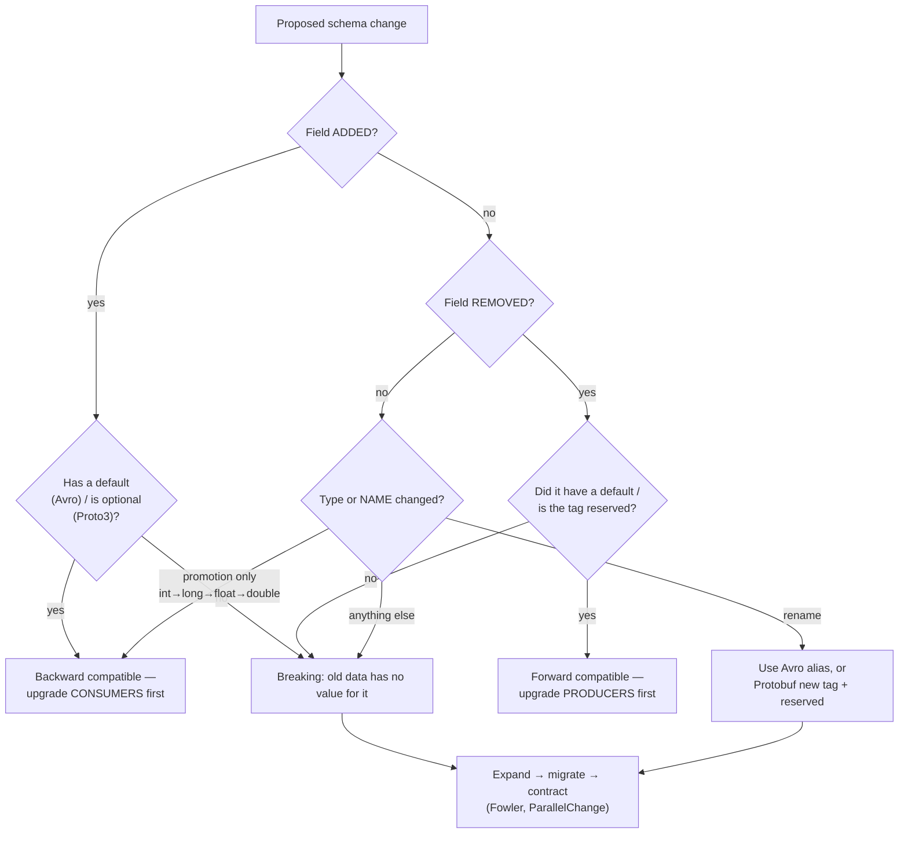

# Schema Evolution Coach

Every schema is a contract with readers you cannot redeploy atomically. This skill classifies a proposed
change against the *published resolution rules*, then sequences the rollout so no reader ever sees data it
cannot parse — first principles and named sources per [`AGENTS.md`](../../../AGENTS.md).

## When to use

- A field must be added, removed, renamed, or retyped in a topic payload, an RPC message, or a table.
- Schema Registry rejected a version and the error message means nothing to the team.
- You need the *deploy order* — producers first or consumers first? — and getting it wrong causes an outage.
- **Don't use it for** HTTP API surfaces and endpoint retirement — that's
  [api-versioning-coach](../api-versioning-coach/SKILL.md); or for choosing a serialization format at all —
  that's [data-contract-designer](../data-contract-designer/SKILL.md).

## First principles: the reader decides, so give the reader an escape hatch

Avro's specification defines **schema resolution** with both a writer's and a reader's schema present:
record fields are matched **by name**; a field in the writer but not the reader is ignored; a field in the
reader but not the writer is an error *unless the reader's field declares a default*; and `aliases` on the
reader let a renamed field still match. Protobuf's *Language Guide → Updating A Message Type* takes the
opposite tack: fields are matched by **number**, and proto3 preserves unknown fields (since 3.5) so an old
binary can round-trip data it does not understand. Same goal, two mechanisms.



| Confluent Schema Registry mode | Guarantee | Permitted changes | Upgrade **first** |
| --- | --- | --- | --- |
| `BACKWARD` (default) | new schema reads data written by the *previous* schema | delete a field; add an **optional** field (with default) | consumers |
| `BACKWARD_TRANSITIVE` | …reads data from **all** previous schemas | same | consumers |
| `FORWARD` | the *previous* schema reads data written by the new one | add a field; delete an **optional** field | producers |
| `FORWARD_TRANSITIVE` | …for all previous schemas | same | producers |
| `FULL` | both, against the previous version | add/delete optional fields only | either |
| `FULL_TRANSITIVE` | both, against all versions | same | either |
| `NONE` | nothing is checked | anything | hope |

That "upgrade first" column is the single most valuable line in this skill: **BACKWARD ⇒ consumers first,
FORWARD ⇒ producers first.** Reason it out — backward compatibility means the *new reader* handles *old
data*, so the reader must exist before the new writer does.

| Change | Avro | Protobuf (proto3) | JSON Schema | SQL |
| --- | --- | --- | --- | --- |
| Add field | safe **iff** it has a `default` | safe — new tag number, never reused | safe iff not in `required` | `ADD COLUMN` nullable = safe |
| Remove field | safe iff the reader keeps a default for it | safe **iff** you `reserved` the tag *and* the name | safe if it was optional | drop only after contract phase |
| Rename field | `aliases: ["old_name"]` on the reader's field | not a thing — new tag + `reserved` on the old | breaking | expand/contract, never in place |
| Widen type | `int→long→float→double`, `long→float→double`, `float→double`, `string↔bytes` | `int32/int64/uint32/uint64/bool` interchange (varint); `sint32↔sint64`; `fixed32↔sfixed32`; `fixed64↔sfixed64`; `string↔bytes` when valid UTF-8 | numeric widening only | `int→bigint` = rewrite, plan it |
| New enum value | needs an enum `default` on the reader (Avro 1.9+) or it errors | preserved as an unknown value in proto3 | breaking for `enum` keyword | add before any writer emits it |

## Procedure

1. **Name the format and the exact edit** in one line, then classify it with the flowchart above.
2. **Ask the resolution rule, not your intuition.** Cite the specification clause you relied on — Avro
   "Schema Resolution", Protobuf "Updating A Message Type" — in the design note.
3. **Set the compatibility mode explicitly per subject**, not globally by accident:
   ```bash
   curl -s -X PUT -H "Content-Type: application/vnd.schemaregistry.v1+json" \
     --data '{"compatibility":"FULL_TRANSITIVE"}' http://localhost:8081/config/user-value
   ```
4. **Dry-run the candidate before merging** — the registry will tell you exactly which rule you broke:
   ```bash
   curl -s -X POST -H "Content-Type: application/vnd.schemaregistry.v1+json" \
     --data @candidate.json \
     "http://localhost:8081/compatibility/subjects/user-value/versions/latest?verbose=true"
   # {"is_compatible":false,"messages":["READER_FIELD_MISSING_DEFAULT_VALUE: contact_email"]}
   ```
   For Protobuf, gate it in CI with buf: `buf breaking --against '.git#branch=main'`.
5. **Run expand → migrate → contract** (Fowler's bliki, *ParallelChange*), one deploy per phase:
   **expand** adds the new shape while the old keeps working → **migrate** dual-writes and backfills →
   **contract** removes the old shape once telemetry shows zero readers.
6. **For SQL, make each step non-blocking.** In PostgreSQL, `ADD COLUMN … DEFAULT` no longer rewrites the
   table (since PG 11); adding `NOT NULL` safely is two steps:
   ```sql
   ALTER TABLE users ADD COLUMN contact_email text;                       -- expand (instant)
   -- backfill in batches so you never hold a long transaction
   UPDATE users SET contact_email = email WHERE contact_email IS NULL AND id BETWEEN $1 AND $2;
   ALTER TABLE users ADD CONSTRAINT users_contact_email_nn
     CHECK (contact_email IS NOT NULL) NOT VALID;                          -- no full-table lock
   ALTER TABLE users VALIDATE CONSTRAINT users_contact_email_nn;           -- scans without blocking writes
   ALTER TABLE users DROP COLUMN email;                                    -- contract, weeks later
   ```
7. **Verify with real old data**, not synthetic: replay an archived payload through the new reader.
8. **Record the rollback**: which phase can be reverted freely (expand, migrate) and which cannot
   (contract). Then close with the **Learning Footer**.

## Output shape

```
Format: <Avro | Protobuf | JSON Schema | SQL>   Subject/message: <name>
Change: <one sentence>
Classification: <backward | forward | full | BREAKING> — rule: <spec clause you checked>
Compatibility mode in force: <BACKWARD|FORWARD|FULL|...>   Dry-run result: <is_compatible + message>
Deploy order: <consumers first | producers first | either> — because <the guarantee direction>
Plan:
  Expand   — <schema/DDL edit, both shapes valid>
  Migrate  — <dual-write + backfill command, batch size, expected duration>
  Contract — <removal, earliest date, evidence required: zero readers of <field>>
Rollback: expand/migrate = revertible; contract = NOT revertible (data gone)
CI guard: <schema-registry dry run | buf breaking | migration linter>
Verified against: <archived payload / production sample>
Next: <api-versioning-coach | schema-registry-lab | database-migration-coach>
Learning Footer
```

## Worked example — renaming `email` to `contact_email`

A rename is a delete plus an add, so naively it is breaking in **both** directions. Each format has one
legitimate escape hatch.

**Avro** — the reader declares an alias and a default, so it can read old *and* new records:

```json
{ "type": "record", "name": "User", "namespace": "dev.lab",
  "fields": [
    { "name": "id", "type": "string" },
    { "name": "contact_email", "type": ["null", "string"], "default": null,
      "aliases": ["email"] }
  ] }
```

Resolution: for an old record the writer's `email` matches the reader's alias; for a brand-new record
missing the field entirely, the `default: null` applies. **Check this in your registry with the dry-run
call above before relying on it** — alias handling in automated compatibility checkers has historically
lagged the specification, and a `is_compatible: false` there beats an incident.

**Protobuf** — numbers are the identity, so you add a new tag and permanently retire the old one:

```protobuf
syntax = "proto3";
package dev.lab;

message User {
  string id = 1;
  reserved 2;                  // never reuse tag 2 — old bytes on the wire still carry it
  reserved "email";            // and never reuse the name either
  string contact_email = 3;    // new tag; old readers keep it as an unknown field
}
```

**Rollout, with the deploy order derived rather than guessed** (subject on `BACKWARD`, so consumers first):

| Phase | Producers | Consumers | Safe because |
| --- | --- | --- | --- |
| 1 · Expand | still write `email` | deploy readers that accept **either** field | new reader handles old data |
| 2 · Migrate | write **both** fields; backfill history | read `contact_email`, fall back to `email` | every reader sees a value |
| 3 · Contract | stop writing `email`; `reserved` the tag | drop the fallback branch | telemetry shows zero `email` reads |

Skip phase 2 and any consumer that lagged one deploy gets a record with no email at all — which is exactly
how "compatible" schema changes cause pages.

## Tips

- **Every** Avro field you might ever remove needs a `default` from day one; retrofitting one later is
  itself a compatibility event.
- Never reuse a Protobuf field number, even for a "compatible" type — old bytes still decode against it and
  will silently land in the wrong field. `reserved` both the number and the name.
- `NONE` compatibility is not a strategy; it just moves the failure from the registry to production.
- Transitive modes matter once you have replayable history (Kafka, event stores): non-transitive checks
  only compare against the *latest* version, so a three-hop evolution can break a consumer replaying day 1.
- A default of `0`/`""` is indistinguishable from an unset value in proto3 scalars — use `optional` (proto3
  field presence) when "absent" and "zero" must differ.
- Practise the registry mechanics in [schema-registry-lab](../schema-registry-lab/SKILL.md); sequence table
  changes with [database-migration-coach](../database-migration-coach/SKILL.md); align the HTTP surface
  with [api-versioning-coach](../api-versioning-coach/SKILL.md); guard consumers with
  [contract-testing-coach](../contract-testing-coach/SKILL.md) and
  [data-contract-designer](../data-contract-designer/SKILL.md); see it end-to-end in
  [kafka-producer-lab](../kafka-producer-lab/SKILL.md) and
  [flink-local-lab](../flink-local-lab/SKILL.md). Close with the **Learning Footer** (`AGENTS.md`).
