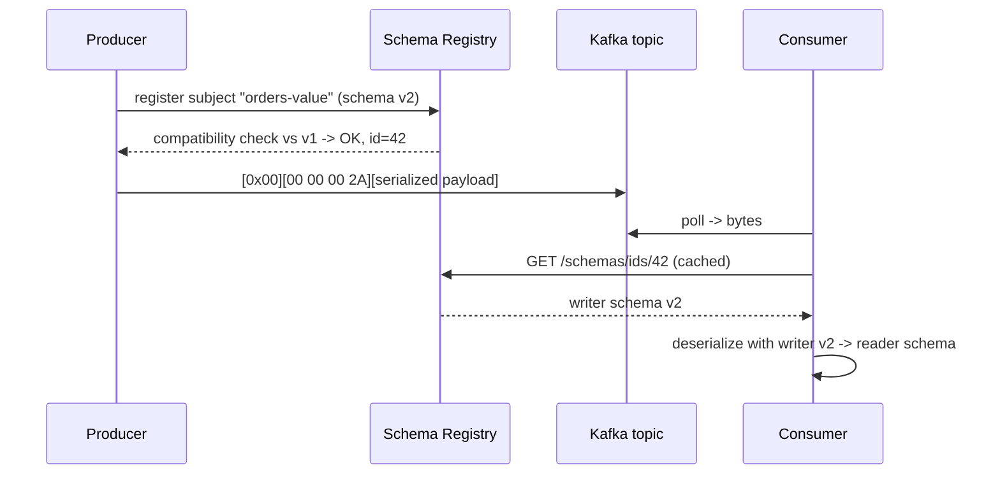

# Schema Registry Lab

Turn "we agreed on the payload" into a rule the broker path actually enforces — register, evolve, break, and
gate in CI — following the teach-by-doing principles in [`AGENTS.md`](../../../AGENTS.md). The
producer-side agreement is designed in
[`data-contract-designer`](../data-contract-designer/SKILL.md); the topology around it in
[`streaming-pipeline-designer`](../streaming-pipeline-designer/SKILL.md).

## When to use

- A producer changed a field and consumers broke in production — the classic missing-contract failure.
- The learner cannot explain why a field needs a **default** to be safely removable.
- They must choose Avro vs Protobuf vs JSON Schema, or a subject naming strategy for a multi-type topic.
- They want schema compatibility enforced by CI, before the merge, not by an incident afterwards.

## First principles: the topic is a public API

Kafka brokers store bytes and validate nothing. Schema Registry moves the contract **beside** the data: the
producer registers a schema, gets back a numeric **schema ID**, and prefixes each message with it. The
consumer reads the ID and fetches the exact writer schema — so payloads stay small and no schema travels
with every record (Confluent Schema Registry docs, *Schema Registry Concepts*, docs.confluent.io).



The **wire format** is worth decoding once by hand: byte 0 is a magic byte `0x0`, bytes 1–4 are the schema
ID as a 4-byte big-endian integer, and the rest is the serialized payload (for Protobuf, an extra
message-index varint follows). Once you have seen it, "why is there garbage at the front of my message?"
stops being a mystery.

| Compatibility mode | New schema can… | Checked against | Upgrade first |
| --- | --- | --- | --- |
| `BACKWARD` (default) | delete a field, add an **optional** field (with default) | latest version | **Consumers** |
| `BACKWARD_TRANSITIVE` | same | **all** previous versions | Consumers |
| `FORWARD` | add a field, delete an **optional** field | latest version | **Producers** |
| `FORWARD_TRANSITIVE` | same | all previous versions | Producers |
| `FULL` | add or delete optional fields only | latest version | Either order |
| `FULL_TRANSITIVE` | same | all previous versions | Either order |
| `NONE` | anything | nothing | You are on your own |

| Format | Strength | Trade-off |
| --- | --- | --- |
| **Avro** | compact binary, schema-first, rich default/alias rules | needs the writer schema to read; tooling-heavy outside the JVM |
| **Protobuf** | strong cross-language codegen, field numbers make evolution explicit | reserved field numbers must be disciplined by hand |
| **JSON Schema** | human-readable, easy debugging, no codegen needed | largest payloads, weakest evolution semantics |

**Subject naming** decides the blast radius: the default `TopicNameStrategy` gives `<topic>-key` and
`<topic>-value`; `RecordNameStrategy` scopes by record type so one topic can carry several event types;
`TopicRecordNameStrategy` combines both.

## Procedure

1. **Stand it up locally, free.** A `compose.yaml` with a KRaft-mode Kafka broker plus
   `confluentinc/cp-schema-registry` (or the Apache-2.0 **Karapace** registry) listening on `:8081`.
   Reuse the broker from [`kafka-kraft-local-lab`](../kafka-kraft-local-lab/SKILL.md). Run every command
   with **`#run` (`learningos_runcode`)** and paste the real responses.
2. **Verify it is alive.** `curl -s localhost:8081/subjects` → `[]`. An empty list is the correct start state.
3. **Register v1.** `POST /subjects/orders-value/versions` with the schema escaped inside a JSON body, or
   let the Avro/Protobuf/JSON serializer auto-register on first produce. Record the returned **id**.
4. **Read the config.** `GET /config` for the global default and
   `GET /config/orders-value` for the per-subject override; set the subject explicitly with
   `PUT /config/orders-value {"compatibility":"BACKWARD"}`. Never rely on an inherited default in production.
5. **Produce and consume with the schema.** Use `kafka-avro-console-producer` /
   `kafka-avro-console-consumer` with `--property schema.registry.url=http://localhost:8081`.
6. **Decode the wire format by hand.** Consume the same message with the plain
   `kafka-console-consumer` and hexdump it: confirm `00`, then the 4-byte big-endian ID, then the payload.
   Cross-check that ID against `GET /schemas/ids/<id>`.
7. **Evolve compatibly.** Add a field **with a default** and dry-run it first:
   `POST /compatibility/subjects/orders-value/versions/latest` → `{"is_compatible": true}`. Register it and
   confirm the version count incremented.
8. **Break it on purpose.** Try to add a required field with no default, or rename one, under `BACKWARD`.
   Expect HTTP **409 Conflict**. Read the error message and explain *which* consumer would have failed.
9. **Flip the mode and re-run.** Set `FORWARD`, retry the same change, and observe the opposite verdict.
   Make the learner state the upgrade order each mode implies before you show the result.
10. **Choose a naming strategy.** Publish two event types to one topic and show why `TopicNameStrategy`
    fails there while `RecordNameStrategy` or `TopicRecordNameStrategy` works — and what each costs.
11. **Gate it in CI.** Add a pipeline step that runs the compatibility check against the **deployed**
    registry for every changed schema file and fails the build on 409 — the Confluent Schema Registry Maven
    plugin's `test-compatibility` goal, or a `curl` to `/compatibility/...` for non-JVM repos. A contract
    only exists if a red build enforces it.
12. **Tear down** with `docker compose down -v` and summarize the evolution rules the learner now owns.

## Output shape

```
Schema Registry lab — topic <topic> · format <Avro|Protobuf|JSON Schema> · registry localhost:8081

Setup:     docker compose up -d   (kafka KRaft + cp-schema-registry | karapace) — free, local
Subject:   <topic>-value  (strategy: TopicName | RecordName | TopicRecordName)
Config:    global=<mode>  subject=<mode>   (PUT /config/<subject>)

v1 registered:  id=<n>  version=1
Wire format:    00 | 00 00 00 <id hex> | <payload>     (magic byte + 4-byte BE schema id)
                GET /schemas/ids/<n> -> matches v1  ✔

Compatible change:  add <field> with default  -> is_compatible=true  -> version=2
Breaking change:    add required <field>      -> HTTP 409  -> would break <consumer>
Mode flipped:       BACKWARD -> FORWARD       -> same change now <accepted|rejected>

CI gate:  step "schema-compat" -> POST /compatibility/subjects/<s>/versions/latest -> fail on 409
Upgrade order: <consumers first | producers first> because mode=<mode>

#run checks: <curl/CLI -> real output -> PASS/FAIL>
Next: data-contract-designer | streaming-pipeline-designer | flink-sql-lab
```

## Tips

- Turn **off** producer auto-registration in production (`auto.register.schemas=false`) and register through
  CI instead — otherwise any laptop can silently define the contract.
- Set compatibility **per subject**, explicitly. Inheriting the global default is how a topic ends up on
  `NONE` without anyone deciding it.
- Only fields with defaults can be safely removed under `BACKWARD` — that is the whole reason defaults are
  worth arguing about at design time.
- Prefer the `_TRANSITIVE` modes for long-lived topics with replay: non-transitive modes only compare
  against the **latest** version, so a chain of individually valid steps can still break a v1 replay reader.
- In Protobuf, never reuse a field number and always `reserved` the retired ones; the field number, not the
  name, is the contract.
- The registry validates *shape*, not *meaning*. Semantic rules (units, enum values, nullability intent)
  belong in [`data-contract-designer`](../data-contract-designer/SKILL.md), and downstream expectations in
  [`dbt-model-coach`](../dbt-model-coach/SKILL.md) tests or a
  [`lakehouse-designer`](../lakehouse-designer/SKILL.md) bronze layer.
- End with the **Learning Footer** (`AGENTS.md`) — one compatibility mode the learner must justify unaided,
  and one breaking change for them to predict before running it.
