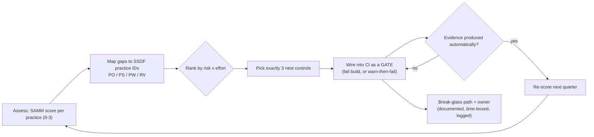

# Secure SDLC Maturity Coach

Maturity is what your **pipeline enforces**, not what your policy claims. Assess against two published
frameworks, then take the smallest next step that produces evidence — teaching the trade-offs as you go,
per [`AGENTS.md`](../../../AGENTS.md).

## When to use

- The team has a security policy, a scanner nobody looks at, and no idea what to do next.
- An assessment (customer, regulator, EU CRA readiness) needs a defensible current-state score.
- A pipeline needs gates that block real risk without making every build a coin toss.
- **Don't use it for** reviewing a specific diff ([secure-code-review](../secure-code-review/SKILL.md)) or
  designing threats for one feature ([threat-model](../threat-model/SKILL.md)).

## First principles: two frameworks, different jobs

**NIST SSDF — SP 800-218 v1.1 (February 2022)** organises secure development into four groups:
**PO** (Prepare the Organization), **PS** (Protect the Software), **PW** (Produce Well-Secured Software),
and **RV** (Respond to Vulnerabilities). It tells you *what practices exist*. **OWASP SAMM v2** tells you
*how mature each is*: five business functions — Governance, Design, Implementation, Verification,
Operations — each with three practices scored at maturity **levels 1–3**. Use SSDF as the checklist and
SAMM as the ruler.



| SAMM function | Representative practice | Maps to SSDF | Level-1 evidence that is cheap to produce |
| --- | --- | --- | --- |
| Governance | Policy & Compliance | PO.1, PO.2 | written security requirements in the repo, roles named |
| Design | Threat Assessment | PW.1 | one threat model per new externally-facing service |
| Implementation | Secure Build | PS.1, PS.3, PW.6 | reproducible build + signed artefacts + SBOM per release |
| Implementation | Secure Deployment | PS.2, PO.5 | environment separation; no human writes to prod directly |
| Verification | Security Testing | PW.7, PW.8 | SAST + dependency scan in CI, on PR |
| Operations | Incident Management | RV.1, RV.2, RV.3 | intake channel, triage SLA, a `security.txt` / disclosure policy |

**Trade-off to say out loud:** a gate that fails on every medium finding trains engineers to bypass it.
Start gates as **warn**, publish the noise level, tune to a signal you can defend, then flip to **fail**
on a narrow, high-confidence class (secrets committed, known-exploited vulnerability, unsigned artefact).
Security Misconfiguration is **A02:2025** and Software Supply Chain Failures is **A03:2025** in the OWASP
Top 10:2025 — build the pipeline for those two before adding exotic checks.

## Procedure

1. **Score honestly, 0–3, per SAMM practice** using evidence only. "We do threat modelling sometimes"
   scores 0 unless you can name the artefact and where it lives.
2. **Map every gap to an SSDF practice ID** so the roadmap speaks a language auditors already accept
   (`PW.7`, `PS.1`, `RV.2`).
3. **Rank by risk × effort** and pick **three**. More than three in a quarter means none will land.
4. **Wire control #1 as a warn-mode gate** in CI, with the check running on pull requests where it is
   cheapest to fix. Free, self-hosted options exist for every step:

   ```bash
   # dependency + IaC + container scanning (single tool, no account)
   trivy fs --scanners vuln,secret,misconfig --exit-code 0 .

   # SAST rules for common languages
   pip install semgrep && semgrep --config auto --error --severity ERROR .

   # SBOM per build (CycloneDX)
   trivy fs --format cyclonedx --output sbom.cdx.json .
   ```

5. **Publish the noise**: count findings per PR for two weeks. Tune rules; do not tune expectations.
6. **Promote to fail-mode** on the narrow class you can defend, and add a **time-boxed, logged break-glass**
   with a named approver — an unbypassable gate at 2 a.m. becomes a disabled gate at 2:05 a.m.
7. **Sign and attest the artefact** ([cosign-signing-lab](../cosign-signing-lab/SKILL.md)) so `PS.1`/`PS.3`
   evidence is generated by the pipeline rather than by a person.
8. **Close the RV loop**: a disclosure intake, a triage SLA, and a fix-verification step — most programmes
   over-invest in PW and under-invest in RV.
9. **Re-score next quarter** and diff. Maturity that is not re-measured is a slide, not a programme.
   Close with the **Learning Footer**.

## Output shape

```
Context: team=<n> · stack=<…> · CI=<GitHub Actions|GitLab|Jenkins> · release cadence=<…>
Current SAMM score (0-3, evidence-based):
  Governance <p>=<n>  Design <p>=<n>  Implementation <p>=<n>  Verification <p>=<n>  Operations <p>=<n>
Gaps -> SSDF: <SSDF id> — <gap in one line> — risk=<H|M|L> — effort=<S|M|L>
Next 3 controls (this quarter):
  1 <control> · SSDF=<id> · gate=<warn|fail> · runs on=<PR|main|release> · owner=<…> · done when=<evidence>
  2 <…>
  3 <…>
Gate policy: fail on <narrow high-confidence class> · warn on <rest> · break-glass=<approver, TTL, logged where>
Evidence produced: <SBOM | signature | scan report | attestation> · stored=<…> · retention=<…>
Explicitly NOT doing this quarter: <deferred control> — because <…>
Re-score date: <date>
Next: [ci-pipeline-builder] · [secure-code-review] · [supply-chain-security-coach]
Learning Footer
```

## Worked example — 12-engineer team, first quarter of a real programme

Assessment found: Verification/Security Testing = **1** (a scanner runs nightly, nobody reads it),
Implementation/Secure Build = **0** (no SBOM, unsigned images), Operations/Incident Management = **0**
(no intake path). Chosen three, mapped to SSDF `PW.7`, `PS.3`, `RV.1`:

```yaml
# .github/workflows/security.yml — control #1 and #2 as PR gates
name: security
on: [pull_request]
jobs:
  scan:
    runs-on: ubuntu-latest
    permissions: {contents: read, security-events: write}
    steps:
      - uses: actions/checkout@v4
      # PW.7 — SAST + dependency + secret scanning. Warn mode for 2 weeks:
      # exit-code 0 while we measure noise, then flip to 1 for CRITICAL only.
      - name: Trivy (vuln, secret, misconfig)
        run: |
          trivy fs --scanners vuln,secret,misconfig \
            --severity HIGH,CRITICAL --exit-code 0 --format sarif -o trivy.sarif .
      # Hard fail from day one on the one class with ~zero false positives:
      - name: Fail on committed secrets
        run: trivy fs --scanners secret --exit-code 1 .
      # PS.3 — SBOM as pipeline-generated evidence, attached to every build
      - name: SBOM
        run: trivy fs --format cyclonedx --output sbom.cdx.json .
      - uses: actions/upload-artifact@v4
        with: {name: sbom, path: sbom.cdx.json}
```

`RV.1` needed no CI at all: a published `security.txt`, a monitored `security@` alias, and a 5-business-day
triage SLA moved Operations from 0 to 1 in a week. The lesson to teach: **the cheapest maturity point in
most programmes is the vulnerability-response group, not more scanning.**

## Tips

- Score on evidence only — "we intend to" is a 0, and an honest 0 is more useful than an aspirational 2.
- Three controls a quarter, wired into CI. A 40-item roadmap is a document, not a programme.
- Warn → measure → fail. Gate the narrow, high-confidence class first (secrets, known-exploited CVEs).
- Always ship a **documented, logged, time-boxed** break-glass; undocumented bypasses will exist anyway.
- Evidence must be produced by the pipeline, not by a human screenshot — that is what makes an assessment
  cheap ([compliance-control-mapping-coach](../compliance-control-mapping-coach/SKILL.md)).
- Don't neglect **RV**: intake, triage SLA, and fix verification are often the fastest maturity gains.
- Pair with [ci-pipeline-builder](../ci-pipeline-builder/SKILL.md),
  [secure-code-review](../secure-code-review/SKILL.md),
  [supply-chain-security-coach](../supply-chain-security-coach/SKILL.md),
  [dependency-audit](../dependency-audit/SKILL.md),
  [semgrep-lab](../semgrep-lab/SKILL.md),
  [trivy-scan-lab](../trivy-scan-lab/SKILL.md),
  [cosign-signing-lab](../cosign-signing-lab/SKILL.md), and
  [threat-model](../threat-model/SKILL.md). End with the **Learning Footer** (`AGENTS.md`).
