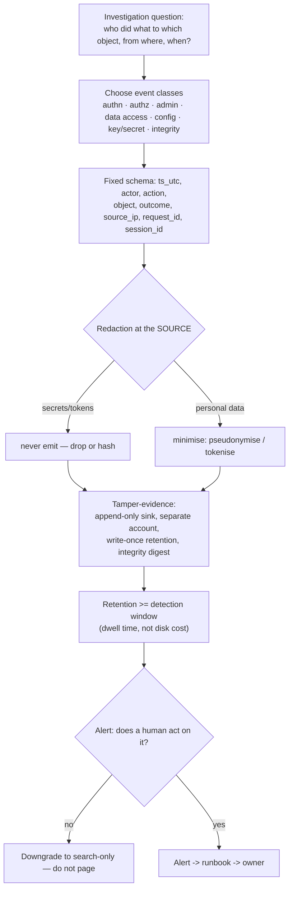

# Security Logging & Audit Coach

Logging is designed **backwards from the question you will be asked at 3 a.m.** — "who did what, to which
object, from where, and when?" — then constrained by privacy and cost. Taught from first principles per
[`AGENTS.md`](../../../AGENTS.md), with detection as the goal rather than volume.

## When to use

- An incident review concluded "we couldn't tell" — the trail existed but lacked actor, object, or outcome.
- Logs contain tokens, passwords, or personal data and now carry their own breach risk.
- Alerts fire constantly and nobody responds, or nothing fires at all.
- **Don't use it for** general application/observability logging
  ([logging-strategy-coach](../logging-strategy-coach/SKILL.md)) or alert-routing mechanics
  ([alerting-strategy-coach](../alerting-strategy-coach/SKILL.md)).

## First principles: the five W's, then the constraints

**A09:2025 — Security Logging & Alerting Failures** in the OWASP Top 10:2025 is explicit that logging
without *alerting* is not a control. NIST CSF 2.0 places this under **DETECT** (DE.AE anomalies and
events, DE.CM continuous monitoring), and NIST SP 800-92 remains the baseline log-management guidance.
Every security event answers the same five questions.



| Event class | Must capture | Why it matters in an investigation | Common miss |
| --- | --- | --- | --- |
| Authentication | actor, result, method/factor, source IP, user agent | separates credential theft from session abuse | success events not logged, only failures |
| Authorisation | actor, object, decision, policy/role used | proves whether access was allowed or blocked | `403` logged without the object |
| Admin / privilege change | who granted what to whom, when, approval ref | fastest persistence signal there is | role changes only in the IdP, not the SIEM |
| Data access / export | actor, dataset, record volume, purpose | scoping a breach depends on volume | bulk export indistinguishable from a page view |
| Configuration change | before → after, actor, change ticket | ties an outage or exposure to a cause | "changed by automation" with no principal |
| Secret / key use | key id, operation, caller — **never the secret** | detects credential misuse | the secret itself logged on error |
| Log-integrity events | gaps, clock skew, ingest failure, sink policy change | **absence of logs is itself a signal** | nobody alerts on "logs stopped" |

**Trade-off to say out loud:** more retention improves investigations but increases both cost *and* the
privacy blast radius of the log store itself. Resolve it by **tiering**: keep a small, high-value,
long-retained security event stream separate from verbose application logs, and pseudonymise identifiers
so the trail stays useful without becoming a second copy of your personal-data estate. Retention should be
driven by realistic intrusion dwell time, not by the default your sink shipped with.

## Procedure

1. **Write the investigation questions first** (three to five). Every field you keep must serve one; every
   field that serves none is cost and risk.
2. **Fix a schema and version it.** Emit structured JSON with stable keys, all timestamps **UTC** and
   ISO-8601, and a `request_id`/`trace_id` that correlates across services.
3. **Log the *successes*, not just the failures** — successful admin actions and successful bulk reads are
   what scope an incident.
4. **Redact at the source**, never in the pipeline: deny-list obvious secret fields, and prefer *not
   collecting* over masking later. Test the redaction with a unit test that asserts a known token never
   appears in output.
5. **Pseudonymise personal data** where the identifier can be resolved out-of-band; store the mapping
   under separate access control.
6. **Make the trail tamper-evident**: a separate account/project for the log sink, append-only or
   write-once retention, an identity that can write but not delete, and periodic integrity digests:

   ```bash
   sha256sum audit-2026-08-09.jsonl >> DIGESTS.txt   # anchor the day's file
   sha256sum -c DIGESTS.txt                          # verify later
   ```

7. **Alert on outcomes, not volume.** Every alert needs a hypothesis, a runbook link, and an owner; if no
   human acts, it is a search, not an alert.
8. **Alert on silence too** — an ingest gap or a disabled sink is a high-fidelity signal that costs nothing.
9. **Validate by replay**: pick a past incident (or a drill from
   [threat-hunting-drill](../threat-hunting-drill/SKILL.md)) and try to answer the questions from logs alone.

   ```bash
   # local, free: does the trail answer "who changed this role?"
   jq -r 'select(.action=="role.grant") | [.ts_utc,.actor,.object,.outcome] | @tsv' audit.jsonl
   ```

10. **Record retention, owner, and access policy**, then close with the **Learning Footer**.

## Output shape

```
Questions this trail must answer:
  1 <…>  2 <…>  3 <…>
Schema (v<n>): ts_utc · actor{id,type} · action · object{type,id} · outcome · source_ip ·
               user_agent · request_id · session_id · policy · <domain fields>
Events logged: <class> -> <events> · success logged=<yes|no> · sampling=<none|rate>
Never logged: <passwords · tokens · full PAN · secrets · raw request bodies>  (enforced by <test/lib>)
Personal data: <fields> · treatment=<pseudonymised|tokenised|omitted> · lawful basis owner=<…>
Tamper-evidence: sink=<append-only store> · account=<separate?> · delete perm=<who> ·
               write-once retention=<period> · integrity digest=<method, frequency>
Retention: security stream=<period, rationale> · verbose app logs=<period> · legal hold=<path>
Alerts: <name> · hypothesis=<…> · condition=<…> · severity=<…> · runbook=<link> · owner=<…>
Silence alert: <ingest gap > n min | sink policy change> -> <owner>
Validation: replayed incident=<id> · questions answered from logs alone=<n/of>
Gaps: <question you still cannot answer> -> <field/event to add> -> owner=<…>
Next: [detection-engineering-coach] · [threat-hunting-drill] · [alerting-strategy-coach]
Learning Footer
```

## Worked example — audit event for a privilege grant

```json
{
  "schema": "audit.v1",
  "ts_utc": "2026-08-09T11:04:22.318Z",
  "actor": {"id": "u_8f21", "type": "user", "auth_method": "webauthn"},
  "action": "role.grant",
  "object": {"type": "role", "id": "prod-dba", "grantee": "u_44c9"},
  "outcome": "success",
  "source_ip": "203.0.113.44",
  "user_agent": "Mozilla/5.0 …",
  "request_id": "01J9Z8K3P7",
  "session_id": "s_c19b",
  "policy": "rbac/prod-admin@v7",
  "approval_ref": "CHG-20416"
}
```

Note what is present and what is deliberately absent: actor **and** grantee (so escalation chains are
reconstructable), the policy version that permitted it, and the approval ticket — but no token, no
session cookie, and pseudonymous user IDs that resolve through a separately controlled directory.

Two alerts sit on this one event type: (a) `role.grant` to a production role **without** an
`approval_ref`, severity high, runbook "unapproved privilege change"; (b) `role.grant` where actor ==
grantee, severity critical. Both are testable statements about outcomes, which is why they page. A third
rule — "count of `role.grant` per day" — is a **dashboard**, not an alert, and is explicitly marked so.

## Tips

- Design from the investigation question backwards; fields that answer nothing are pure cost and risk.
- Log successful privileged actions — failure-only logging hides exactly the intrusion you care about.
- UTC, ISO-8601, and a correlation ID everywhere; mixed local times manufacture false sequences.
- Redact at the **source** and unit-test it — a masking regex in the pipeline is a leak waiting on a retry.
- A log store you can delete from is not an audit trail: separate account, append-only, write-once retention.
- Alert on **missing** logs; ingest silence is one of the highest-fidelity signals available.
- Every alert needs a runbook and an owner, or it trains people to ignore alerts (A09:2025 is about
  alerting, not storage).
- Pair with [detection-engineering-coach](../detection-engineering-coach/SKILL.md),
  [threat-hunting-drill](../threat-hunting-drill/SKILL.md),
  [logging-strategy-coach](../logging-strategy-coach/SKILL.md),
  [alerting-strategy-coach](../alerting-strategy-coach/SKILL.md),
  [dfir-evidence-triage-drill](../dfir-evidence-triage-drill/SKILL.md),
  [observability-plan](../observability-plan/SKILL.md), and
  [compliance-control-mapping-coach](../compliance-control-mapping-coach/SKILL.md).
  End with the **Learning Footer** (`AGENTS.md`).
