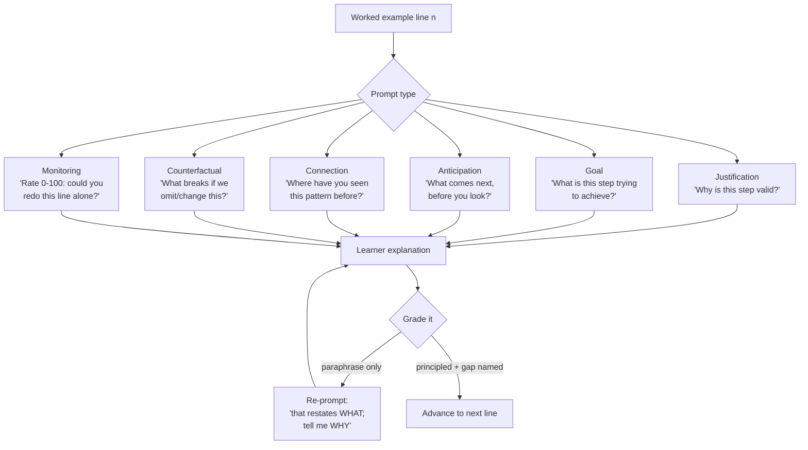

# Self-Explanation Prompter

Learners who explain each step *to themselves* learn far more from the same worked example than learners
who simply read it. This skill writes those prompts and grades the answers, in the Socratic,
don't-spoon-feed spirit of [`AGENTS.md`](../../../AGENTS.md).

## When to use

- A learner reads a solution, nods, and then cannot reproduce a single step of it.
- You have a good worked example that is being consumed passively.
- A learner can execute a procedure but cannot say why any step exists — brittle, non-transferable skill.
- Don't use it as a first explanation of a brand-new concept; self-explanation *elaborates* material the
  learner has just seen — introduce it with [concept-explainer](../concept-explainer/SKILL.md) first.

## First principles: explaining generates knowledge the text never stated

Chi, Bassok, Lewis, Reimann & Glaser (1989, *Cognitive Science*) studied students working through physics
worked examples. "Good" students spontaneously explained lines to themselves, inferred unstated
conditions, and monitored their own comprehension; "poor" students re-read and reported understanding.
Chi et al. (1994) then showed the effect is **trainable**: simply *prompting* students to explain after
each line improved learning substantially, even with no feedback on the explanations.

Two mechanisms: **inference generation** — filling gaps the author left implicit — and **comprehension
monitoring**, i.e. noticing that you *don't* understand. Related work on *elaborative interrogation*
(Pressley et al., 1987) shows plain "why is this true?" prompts on factual material work by the same
route. Self-explanation is exactly the germane load that Cognitive Load Theory says to protect
([cognitive-load-coach](../cognitive-load-coach/SKILL.md)).



| Prompt type | Template | Elicits | Use at |
| --- | --- | --- | --- |
| Justification | "Why is this step valid here?" | the governing principle | every non-obvious line |
| Goal | "What is this step trying to achieve?" | the plan behind the syntax | start of each block |
| Anticipation | "Before you look — what must come next, and why?" | prediction + prediction error | mid-example, cover the rest |
| Connection | "What earlier idea is this an instance of?" | schema linking | after a familiar pattern |
| Counterfactual | "What breaks if we drop this line / change this bound?" | necessity of the step | guard clauses, base cases, edge conditions |
| Monitoring | "0–100: could you redo this line unaided?" | comprehension monitoring | end of each block |
| Contrast | "Solution B does X instead — when would B be better?" | boundary conditions | end of the example |

**Trade-off to say out loud:** prompting roughly doubles the time per worked example. It pays on
material meant to *transfer*; it's waste on rote syntax you'll look up anyway. Also, over-prompting every
single line adds extraneous load — prompt at *conceptual* boundaries, not on every semicolon.

## Procedure

1. **Segment the example into conceptual steps** — a step is a line or block that carries one decision.
   Typically 4–8 steps, not 40.
2. **Classify each step** as *mechanical* (syntax, arithmetic) or *decisional* (a choice was made).
   Prompt the decisional ones; skip the mechanical ones.
3. **Pick the prompt type** per step from the table; vary types so the learner can't fall into a script.
4. **Ask before revealing.** Anticipation prompts require covering the remainder — once seen, the
   prediction is worthless.
5. **Require a principle, not a paraphrase.** "It sets `lo = mid + 1`" is restating; "because `mid` was
   already tested, so the invariant must exclude it" is explaining.
6. **Collect the monitoring ratings** and feed them to
   [confidence-calibration-coach](../confidence-calibration-coach/SKILL.md) — a 90 % rating on a step the
   learner then fails is the highest-value signal you can get.
7. **Grade with the 4-level rubric** below and re-prompt (never supply the explanation) at levels 0–1.
8. **Close the loop**: have the learner explain the whole example unaided from their own notes, then
   finish with the **Learning Footer**.

## Output shape

```
Example: <title>   Learner level: <novice|intermediate|advanced>   Steps: <n>
Step <n>  [decisional]  Code/line: <the line>
  Prompt [<justification|goal|anticipation|connection|counterfactual|monitoring|contrast>]:
    "<the prompt, asked before the next line is revealed>"
  Target explanation (for grading, NOT shown first): <the principle>
  Learner said: <verbatim>
  Grade: <0 none | 1 paraphrase | 2 partial principle | 3 principled + boundary>
  Re-prompt if <=1: "<narrower prompt that still doesn't give the answer>"
Monitoring ratings: step<n>=<0-100> ...   -> calibration check against later retrieval
Gaps surfaced: <what the learner discovered they didn't know>
Closing task: explain the whole example unaided in <n> minutes
Next: <worked-example | retrieval-practice-coach | confidence-calibration-coach>
Learning Footer
```

## Worked example — prompting a binary search implementation

```python
def bsearch(a, target):          # a is sorted ascending
    lo, hi = 0, len(a) - 1       # step 1
    while lo <= hi:              # step 2
        mid = lo + (hi - lo) // 2  # step 3
        if a[mid] == target: return mid
        if a[mid] < target: lo = mid + 1   # step 4
        else:                  hi = mid - 1
    return -1                    # step 5
```

| Step | Type | Prompt | Target explanation | Sample learner answer | Grade |
| --- | --- | --- | --- | --- | --- |
| 1 | goal | "What must be true about `a` for any of this to work, and who guarantees it?" | sortedness is a precondition the function does not check | "it has to be sorted" | 2 — states it, doesn't say who guarantees it |
| 2 | counterfactual | "What changes if `<=` becomes `<`?" | the single-element window is never examined ⇒ misses the target | "it would loop less" | 1 — paraphrase; re-prompt with a 1-element array |
| 3 | justification | "Why `lo + (hi-lo)//2` rather than `(lo+hi)//2`?" | avoids integer overflow in fixed-width languages; identical in Python | "same value, but safe against overflow in Java/C" | 3 — principled + boundary |
| 4 | justification | "Why `mid + 1` and not `mid`?" | `mid` was just tested, so the invariant must exclude it; `mid` would loop forever | "because we already checked mid, and keeping it can't terminate" | 3 |
| 5 | anticipation | *(before revealing)* "What must the function return when the loop ends, and why is that the only option?" | loop exit ⇒ `lo > hi` ⇒ empty window ⇒ absent | "return -1 because nothing's left to search" | 3 |
| — | monitoring | "0–100: could you rewrite this from scratch tomorrow?" | — | 85 % | check against next-day retrieval |

Gaps surfaced: the learner did not know the *overflow* rationale (new knowledge) and could not articulate
the loop invariant (step 2, graded 1) — that becomes a
[mistake-log-coach](../mistake-log-coach/SKILL.md) entry and a retrieval cue. The 85 % monitoring rating
is tested next day: if the rewrite fails, that's an overconfidence signal, not a knowledge gap.

## Tips

- The single most useful re-prompt is: **"that tells me *what* it does — tell me *why* it must."**
- Never accept "it just works"; give a narrower prompt or a counter-case instead of the answer.
- Prompt at decisions, not at every line — over-prompting is extraneous load
  ([cognitive-load-coach](../cognitive-load-coach/SKILL.md)).
- Anticipation prompts must be asked *before* revealing; prediction error is where the learning lives.
- Monitoring ratings are free calibration data — collect them every session.
- Pair with [worked-example](../worked-example/SKILL.md) for the example itself,
  [socratic-tutor](../socratic-tutor/SKILL.md) for a full dialogue,
  [productive-failure-designer](../productive-failure-designer/SKILL.md) for struggle-first sequences,
  [retrieval-practice-coach](../retrieval-practice-coach/SKILL.md) to convert gaps into cues, and
  [misconception-buster](../misconception-buster/SKILL.md) when an explanation reveals a wrong model.
  End with the **Learning Footer** (`AGENTS.md`).
