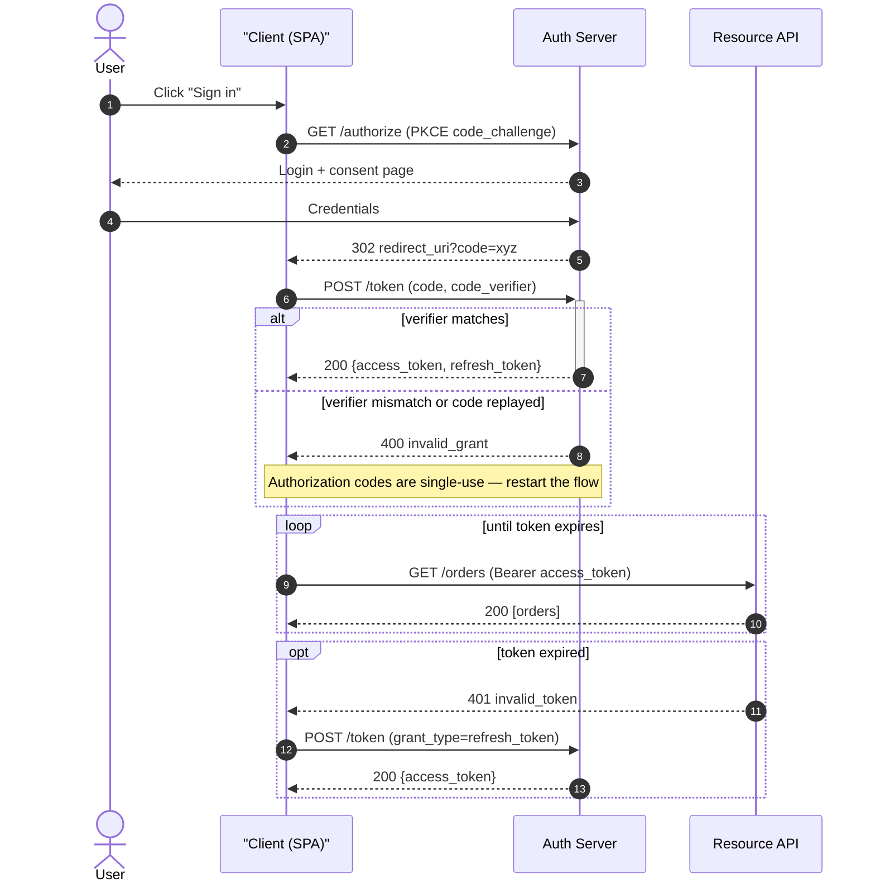

# Sequence Diagram Generator

Time runs down, messages run across. This skill turns a flow into a **correct, minimal, accessible**
Mermaid `sequenceDiagram` — including the error path — following [`AGENTS.md`](../../../AGENTS.md) §4
(visuals by default) and §2 (never draw a message you cannot justify).

## When to use

- An interaction spans **two or more parties over time**: HTTP/gRPC call chains, OAuth 2.0 / OIDC,
  TLS handshakes, webhooks and retries, message queues, saga steps, UI → API → DB traces.
- A learner can describe *what* happens but not *in what order*, or can't say who waits for whom.
- Reviewing a design: the diagram exposes chatty round-trips, missing timeouts, unhandled failures.
- **Not** for static structure (use `classDiagram` / `erDiagram`) and not for the lifecycle of a single
  object (use [state-machine-visualizer](../state-machine-visualizer/SKILL.md)).

## First principles

A sequence diagram is a **partial order of messages between lifelines**. Only three things carry meaning:
*who* (participant), *when* (vertical position), and *what kind* of message (sync, reply, async, lost).
Everything else — colour, icons, prose — is decoration and should be cut (Mayer's **coherence** principle;
see [dual-coding-coach](../dual-coding-coach/SKILL.md)).



## Fragment cheat-sheet

| You need to show… | Mermaid keyword | Renders as | Common mistake |
| --- | --- | --- | --- |
| A branch on a condition | `alt` / `else` / `end` | labelled alt box | omitting `else` — the failure path vanishes |
| Something that may not happen | `opt` … `end` | single-branch box | using `alt` with an empty `else` |
| Genuinely concurrent work | `par` / `and` / `end` | stacked par box | using `par` for things that are merely fast |
| Repetition / polling / retries | `loop <label>` … `end` | loop box | no exit condition in the label |
| Transaction with compensation | `critical` / `option` … `end` | critical box | modelling rollback as a plain `alt` |
| Early exit / abort | `break <reason>` … `end` | break box | drawing the rest of the flow after an abort |
| Blocking call | `->>+` … `-->>-` | activation bar | unbalanced `+`/`-` breaks the render |
| Fire-and-forget / event | `-)` async arrow | open arrowhead | drawing a reply that never happens |
| Reply | `-->>` dashed | dashed arrow | using `->>` for responses |
| Stable step references | `autonumber` | 1, 2, 3 … | hand-numbering, then drifting |

Arrow vocabulary from the **Mermaid** sequence-diagram documentation: `->` line, `-->` dotted,
`->>` solid arrowhead (call), `-->>` dotted arrowhead (reply), `-x` / `--x` lost message,
`-)` / `--)` async. `actor X` draws a stick figure; `participant X as Label` keeps short IDs with
readable labels.

## Procedure

1. **Collect the cast.** List every party that *sends or receives* — no more. Anything that never sends
   an independent message is not a participant (the DB driver isn't; the database is).
2. **Order participants left→right by first appearance**, so arrows mostly go right then return.
   Use `actor` for humans, `participant` for systems.
3. **Write the happy path first**, one message per line, imperative and concrete: `POST /token (code)`.
   Put only the payload that matters in the label.
4. **Add `autonumber`** so you and the learner can say "step 7" instead of pointing.
5. **Mark blocking work with balanced activations** (`->>+` … `-->>-`). Activation bars show how long a
   caller is held — the whole point when discussing latency and timeouts.
6. **Add the failure path.** For every external call ask: what if it is *slow*, *down*, *duplicated*, or
   *unauthorized*? Encode it with `alt`/`else`, `break`, or a `-x` lost message. A flow with no `else` is
   a design you have not reviewed yet.
7. **Wrap repetition and concurrency** in `loop` / `par`, labelling the exit or join condition
   (`loop until 3 retries`, `par fan-out to both regions`).
8. **Annotate invariants, not the obvious**: `Note over C,A: codes are single-use`.
9. **Self-check before rendering:** balanced `end`s, balanced `+`/`-`, every declared participant used,
   no reply to a `-)` message, no message crossing a fragment boundary.
10. **Add the accessibility layer** — caption, short alt text, numbered prose walkthrough; details in
    [diagram-accessibility-coach](../diagram-accessibility-coach/SKILL.md).
11. **Split beyond ~15 messages or ~7 participants.** Two diagrams (happy path + failure path) beat one
    wall. If a different visual actually fits, hand off to
    [visual-explainer](../visual-explainer/SKILL.md).

## Output shape

```
Flow: <name>  ·  Participants: <A, B, C>  ·  Scope: <where it starts and ends>

```mermaid
sequenceDiagram
  autonumber
  participant ...
  <messages, fragments, notes>
```

Caption: <one line — what the reader should take away>
Alt text: <short prose summary of the interaction>
Walkthrough: 1) <step>  2) <step>  3) <step> ...
Failure paths covered: <timeout | 401 | duplicate delivery | downstream 5xx>
Not shown (out of scope): <explicit omissions>
Source: <official spec/doc name + date>
Next: <related skill link>
```

## Tips

- **The failure path is the diagram.** Anyone can draw the happy path; the value lives in `else`,
  `break`, timeouts and retries.
- Distinguish **sync (`->>`) from async (`-)`)** rigorously — blurring them hides queues and back-pressure.
- Labels are messages, not documentation: `POST /token (code)` beats a sentence about exchanging codes.
- Never let colour carry meaning alone; if you add `rect rgb(...)` shading, repeat the meaning in the
  label (WCAG 2.2 success criterion **1.4.1 Use of Color**).
- Reconstruct flows from **official protocol documentation or a real trace**, never from a half-remembered
  blog post — and name the source with its date (§2).
- Pair with [api-design-review](../api-design-review/SKILL.md),
  [openapi-spec-writer](../openapi-spec-writer/SKILL.md),
  [distributed-tracing-coach](../distributed-tracing-coach/SKILL.md),
  [saga-pattern-coach](../saga-pattern-coach/SKILL.md) and
  [visual-explainer](../visual-explainer/SKILL.md).
  End with the **Learning Footer** (`AGENTS.md`).
