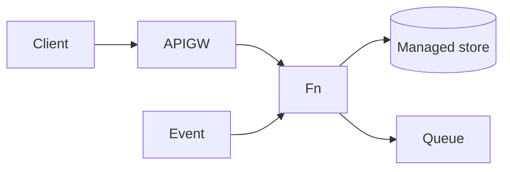

# Serverless Designer

Design serverless the way the well-architected serverless lens does — event-driven, stateless,
pay-per-use — per [`AGENTS.md`](../../../AGENTS.md). Pairs with [architecture-diagram](../architecture-diagram/SKILL.md) and [message-queue-coach](../message-queue-coach/SKILL.md).

## When to use

- The learner has spiky, event-driven, or unpredictable load and wants to minimize ops and idle cost.
- Reinforcing event-driven trade-offs for a **cloud/backend** role-agent.

## Shape



## Procedure

1. **Map events → functions:** one function per job, triggered by HTTP (API Gateway), queue, stream, or
   schedule; keep them small and single-purpose.
2. **Stay stateless:** no in-memory state between invocations — push state to managed stores
   (DynamoDB/Cosmos/Firestore) and use idempotency keys.
3. **Tame cold starts:** trim package size and deps, use provisioned concurrency for latency-critical
   paths, and pick a fast runtime.
4. **Managed data + async:** prefer managed/serverless data; decouple with queues/streams for retries and
   backpressure ([message-queue-coach](../message-queue-coach/SKILL.md)).
5. **Cost model:** pay per request + duration — cheap at low/spiky volume, but can exceed always-on
   compute at steady high throughput.
6. **When NOT to:** long-running/CPU-heavy jobs, ultra-low latency, chatty DB access, or heavy lock-in
   concerns — consider containers instead.

## Output shape

```
Workload: … | Provider: … | Trigger(s): HTTP/queue/stream/schedule
Functions: <fn> = <one job> (stateless + idempotent)
State: <managed store> | Async: <queue/stream>
Cold start: <package trim / provisioned concurrency>
Cost: per request+duration | Fit check: serverless vs container — because …
```

## Tips

- Serverless trades control for less ops — great for spiky load, poor for steady heavy compute.
- Idempotency is mandatory; at-least-once delivery means functions will re-run.
- End with the **Learning Footer** (`AGENTS.md`) — one function to isolate + the cost break-even to estimate yourself.
