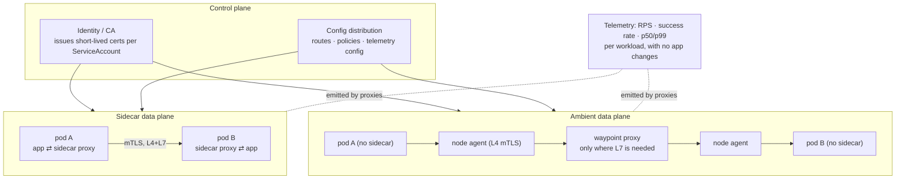

# Service Mesh Lab

A mesh moves connection concerns — identity, encryption, retries, timeouts, routing, telemetry — **out of
your application and into the network path**. That is genuinely powerful and genuinely expensive. This lab
runs one on a **free local kind/k3d cluster**, proves each property with a command instead of a slide, and
finishes by asking honestly whether you needed it, per [`AGENTS.md`](../../../AGENTS.md).

## When to use

- You need **mutual TLS between every pod** with automatic certificate rotation, and you cannot change 40
  services in 12 languages to do it themselves.
- You want per-service golden signals (success rate, latency, RPS) for services whose authors will never
  instrument them.
- You want traffic shifting, retries and timeouts implemented **identically** regardless of language.
- **Don't use it for** north–south ingress alone — that is [gateway-api-lab](../gateway-api-lab/SKILL.md).
  Don't use it as a substitute for fixing an application that has no timeouts (the mesh will happily retry
  a broken call 3× faster). And don't adopt one for three services: the operational cost — an extra proxy
  per pod or node, a control plane to upgrade, and a second place every packet can die — dominates at small
  scale.

## First principles: a programmable L7 proxy on every hop

Every mesh has the same two halves: a **data plane** of proxies that carry the traffic, and a **control
plane** that configures them and issues workload identities. The identity is the foundation — each workload
gets a short-lived X.509 certificate tied to its service account, so "who is calling me" becomes a
cryptographic fact rather than an IP address.

Two data-plane shapes exist today:

- **Sidecar**: a proxy container injected into every pod; sees all L7 traffic for that pod. Full features,
  highest cost, and a pod restart to upgrade.
- **Ambient / sidecar-less**: a per-node component handles L4 (mTLS, authorization), and an optional
  per-namespace or per-service L7 proxy is added only where you need HTTP-level features.
  **Istio's ambient mode reached GA in Istio 1.24** (Istio blog, *Istio's Ambient Mode Reaches General
  Availability*, istio.io / CNCF blog, 7 November 2024), with `ztunnel` as the node-level L4 component and
  `waypoint` proxies for L7. Linkerd takes a different route: a purpose-built, deliberately small Rust
  micro-proxy per pod.



*Figure: same control plane, two data-plane shapes. Ambient pays the L7 cost only where an L7 feature is
actually used; sidecars pay it on every pod, always.*

| Capability | Mesh | Alternative without a mesh | When the mesh clearly wins |
| --- | --- | --- | --- |
| mTLS + workload identity | automatic, rotating | per-app TLS config, or none | many services, many languages |
| Retries / timeouts | uniform policy | libraries per language ([retry-backoff-coach](../retry-backoff-coach/SKILL.md)) | you cannot change every app |
| Canary / traffic shifting | weighted routing by subset | gateway weights, or deploy tricks | shifting **east–west**, service to service |
| Circuit breaking / outlier ejection | connection-pool + ejection config | library circuit breakers | polyglot fleet |
| Golden-signal telemetry | free, per hop | instrument every service | uninstrumented services |
| Authorization between services | L7 policy (path, method, identity) | NetworkPolicy at L3/L4 | need identity + HTTP semantics |
| Multi-cluster / failover | built in | bespoke | real multi-cluster topology |

| Cost | Sidecar mode | Ambient / sidecar-less |
| --- | --- | --- |
| Extra containers | 1 per pod | 0 per pod (node agent + optional waypoint) |
| Memory / CPU | per pod, non-trivial at scale | shared per node; L7 only where enabled |
| Added latency | two proxy hops per request | L4 hop always; L7 hop only via waypoint |
| Onboarding | namespace label + **pod restart** | namespace label, **no restart** |
| Upgrades | control plane + every pod | control plane + node agents |
| Debugging | a new place packets die; `502` may be the proxy | fewer moving parts at L4, new concepts at L7 |

⚠ Volatile: mesh releases move fast and feature status changes (ambient GA'd in 1.24; Istio also supports
Gateway API for mesh via the GAMMA initiative; Linkerd's release/licensing model has changed over time).
Pin a version, and verify capabilities on istio.io / linkerd.io for the version you install.

## Procedure

1. **Write down the one property you are buying** — "mTLS everywhere", "canary without redeploying", or
   "per-service golden signals". A mesh adopted for "best practice" gets abandoned at the first upgrade.
2. **Cluster**: `kind create cluster --name mesh` (or `k3d cluster create mesh`); `kubectl get nodes`.
3. **Install a mesh.** Istio, sidecar mode, is the most instructive first run (Istio documentation,
   *Getting Started*, istio.io — verify the current version):
   ```bash
   curl -L https://istio.io/downloadIstio | sh -   # writes istio-<version>/ into the cwd
   export PATH="$PWD/istio-<version>/bin:$PATH"
   istioctl install --set profile=demo -y
   kubectl -n istio-system get pods
   istioctl version
   ```
   Linkerd alternative: `linkerd install --crds | kubectl apply -f -`, then
   `linkerd install | kubectl apply -f -`, then `linkerd check`.
4. **Baseline before meshing.** Deploy two services (`web` → `api`), call one from the other, and record
   latency. You need this number to state the mesh's latency cost honestly at the end.
5. **Enrol a namespace and restart the workloads** (sidecar injection is a *pod-creation* time event):
   `kubectl label namespace shop istio-injection=enabled` then
   `kubectl rollout restart deploy -n shop`. Verify the sidecar exists:
   `kubectl get pod -n shop -o jsonpath='{.items[0].spec.containers[*].name}'` → expect `app istio-proxy`.
   For ambient mode instead: `istioctl install --set profile=ambient -y` and
   `kubectl label namespace shop istio.io/dataplane-mode=ambient` — note that **no restart is required**,
   which is the headline operational difference.
6. **Prove mTLS rather than assuming it.** Send a request from a *non-meshed* pod and see it succeed
   (permissive mode), then enforce `STRICT` `PeerAuthentication` and see the same request rejected while
   meshed traffic still works. Cross-check the certificate chain with
   `istioctl proxy-config secret <pod> -n shop`.
7. **Shift traffic for a canary**: define `DestinationRule` subsets (`v1`, `v2`) and a `VirtualService`
   with weights `90/10`. Verify the ratio with a request loop, not by reading YAML.
8. **Add resilience policy**: `timeout`, `retries` (attempts, perTryTimeout, retryOn) on the route, and
   `outlierDetection` on the DestinationRule to eject failing endpoints.
9. **Inject an L7 fault** — the mesh can return HTTP 500 or add a fixed delay for a percentage of requests,
   with no application change. This is the cheapest possible resilience test; pair with
   [chaos-engineering-lab](../chaos-engineering-lab/SKILL.md).
10. **Read the telemetry you now get for free**: `istioctl dashboard kiali` (demo profile) or scrape the
    proxies with Prometheus. Confirm you can see success rate and p99 per workload **without touching the
    apps** — for many teams this alone justifies the mesh.
11. **Measure the cost honestly**: re-run the step-4 latency test, and compare pod memory before/after
    (`kubectl top pods -n shop`). Write both numbers into your decision record.
12. **Debug like a mesh operator once**, deliberately: `istioctl proxy-status`,
    `istioctl proxy-config routes <pod> -n shop`, `kubectl logs <pod> -c istio-proxy`. Knowing where the
    proxy's view lives is the difference between a 20-minute and a 2-day incident.
13. **Clean up**: `istioctl uninstall --purge -y && kubectl delete ns istio-system`, or
    `linkerd uninstall | kubectl delete -f -`; then `kind delete cluster --name mesh`. Close with the
    **Learning Footer**.

## Output shape

```
Mesh: <Istio vX.Y | Linkerd vX.Y>   Mode: <sidecar | ambient>   Cluster: <kind/k3d>
Bought for (one property): <mTLS everywhere | east-west canary | golden signals | L7 authz>

Enrolment: ns=<shop> label=<istio-injection=enabled | istio.io/dataplane-mode=ambient>
  restart required: <yes (sidecar) | no (ambient)>   proxies per pod: <1 | 0>

mTLS: PeerAuthentication mode=<STRICT>  scope=<ns|mesh>
  proof: request from NON-meshed pod → <rejected ✔>   meshed → <200 ✔>
  cert issuer/rotation: <control-plane CA, TTL <..>>

Traffic policy:
  canary: <svc> v1=<90> v2=<10>   observed over 100 reqs: <89/11>   ✔
  timeout=<Ns>  retries: attempts=<N> perTryTimeout=<Ns> retryOn=<5xx,reset,connect-failure>
  outlierDetection: consecutive5xxErrors=<N> interval=<..> baseEjectionTime=<..>
  fault injection tested: <abort 500 @ 10% | delay 2s @ 5%>  → app behaviour: <...>

Cost measured (not estimated):
  p50/p99 latency before → after: <..> → <..>   (+<N>ms per hop)
  memory per pod before → after: <..> → <..>
  upgrade blast radius: <control plane + N pods restarted>
Telemetry gained without app changes: <success rate, RPS, p50/p99 per workload> ✔
Verdict: <mesh justified because ... | do this at the gateway/library instead because ...>
Next: <gateway-api-lab | k8s-network-policy-lab | progressive-delivery-lab>
Learning Footer
```

## Worked example — prove mTLS, then canary 90/10 (Istio, kind, free)

**Baseline first, so the cost is measurable later.**

```bash
kubectl create namespace shop
kubectl apply -n shop -f apps.yaml            # web (v1) + api (v1, v2), all with version labels
kubectl exec -n shop deploy/web -- curl -s -o /dev/null -w '%{time_total}\n' http://api:8080/
# record this number BEFORE the mesh exists
```

**Enrol and restart.** Injection happens at pod creation, so existing pods are unmeshed until they restart
— an easy way to spend an hour confused:

```bash
kubectl label namespace shop istio-injection=enabled
kubectl rollout restart deploy -n shop
kubectl get pod -n shop -o jsonpath='{range .items[*]}{.metadata.name}{"\t"}{.spec.containers[*].name}{"\n"}{end}'
# expect: web-...  app istio-proxy
```

**Enforce mTLS, and prove it with a negative test** — the only proof that counts:

```yaml
apiVersion: security.istio.io/v1
kind: PeerAuthentication
metadata:
  name: default
  namespace: shop
spec:
  mtls:
    mode: STRICT        # PERMISSIVE (the default during migration) accepts plaintext too
```

```bash
kubectl create namespace outside                       # deliberately NOT meshed
kubectl run probe -n outside --image=curlimages/curl:8.10.1 --restart=Never -- \
  sh -c 'sleep 3600'

# from OUTSIDE the mesh → must fail once STRICT is applied
kubectl exec -n outside probe -- curl -sS -m 5 http://api.shop.svc.cluster.local:8080/ ; echo "exit=$?"
#   → connection reset / 000  ✔  (plaintext is refused by the receiving sidecar)

# from INSIDE the mesh → still works, transparently encrypted
kubectl exec -n shop deploy/web -- curl -sS -o /dev/null -w '%{http_code}\n' http://api:8080/
#   → 200  ✔
```

**Reasoning through why that works.** `STRICT` tells the *receiving* proxy to accept only mTLS connections.
The unmeshed pod in `outside` has no sidecar, so it offers plaintext and is refused at the transport layer
— you get a connection reset, not an HTTP error, which is a useful diagnostic fingerprint. Meanwhile `web`
still uses a plain `http://api:8080/` URL: **the application never learns that TLS happened**, which is the
entire value proposition. Note the migration order this implies: enrol everything first under `PERMISSIVE`,
verify, and only then flip to `STRICT` — doing it in the other order takes the fleet down.

**Canary by weight, east–west.** Two objects, with distinct jobs: `DestinationRule` *names* the subsets,
`VirtualService` *routes* to them.

```yaml
apiVersion: networking.istio.io/v1
kind: DestinationRule
metadata: {name: api, namespace: shop}
spec:
  host: api                       # the Kubernetes Service name
  subsets:
    - name: v1
      labels: {version: v1}       # MUST match pod labels, not Service labels
    - name: v2
      labels: {version: v2}
  trafficPolicy:
    connectionPool:
      tcp:  {maxConnections: 100}
      http: {http1MaxPendingRequests: 100, maxRequestsPerConnection: 10}
    outlierDetection:             # eject an endpoint that keeps failing
      consecutive5xxErrors: 5
      interval: 10s
      baseEjectionTime: 30s
      maxEjectionPercent: 50      # never eject more than half — avoids self-inflicted outage
---
apiVersion: networking.istio.io/v1
kind: VirtualService
metadata: {name: api, namespace: shop}
spec:
  hosts: [api]
  http:
    - route:
        - {destination: {host: api, subset: v1}, weight: 90}
        - {destination: {host: api, subset: v2}, weight: 10}
      timeout: 3s                 # bound the call — the mesh enforces it even if the client forgot
      retries:
        attempts: 3
        perTryTimeout: 800ms      # 3 × 800ms < 3s timeout, so retries fit inside the budget
        retryOn: 5xx,reset,connect-failure
```

**Trace the numbers before applying.** `attempts: 3` at `perTryTimeout: 800ms` is a worst case of 2.4s,
which fits inside the 3s route `timeout` — if it did not, the outer timeout would fire mid-retry and you
would have configured a slower failure, not a more reliable call. This arithmetic is the single most common
mesh misconfiguration. Also note `subsets` match **pod** labels: a `version` label present on the Service
but missing on the pod template yields an empty subset and a 503 with no obvious cause.

**Verify empirically:**

```bash
for i in $(seq 1 100); do
  kubectl exec -n shop deploy/web -- curl -s http://api:8080/version
done | sort | uniq -c        # → roughly 90 × v1, 10 × v2
```

**Then inject an L7 fault with no code change** — a resilience test that costs one manifest:

```yaml
apiVersion: networking.istio.io/v1
kind: VirtualService
metadata: {name: api-fault, namespace: shop}
spec:
  hosts: [api]
  http:
    - fault:
        abort:
          percentage: {value: 10}
          httpStatus: 503
        delay:
          percentage: {value: 5}
          fixedDelay: 2s
      route:
        - {destination: {host: api, subset: v1}}
```

If `web` has no client-side handling, a 10% 503 rate turns into a user-visible failure and you have found
a real gap. Note the interaction worth understanding: the retry policy above will mask some of these
aborts, which is exactly why you should test with and without retries enabled.

**Finally, price it.** Re-run the step-1 latency probe and `kubectl top pods -n shop`. Write the delta into
your decision record next to the properties you gained — a mesh justified by "we get mTLS and golden
signals for +1.5ms and +40MiB per pod" is a defensible engineering decision; "everyone uses one" is not.

## Tips

- **Migrate `PERMISSIVE` → verify → `STRICT`.** Going straight to `STRICT` before every workload is meshed
  is the classic self-inflicted outage.
- Sidecar injection happens **at pod creation**. Labelling a namespace changes nothing until pods restart —
  and forgetting that is the most common "the mesh isn't working" report.
- Subsets match **pod** labels. An empty subset produces 503s with a perfectly valid-looking config.
- Make the retry budget arithmetic explicit: `attempts × perTryTimeout` must be less than the route
  timeout, and retries must only be enabled for **idempotent** operations — see
  [retry-backoff-coach](../retry-backoff-coach/SKILL.md).
- A mesh does not fix an application with no timeouts; it just fails more consistently. Fix the client
  contract too.
- Ambient mode removes the per-pod proxy and the restart requirement, which changes the adoption
  calculation significantly at scale — but adds new concepts (node agent, waypoint) to learn and debug.
  Choose deliberately and record why.
- Budget for **upgrades**. A mesh is a permanently running, in-path dependency; a control-plane upgrade
  that restarts every pod is a quarterly event you must plan for, not discover.
- The mesh handles east–west; use [gateway-api-lab](../gateway-api-lab/SKILL.md) for north–south, and keep
  L3/L4 reachability locked down with
  [k8s-network-policy-lab](../k8s-network-policy-lab/SKILL.md) — mesh authorization and NetworkPolicy are
  complementary, not alternatives.
- Related: [envoy-local-lab](../envoy-local-lab/SKILL.md) to understand the proxy itself,
  [progressive-delivery-lab](../progressive-delivery-lab/SKILL.md) for automated canary analysis,
  [distributed-tracing-coach](../distributed-tracing-coach/SKILL.md) (a mesh propagates headers but your
  app must still forward them), [chaos-engineering-lab](../chaos-engineering-lab/SKILL.md),
  [zero-trust-architecture-coach](../zero-trust-architecture-coach/SKILL.md), and
  [circuit-breaker-coach](../circuit-breaker-coach/SKILL.md).
  End with the **Learning Footer** (`AGENTS.md`).
