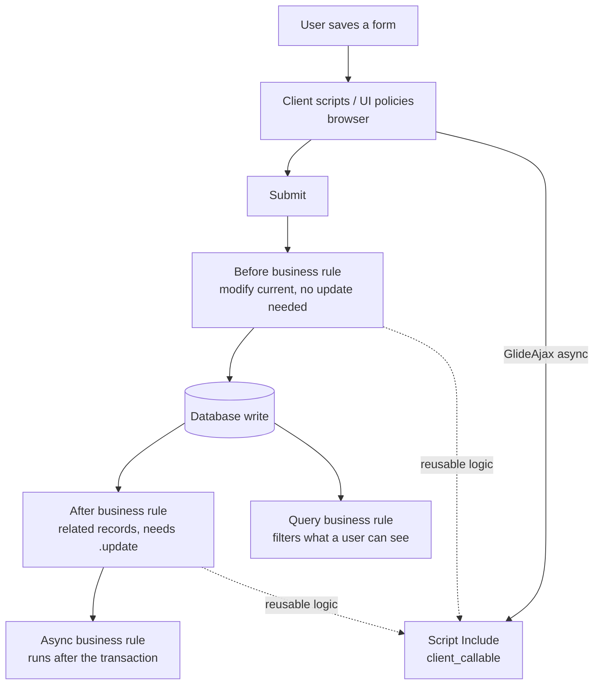

# ServiceNow Glide Scripting Lab

A hands-on lab for ServiceNow server-side JavaScript — **every script runs inside a shared instance, so
scope, phase and query cost are design decisions** — following [`AGENTS.md`](../../../AGENTS.md).
Everything runs on a **free ServiceNow Personal Developer Instance (PDI)** from the Developer Program.

## When to use

- The learner wants a real instance to script against without a customer subscription.
- A business rule fires at the wrong time, loops, or overwrites another rule's changes.
- A form is slow because a client script queries the server synchronously.
- They need to decide between a business rule, a Script Include, a flow action and a scheduled job.
- Records are visible to the wrong people and the fix is ACLs, not scripting.

## Free environment — Personal Developer Instance

| Step | Action | Verify |
| --- | --- | --- |
| 1. Sign up | Create a free account at `developer.servicenow.com` | Email confirmed |
| 2. Request PDI | Developer portal → **Request Instance** → pick the offered release | Instance URL + admin credentials shown |
| 3. Log in | Open `https://devXXXXX.service-now.com` as `admin` | Home page loads |
| 4. Keep it alive | Log in at least every 10 days (idle PDIs are reclaimed) | Instance still listed in the portal |
| 5. Scratchpad | Navigate to **Scripts - Background** (`/sys.scripts.do`) | Script box appears |
| 6. First query | Run a small `GlideRecord` snippet with `gs.info(...)` | Output panel prints your log line |
| 7. Scoped app | **All → Studio → Create Application** (new scope, e.g. `x_lab_demo`) | App shows a scope prefix |
| 8. Debug | **System Diagnostics → Session Debug → Debug Business Rule / Script Debugger** | Debug output at page bottom |

`sys.scripts.do` runs in the **global** scope with admin rights — perfect for learning, dangerous for
production habits. Do real work inside a scoped app.

## Where code runs, and when



| Task | Right tool | Trade-off / rule |
| --- | --- | --- |
| Default or validate a field on the record being saved | **Before** business rule | Set `current.field`; do **not** call `current.update()` — that recurses |
| Update related records after the save | **After** business rule | Must call `.update()` on the *other* record |
| Heavy work the user shouldn't wait for | **Async** business rule | Runs post-transaction; not for anything the form must show |
| Restrict rows a user can query | **Query** business rule | Silent by design; test as a non-admin |
| Reusable server logic | **Script Include** | `Class.create()` + prototype; the only thing you should call from two places |
| Server data needed by a client script | **GlideAjax** to a `client_callable` Script Include | Never `GlideRecord` in a client script — it is synchronous and slow |
| Row-level / field-level security | **ACL** | Scripting a UI hide is cosmetic, not security |
| Scheduled cleanup | Scheduled Script Execution | Watch transaction quotas on large tables |

## Procedure

1. **Claim the PDI** and run one `gs.info('hello')` in Scripts - Background before anything else — prove the
   loop works.
2. **Name the trigger precisely**: which table, which operation (insert/update/delete), which condition.
   Put the condition in the rule's **Condition** field or **Filter Conditions**, not in an `if` at the top
   of the script — the platform can then skip the script entirely.
3. **Write the query the efficient way**:
   `var gr = new GlideRecord('incident'); gr.addQuery('active', true); gr.addQuery('priority', '<=', 2);
   gr.setLimit(50); gr.query(); while (gr.next()) { ... }`. Prefer `addEncodedQuery()` built from a real
   filter in the list view (right-click breadcrumb → *Copy query*) so the syntax is never guessed.
4. **Explain dot-walking and `getValue`**: `gr.caller_id.email` walks a reference (extra lookups);
   `gr.getValue('state')` returns a string, while `gr.state` returns a GlideElement — comparing the object
   with `===` is a classic bug.
5. **Choose the phase** using the diagram: before for the current record, after for related records, async
   for anything slow. State *why* out loud each time.
6. **Extract to a Script Include** as soon as the logic is used twice or exceeds a screen. Use the
   `Class.create()` / `prototype` pattern; mark it `client_callable` and extend
   `AbstractAjaxProcessor` only when the client needs it.
7. **Call it from the client with GlideAjax** — `var ga = new GlideAjax('LabAjax');
   ga.addParam('sysparm_name', 'getOwner'); ga.addParam('sysparm_id', id);
   ga.getXMLAnswer(function(answer) { ... });` — asynchronous, with the result handled in the callback.
8. **Package it in a scoped app** (Studio) so artifacts get the `x_` prefix and cross-scope access is
   explicit. Explain the trade-off: scope protects the instance but requires deliberate cross-scope
   privileges; global is convenient and permanently risky.
9. **Secure it with ACLs**: create table/field ACLs for the operation, test with **Impersonate User** as a
   low-privilege account, and enable **Session Debug → Debug Security Rules** to see which ACL decided.
10. **Debug and verify — actually run it**: `gs.info()` for server logs (**System Logs → All**), the
    **Script Debugger** with breakpoints, `Session Debug → Debug Business Rule` for firing order, and
    **System Diagnostics → Transaction (all user)** for slow transactions. Ask the learner to paste the log
    output and the observed record state, not their expectation.
11. **Guard against recursion**: use `setWorkflow(false)` when a script must update records without
    re-triggering rules, and check the *Business Rule* debug output for repeated firings.
12. **Route onward** — query cost and indexing intuition →
    [sql-indexing-lab](../sql-indexing-lab/SKILL.md); authorization design →
    [auth-designer](../auth-designer/SKILL.md); systematic debugging →
    [debugging-coach](../debugging-coach/SKILL.md); API integrations →
    [api-design-review](../api-design-review/SKILL.md).

## Output shape

```
ServiceNow lab — <goal>

Instance: PDI (devXXXXX)  Release: <as shown in the portal>  Scope: <x_lab_demo | global>
Trigger: table=<incident> when=<before insert/update> condition=<...>

Artifact plan:
  Business Rule : <name> — phase <before/after/async>, order <n>
  Script Include: <LabAjax> — client_callable? <yes/no>
  Client Script : <onChange field> -> GlideAjax
  ACL           : <table.field> operation <read/write>

Code (annotated):
  <business rule>
  <script include>
  <client script with GlideAjax callback>

Efficiency check: addEncodedQuery used? <y>  setLimit? <y>  dot-walk count: <n>
Recursion check: current.update() inside a before rule? <no>

Run this:
  Scripts - Background: <snippet>   |  Session Debug: Business Rule + Security Rules
Actual result: <paste gs.info output / debug trace / record state>

Pitfall avoided: <wrong phase | sync client GlideRecord | ACL vs UI hide>
Next: <linked skill>
```

## Tips

- Never use `GlideRecord` in a client script or a UI policy script — it blocks the browser. GlideAjax with
  a callback is the supported path.
- `current.update()` inside a **before** business rule causes recursion; the platform saves `current` for
  you after the rule returns.
- `gr.getRowCount()` forces the platform to walk the result set — use `GlideAggregate` with
  `addAggregate('COUNT')` for counts on large tables.
- Put conditions in the rule's Condition field so the script never loads; conditions are cheaper than code.
- Hiding a field with a client script is **not** security — an ACL is. Always test by impersonating.
- Business rules on the same table run in **Order** sequence; leave gaps (100, 200, 300) so future rules
  can be inserted without renumbering.
- Ground every API, table and navigation path in the **official ServiceNow product documentation** and the
  **ServiceNow API reference** (`developer.servicenow.com`) for the release your PDI reports — never invent
  a Glide API or a limit; look it up and name the release.
- End with the **Learning Footer** (`AGENTS.md`).
