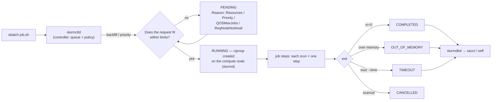

# Slurm HPC Job Lab

Batch scheduling taught by running it: **request → queue → allocate → execute → account**, following the
build-it-yourself principle in [`AGENTS.md`](../../../AGENTS.md). You will stand up a free single-node
Slurm cluster on a laptop or VM, then submit, array-ify, debug and audit real jobs.

## When to use

- The learner has an HPC account but treats `sbatch` as a magic incantation and cannot explain why a job
  is `PENDING`, gets killed, or runs 8× slower than expected.
- They need to convert a for-loop over 500 inputs into a job array instead of 500 submissions.
- They must justify a resource request (cores, memory, walltime) with evidence from `sacct`/`seff`.
- Don't use it for writing the parallel code itself — see
  [mpi-openmp-parallel-lab](../mpi-openmp-parallel-lab/SKILL.md) — or for cloud batch services.

## First principles: you are bidding for a resource reservation

Slurm (SchedMD, open-source under GPL) is a **resource manager plus scheduler**. Your script does not ask
"please run"; it declares a *reservation shape* — nodes × tasks × CPUs × memory × time — and waits until
that shape fits. Everything confusing about Slurm follows from that. Check your site's version with
`sinfo --version` and read `man sbatch` on the cluster you actually use; flags are version-stable but
partition names, QOS and limits are entirely site-local.



| Command | Allocation | Runs | Use it for |
| --- | --- | --- | --- |
| `sbatch script.sh` | requests one, returns immediately | the script, once, on the first node | production work |
| `srun ...` | creates a *step* inside an allocation (or its own) | N tasks in parallel | launching parallel tasks |
| `salloc` | holds an allocation, gives you a shell | whatever you type | interactive debugging |
| `sattach` | none | attaches to a running step | inspecting a live job |

| Request flag | Means | Classic mistake |
| --- | --- | --- |
| `--nodes=N` | how many machines | asking for many nodes for a serial program |
| `--ntasks=N` | how many *processes* (MPI ranks) | using it for threads |
| `--cpus-per-task=C` | cores per process (OpenMP threads) | leaving it at 1 for a threaded app |
| `--mem=8G` / `--mem-per-cpu=2G` | memory ceiling, enforced by cgroups | requesting node RAM → never schedules |
| `--time=HH:MM:SS` | walltime ceiling; job is killed at it | asking for the max → worst backfill priority |
| `--array=1-500%20` | 500 tasks, ≤20 concurrent | submitting 500 separate jobs |

**Trade-off to say out loud:** a *smaller, honest* request starts sooner. Slurm's backfill scheduler slots
short, small jobs into gaps ahead of higher-priority large ones, so over-requesting walltime or memory
costs you queue time and nothing else.

## Procedure

1. **Build a free single-node cluster** (Ubuntu/Debian; works in a VM, WSL2 or a container):
   ```bash
   sudo apt update && sudo apt install -y slurm-wlm slurm-wlm-doc munge
   sudo /usr/sbin/create-munge-key 2>/dev/null; sudo systemctl enable --now munge
   slurmd -C            # prints the exact NodeName= line for THIS machine — copy it
   ```
2. **Write `/etc/slurm/slurm.conf`** using that `NodeName` line (keep `RealMemory` below physical RAM):
   ```ini
   ClusterName=lab
   SlurmctldHost=localhost
   SlurmUser=slurm
   StateSaveLocation=/var/spool/slurmctld
   SlurmdSpoolDir=/var/spool/slurmd
   ProctrackType=proctrack/cgroup
   TaskPlugin=task/cgroup
   SelectType=select/cons_tres
   SelectTypeParameters=CR_Core_Memory
   AccountingStorageType=accounting_storage/none
   JobAcctGatherType=jobacct_gather/cgroup
   NodeName=localhost CPUs=4 RealMemory=3000 State=UNKNOWN
   PartitionName=debug Nodes=ALL Default=YES MaxTime=01:00:00 State=UP
   ```
   ```bash
   sudo mkdir -p /var/spool/slurmctld /var/spool/slurmd && sudo chown slurm: /var/spool/slurmctld
   sudo systemctl enable --now slurmctld slurmd && sinfo
   ```
   If a node shows `drain`, fix the mismatch and clear it:
   `sudo scontrol update nodename=localhost state=resume`.
3. **Submit the smallest possible job** and read its ID: `sbatch --wrap='hostname; sleep 5'`.
4. **Watch the queue**: `squeue -u $USER -o '%.8i %.9P %.12j %.2t %.10M %.6D %R'` — the last column is the
   *reason*, and `Resources` vs `Priority` vs `QOSMaxJobsPerUserLimit` are three different conversations.
5. **Write a real batch script** with `#SBATCH` directives (worked example below). All directives must
   precede the first non-comment line, or Slurm silently ignores them.
6. **Turn the loop into an array**: `--array=1-N%K` and branch on `$SLURM_ARRAY_TASK_ID`. One submission,
   N independent tasks, K running at once.
7. **Audit the run** — never guess at usage:
   ```bash
   sacct -j <jobid> --format=JobID,JobName%18,State,Elapsed,TotalCPU,ReqCPUS,ReqMem,MaxRSS,ExitCode
   seff <jobid>        # CPU + memory efficiency, if the site installs it
   ```
   `MaxRSS` appears on the `.batch`/`.0` step rows, not the parent row — that surprises everyone once.
8. **Right-size and resubmit**: set `--mem` ≈ 1.3 × observed `MaxRSS` and `--time` ≈ 1.5 × `Elapsed`.
9. **Break it on purpose**: request `--mem=10M` for a memory-hungry step and read the `OUT_OF_MEMORY`
   state; then fix it. Close with the **Learning Footer**.

## Output shape

```
Workload: <serial | array | MPI | hybrid | GPU>     Site/partition: <name>   Slurm: <sinfo --version>
Request:  --nodes=<N> --ntasks=<N> --cpus-per-task=<C> --mem=<X> --time=<HH:MM:SS> [--array=<a-b%k>]
Rationale: cores because <...> · memory because <MaxRSS evidence> · walltime because <Elapsed evidence>
Script: <path>   Submitted: sbatch <script>  -> JobID <id>
Queue: state=<PD|R|CG> reason=<Resources|Priority|Dependency|QOS...>  waited <mm:ss>
Result: State=<COMPLETED|TIMEOUT|OUT_OF_MEMORY|FAILED>  Elapsed=<...>  TotalCPU=<...>  MaxRSS=<...>
Efficiency: CPU <x%> · Memory <y%>  -> revised request: <...>
Next: <mpi-openmp-parallel-lab | nextflow-nfcore-lab | capacity-planning-coach>
Learning Footer
```

## Worked example — a job array that fans out over inputs, then reports its own efficiency

```bash
#!/bin/bash
#SBATCH --job-name=fanout
#SBATCH --partition=debug
#SBATCH --array=1-8%4              # 8 tasks, at most 4 running concurrently
#SBATCH --nodes=1
#SBATCH --ntasks=1                 # one process per array task
#SBATCH --cpus-per-task=2          # ...which itself uses 2 threads
#SBATCH --mem-per-cpu=256M
#SBATCH --time=00:05:00
#SBATCH --output=logs/%x_%A_%a.out # %A = array job id, %a = task id
#SBATCH --error=logs/%x_%A_%a.err
set -euo pipefail

mkdir -p logs
export OMP_NUM_THREADS="${SLURM_CPUS_PER_TASK:-1}"   # honour the reservation, don't oversubscribe

INPUT=$(sed -n "${SLURM_ARRAY_TASK_ID}p" inputs.txt)  # line N of the manifest for task N
echo "task=${SLURM_ARRAY_TASK_ID} host=$(hostname) cpus=${SLURM_CPUS_PER_TASK} input=${INPUT}"

srun --cpu-bind=cores python3 - "$INPUT" <<'PY'
import sys, hashlib
data = sys.argv[1].encode()
digest = hashlib.sha256(data).hexdigest()
print(f"{sys.argv[1]} -> {digest[:16]}")
PY
```

```bash
printf 'alpha\nbeta\ngamma\ndelta\nepsilon\nzeta\neta\ntheta\n' > inputs.txt
sbatch fanout.sh                 # Submitted batch job 42
squeue -u "$USER" -o '%.10i %.10j %.2t %R'
sacct -j 42 --format=JobID%14,State,Elapsed,TotalCPU,ReqCPUS,MaxRSS
#        42_1   COMPLETED  00:00:03  00:00:02        2
#  42_1.batch   COMPLETED  00:00:03  00:00:02        2   18244K   <- MaxRSS lives on the step row
```

Reading it: 8 tasks completed but only 4 ran at a time (`%4`), `TotalCPU` ≈ `Elapsed` × threads actually
used, and 18 MB observed against 512 MB requested — so the next submission should drop `--mem-per-cpu`.

## Tips

- `#SBATCH` lines are **comments to bash** — a stray `echo` above them disables every directive below.
- `--ntasks` is processes, `--cpus-per-task` is threads. Getting this backwards is the single most common
  HPC ticket: an OpenMP job asking for 32 tasks gets 32 single-core processes fighting each other.
- Always `export OMP_NUM_THREADS=$SLURM_CPUS_PER_TASK`; libraries otherwise detect *node* cores and
  oversubscribe the cgroup.
- Read the `NODELIST(REASON)` column before asking anyone: `Resources` = wait, `Priority` = wait longer,
  `ReqNodeNotAvail` = you asked for something that does not exist.
- `MaxRSS` is sampled — very short spikes can be missed; keep ~30 % headroom.
- Use `--dependency=afterok:<jobid>` to chain stages instead of polling `squeue` in a loop.
- Prefer `scontrol show job <id>` for a live job and `sacct` for a finished one; `squeue` shows neither well.
- Pair with [mpi-openmp-parallel-lab](../mpi-openmp-parallel-lab/SKILL.md) for the parallel code,
  [nextflow-nfcore-lab](../nextflow-nfcore-lab/SKILL.md) to let a workflow engine emit the sbatch calls,
  [bash-scripting-lab](../bash-scripting-lab/SKILL.md) for robust job scripts,
  [linux-processes-lab](../linux-processes-lab/SKILL.md) for cgroups, and
  [capacity-planning-coach](../capacity-planning-coach/SKILL.md) for fleet-level sizing.
  End with the **Learning Footer** (`AGENTS.md`).
