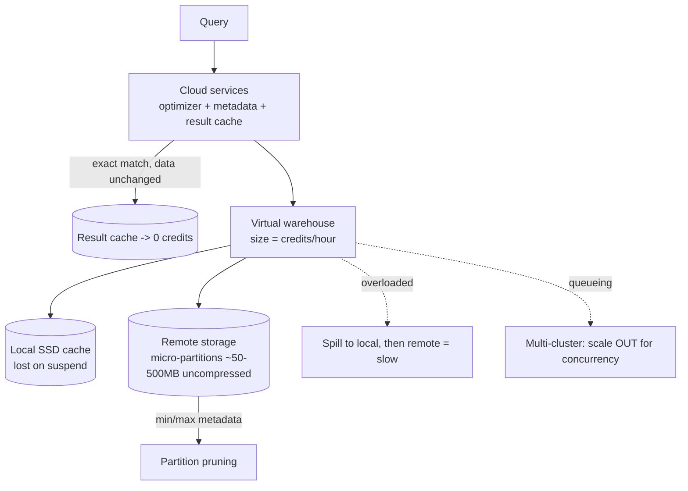

# Snowflake Performance Coach

Every performance question here is really "**which of the three layers am I paying?**", following
[`AGENTS.md`](../../../AGENTS.md) — and every cost question is a query that scanned too much. Model the
tables first with [`data-warehouse-modeling`](../data-warehouse-modeling/SKILL.md); transform them with
[`dbt-model-coach`](../dbt-model-coach/SKILL.md).

## When to use

- A dashboard got slow, a bill got large, or both — and nobody has opened the Query Profile yet.
- The team's reflex is "size up the warehouse", regardless of whether the problem is scan, spill, or queueing.
- They must choose between a clustering key, the search optimization service, and simply rewriting the query.
- They are building pipelines and weighing tasks + streams against **dynamic tables**.

## First principles: three layers, two meters

Snowflake splits **storage** (compressed micro-partitions in cloud object storage), **compute** (virtual
warehouses — independent clusters that can be resized, suspended, and cloned), and **cloud services**
(optimizer, metadata, transactions, security). Storage bills by the terabyte-month; compute bills by
**credits per second while a warehouse is running**. Nothing else you tune matters more than those two
sentences.



| Lever | Fixes | Does **not** fix | Cost signal |
| --- | --- | --- | --- |
| **Size up** (XS→S→M→…) | spilling, one huge query, big joins/sorts | too many concurrent users | credits/hour **doubles** per size step |
| **Multi-cluster (scale out)** | queueing under concurrency | a single slow query | more clusters × the same per-cluster rate |
| **Auto-suspend / auto-resume** | idle burn | anything about speed | biggest easy saving; short suspend also drops the warm cache |
| **Clustering key + automatic clustering** | poor pruning on huge tables | small tables; low-selectivity filters | ongoing background credits |
| **Search optimization service** | point lookups / needle-in-haystack | large scans and aggregations | serverless maintenance credits |
| **Query rewrite** | most things, honestly | hardware-bound work | free |

Compute is billed **per second with a 60-second minimum each time a warehouse resumes**, and each size step
roughly doubles credits per hour (XS = 1, S = 2, M = 4, L = 8, XL = 16, …). The consequence people miss:
if doubling the size **halves** the runtime, the credit cost is a wash *and you got the answer twice as
fast*. If it does not halve the runtime, sizing up is pure waste — so measure, don't assume (Snowflake
Documentation, *Warehouse Considerations* and *Overview of Warehouses*, docs.snowflake.com).

**Micro-partitions** are the storage unit: small contiguous units of roughly 50–500 MB of *uncompressed*
data, stored columnar and compressed, each with metadata (per-column min/max, distinct counts, nulls).
Pruning uses that metadata to skip partitions entirely. They are created automatically — you never declare
them — which is why "partitioning" in Snowflake is really a question about **natural ordering** and
clustering, not DDL (Snowflake Documentation, *Understanding Micro-partitions and Data Clustering*).

| Cache | Lives in | Lifetime | Hit means |
| --- | --- | --- | --- |
| Result cache | Cloud services | 24 h, extendable on reuse | zero compute credits, near-instant |
| Local disk (warehouse) cache | Warehouse SSD | until the warehouse **suspends/resizes** | no remote read |
| Metadata cache | Cloud services | continuous | `COUNT(*)`, `MIN`/`MAX` answered from metadata |

## Procedure

1. **Get the facts before the opinion**: query text, warehouse size, table row counts, and how many people
   run it concurrently. Refuse to tune on vibes.
2. **Open the Query Profile.** Read, in order: *partitions scanned / partitions total* (pruning),
   *bytes spilled to local / remote storage*, the most expensive operator, and any exploding join. This
   single screen decides which lever from the table applies.
3. **Classify the symptom** before touching anything:
   - poor pruning → clustering, filter predicates, or the query shape;
   - **spilling to remote storage** → size up (or reduce the working set);
   - **queueing** → scale out with a multi-cluster warehouse;
   - long compile / tiny result → the query is fine, the cache was cold.
4. **Fix the query first — it is free.** Filter on the clustering/ordering column directly (a function
   around the column can defeat pruning), project only needed columns, avoid `SELECT *` on wide tables,
   and eliminate accidental cross joins.
5. **Tune warehouse economics.** Set a short `AUTO_SUSPEND` (seconds–minutes) with `AUTO_RESUME = TRUE`;
   accept that suspend clears the local cache and trade that against idle credits. Separate workloads onto
   separate warehouses so an ETL job cannot queue behind BI.
6. **Scale correctly**: **up** for one heavy query that is spilling, **out** (min/max clusters, with a
   `STANDARD` or `ECONOMY` scaling policy) for many concurrent small queries. Never use one to solve the
   other.
7. **Consider clustering only for large tables** whose filters are consistent and selective. Check
   `SYSTEM$CLUSTERING_INFORMATION` before and after, enable automatic clustering, and then **watch the
   maintenance credits** — a badly chosen key costs forever.
8. **Choose the right accelerator**: search optimization for selective point lookups, query acceleration for
   scan-heavy outliers, materialized views for a narrow repeated aggregate. Each buys speed with credits.
9. **Set guardrails**: `STATEMENT_TIMEOUT_IN_SECONDS`, resource monitors with suspend actions, and warehouse
   ownership per team so cost has an owner.
10. **For pipelines, evaluate dynamic tables.** You declare the SQL and a `TARGET_LAG`, and Snowflake keeps
    the result refreshed incrementally — replacing hand-written task + stream DAGs with a declarative
    freshness contract. Trade-off: less control over the schedule, and lag is a promise you now pay for
    (Snowflake Documentation, *Dynamic Tables*).
11. **Re-measure and report the delta** — runtime, partitions scanned, spill, and credits. A tuning claim
    without a before/after number is not a result.

## Output shape

```
Snowflake tuning — <query/workload> · warehouse <size> · concurrency <n>

Query Profile:
  partitions scanned/total : <a>/<b>   (pruning <good|poor>)
  spilled local / remote   : <x> / <y>
  top operator             : <TableScan|Join|Sort|Aggregate> <pct>%
  queueing                 : <ms>      (overload -> scale OUT)

Diagnosis: <poor pruning | spilling | queueing | cold cache | bad join>
Actions (cheapest first):
  1. query rewrite: <filter on clustering col directly / drop SELECT * / fix join>
  2. warehouse:     AUTO_SUSPEND=<s> AUTO_RESUME=TRUE · size <old> -> <new> (scale UP because spill)
  3. concurrency:   MIN/MAX_CLUSTER_COUNT=<a>/<b> policy=<STANDARD|ECONOMY> (scale OUT because queueing)
  4. layout:        CLUSTER BY (<cols>) + automatic clustering · SYSTEM$CLUSTERING_INFORMATION before/after
  5. accelerator:   search optimization | query acceleration | materialized view — because <...>
Guardrails: STATEMENT_TIMEOUT_IN_SECONDS=<n> · resource monitor <name> at <n> credits
Pipelines:  dynamic table <name> TARGET_LAG='<x> minutes'  (vs task+stream because <...>)

Result: runtime <before> -> <after> · partitions <before> -> <after> · credits/run <before> -> <after>
Next: data-warehouse-modeling | dbt-model-coach | lakehouse-designer
```

## Tips

- The cheapest query is the one served by the **result cache** — identical SQL, unchanged data, no compute
  credits at all. Parameterized-but-identical dashboards benefit enormously; `CURRENT_TIMESTAMP()` in the
  select list destroys it.
- Sizing up only pays if runtime falls roughly proportionally. Same credits, faster answer = good deal;
  same credits, same runtime = you just doubled the bill.
- Aggressive `AUTO_SUSPEND` saves idle credits but throws away the warm local cache — for a bursty BI
  warehouse, a slightly longer suspend can be *cheaper* overall. Measure both.
- Spilling to **remote** storage is the loudest "I am undersized" signal in the profile. Spilling to local
  is tolerable; remote is not.
- Clustering is a maintenance subscription, not a one-off. Only cluster large tables with stable, selective
  filters, and verify with clustering depth rather than hope.
- Wrapping the filter column in a function (`TO_DATE(ts) = …`) commonly defeats partition pruning — filter
  on the raw column with a range instead.
- Cross-link onward: [`data-warehouse-modeling`](../data-warehouse-modeling/SKILL.md) for the star schema,
  [`dbt-model-coach`](../dbt-model-coach/SKILL.md) for incremental models,
  [`lakehouse-designer`](../lakehouse-designer/SKILL.md) when open formats are on the table, and
  [`streaming-pipeline-designer`](../streaming-pipeline-designer/SKILL.md) for continuous ingestion.
- End with the **Learning Footer** (`AGENTS.md`) — one Query Profile metric the learner must interpret
  unaided, and one warehouse setting for them to justify in credits.
