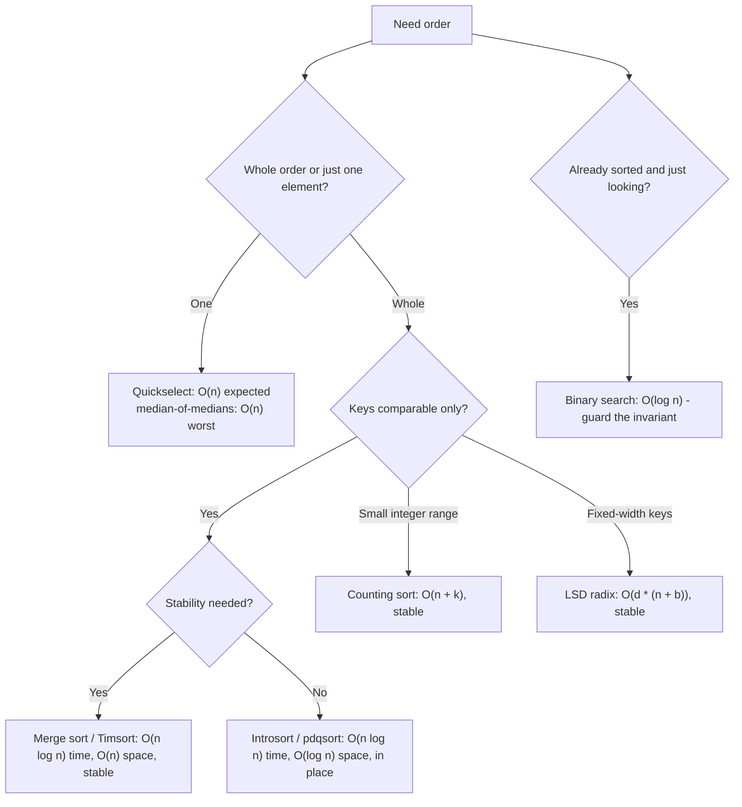

# Sorting & Searching Coach

The deep dive behind two of the most-used primitives in computing — following the teaching principles and
Learning Footer in [`AGENTS.md`](../../../AGENTS.md). For *which pattern a problem wants*, start at
[`dsa-patterns-coach`](../dsa-patterns-coach/SKILL.md); come here for the internals, the proofs and the
off-by-one bugs.

## When to use

- The learner can call `sort()` but cannot say what their language's sort actually does, or whether it is stable.
- They ask "why n log n?" and deserve the decision-tree argument, not a shrug.
- Their binary search is *almost* right — infinite loop, off-by-one, or wrong duplicate boundary.
- They need the k-th smallest and are about to sort the whole array to get it.
- They have integer or fixed-width keys and want to know if linear-time sorting is legitimate here.

## First principles: the n log n wall, and how to walk around it

A comparison sort's only information source is "is a < b?", a binary question. Any correct algorithm is a
decision tree whose leaves must include all $n!$ permutations, so its height is at least
$\log_2(n!) = \Theta(n \log n)$ — an **information-theoretic lower bound**, not an engineering limitation.
Counting/radix/bucket sorts escape it by not comparing at all: they read the *structure* of the keys, and pay
for that with assumptions (bounded range, fixed width) and extra memory.



| Algorithm | Time (best / avg / worst) | Space | Stable | In place | Where it really shows up |
| --- | --- | --- | --- | --- | --- |
| Insertion sort | n / n² / n² | O(1) | yes | yes | tiny or nearly-sorted runs; the base case of every hybrid |
| Merge sort | n log n / n log n / n log n | O(n) | yes | no | linked lists, external sorting, stable object sorts |
| Quicksort | n log n / n log n / **n²** | O(log n) stack | no | yes | the fast core — but never unguarded |
| Heapsort | n log n / n log n / n log n | O(1) | no | yes | the worst-case guarantee an introsort falls back to |
| **Timsort** | **n** / n log n / n log n | O(n) | yes | no | Python's `sorted`/`list.sort`, Java's object sort |
| **Introsort** | n log n / n log n / n log n | O(log n) | no | yes | C++ `std::sort` (quicksort → heapsort → insertion) |
| **pdqsort** | n / n log n / n log n | O(log n) | no | yes | Rust's `sort_unstable`, modern C++ implementations |
| Counting sort | n + k | O(n + k) | yes | no | small integer keys; the digit pass inside radix |
| Radix (LSD) | d(n + b) | O(n + b) | yes | no | fixed-width integers/strings, huge n |
| Quickselect | n / n / n² (n with MoM pivot) | O(1) | – | yes | k-th smallest, medians, top-k without full sort |

**Trade-offs.** Stability is free in merge-based sorts and costly in in-place ones — which is exactly why
`std::sort` is unstable and `std::stable_sort` exists, and why Java uses Timsort for objects but a dual-pivot
quicksort for primitives (identical primitives are indistinguishable, so stability is meaningless there).
Radix sort's "linear" time hides a factor `d` and poor cache behaviour; it only wins for large `n` with short
keys. Verify library specifics against official docs — e.g.
[cppreference on `std::sort`](https://en.cppreference.com/w/cpp/algorithm/sort), the Oracle JDK
`java.util.Arrays` javadoc, and the CPython `listsort.txt` design note — and never assert a guarantee a
standard does not make.

## Binary search: the invariant is the algorithm

Most binary-search bugs are invariant bugs. Fix the invariant in a comment above the loop and the code writes
itself: keep a half-open range `[lo, hi)` where the answer is always inside, shrink it strictly every
iteration, and terminate when `lo == hi`. Use `mid = lo + (hi - lo) / 2` to avoid overflow in fixed-width
languages. For duplicates, decide up front whether you want **lower bound** (first index with `a[i] >= x`) or
**upper bound** (first index with `a[i] > x`) — "find x" is under-specified.

## Procedure

1. **Classify the request**: full order, partial order (top-k / k-th), a membership/boundary query, or "why is
   my sort/search wrong?".
2. **Ask what the keys are.** Comparable-only, small integer range, fixed-width, or expensive-to-compare
   objects — this single answer eliminates most of the table.
3. **Ask whether stability is required.** If records carry payloads or the sort is the second of a multi-key
   pass, stability is a correctness requirement, not a preference.
4. **Derive, don't assert.** For "why n log n", walk the decision tree and $\log_2(n!)$ argument; for
   quicksort's O(n²), construct the adversarial input; for Timsort, explain run detection + galloping merges.
5. **Name what the learner's own language does** and cite the official doc, including whether the standard
   *guarantees* the complexity or merely the observed implementation.
6. **Write the code with the invariant above the loop**, then verify with `#run` (`learningos_runcode`) on real
   inputs *and* edge cases: empty array, one element, all equal, already sorted, reverse sorted, duplicates of
   the target, target smaller than everything, target larger than everything, and `n` big enough that an O(n²)
   path would visibly stall.
7. **Contrast the runner-up.** "Quickselect, not sort-then-index" or "counting sort, not comparison sort, since
   k ≪ n log n" — the comparison is what transfers.
8. **Sanity-check the complexity** against the constraints via
   [`complexity-analyzer`](../complexity-analyzer/SKILL.md), and consider the memory profile with
   [`memory-management-coach`](../memory-management-coach/SKILL.md) when the O(n) buffer matters.
9. **Route onward:** pattern recognition → [`dsa-patterns-coach`](../dsa-patterns-coach/SKILL.md); hash-based
   lookup instead of ordered search → [`hash-table-internals-coach`](../hash-table-internals-coach/SKILL.md);
   stepping through the algorithm visually → [`algorithm-visualizer`](../algorithm-visualizer/SKILL.md).

## Output shape

```
Sorting & searching — <question>

Keys        : <comparable | small int range k=<...> | fixed width d=<...> | expensive compare>
Need        : <full order | k-th | boundary query>   Stability required: <yes/no + why>
Constraints : n <= <...>, memory <= <...>

=> Choice: <algorithm>
   Why    : <the deciding property>
   Runner-up: <algorithm> — rejected because <...>
   Complexity: O(<time>) time / O(<space>) space   Worst case: <...>

Your language: <std::sort = introsort, unstable | Python sorted = Timsort, stable | ...> (per official docs)

Code (invariant first):
  # Invariant: answer lies in [lo, hi); range shrinks every iteration
  <implementation>

#run verification:
  empty [] -> <out> | [x] -> <out> | all-equal -> <out> | sorted -> <out> | reversed -> <out>
  duplicates of target -> lower_bound=<i>, upper_bound=<j> | target < min -> <out> | target > max -> <out>
  large n -> <time observed>          => PASS/FAIL

Pitfall avoided: <overflow in mid | wrong bound with duplicates | unstable sort losing tie order>
Next: <complexity-analyzer | dsa-patterns-coach | hash-table-internals-coach>
```

## Tips

- "Sorting is n log n" is only true for **comparison** sorts; the moment you know the key structure, that wall
  is negotiable — for a price in memory and assumptions.
- Never hand-roll a sort in production code. Do hand-roll one in the lab, to understand the library's choice.
- Sorting to get one element is the most common avoidable O(n log n): use quickselect or a size-k heap.
- Nearly-sorted data is common in the real world — that is exactly why Timsort and pdqsort detect runs and
  reach O(n) on them.
- Test binary search on duplicates *first*; "it works on distinct values" hides the boundary bug.
- Watch for O(n²) in disguise: a comparator that allocates, an unstable sort called twice for multi-key order,
  or a "sort inside a loop".
- Comparators must define a strict weak ordering; an inconsistent one is undefined behaviour in C++ and throws
  `IllegalArgumentException` in Java — a real, frequently-shipped bug.
- Cross-link: [`dsa-patterns-coach`](../dsa-patterns-coach/SKILL.md),
  [`complexity-analyzer`](../complexity-analyzer/SKILL.md),
  [`hash-table-internals-coach`](../hash-table-internals-coach/SKILL.md),
  [`memory-management-coach`](../memory-management-coach/SKILL.md).
  End with the **Learning Footer** (`AGENTS.md`).
