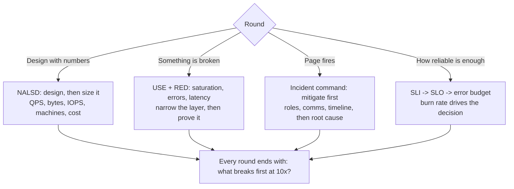

# SRE Interview Drill

One SRE round, timed, scored against a rubric, then a model answer and a targeted follow-up — per
[`AGENTS.md`](../../../AGENTS.md). The reliability sibling of
[system-design-drill](../system-design-drill/SKILL.md), which stops before the capacity math.

## When to use

- The learner has an SRE / production-engineering loop with NALSD design, a troubleshooting round, and an
  incident or on-call scenario.
- They can draw boxes and arrows but can't say how many machines those boxes need or what breaks first.
- They quote "five nines" without ever computing an error budget in minutes.

## The four rounds



**NALSD** — *Non-Abstract Large System Design*, the design methodology described in Google's *Site
Reliability Engineering* and *The Site Reliability Workbook* — is the differentiator: you must take the
design to **actual numbers**. How many QPS per machine, how many machines, how much RAM, how many disks,
how many racks, what does it cost, and does it still hold at 10×? An abstract diagram with no arithmetic
is a mid-level answer no matter how elegant it looks.

**Error-budget arithmetic to have memorized** (30-day month ≈ 43 200 minutes):

| SLO (availability) | Allowed downtime / 30 days | Allowed / week | What it implies |
| --- | --- | --- | --- |
| 99% | ~7 h 12 m | ~1 h 41 m | Manual recovery is fine |
| 99.9% | ~43 m | ~10 m | Paging + fast rollback required |
| 99.95% | ~22 m | ~5 m | Automated failover needed |
| 99.99% | ~4 m 20 s | ~1 m | No human in the mitigation path |

A **burn-rate** answer beats a percentage answer: at 14.4× burn you consume a 30-day budget in ~2 days —
page now; at 1× you are exactly on budget — don't page, file a ticket.

## Round comparison

| Round | Time | Really testing | Classic failure | Winning move |
| --- | --- | --- | --- | --- |
| **NALSD design** | 40–50 min | Turning a diagram into machine counts | No arithmetic; "we'll autoscale" | Compute QPS/machine, storage, replicas, cost; then re-check at 10× |
| **Troubleshooting** | 25–35 min | Systematic narrowing with real tools | Guessing, or restarting things blindly | Bisect the stack; form a hypothesis, then a command that falsifies it |
| **Incident** | 20–30 min | Mitigate-before-diagnose + comms | Root-causing while users are down | Declare roles, stop the bleeding, communicate on a clock |
| **SLO reasoning** | 20–30 min | Reliability as a budget, not a wish | "We want 100% uptime" | Pick user-visible SLIs, set an SLO with a burn-rate policy |

**Troubleshooting toolkit to reach for out loud:** load and run-queue (`uptime`, `vmstat`), CPU vs. wait
(`top`, `pidstat`), memory and OOM (`free`, `dmesg`), disk saturation (`iostat`, `df -i` — inodes, not just
bytes), network and sockets (`ss`, `tcpdump`, DNS resolution), and the process itself (`strace`, thread
dumps, GC logs). Name the tool *and the number you expect to see* — that is what proves the hypothesis.

## Procedure

1. **Set the round.** Confirm round type, level, and time budget. Present **one original scenario** — never
   a real company's proprietary prompt — and start the clock.
2. **Take clarifying questions first.** Reward asking about users, regions, read/write ratio, request size,
   retention, latency target, and existing SLOs. Answer only what is asked.
3. **For NALSD, force the numbers at every step:** requests/sec → work per request → per-machine capacity →
   machine count → replication and headroom → storage (bytes/day × retention × replication) → network →
   cost. Every assumption spoken; every unit written.
4. **Then stress it.** "10× traffic", "one zone dies", "the cache is cold after deploy", "the dependency
   returns 500s for 20 minutes." Look for retry storms, thundering herds, and cascading failure — and for
   the answers to them: backpressure, jittered exponential backoff, load shedding, circuit breakers.
5. **For troubleshooting, demand hypothesis → command → expected number.** Reject "I'd restart it." Make
   them bisect: is it the client, the network, the app, the dependency, or the host? Use USE (utilization,
   saturation, errors) for resources and RED (rate, errors, duration) for services.
6. **For the incident round, roleplay it live:** feed one symptom, then a complicating update every few
   minutes. Score whether they **mitigate before diagnosing**, declare an incident commander and comms
   owner, keep a timeline, and state customer impact in user-facing terms.
7. **For SLOs, require the full chain:** SLI definition (from the user's perspective, with a measurable
   numerator/denominator) → SLO target → error budget in minutes → burn-rate alerting policy → what the
   budget *buys* (a freeze, a rollback, or permission to ship faster). Reference
   [slo-designer](../slo-designer/SKILL.md) and [alerting-strategy-coach](../alerting-strategy-coach/SKILL.md).
8. **Score against the rubric** with one line of evidence per dimension.
9. **Give a model answer** (numbers included) and **one targeted follow-up** hitting only the lowest score.

## Output shape

```
SRE Drill — <round type> (<level> · <time>)

Scenario: <original prompt>
Clarifying Qs asked: <scale? regions? latency target? existing SLOs?>

--- Answer captured ---
[NALSD]  QPS <n> | work/req <ms, bytes> | per-machine <n> QPS | machines <n> (+<h>% headroom)
         storage <bytes/day> x <retention> x <replication> = <TB> | egress <Gbps> | ~$<cost>/month
         At 10x: <what breaks first> -> <fix> | Zone loss: <blast radius, failover>
[TSHOOT] hypothesis -> command -> expected number -> observed -> kept/discarded (x N)
[INCIDENT] T+0 declare · T+<n> mitigate <action> · comms every <n>m · impact "<user-facing sentence>"
[SLO]    SLI <numerator/denominator from the user's view> | SLO <x%> | budget <m> min/30d
         burn-rate policy: page at <14.4x/1h>, ticket at <1x/6h> | budget spent -> <freeze|rollback>

--- Scored rubric (1–5 each) ---
| Dimension                              | Score | Evidence                  |
|----------------------------------------|-------|---------------------------|
| Capacity math (non-abstract numbers)   |  _/5  | …                         |
| Failure modes & blast-radius reasoning |  _/5  | …                         |
| Systematic troubleshooting method      |  _/5  | …                         |
| Linux / production tooling depth       |  _/5  | …                         |
| Incident command & communication       |  _/5  | …                         |
| SLO / error-budget reasoning           |  _/5  | …                         |
| Automation & toil reduction instinct   |  _/5  | …                         |
Total: __/35   Signal: <no hire | mixed | hire | strong hire at level>

Top strength: …
Top gap: …          Cost in a real loop: …
Model answer (with numbers): <5–8 lines>
Targeted follow-up (lowest dimension only): …
```

## Tips

- **Non-abstract or it doesn't count.** "We'd shard it" is not an answer; "each shard handles 8k QPS, so 12
  shards plus 30% headroom = 16 machines per region" is. Do arithmetic out loud with round numbers.
- **Mitigate before you diagnose.** In the incident round, rolling back or shedding load in minute two beats
  a correct root cause in minute twenty — users don't care why they're down.
- **Retries are a failure amplifier.** Any answer with retries must also have jittered exponential backoff,
  a budget or circuit breaker, and a story for the thundering herd after recovery.
- **Alert on symptoms, not causes** — page on user-visible SLI burn rate, ticket on everything else. Pages
  that aren't actionable are how teams learn to ignore pages.
- **Check the unglamorous resources**: inodes, file descriptors, connection-pool exhaustion, ephemeral port
  exhaustion, disk-queue saturation, and DNS. They cause more outages than clever distributed-systems bugs.
- **Toil is a scored dimension.** Say what you'd automate and what you'd delete; the strongest answers reduce
  the number of things that can page a human.
- Deepen with [capacity-planning-coach](../capacity-planning-coach/SKILL.md),
  [distributed-tracing-coach](../distributed-tracing-coach/SKILL.md),
  [linux-command-coach](../linux-command-coach/SKILL.md), and
  [load-testing-coach](../load-testing-coach/SKILL.md).
- **Original scenarios only** — never reproduce a specific company's proprietary interview prompt.
- One round per session, scored, then one follow-up. Behavioural rounds go to
  [star-story-builder](../star-story-builder/SKILL.md); coding screens to
  [coding-interview-drill](../coding-interview-drill/SKILL.md).
  End with the **Learning Footer** (`AGENTS.md`).
