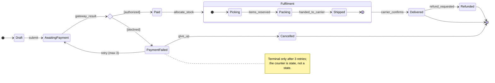
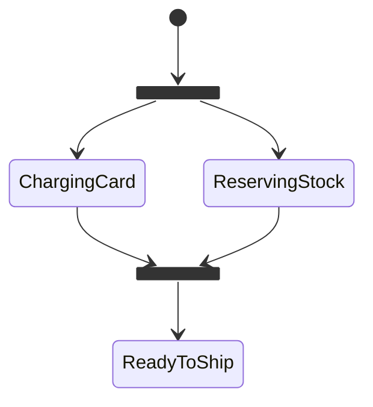

# State Machine Visualizer

Most "status bugs" are really **undocumented transitions**. Following [`AGENTS.md`](../../../AGENTS.md)
§4 (visuals by default) and §3 (testing note), this skill turns a lifecycle into a `stateDiagram-v2`, a
**transition table**, and a list of **illegal transitions** that becomes your test suite.

## When to use

- Anything with a `status` column or `enum`: orders, tickets, subscriptions, jobs, PRs, devices, sessions.
- Protocol or connection lifecycles (TCP, WebSocket, circuit breakers, retries with back-off).
- UI flows with modes: idle / loading / success / error / stale.
- Reverse-engineering a legacy service where "which statuses can follow which" is tribal knowledge.
- **Not** for who-talks-to-whom over time — that's
  [sequence-diagram-generator](../sequence-diagram-generator/SKILL.md).

## First principles

A finite state machine is a 5-tuple: **states**, **events**, a **transition function**, one **initial**
state, and a set of **final** states. Two rules do the heavy lifting:

- **Determinism** — one `(state, event)` pair must map to exactly one outcome. If two arrows share a
  source and an event, you need a **guard**, modelled as a `<<choice>>` pseudostate.
- **Totality** — every `(state, event)` pair is either legal or *explicitly* illegal. Silence is where
  bugs live.



Concurrency uses `<<fork>>` / `<<join>>` — two regions that must both finish before the machine moves on:



## Notation reference

| Concept | Mermaid syntax | Use it for |
| --- | --- | --- |
| Start / end | `[*] --> S` · `S --> [*]` | initial and final states |
| Transition with event | `A --> B: event` | the normal case |
| Guarded branch | `state c <<choice>>` then `c --> B: [cond]` | one event, several outcomes |
| Concurrency | `state f <<fork>>` / `state j <<join>>` | parallel regions that must rejoin |
| Nesting | `state Parent { [*] --> Child }` | collapse detail; shared exits |
| Concurrent regions | `--` inside a composite state | independent sub-machines |
| Resume where you left | `[H]` (shallow history) | pausable flows, wizards |
| Readable label | `state "Awaiting payment" as AP` | spaces in names |
| Annotation | `note right of S ... end note` | invariants, timeouts, counters |
| Layout | `direction LR` / `TB` | wide vs. tall lifecycles |

## Procedure

1. **Name the entity and its scope** — "an Order, from checkout to archive". A machine without a bounded
   scope grows forever.
2. **Extract states from the source of truth** — the enum, the `status` column's `DISTINCT` values, the
   code's guard clauses — not from imagination (§2). States are *nouns/adjectives* (`Paid`), never verbs.
3. **Extract events** — the things that cause change (`submit`, `gateway_result`, `timeout`). Distinguish
   **commands** (someone asks) from **facts** (something happened).
4. **Draw the happy path spine first**, then attach exceptional branches to it.
5. **Resolve every non-determinism with a `<<choice>>`** and write the guard in `[brackets]`.
6. **Group repeated sub-flows into a composite state** when three or more states share the same exits —
   nesting removes arrow spaghetti without losing information.
7. **Model true parallelism with `<<fork>>`/`<<join>>`**, never as two sequential paths you promise are
   concurrent.
8. **Emit the transition table** — one row per legal `(from, event, to, guard, side effect)`. The table is
   the specification; the diagram is the summary.
9. **Emit the illegal-transition list** — every `(state, event)` pair not in the table, plus the intended
   behaviour (reject / ignore / dead-letter). Turn each into a test case
   ([test-writer](../test-writer/SKILL.md)).
10. **Check the machine's health**: unreachable states, states with no exit (unintentional traps), missing
    timeouts, and any transition that skips a required step.
11. **Add the accessibility layer** — caption, alt text, and note that the transition table *is* the
    text equivalent; see [diagram-accessibility-coach](../diagram-accessibility-coach/SKILL.md).

## Output shape

```
Entity: <name>  ·  Scope: <start → end>  ·  Initial: <state>  ·  Final: <states>



```mermaid
stateDiagram-v2
  <the machine>
```

Transition table
| From | Event | Guard | To | Side effect |
|---|---|---|---|---|
| <...> | <...> | <...> | <...> | <...> |

Illegal transitions (must be rejected)
- <State> + <event> → reject with <error>, because <invariant>

Health check: unreachable=<...> · dead-ends=<...> · missing timeouts=<...>
Alt text: <short prose summary>
Tests to write: <one per illegal transition + one per guard branch>
Next: <related skill link>
```

## Tips

- **States are what you can be, not what you are doing.** `Shipping` is usually an event; `Shipped` is a
  state. Verb-shaped states are the #1 sign the model is really a flowchart.
- Counters, retry attempts and timestamps are **extended state (variables)** — putting `Retry1`,
  `Retry2`, `Retry3` on the diagram explodes it; use a guard `[attempts < 3]` instead.
- Every state that can be entered by an external system needs a **timeout transition**, or you have
  invented a permanent limbo.
- Prefer **two views over one giant one**: a top-level machine plus a zoom into one composite state.
  Split beyond ~12 states.
- Don't encode meaning in colour alone; label the arrow (WCAG 2.2 **1.4.1 Use of Color**).
- Pair with [event-sourcing-coach](../event-sourcing-coach/SKILL.md),
  [state-management-coach](../state-management-coach/SKILL.md),
  [saga-pattern-coach](../saga-pattern-coach/SKILL.md),
  [sequence-diagram-generator](../sequence-diagram-generator/SKILL.md) and
  [visual-explainer](../visual-explainer/SKILL.md).
  End with the **Learning Footer** (`AGENTS.md`).
