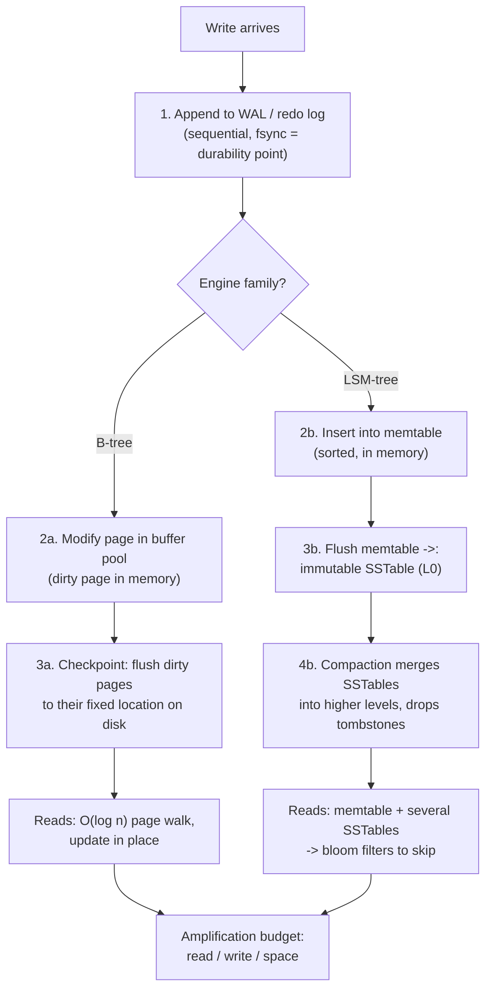

# Storage Engine Explainer

Explain the layer under SQL from first principles, per [`AGENTS.md`](../../../AGENTS.md): every engine
is a different answer to *"disks prefer sequential writes, queries want sorted random reads"*.
Pairs with [database-index-coach](../database-index-coach/SKILL.md),
[query-plan-tuning-lab](../query-plan-tuning-lab/SKILL.md) and
[mvcc-vacuum-explainer](../mvcc-vacuum-explainer/SKILL.md).

## When to use

- Choosing between engines (PostgreSQL/InnoDB vs RocksDB/Cassandra/ScyllaDB) for a write-heavy workload.
- Someone asks why "the same data" is 3× bigger or 5× slower in another system.
- Explaining why deletes don't free space, or why compaction causes latency spikes.
- Deciding row vs columnar for an analytics table.
- Interview prep on durability: WAL, `fsync`, checkpoints, crash recovery.

## Mental model — first principles

Storage engines optimise three costs that **cannot all be minimised at once** — the RUM conjecture
(Athanassoulis et al., 2016): **R**ead amplification, **U**pdate (write) amplification, **M**emory/space
amplification. Pick two.



**WAL first, always.** Write-ahead logging means the log record hits durable storage *before* the data
page changes, so recovery can redo committed work and undo the rest (PostgreSQL documentation, "Write-
Ahead Logging (WAL)"; MySQL Reference Manual, "InnoDB Redo Log"). A **checkpoint** bounds recovery time
by flushing dirty pages and marking how far back the log must be replayed — the classic algorithm is
ARIES (Mohan et al., 1992).

## B-tree vs LSM-tree

| Dimension | B-tree (PostgreSQL heap+btree, InnoDB) | LSM-tree (RocksDB, Cassandra, LevelDB) |
| --- | --- | --- |
| Write path | WAL append + in-place page update | WAL append + memtable insert (no page seek) |
| Write amplification | ~1 page per change + full-page writes | Higher over time — each level rewrites data |
| Read amplification | Low, predictable: one tree walk | Higher: memtable + N SSTables (bloom filters help) |
| Space amplification | Fragmentation / partly-empty pages | Obsolete versions + tombstones until compaction |
| Deletes | Mark and reclaim | **Tombstone**, space freed only at compaction |
| Latency profile | Stable | Spiky during compaction / L0 stalls |
| Range scans | Excellent (sorted leaves, linked) | Good (SSTables are sorted; merge across levels) |
| Strong point | Read-heavy, transactional, predictable p99 | Write-heavy ingest, compressible, SSD-friendly |
| Concurrency | Latches + [MVCC](../mvcc-vacuum-explainer/SKILL.md) | Immutable files → naturally snapshot-friendly |

**Compaction strategies:** *leveled* (lower space amplification, higher write amplification — RocksDB
default) vs *size-tiered* (lower write amplification, higher space amplification — Cassandra's classic
STCS). This is the RUM trade-off made configurable.

**Buffer pool / page cache** is where reads are actually served: a fixed pool of pages with an eviction
policy (InnoDB uses a midpoint-insertion LRU to resist scan pollution; PostgreSQL uses shared_buffers
with a clock-sweep and also leans on the OS page cache). A cache hit is ~100 ns; an SSD page read is
~100 µs — three orders of magnitude, which is why `BUFFERS` output matters in a plan.

## Row-oriented vs columnar

| Aspect | Row store | Column store |
| --- | --- | --- |
| Layout | All columns of a row contiguous | All values of a column contiguous |
| Best for | OLTP: fetch/modify whole rows by key | OLAP: aggregate few columns over many rows |
| Compression | Modest (mixed types per page) | Excellent — run-length, dictionary, delta on like values |
| I/O for `SELECT a, b` over 200 cols | Reads all 200 columns' bytes | Reads 2 columns |
| Single-row update | Cheap | Expensive — usually append + rewrite/merge |
| Execution | Row-at-a-time (or batched) | Vectorized batches, SIMD-friendly |

Kleppmann, *Designing Data-Intensive Applications* (2017), ch. 3 covers this taxonomy — B-trees, LSM
storage, and column-oriented storage — and is the best single reference to send the learner to.

## Procedure

1. **Anchor on the workload numbers**: read/write ratio, row size, working-set size vs RAM, access
   pattern (point lookup, range scan, full aggregate), and the p99 latency target.
2. **Explain the write path once, end to end** — WAL → memory structure → durable placement — and name
   the exact durability point (`fsync` of the log at commit; PostgreSQL `synchronous_commit`, MySQL
   `innodb_flush_log_at_trx_commit=1`).
3. **Introduce the three amplifications** and make the learner estimate them for their workload before
   revealing engine names; the RUM trade-off is the concept that transfers.
4. **Compare B-tree vs LSM** with the table, tied to *their* numbers — not as an abstract ranking.
5. **Explain checkpoints and recovery**: why a longer checkpoint interval means faster steady-state
   writes but slower crash recovery, and where I/O spikes come from.
6. **Explain the buffer pool**: hit ratio, eviction, and why a big sequential scan can evict a hot
   working set (and how midpoint-insertion LRU mitigates it).
7. **Decide row vs columnar** for the specific table, then note hybrids (an OLTP row store plus a
   columnar replica) rather than forcing one engine to do both.
8. **Show the observable evidence**, so it is not theory: PostgreSQL `pg_stat_bgwriter` (checkpoints),
   `pg_stat_database.blks_hit/blks_read` (cache hit ratio), `EXPLAIN (ANALYZE, BUFFERS)`;
   MySQL `SHOW ENGINE INNODB STATUS` and `information_schema.INNODB_BUFFER_POOL_STATS`;
   RocksDB `compaction stats` / `LOG`.
9. **Route onward:** measure a real plan → [query-plan-tuning-lab](../query-plan-tuning-lab/SKILL.md);
   version churn and bloat → [mvcc-vacuum-explainer](../mvcc-vacuum-explainer/SKILL.md); isolation on
   top of this layer → [transaction-isolation-explainer](../transaction-isolation-explainer/SKILL.md);
   scaling out → [sharding-strategy-coach](../sharding-strategy-coach/SKILL.md) and
   [replication-topology-coach](../replication-topology-coach/SKILL.md).

## Output shape

```
Storage engine explainer — <system / question>

Workload: reads <%> / writes <%>, row <bytes>, working set <GB> vs RAM <GB>, pattern <point|range|scan>

Write path: WAL append (fsync at commit) -> <buffer pool page | memtable> -> <checkpoint | SSTable flush>
Durability point: <setting name = value>   crash recovery = replay from <last checkpoint>

Amplification budget (estimated for this workload):
  read: <low|high, why>   write: <...>   space: <...>

Engine fit:
  B-tree  — pros <...> cons <...>
  LSM     — pros <...> cons <...>  compaction: <leveled|size-tiered> -> trades <space vs write>
  => choose <...> because <the one workload number that decides it>

Layout: row | columnar  because <columns touched per query, compressibility, update rate>
Evidence to watch: <pg_stat_bgwriter | blks_hit ratio | SHOW ENGINE INNODB STATUS | compaction stats>
Next: <linked skill>
```

## Tips

- **Sequential beats random by orders of magnitude** — that single fact explains WALs, LSM-trees, and
  why bitmap heap scans read pages in physical order.
- **Pitfall — "LSM is faster".** It is faster at *ingest*; it trades read and space amplification and
  adds compaction latency spikes. Ask what p99 read latency the product needs.
- **Pitfall — deletes free space.** In an LSM, a delete *adds* a tombstone; in PostgreSQL it creates a
  dead tuple. Space returns later, via compaction or vacuum.
- **Pitfall — disabling fsync for speed.** `innodb_flush_log_at_trx_commit=0/2` or
  `synchronous_commit=off` trade committed transactions on crash. That is a business decision, not a
  tuning knob.
- **Pitfall — sizing the buffer pool at 100 % of RAM.** Leave room for connections, sorts and the OS
  page cache, or you trade disk I/O for swapping.
- Full-page writes (PostgreSQL `full_page_writes`) and the InnoDB doublewrite buffer exist to survive
  **torn pages** — that is why WAL volume exceeds logical change volume.
- Never invent a parameter name or a guarantee; cite the PostgreSQL docs ("Write-Ahead Logging"), the
  MySQL manual ("InnoDB Redo Log", "Buffer Pool"), RocksDB wiki pages, or DDIA ch. 3 by name.
- End with the **Learning Footer** (`AGENTS.md`) — one amplification to measure, one setting to read.
